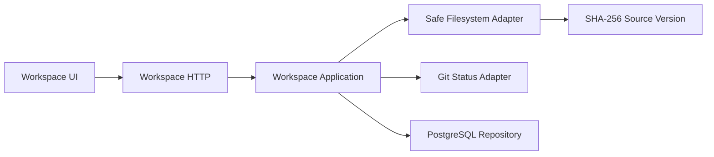

# M3 Workspace 设计

## 模块

- `internal/foundation`：ID、Clock、稳定错误。
- `internal/workspace/domain`：Workspace、Source、SourceVersion 不变量。
- `internal/workspace/application`：Create/Open/Scan 用例。
- `internal/workspace/adapter/filesystem`：安全路径、扫描、SHA-256。
- `internal/workspace/adapter/git`：分支、HEAD、dirty 只读状态。
- `internal/workspace/adapter/postgres`：Workspace/Source/Version Repository。
- `internal/workspace/http`：REST/DTO/Problem 映射。
- `web/src/features/workspace`：创建、打开、扫描状态。

## 数据流

## 首个垂直切片

1. Foundation ID/Clock/Error。
2. 安全路径与扫描纯单元测试。
3. Workspace/Source/Version migration 与 Repository。
4. Create/Open/Scan Application。
5. REST/OpenAPI。
6. React Workspace 页面与 Compose Smoke。

## 回滚

应用回滚到 M2 版本；数据库使用向前兼容迁移，不通过破坏性 Down 作为发布回滚。Workspace 文件只读扫描，本任务不修改用户内容。
