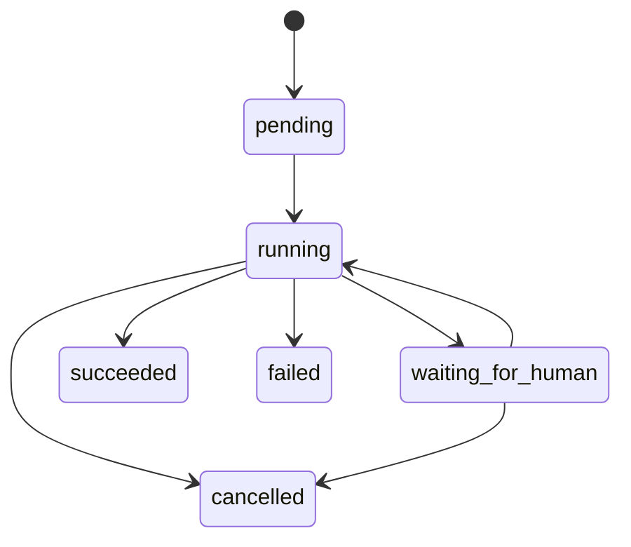

# M4 Workflow 设计

## 模块

- `internal/workflow/domain`：状态、Definition、Run、Node、Human Task 和稳定错误。
- `internal/workflow/application`：Start/Get/Claim/Heartbeat/Complete/SubmitHumanDecision。
- `internal/workflow/adapter/postgres`：pgx Repository 与事务边界。
- `internal/workflow/http`：REST DTO 和 Problem 映射。
- `migrations/00003_workflow.sql`：仅最小 Workflow/Outbox 表。

## 状态流

本任务不提供 File Write、Git Commit、Tool Authorization 或 Approval Apply；任何后续副作用必须在 Proposal → Approval → Safe Writeback seam 中接入。
