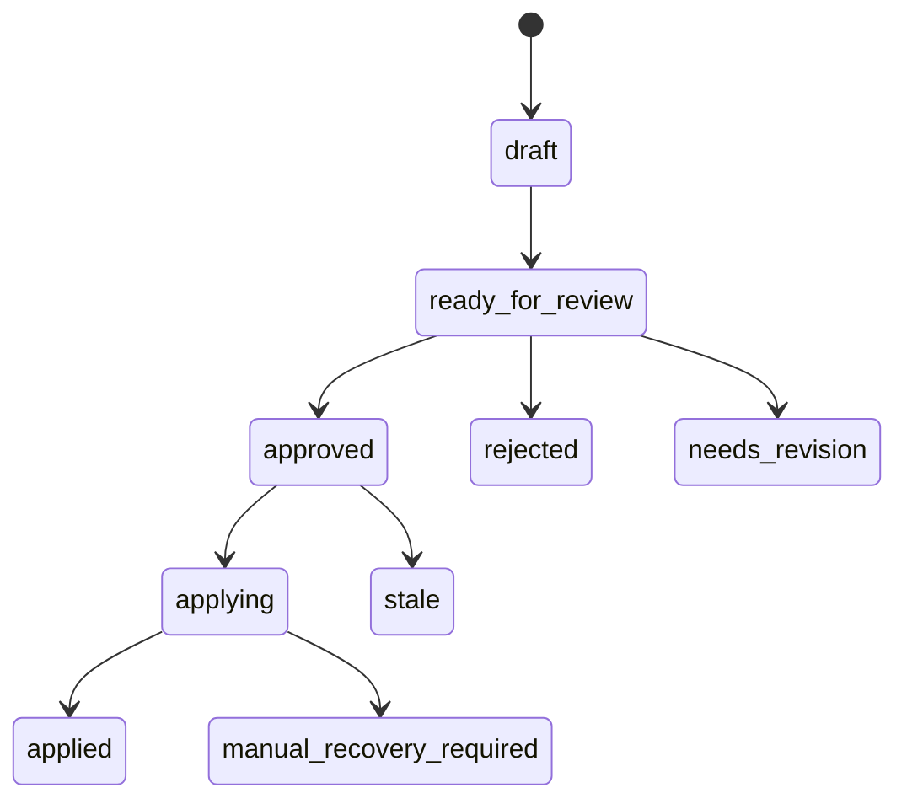
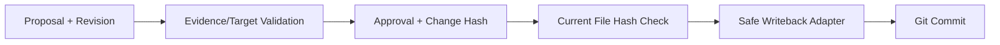

# M5 Change Control 设计

## 领域状态

## 唯一写入边界

本任务先落地 Proposal/Approval 和 Version Check；不允许 Handler、Agent 或模型直接修改 Workspace 文件。

## 本期落地边界

- `Change Hash` 使用版本化规范载荷，绑定 Workspace 相对目标路径、基线 SHA-256 与保留语义空白的变更内容。
- Apply preflight 由服务端通过 Workspace 安全文件边界重新读取目标文件哈希；客户端不能提交一个“当前哈希”作为事实。
- preflight 成功只返回 `preflight_only` 结果，`write_performed=false`，不执行文件写回、Git Commit、索引或审计发布。
- 目标文件基线冲突会将 Proposal 标记为 `needs_revision`，并返回稳定 `TARGET_BASE_HASH_CONFLICT` Problem。
