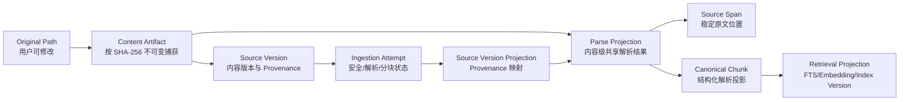

# M5-02 摄取契约设计

## 事实分层

`original_location` 只表示来源路径，不能作为历史 Source Version 的唯一内容存储。扫描时必须将原始字节按内容哈希 create-only 捕获到 Workspace 管理目录；该目录从普通扫描中排除。不同路径的相同内容可保留各自 Source Version Provenance，但共享 Content Artifact、Parse Projection、Source Span 和 canonical Chunk；`source_version_projection` 显式保存来源到共享投影的映射。

捕获协议：在同一 Workspace 管理目录写入临时文件 → fsync/关闭 → 再算 SHA-256 和大小 → 使用 create-only 原子发布到 hash 路径；并发同哈希只允许一个发布者成功，其他调用验证既有文件。管理目录必须从扫描、Git 默认跟踪和用户知识路径排除，备份必须包含 Content Artifact；未被任何 Source Version 引用前不得清理。实现使用 Go `os.Root` 固定 Workspace 根句柄，拒绝托管目录和来源路径的越界 symlink/竞态替换；Git 普通仓库通过 `.git/info/exclude` 排除，非标准或不可信 worktree marker 明确失败，不向任意外部路径写入排除规则。

## 状态边界

- Ingestion：`validating → parsing → parsed → chunking → chunked`。
- Ingestion 失败：`parse_failed`、`cancelled`；隔离使用正交组合 `status=validating + security_status=quarantined`。
- Workflow：`retry_wait`、租约、暂停、恢复和重试。
- Retrieval：`indexing`、`ready`、`index_failed`、`waiting_dependency`。

重试创建新 Attempt；旧失败记录不可覆盖为成功。相同 Content Artifact + Parser/Config/Schema 共享 Parse Projection；相同 Parse Projection + Chunk Strategy/Schema 共享 canonical Chunk。

每个逻辑 Source 仍创建独立 SOURCE Document/Article Revision，`canonical_path` 使用 Workspace 安全规范化后的原始相对路径；共享解析投影不合并用户可见的 Document 身份。

## 位置契约

- Markdown/TXT 行号：1-based、闭区间。
- byte offset：不可变 Content Artifact 原始字节中的 0-based 半开区间。
- BOM/CRLF 标准化必须保留 raw → normalized 映射。
- 每个 Chunk 通过 `source_span_id` 指向稳定 Span；Span 保存 excerpt hash 以检测失效。

## 结构完整性

标题与段落优先分块；fenced/indented code、GFM table、blockquote 和 list 不得为满足 token 上限被静默拆散。Canonical Chunk 记录 byte/rune count；具体 Token Count 在 Retrieval Projection 中按模型版本计算。单个原子块超限时保留 `atomic_oversized` Chunk 并生成 Warning，FTS 可继续，向量 projection 使用 `skipped_oversized`；Index 保持 `status=active` 并设置 `degraded_capabilities=["vector"]`，API 必须显式展示。

## 当前范围

本契约任务不实现 PDF、Web、FTS、Embedding、Claim/Relation、正式知识写回或 Inbox UI。
