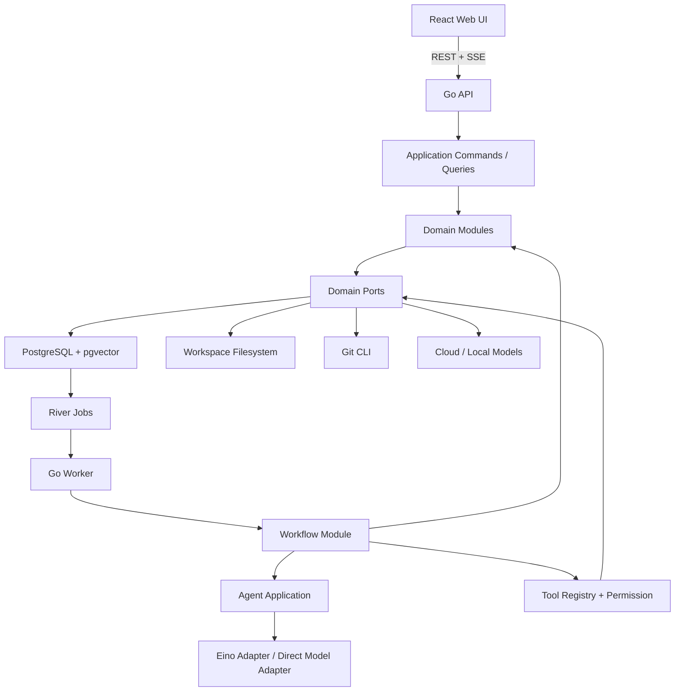
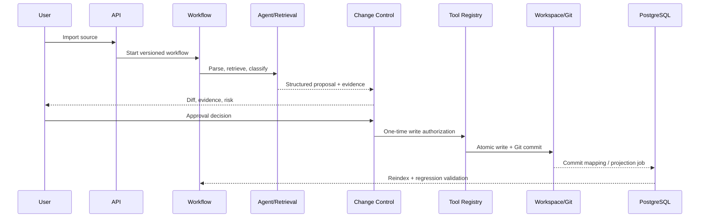

# ZHIXU 产品级建设技术设计

## 1. Design Objective

在不改变已接受 ADR 核心不变量的前提下，把文档态 ZHIXU 落地为本地优先、单用户、可恢复的模块化单体。设计优先解决四个最高风险：文件/Git/数据库/索引一致性、持久化工作流幂等、AI 权限边界、证据与引用可靠性。

## 2. Architecture Overview

运行单元：

- `cmd/api`：同步查询、命令提交、认证、SSE、Human Decision。
- `cmd/worker`：领取 River Job，执行 Workflow Node、模型调用、检索、验证和受控副作用。
- `web`：React 静态应用；生产默认由 Go app 镜像提供静态资源，自托管可置于反向代理后。
- `postgres`：领域状态、投影、工作流、Outbox、审计、评测、FTS 与 pgvector。
- `workspace`：用户持有的原始资料、正式 Markdown、附件、导出物和 Git 历史。

## 3. Module Boundaries

| 模块 | 公开职责 | 隐藏复杂度 | 禁止依赖 |
|---|---|---|---|
| Workspace | 创建/校验 Workspace、安全读写准备、版本令牌 | 路径、锁、临时文件、符号链接 | HTTP、Git 实现、模型 |
| Ingestion | 注册 Source、解析、标准化、分块 | MIME、解析器、Source Span、隔离 | 正式写回 |
| Retrieval | IndexRevision、Search、ActivateVersion | FTS、pgvector、RRF、Rerank、去重 | UI、模型 SDK |
| Knowledge | Claim/Topic/Relation/Conflict 不变量 | 适用条件、证据、状态机 | 文件/Git |
| Change Control | Proposal、Approval、Apply、Compensate | Change Hash、授权、Saga、回滚 | Handler 事务 |
| Workflow | Definition/Run/Node/Human/Retry/Cancel | River 映射、租约、幂等、补偿 | Eino 持久状态 |
| Agent | Analyze/Organize/Review 用例 | Prompt、模型路由、结构化输出 | 文件、Git、数据库实现 |
| Tools | 注册、Schema、授权、执行、审计 | Permission、超时、幂等、脱敏 | 模型文本直接授权 |
| Graph/Collection/Health | 图查询、保存查询、健康问题 | 聚类、Query AST、Fingerprint | 第二知识事实源 |
| Artifact/Review/Memory | 产物、学习、复习、确认记忆 | 章节、FSRS、评分、生命周期 | 未批准 Claim |

依赖规则：`presentation → application → domain ports`；`platform adapters → domain ports`；Domain 不依赖 `chi/pgx/sqlc/River/Eino/React` 类型。

## 4. Core Business Flows

### 4.1 Knowledge Change Loop

### 4.2 RAG Loop

Question → scope-preserving rewrite → FTS/vector parallel search → RRF/dedup → optional rerank → evidence sufficiency → conflict detection → answer generation → citation/faithfulness validation → publish or refuse.

### 4.3 Persistent Workflow Boundary

- PostgreSQL Workflow/Node/Outbox 表是唯一持久状态。
- River Job 仅指向可运行节点，不保存业务上下文事实。
- Eino Graph 可执行一个短生命周期 AI 节点，但结果必须回写版本化 Node Output；重启恢复不依赖 Eino 内存。
- Human Task 释放 Worker；重复提交由 Proposal Revision、Change Hash 和 Idempotency Key 拒绝。

## 5. Domain Model

核心聚合：

- Workspace：根路径、Git、活动索引和一致性状态。
- Source：逻辑资料；Source Version 为不可变内容哈希版本。
- Document：正式知识身份；Article Revision 表达来源、草稿、批准、发布和替代关系。
- Knowledge：Topic、Claim、Relation、Relation Evidence、Conflict、Provenance。
- Change Control：Proposal、Proposal Revision、Approval、Write Authorization、Compensation。
- Workflow：Definition、Run、Node Run、Human Task、Tool Call、Outbox。
- Learning/Ops：Artifact、Collection、Review、Memory、Health Issue、Knowledge Event、Audit、Evaluation。

关键不变量必须同时由领域规则和数据库约束保护：

- Source Version 内容不可变，`source_id + content_hash` 唯一。
- 每个 Document 只有一个当前 Published Revision，Published 必须关联 Git Commit。
- 正式 Claim/Relation 必须有可达 Evidence；对称 Relation 规范化去重。
- Approval 绑定 Proposal Revision 与 approved change hash。
- Side Effect 的幂等键按 Workspace + operation + target version 设作用域。
- Active Health Issue Fingerprint 唯一；Review Answer 幂等且与 Schedule 同事务。

数据库设计在实施前补齐 Smart Collection、Artifact/Revision、Memory、Knowledge Event、Audit、Evaluation、Index Version、Human Task、Compensation Record、版本元数据和 Tool Authorization 字段。

## 6. Database and Migration Strategy

- PostgreSQL + pgvector，Goose 前向迁移，pgx 连接池，sqlc 生成类型安全查询。
- 逻辑 Schema：`core`、`change_control`、`workflow`、`retrieval`、`learning`、`ops`。
- Migration 使用 Expand/Contract；DDL 与回填分离；应用启动前 Migration Job 完成。
- 生产 seed 仅包含版本化 Workflow Definition、Prompt/Schema Registry、Tool Definition 等系统数据；业务演示数据只存在测试 Fixture。
- 关键索引：B-tree 状态/外键/租约，GIN FTS，HNSW vector，对称 Relation 唯一索引，部分唯一索引保护当前 Revision/Active Fingerprint。
- Testcontainers 验证空库、升级、重复执行、事务失败、pgvector/FTS、SKIP LOCKED、Outbox 和 EXPLAIN。

## 7. API Contract

- Base path `/api/v1`，REST + SSE。
- Query 无副作用，默认 cursor + limit；Command 使用 Idempotency-Key、审计和 Version/ETag。
- 长任务返回 `202 + workflow_run_id + status_url`。
- 错误采用稳定 Problem Details 扩展：`error_code`、`retryable`、`workflow_run_id`、`details`。
- SSE 事件包含稳定 ID、type、occurred_at、workspace_id、resource_ref、payload_summary；支持 Last-Event-ID，超窗后重查资源。
- OpenAPI-first 定义具体 method/path/DTO/Schema；CI 做 breaking-change 检查并生成 TypeScript client。
- PRD 中 Search 的 `page` 字段修改为 cursor；所有“WebSocket 或 SSE”修改为 SSE。

## 8. Eino Evaluation and Boundary

### 8.1 Responsibilities

Eino 可负责：ChatModel/Embedding/Retriever/Rerank Adapter、Tool Calling 适配、Graph/Chain 短流程、流式输出、Callback 和 AI 节点观测。

Eino 不负责：领域实体、公共 API、数据库模型、持久化 Workflow、Proposal/Approval、Tool Permission、Evidence/Citation Validation、Safe Writeback、幂等/补偿和审计事实。

### 8.2 PoC Gate

| 验证项 | 方法 | 通过标准 |
|---|---|---|
| OpenAI-Compatible / Local model | 独立 Adapter 集成测试 | 两类模型返回统一领域结果 |
| Embedding / Retriever / pgvector | Testcontainers + fixture | 批量向量、过滤和 Evidence 可追踪 |
| Streaming | 取消、超时、EOF、并发测试 | Reader/goroutine 无泄漏，取消生效 |
| Structured Output | JSON Schema + 业务校验 | 非法输出显式失败，不产生假成功 |
| Tool Calling | 接项目 Tool Registry Fake | 模型文本无法绕过权限或扩大参数 |
| Callback / OTel | Trace 断言 | model、token、latency、error、version 可记录 |
| River Worker 调用 | River integration test | Node 可重试且不重复副作用 |
| Versioning / Replacement | Adapter contract | Prompt/Model/Schema/Workflow 可记录，替换不改 Domain |

16 项完整 PoC 结果写入 `docs/architecture/research/eino-poc.md`。通过后新增 ADR；未通过则保留直接 OpenAI-Compatible/Ollama Adapter。

## 9. Proposal, Approval, Tool Permission and Safe Writeback

- Proposal 必含目标、base versions、change set、evidence、risk、rollback plan、schema version。
- Approval 签发服务端短期 Write Authorization，绑定 workflow/node/proposal/revision/approval/change hash/target version/expiry。
- Tool Registry 再做工具 allowlist、JSON Schema、路径、权限、超时、输出、敏感字段和幂等校验。
- Safe Writeback：锁与版本校验 → 临时文件 → 内容验证 → 原子替换 → Git diff/commit → DB mapping/outbox → reindex → regression。
- Git/DB 状态未知时禁止自动重试，进入 `MANUAL_RECOVERY_REQUIRED`；回滚使用反向 Commit，不重写历史。

## 10. Table and Export Capability

- Smart Collection 查询使用版本化 Query AST；数据来自领域 read model，不复制知识。
- 表格列来自受控字段注册表，可选择显示、排序、过滤、分组；服务端 cursor 分页，前端虚拟滚动。
- 批量动作只允许非破坏性分析或批量创建 Proposal；正式写入仍逐项/批量审批。
- 导出任务异步执行，记录 request、query version、字段、权限、schema version、文件 hash、状态、创建/过期时间和下载审计。
- 敏感内容按能力脱敏；文本导出防 CSV/公式注入，即使当前仅 JSON/Markdown，也统一对电子表格危险前缀做安全策略测试。
- 错误按对象/字段返回；当前不实现 Excel/CSV 模板、导入映射和错误行回传。

## 11. Authentication and Security

- 本地模式默认 `127.0.0.1`，可选本地 access token。
- 自托管推荐 Secure/HttpOnly/SameSite Cookie Session + CSRF/Origin；自动化接口使用受限 Bearer Token。
- Capability：READ_LOCAL、READ_EXTERNAL、WRITE_PROPOSAL、WRITE_KNOWLEDGE、GIT_WRITE、INDEX_MAINTENANCE、EVALUATION_RUN。
- Stable Object ID 解析路径，canonical root + symlink 最终目标校验；Git 固定参数数组和命令白名单。
- Web Fetch 逐跳 DNS/IP/重定向 SSRF 校验；Source/网页/Tool Output 均为不可信数据。
- Secret 使用环境变量或 secret file，不写 DB 导出，不发给模型，不进入日志。
- Audit append-only，记录认证、审批、授权、文件/Git、设置、恢复与安全阻断。

## 12. Performance and Scalability

基线：10k Document、500k Chunk、100k Claim、500k Relation、单用户、1–4 Worker。

- FTS 与 Vector 并行，Embedding/Rerank/Index 批量，禁止循环远程调用与 N+1。
- API/Worker 独立连接池；模型调用时不持有数据库事务。
- 图谱局部一跳默认、分页/聚类/按需展开；大表虚拟滚动；大 Diff/Artifact 分段。
- 全量索引使用新 Index Version 后台构建、评测、原子激活、旧版保留。
- 只有基准证明 pgvector/Relation/PostgreSQL 不满足目标后，才重新评估专用向量库、图数据库、Redis 或微服务。

## 13. Observability, Testing and Evaluation

- slog JSON、OpenTelemetry Trace/Metrics、独立 Audit；全链路关联 request/workflow/node/proposal/tool/document。
- Unit：状态机、Hash、Fingerprint、路径、RRF、Query AST、错误映射、调度幂等。
- Contract：PostgreSQL、Filesystem、Git CLI、Model/Eino、Parser、Retrieval、FSRS。
- Integration：Testcontainers PostgreSQL/pgvector、River、Outbox、文件/Git Saga、SSE。
- E2E：六条 seam 与 PRD 最终 11 步演示；Fake Model 保证确定性。
- AI Eval：RAG、Relation、Article、Graph、Review 固定 Gold Set；模型/Prompt/Retrieval/Schema 变化触发回归门禁。
- Security：Path、Symlink、SSRF、Prompt Injection、XSS、CSRF、SQL/Command Injection、越权 Tool、Secret Redaction。
- Performance：50 万数据集、冷/热、P50/P95/P99、EXPLAIN、索引构建与 UI profile。

## 14. Deployment and Operations

- 多阶段 non-root 镜像，同一镜像以不同命令运行 API/Worker。
- 显式 `deploy/compose.yml`：app、worker、postgres/pgvector、可选 Ollama profile；验收命令必须带 `-f`，防止误用父目录 Compose。
- 启动顺序：PostgreSQL → Migration → API/Worker → Workspace Consistency → Index Health → traffic。
- Readiness 区分 unavailable、degraded/read-only 与 ready；liveness 只检查进程。
- 备份 Workspace/Git/PostgreSQL/配置模板，恢复必须在临时实例演练；Embedding/FTS 可重建。
- 发布产物：Binary、Web assets、Image、Compose、Migration、示例配置、SBOM、OpenAPI、Runbook。

## 15. Compatibility and Rollback

- API v1 避免破坏性变更；OpenAPI breaking gate。
- DB 使用 Expand/Contract，应用可回滚到兼容 Schema；不默认依赖 down migration。
- Prompt/Workflow/Schema/Model/Index 使用 Active Version，可切回上一 Ready 版本。
- Git 回滚使用 reverse commit；数据库投影可重建，确认历史和审计必须恢复。
- 第三方框架只在 Adapter，退出机制是替换实现并复用同一 Contract Test。

## 16. Planning Conflicts to Resolve in Documentation

- 修订 PRD Search 分页字段为 cursor。
- 修订实时协议为 SSE。
- 新增 Eino PoC 研究文档和采用/拒绝 ADR。
- 补齐数据库物理模型、认证 ADR、备份 RPO/RTO 与 License。
- 明确表格范围不包含 Excel/CSV，避免需求漂移。
