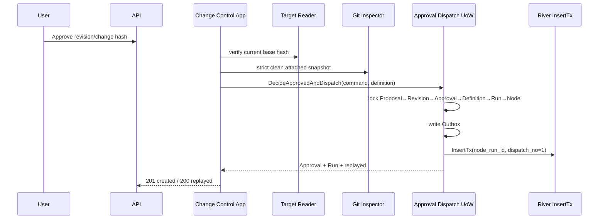
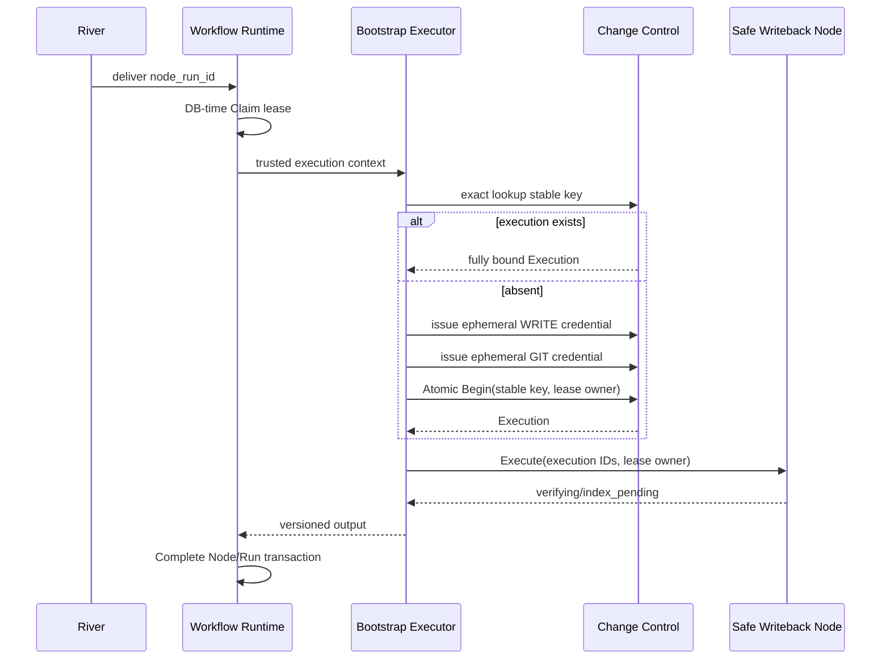

# M4-C Approval Safe Writeback Dispatch 技术设计

## 1. Boundaries

- Change Control Application：安全前置检查、ApprovalDispatchCommand、Bootstrap Executor。
- Cross-Schema PostgreSQL+River Adapter：Approval/Proposal/Workflow/Outbox/Job 单事务。
- Change Control Repository：Execution exact lookup、Authorization/Atomic Begin/Saga。
- Existing Safe Writeback Node：只 Resume 已存在 Execution，不依赖 River/Credential。

## 2. Approval Dispatch Flow

Application 先读取持久 Approval/Proposal binding：若相同 Approval 已有完整 Proposal→Run→Node→Job binding，则直接调用 UoW exact replay，不访问当前文件/Git；若是首次审批或 Approval 存在但 dispatch 不完整，才执行下列 Target/Git preflight 后进入 UoW。



`ApprovalDispatchCommand` 包含服务端生成 Approval ID/time/head 与用户允许的 proposal/revision/change hash/decision。UoW 不执行外部 I/O，但在锁内重验所有持久绑定。

## 3. Schema And Identity

- `00013_approval_writeback_dispatch.sql` 独占 Proposal→Run binding。
- `proposal.workflow_run_id` partial unique FK，trigger 只允许首次从 NULL 绑定。
- Run key：`safe-writeback-approval:<approval_id>`；Node key/kind 固定注册值。
- Node input：`schema_version/proposal_id/revision_id/approved_change_hash`。
- Writeback Execution key：`safe-writeback:<node_run_id>`；Repository 增加 `FindWritebackExecutionByKey(workspace,key)`。

## 4. Bootstrap Flow



Bootstrap 查询存在结果时逐字段验证，任何 mismatch 为 `WRITEBACK_EXECUTION_BINDING_CONFLICT` Manual。不存在时每次 delivery 使用随机服务端 Authorization issue generation；稳定 Begin key保持唯一 Execution。

## 5. Crash Matrix

| 窗口 | Durable fact | 恢复 |
|---|---|---|
| 第一 Authorization 后 | issued auth | 过期/撤销；新 generation |
| 第二 Authorization 后 | 两 issued auth | 同上，不持久 Credential |
| Begin commit 前 | 无 Execution/消费偏态 | 重签并 Begin |
| Begin commit 响应丢失 | Execution prepared + consumed auth | exact lookup，直接 Node |
| Saga checkpoint 响应丢失 | Execution checkpoint | existing Resume 规则 |
| Node success/Complete 前 | verifying Execution | duplicate Node returns same Output then Complete |
| Workflow Complete 响应丢失 | succeeded Node/Run | idempotent completion replay |

## 6. Lock And Concurrency

- Approval UoW：Proposal→Revision→Approval→Definition→Run→Node→Outbox→River。
- Bootstrap Authorization Issue：Proposal→Revision→Approval→Run→Node→Authorization。
- Atomic Begin 保持 Authorization IDs→Proposal/Revision/Approval→Run/Node→Execution。
- Approval首次路径提交后 Job 才可见；重复 Approval、Claim、Issue/Begin并发必须真实 PG `-count=20` 无死锁。

## 7. API

Approved response 扩展：

```json
{
  "id": "approval_uuid",
  "decision": "approved",
  "approved_git_head": "sha",
  "workflow_run_id": "uuid",
  "workflow_status_url": "/api/v1/workflows/uuid",
  "dispatch_status": "queued"
}
```

`dispatch_status` 为 `queued|running|replayed`。Rejected 不出现三个 Workflow 字段。完全重放 200，新建 201，binding conflict 409，依赖失败 503。

## 8. Security And Rollback

- Credential 只存在于 Bootstrap 栈帧；不进 Job/Node/DB明文字段/日志。
- 回滚前停 Worker。未 Commit Git 可由 Saga补偿；已 Commit Git 只能 Publish/reconcile，禁止 Restore 文件。
- M6 未完成时 Reindex Outbox保持 unpublished。
