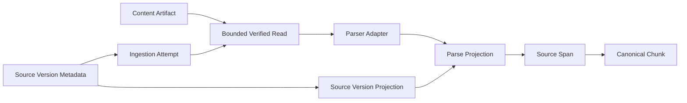

# M5-02C/D/E/F 技术设计

## 分层

- `internal/ingestion/domain`：SourceInput、ParsedDocument、SourceSpan、CanonicalChunk、Attempt 状态和稳定错误；不依赖 goldmark/pgx/HTTP。
- `internal/ingestion/application`：先解析可信 Source 元数据并创建 Attempt，再受限重读 Artifact；负责编排 Parser、幂等键、失败持久化和 Repository 调用。
- `internal/platform/parser`：goldmark Adapter 与纯文本 Adapter；只接收 immutable bytes，负责 RawRangeResolver。
- `internal/ingestion/adapter/postgres`：迁移、Repository 和投影幂等。

## Parser 契约

```go
type SourceInput struct {
    SourceVersionID foundation.ID
    MediaType string
    ImmutableBytes []byte
}

type Parser interface {
    Supports(mediaType string) bool
    Version() string
    Parse(context.Context, SourceInput) (ParsedDocument, error)
}
```

goldmark 版本锁定为 `v1.8.4`，AST 类型只存在 Adapter；标题围栏、FencedCodeBlock 围栏、Table 分隔线等范围由 Adapter-owned RawRangeResolver 从原始 bytes 恢复。

## 数据流



历史 Attempt 只追加不覆盖；共享投影按版本哈希复用。Retrieval/Embedding 不在本任务中实现。

元数据读取与文件内容读取必须分为两个阶段：只有 SourceVersion 本身不可解析时才允许不创建 Attempt；一旦获得 Workspace、Artifact、MIME 和大小契约，就先创建 `validating` Attempt。随后发生的超限、文件校验失败、依赖错误或取消都必须写入 `parse_failed`/`cancelled`，避免失去审计轨迹。
