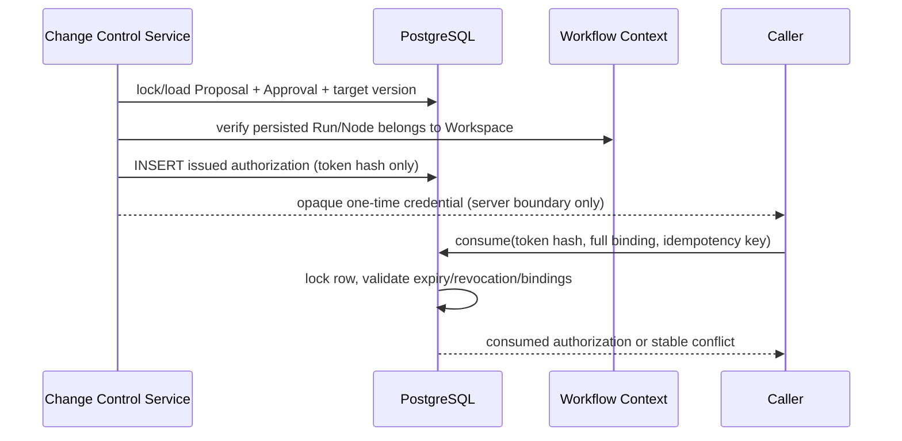

# M5-03 Write Authorization 技术设计

## 边界

- `internal/changecontrol/domain`：定义不可变授权绑定、能力、状态和稳定错误；不依赖 pgx、HTTP、Workflow Adapter 或模型框架。
- `internal/changecontrol/application`：从当前 Proposal/Approval 和目标版本签发授权，限制 TTL；消费前先完成完整不可变绑定校验，再做可选的目标当前哈希快速失败检查。
- `internal/changecontrol/adapter/postgres`：在 `change_control.tool_authorization` 保存不可逆 token hash，使用事务和行锁实现一次性消费及幂等重放。
- 后续 M5-04 才实现 Apply Workflow、文件原子替换、Git Commit、DB mapping、索引和补偿；本任务的消费结果只代表授权事实，不代表写回成功。

## 核心模型

`ToolAuthorization` 绑定：Workspace、Workflow Run、Node Run、Proposal、Revision、Approval、Change Hash、Target Version、Capability、Scope、Idempotency Key、Issued/Expires/Consumed/Revoked 时间和版本。`token_hash` 由服务端随机凭据经 SHA-256 摘要得到；原始凭据不落库、不出现在日志/模型上下文。

状态：`issued → consumed`，或 `issued → revoked/expired`。过期由数据库可信时间判断并持久化；撤销只允许服务端执行。相同授权幂等重放返回既有消费记录，不再次执行任何副作用。由于文件系统不在数据库事务内，M5-03 的目标版本原子性限定为 Revision/Approval 数据库快照；M5-04 必须在文件原子替换点再次 CAS 校验。

首次签发的明文 Credential 只返回一次且不可恢复；若数据库提交成功后响应丢失，幂等重放只返回授权记录，不重新暴露 Credential。调用方应使用新幂等键重新签发或等待短 TTL 过期，这是避免可恢复明文凭据的安全优先取舍。

## 数据流

## 不变量与兼容性

- Workflow Run/Node 必须真实存在且同 Workspace；不能用 nullable/虚构 ID 弱化写权限绑定。
- Proposal/Revision/Approval 外键和触发器保证授权不能脱离审批事实；消费仍需比较 Change Hash 与 Target Version。当前文件哈希的快速检查发生在完整绑定校验之后，失败可标记 Needs Revision，但不宣称与 DB 消费原子。
- 迁移只新增表和索引；历史 Proposal/Approval 不受改变。后续 M5-04 通过授权消费结果启动副作用 Saga。
- 授权能力使用白名单文本数组或单能力字段，禁止用户输入拼接 SQL；本任务只接受 `WRITE_KNOWLEDGE`、`GIT_WRITE` 等已登记能力。

## 失败与回滚

签发失败不创建授权；消费失败不改变文件/Git；数据库状态变化全部在单事务内回滚。未知外部副作用不在本任务发生，因此不把失败伪装成成功，也不创建补偿记录。
