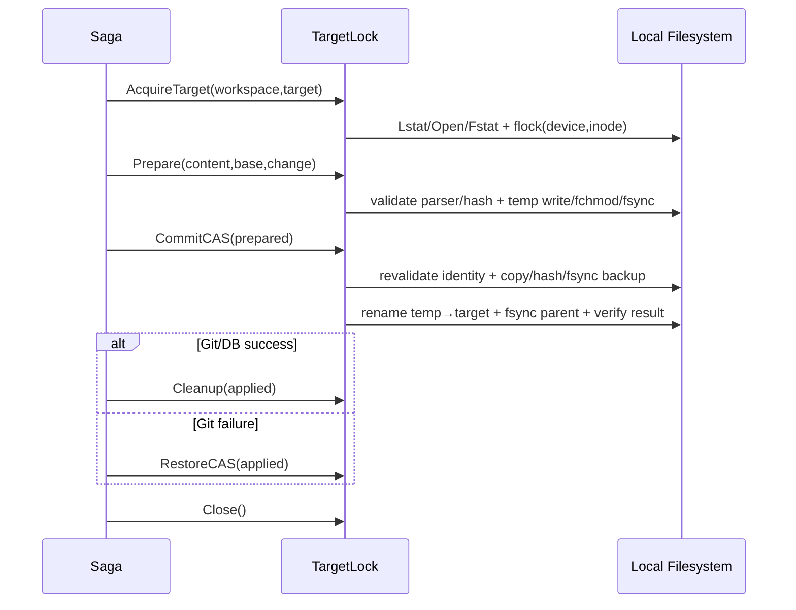

# M5-04B 技术设计

## Boundaries

- `internal/changecontrol/domain/workspace_store.go`：项目拥有的 WorkspaceStore/TargetLock 端口、PreparedWrite/AppliedWrite 值对象和状态无关校验。
- `internal/changecontrol/adapter/localfs/writer.go`：Workspace ID → Root、父链/目标安全、flock、temp/backup、CAS/restore/cleanup。
- `internal/changecontrol/adapter/localfs/markdown_validator.go`：把已有 Parser 契约适配为 Change Control 的 `ContentValidator`；Eino/模型不参与写入校验。
- `internal/platform/filesystem`：复用/提取 Root 内的 hash、sync、Git local exclude 与安全目录基础能力，不承载 Proposal/Writeback 状态机。

## Domain Contract

```go
type WorkspaceStore interface {
    AcquireTarget(context.Context, foundation.ID, string) (TargetLock, error)
}

type TargetLock interface {
    Prepare(context.Context, PrepareWrite) (PreparedWrite, error)
    CommitCAS(context.Context, PreparedWrite) (AppliedWrite, error)
    RestoreCAS(context.Context, AppliedWrite) (RestoreResult, error)
    Cleanup(context.Context, AppliedWrite) error
    Close() error
}
```

`PrepareWrite` 包含 Execution ID、Expected Base Hash、Approved Change Hash 和内容；Result Hash 由 Domain/Adapter重算，不信任调用方 locator。`PreparedWrite`/`AppliedWrite` 只暴露 Workspace 相对 locator、hash、mode 和不可伪造 lock token 摘要，不暴露绝对路径或 Credential。

## File Flow



## Lock And Identity

- Acquire 先在 Root 内对父链/目标 `Lstat`，再用 `O_NOFOLLOW|O_NONBLOCK` 打开并 `Fstat`。
- 文件身份至少记录 device/inode/mode/size；Root device 与目标 device 不同即拒绝 v1 mount 边界。
- lock key 使用 `sha256(device:inode)`，锁文件持久保留；`LOCK_EX|LOCK_NB` + ticker/context 获取。
- Acquire 获锁后再次验证目标路径仍指向同一 device/inode。

## Temp, Backup And Git Clean

- temp/backup 位于目标父目录，命名 `.zhixu-writeback-<execution>-<random>.tmp|.bak`，O_EXCL 0600。
- `.git/info/exclude` 使用单一稳定 pattern `**/.zhixu-writeback-*`；沿用现有安全 Git directory/exclude 写入实现，拒绝 symlink marker。
- backup 为独立 copy，避免 hardlink 被外部 inode 写入污染；copy 时同时计算 Base Hash。
- Adapter 只接受自己生成并与当前 lock token/Execution ID 绑定的 locator。

## Failure Classification

- Path/Markdown/size/change hash：InvalidInput/PermissionDenied，正式文件不变。
- Base hash 或 identity 改变：VersionConflict `TARGET_BASE_HASH_CONFLICT`，正式文件不变。
- Lock busy/暂时 IO：RetryableFailure。
- rename 前失败：清理 temp/backup 后 NonRetryable/Dependency error。
- rename 后 parent sync、结果 hash 或身份无法证明：ManualRecoveryRequired，返回可审计 AppliedWrite 摘要。
- Restore 当前目标不是 Result Hash：VersionConflict，拒绝覆盖用户编辑。

## Compatibility And Rollback

- 不修改公开 HTTP/API/数据库 Schema；M5-04D 通过 Composition Root 注入本端口。
- 停用 Safe Writeback 即停止新 Acquire；已有 backup/temp 按 Execution locator 做恢复/清理，不删除未知文件。
- LocalFS 仅锁定 Linux/macOS 本地 POSIX 语义；其他平台必须提供新 Adapter 或明确不支持。
