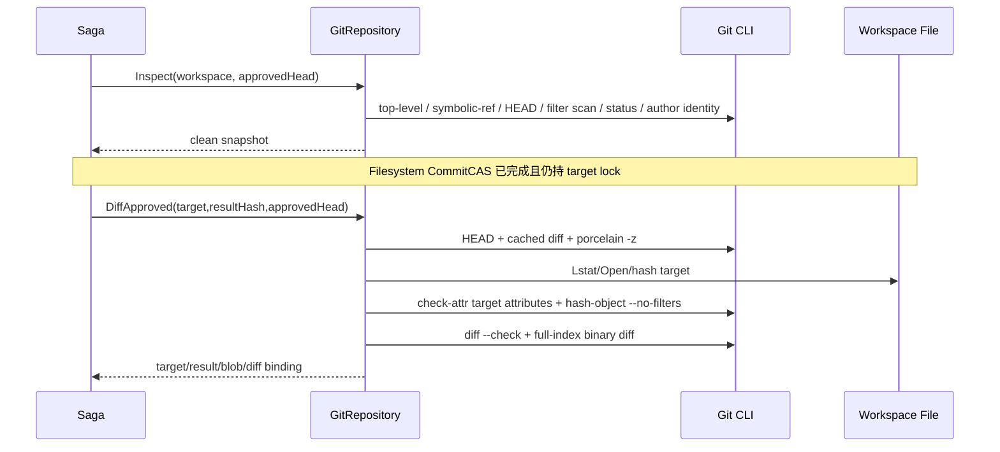

# M5-04C 技术设计

## Boundaries

- `internal/changecontrol/domain/git_repository.go`：GitRepository 端口、GitSnapshot/GitDiff/GitCommit/Lookup/Reverse 值对象和纯领域绑定校验。
- `internal/platform/gitcli/status.go`：保留现有 Workspace Status/Initialize；提取受限 command runner、canonical repo 和稳定错误分类供写回复用。
- `internal/platform/gitcli/writeback_inspect.go`：Workspace ID → root、Inspect、DiffApproved、属性/路径/blob/diff helpers。
- `internal/platform/gitcli/writeback_commit.go`：raw staging、immutable tree、Commit/Lookup/Recovery/Reverse 与 ref CAS。
- `internal/platform/gitcli/*_test.go`：真实临时 Git repo contract/security/fault tests；不 mock Git 语义，只在 unknown-result 注入处替换 runner。

## Domain Contract

```go
type GitRepository interface {
    Inspect(context.Context, foundation.ID, string) (GitSnapshot, error)
    DiffApproved(context.Context, GitDiffRequest) (GitDiff, error)
    CommitApproved(context.Context, GitCommitRequest) (GitCommit, error)
    FindWritebackCommit(context.Context, GitCommitLookup) (GitCommit, error)
    CreateReverseCommit(context.Context, ReverseCommitRequest) (GitCommit, error)
}
```

- `GitOperation` 固定为 `apply/revert`，参与 Trailer、Lookup 和 GitCommit 不可变绑定。
- `GitSnapshot`：Workspace ID、Branch、HEAD、ObjectFormat、Clean；不暴露 absolute root。
- `GitDiffRequest`：Workspace ID、Target Path、Approved Head、Expected Result SHA-256。
- `GitDiff`：Approved Head、Target Path、Result SHA-256、Diff SHA-256、Base/Result Git Blob ID 和 Base Git mode；Base blob/mode 用于 Commit 明确未发生时恢复 index。
- `GitCommitRequest`：GitDiff + Writeback Execution/Proposal/Revision/Approval/Workflow Run/Node IDs。
- `GitCommit`：Commit、Parent、Target、Result/Diff/Blob、Recovered、ReversedCommit optional。
- `GitCommitLookup` 使用与 Commit 相同的完整不可变绑定，不能只靠 Execution ID 接受结果。
- `ReverseCommitRequest` 绑定原 Commit 与 Expected Base SHA-256；反向结果复用 GitCommit 摘要并记录 ReversedCommit。

## Inspect And Diff Flow



## Safe Command Policy

所有命令统一前缀与环境：

```text
git --no-pager --literal-pathspecs -c core.fsmonitor=false -c core.untrackedCache=false -c core.quotePath=true -c core.hooksPath=<disabled> -c diff.compactionHeuristic=false -c diff.suppressBlankEmpty=false -c log.showSignature=false -c color.ui=false -C <canonical-root> <fixed-subcommand> <fixed-flags>
LC_ALL=C LANG=C GIT_TERMINAL_PROMPT=0 GIT_NO_REPLACE_OBJECTS=1 GIT_EDITOR=: GIT_SEQUENCE_EDITOR=:
```

- runner 过滤继承的所有 `GIT_*`，再只设置安全变量；固定禁 Hook、replace object、签名展示、pager/editor/prompt、fsmonitor/untracked cache 和会改变 Diff 字节的 config。只读命令设置 `GIT_OPTIONAL_LOCKS=0`，写命令保留 Git 自身 index/ref lock。
- 读 Diff 固定 `--no-ext-diff --no-textconv --no-color --full-index --binary --no-renames --diff-algorithm=myers --no-indent-heuristic --inter-hunk-context=0 --src-prefix=a/ --dst-prefix=b/ --unified=3`，并校验 full-index header 的 Base/Result Blob。
- 在 status/diff/revert 前扫描全仓 tracked `filter`，并拒绝目标的 filter/ident/text/eol/working-tree-encoding/diff/merge 属性；raw blob 只通过 `hash-object --no-filters` 生成。
- 拒绝 legacy `.git/info/grafts`；`GIT_NO_REPLACE_OBJECTS=1` 保证 log/cat-file/diff 验证真实对象，`--no-show-signature` 避免 lookup 执行仓库 gpg program。
- stdout/stderr 使用 bounded buffer；错误仅保留内部诊断，公开 Error 只暴露稳定 code/category。

## Commit Message And Trailers

```text
ZHIXU: apply approved proposal

Zhixu-Operation: apply
Zhixu-Writeback-ID: <id>
Zhixu-Proposal-ID: <id>
Zhixu-Revision-ID: <id>
Zhixu-Approval-ID: <id>
Zhixu-Workflow-Run-ID: <id>
Zhixu-Workflow-Node-ID: <id>
Zhixu-Target-Path: <relative-path>
Zhixu-Result-SHA256: <64hex>
Zhixu-Diff-SHA256: <64hex>
```

Reverse subject 固定为 `ZHIXU: revert approved proposal`，`Zhixu-Operation: revert`，保留上述绑定并增加 `Zhixu-Reverts-Commit`。Trailer value 必须是单行受验证 ID/path/hash；不接受换行、NUL 或自由文本。Lookup 先按 Execution+Operation 选候选，再校验完整 message 和 Commit 对象。

## Commit And Recovery

1. 重新 Inspect：HEAD==approved、branch attached；worktree 仍只有 target，index clean。
2. 重算 DiffApproved，要求与请求 GitDiff 完全一致。
3. `hash-object -w --no-filters` + NUL `update-index --index-info` 只 stage target，随后验证 staged 唯一路径、mode/blob 和 stable cached Diff。
4. `write-tree` 固化 immutable tree，再次验证 tree 只改变 target；`commit-tree -p approved -F -` 生成固定对象，`update-ref branch new approved` 以 old-value CAS 发布。
5. 发布后读取 HEAD、parent、message/trailers、changed paths、commit diff 和 `HEAD:target` 原始内容 hash；任何失败按已发布未知结果进入人工恢复。
6. 命令返回 error/timeout 时，用 `context.WithoutCancel` 派生固定短时恢复查询；按当前分支 HEAD 起最多 256 个 Commit 搜索 exact Execution Trailer。
7. 只有唯一 Commit 且完整绑定通过才返回 `Recovered=true`；未找到且能证明 HEAD 未变、target index 未被用户再次 stage 时才恢复 Base index；否则进入 ManualRecoveryRequired。

## Reverse Flow

- 前置：HEAD==produced commit、attached、全仓 clean、原 Commit binding 有效。
- 在任何 worktree Git 命令前拒绝目标 filter/merge 等危险属性；执行固定 `git revert --no-commit <commit>`，成功后验证 cached 唯一路径与 Base blob/result，再复用 immutable tree + commit-tree + update-ref CAS 发布 Reverse；全程禁用 Hook/signing/editor/prompt。
- 后置：new parent==produced commit、only target changed、`HEAD:target` SHA-256==Expected Base、Reverse trailers 完整且最终 clean。
- Revert/Commit 命令未知时使用与正向 Commit 相同的 exact Trailer recovery；冲突、index/worktree 残留或无法证明时保留现场并返回 ManualRecoveryRequired，不自动 reset/abort。

## Error Model

- InvalidInput：ID/path/hash/trailer/请求绑定非法。
- NotFound：Workspace/repository/lookup commit 不存在。
- VersionConflict：HEAD drift、dirty/index/target diff、reverse precondition 改变。
- PermissionDenied：unsafe filter/hook boundary、repo root mismatch、target symlink/特殊文件。
- DependencyUnavailable/RetryableFailure：Git binary、暂时 IO、锁、明确可重试超时。
- ConsistencyViolation：唯一 Trailer 冲突、Commit 内容/parent/blob/diff 不一致。
- ManualRecoveryRequired：Commit/Revert 结果无法证明或 revert 留下冲突现场。

## Compatibility And Rollback

- 不修改现有 Workspace `GitStatusReader/GitInitializer` 接口与 HTTP/DB Schema；M5-04D 只注入新 GitRepository。
- Source Version Trailer 暂不实现，因为当前领域没有真实绑定；禁止使用空值或从 target path 猜测。
- 回滚本 Adapter 时停止新 Safe Writeback；已产生 Commit 不改写历史，按 Trailer/DB Mapping 继续 reconcile。
- v1 的 index 恢复采用“读取当前 target entry → 仅匹配系统 Result Blob 时恢复 → 复核无 staged path”的协作式检查；它不能阻止拥有仓库写权限的外部进程在两个 Git 命令之间绕过服务协议直接改 index。正式 Commit 仍由 immutable tree 与 ref CAS 防夹带；恢复期间若检测到任何漂移立即转人工处理。
