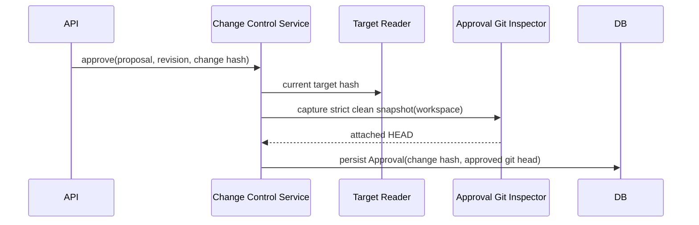

# M5-04D 技术设计

## 1. Confirmed Conflicts And Resolution

| 冲突 | 当前事实 | 采用方案 |
|---|---|---|
| Approval Git HEAD | Schema/PRD 要求新审批必填；Application/API 未观察 Git，实际写入 NULL | 新增消费方 `ApprovalGitInspector`，Approved 决策前读取严格 current snapshot 并保存 HEAD |
| Begin 顺序 | 父设计写 create→consume；Create 会把 Proposal 改 applying，Consume 只接受 approved，且 Credential 不可恢复 | 新增 PostgreSQL 原子 Begin：双授权消费 + Execution create/replay + Proposal applying 同事务 |
| 文件 checkpoint | random backup/lock state 只在内存，rename→DB checkpoint crash 无法恢复 | 新增 `file_prepared`、预留 backup locator、持久化 PreparedWrite 摘要和 ResumeTarget |
| Git checkpoint | Commit→DB checkpoint crash 时缺 Diff/Blob/Mode，不能 exact lookup | 新增 `git_prepared` 和完整 GitDiff 持久字段，重放先 Lookup 后 Commit |
| Worker 运行时 | 文档写 River，仓库无 River/dispatcher，worker 只 ping DB | 本期实现 Node + composition + 直接真实 smoke；另建 M4 River runtime 任务，不宣称自动 dispatch |
| 父 Git/FS 示例 | 父 design 仍含旧 TargetLock 签名和 `git add/commit` 表述 | 以已归档 M5-04B/C 真实接口和 code-spec 为准，并在本任务同步父文档 |

## 2. Boundaries

- `internal/changecontrol/application/service.go`：Approved 决策的只读 Git snapshot。
- `internal/changecontrol/application/writeback_service.go`：Begin/Resume Saga、检查点、补偿、Publish 与安全输出。
- `internal/changecontrol/workflow/node.go`：固定 Node 输入/输出适配，不拥有领域状态机。
- `internal/changecontrol/domain`：新增 Begin、file/git prepared checkpoint、恢复摘要和 Repository/Store 端口。
- `internal/changecontrol/adapter/postgres`：原子 Begin、lease guard、扩展 checkpoint/publish/finalize cleanup。
- `internal/changecontrol/adapter/localfs`：预留 backup locator、可重启 ResumeTarget、受控 cleanup。
- `internal/platform/gitcli`：新增 approval current snapshot；Commit/Lookup/Reverse 语义保持 M5-04C 契约。
- `cmd/api` 只注入 approval inspector；`cmd/worker` 只构造 Saga/Node 组件，不伪造 dispatcher。

## 3. Domain And Persistence Changes

### Writeback States

```text
prepared
  → file_prepared
  → needs_revision | apply_failed | manual_recovery_required
file_prepared
  → file_applied | needs_revision | apply_failed | manual_recovery_required
file_applied
  → git_prepared | compensating_file | manual_recovery_required
git_prepared
  → git_committed | compensating_file | manual_recovery_required
compensating_file
  → compensated | manual_recovery_required
git_committed
  → verifying | publish_recovery_required
publish_recovery_required
  → verifying | manual_recovery_required
verifying
  → completed | verify_failed | rolled_back   (M6/后续)
```

### New Durable Fields

- File intent：`temporary_ref`、`backup_ref`、`file_byte_size`、`file_mode`、`file_lock_token`、`file_result_lock_token`、`file_backup_lock_token`。三个 opaque token 分别绑定原始目标、Result temp/应用后目标和 Base backup 的 device+inode 摘要；它们不是授权凭据，不进入 API/日志。
- Git intent：`base_blob_id`、`result_blob_id`、`base_mode`；`diff_hash` 从 `git_prepared` 起持久化，Commit/Parent 在 `git_committed` 起必填。
- Cleanup：`cleanup_completed_at` 标识 temp/backup 已安全清理；M6 完成前必须保留 verifying 语义。

新增前向迁移 `00010_safe_writeback_saga.sql`，扩展 CHECK/Trigger/状态迁移；不修改已应用 `00009`。

## 4. Ports

```go
type ApprovalGitInspector interface {
    CaptureApprovalSnapshot(context.Context, foundation.ID) (domain.GitSnapshot, error)
}

type WritebackSagaRepository interface {
    domain.WritebackRepository
    BeginWriteback(context.Context, domain.BeginWriteback) (domain.WritebackExecution, error)
    ValidateWritebackLease(context.Context, foundation.ID, string) error
    FinalizeWritebackCleanup(context.Context, foundation.ID, int64, time.Time) (domain.WritebackExecution, error)
}

type WorkspaceStore interface {
    AcquireTarget(context.Context, foundation.ID, string) (TargetLock, error)
    ResumeTarget(context.Context, foundation.ID, string, ResumeWrite) (TargetLock, PreparedWrite, *AppliedWrite, error)
}
```

`BeginWriteback` 携带两份完整 `AuthorizationConsume` 与服务端派生的 Execution identity。Repository 在同一事务中加载真实 Authorization ID 并构造 Execution，不接受调用方伪造 ID。

`ResumeWrite` 由持久化 Execution 和 Proposal Revision 构造；LocalFS 必须重新校验 target/temp/backup 的 regular file、owner、device、hash、size、mode 和 locator 归属。

## 5. Approval Flow



拒绝决策不调用 Git；审批后到 Apply 之间的任何变化由 Begin/Saga 再验证，不静默更新审批基线。

## 6. Begin And Node Flow

```mermaid
sequenceDiagram
    participant O as Trusted Orchestrator
    participant S as Writeback Service
    participant DB
    participant N as Safe Writeback Node
    participant FS
    participant G
    O->>S: Begin(two credentials, workflow/proposal identity)
    S->>DB: atomic consume both + create/replay execution
    DB-->>S: execution_id (prepared)
    O->>N: execute(execution_id, lease owner)
    N->>S: Resume(execution_id)
    S->>DB: validate running lease
    S->>FS: Prepare with reserved backup ref
    S->>DB: checkpoint file_prepared
    S->>FS: CommitCAS / recover result
    S->>DB: checkpoint file_applied
    S->>G: DiffApproved
    S->>DB: checkpoint git_prepared
    S->>G: Lookup exact; if absent CommitApproved
    S->>DB: checkpoint git_committed
    S->>DB: Publish mapping + outbox + verifying
    S->>FS: Cleanup recovery evidence
    S->>DB: finalize cleanup
    S-->>N: verifying/index_pending summary
```

Node input不含 Credential。Begin 响应完成后，两份 Authorization 与 Execution 已在同一事务中成为 Durable Fact。

## 7. Resume Rules

| Execution 状态 | 恢复动作 |
|---|---|
| `prepared` | 重新检查 Proposal/Approval/HEAD/lease，Acquire+Prepare；无正式文件副作用 |
| `file_prepared` | ResumeTarget；Base→继续 CommitCAS，Result+valid backup→识别 applied，其他→manual |
| `file_applied` | ResumeTarget 验证 result/backup；重算 Diff 并 checkpoint git_prepared |
| `git_prepared` | 先 exact Find；found→git_committed，NotFound+safe→Commit，unknown/conflict→manual |
| `git_committed` | Publish；失败保留 Commit，禁止 Restore 文件 |
| `publish_recovery_required` | exact Publish replay；绑定冲突→manual |
| `verifying` | 重试 Cleanup/finalize，返回 index pending；不创建新 Commit/Outbox |
| `compensating_file` | ResumeTarget 验证 Result/backup identity 后直接原子 rename 已 fsync 的 Base backup；成功→compensated，目标/证据同内容不同 inode、冲突或 unknown→manual |

## 8. Error And Compensation Matrix

| 阶段 | 错误 | 状态/动作 |
|---|---|---|
| Begin | credential/绑定/过期/lease/审批冲突 | 整事务回滚，无 Execution/消费偏态 |
| Prepare | invalid content/path/parser | `apply_failed`；正式文件不变 |
| File CAS | Base/identity conflict | `needs_revision`；不覆盖用户内容 |
| File CAS | rename/sync/result unknown | `manual_recovery_required`；保留 intent/backup |
| Diff/Git preflight | HEAD/dirty/diff conflict | `compensating_file`，仅在 Git 明确未提交时 Restore |
| Git Commit | exact found | checkpoint `git_committed`，不重复 Commit |
| Git Commit | unknown/unverifiable | `manual_recovery_required`，不 Restore 文件 |
| Publish | retryable DB rollback | `publish_recovery_required` 或保留 `git_committed`，重放 Publish |
| Publish | Mapping/Outbox binding conflict | `manual_recovery_required`/一致性告警，不重复 Commit |
| Cleanup | 临时依赖失败 | 保持 `verifying` 且 cleanup 未完成，Node 重试 |
| Cleanup | evidence tamper | 保持恢复证据并返回一致性错误，禁止删除未知文件 |

## 9. Lease And Security

- Begin 和每个新副作用前查询数据库可信时间，要求 Node=`running`、owner 匹配、lease 未过期。
- 已开始的单个原子命令不可被 lease 硬中断；命令返回后若 lease 已失效，不开始下一副作用。
- Credential 只进入 Atomic Begin 参数，立即 hash 比较；不得进入 Node、Execution、Outbox、Audit/日志或 error details。
- Application/Node 不接受任意 target/content/Git args；全部由 Proposal/Execution 派生。

## 10. Compatibility And Rollback

- 迁移只向前扩展 nullable 字段并回填默认；旧代码仍可读旧 Execution，但新 Saga 只处理满足新 checkpoint 契约的记录。
- 停止 Worker/Node 可阻止新副作用；`file_prepared/file_applied/git_prepared` 必须恢复或补偿，不能删除记录/证据。
- Git 已提交时回滚应用代码不得恢复文件；按 Trailer + Mapping reconcile。
- River runtime 未实现时仅通过直接 Node 集成 smoke 证明 Saga，不对外声称异步自动执行。

## 11. Alternatives Rejected

- 分两次 Consume 再 Create：存在 Credential 丢失与 Proposal status 冲突。
- 把 Credential 放进 Workflow/River payload：违反 Secret 与不可恢复凭据决策。
- Commit 后再保存 Diff binding：进程崩溃后无法 exact lookup。
- checkpoint 失败时仅当前进程 Restore：不能覆盖进程崩溃。
- 自制轮询 pending node：与已接受 River 架构冲突并制造第二套运行时。
