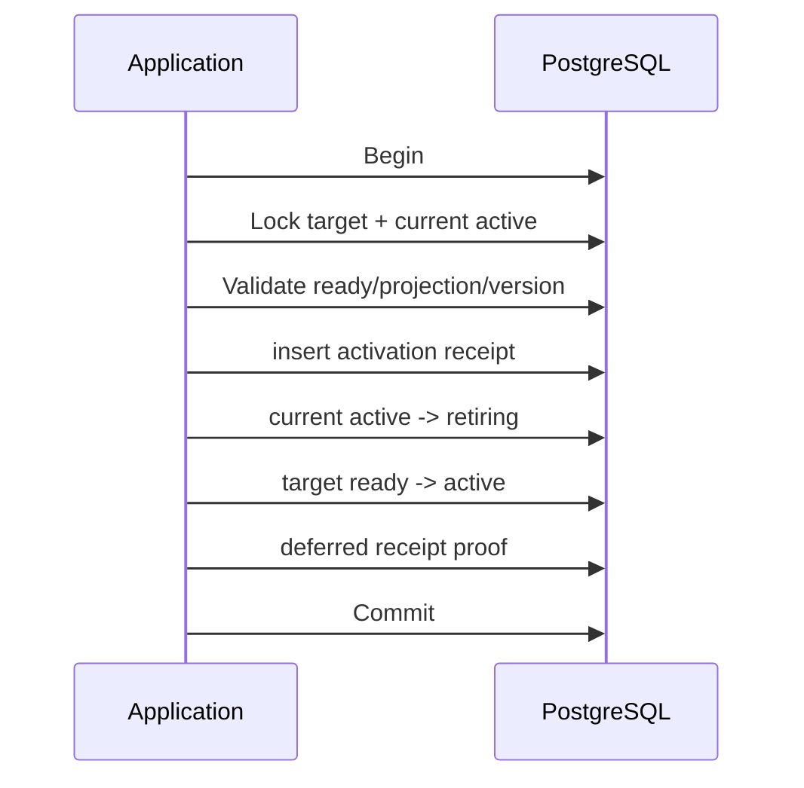

# M6-A Retrieval Index Foundation 技术设计

## 1. Package Design

```text
internal/retrieval/
  domain/             # 状态、实体、校验、Store Port
  application/        # Register/Begin/Save/Ready/Activate/Fail 用例
  adapter/postgres/   # pgx 与 pgvector 持久化实现
internal/platform/postgres/
  pool.go             # AfterConnect 注册官方 pgvector 类型
```

依赖方向为 Adapter → Application/Domain → Foundation。Composition Root 在后续 M6-B
接入，本任务的测试直接构造 Service/Repository。

## 2. Domain Contracts

```go
type Store interface {
    RegisterEmbeddingVersion(context.Context, domain.EmbeddingVersion) (domain.EmbeddingVersionResult, error)
    BeginIndex(context.Context, domain.IndexBuild) (domain.IndexVersionResult, error)
    BuildLexical(context.Context, domain.LexicalBuildCommand) (domain.ProjectionBatchResult, error)
    SaveVectorBatch(context.Context, domain.ProjectionBatch) (domain.ProjectionBatchResult, error)
    TransitionIndex(context.Context, domain.IndexTransition) (domain.IndexVersion, error)
    Activate(context.Context, domain.ActivationCommand) (domain.ActivationResult, error)
    RollbackActivate(context.Context, domain.RollbackActivationCommand) (domain.ActivationResult, error)
    GetIndex(context.Context, foundation.ID, foundation.ID) (domain.IndexVersion, error)
    GetIndexByIdempotencyKey(context.Context, foundation.ID, string) (domain.IndexVersion, error)
    GetBuildStatus(context.Context, foundation.ID, foundation.ID) (domain.BuildStatus, error)
    GetActive(context.Context, foundation.ID) (domain.IndexVersion, error)
}
```

Application 创建 ID/时间、规范化输入并调用 Store；PostgreSQL Adapter 负责事务、行锁、
精确重放和错误分类。Adapter 使用 `pgvector-go` 的 `Vector` 类型传递参数，不自行序列化
或拼接向量文本。

## 3. Database Shape

### embedding_version

- `id uuid primary key`
- `provider/model text`
- `adapter_name/adapter_version/normalization/distance_metric text`
- `dimensions integer > 0`
- `config_hash char(64)`
- `created_at timestamptz`
- 唯一 `(provider, model, dimensions, config_hash)`

### index_version

- `id/workspace_id/embedding_version_id`
- tokenizer/fusion 配置与 hash
- `source_snapshot_ref/manifest_hash/expected_chunk_count`
- `status/degraded_capabilities/failure_code/idempotency_key/version`
- lifecycle timestamps
- 唯一 `(workspace_id,idempotency_key)`
- 部分唯一 `(workspace_id) where status='active'`
- 唯一 `(id,workspace_id)` 供复合 FK

### index_manifest_chunk

- PK `(index_version_id,chunk_id)`
- 复合 FK 到 Index/Canonical Chunk 的 `(id,workspace_id)`
- `content_hash/sequence/parser_version/chunk_strategy_version/schema_version`
- 创建后禁止 Update/Delete；稳定排序摘要必须等于 Index `manifest_hash`

### chunk_projection

- PK `(index_version_id,chunk_id)`
- 复合 FK `(index_version_id,workspace_id)`、`(chunk_id,workspace_id)`
- `embedding_version_id/search_vector/embedding/token_count`
- lexical/vector status、failure code、timestamps
- GIN `search_vector`
- B-tree `(workspace_id,index_version_id,chunk_id)`
- Canonical Chunk content 建 `gin_trgm_ops`，供后续中文/符号 Query 与 Index membership join 使用

### index_activation

- append-only activation ID、Workspace、目标/上一 Index、idempotency key、时间和原因码。
- 唯一 `(workspace_id,idempotency_key)`。
- 目标/上一 Index 都使用 `(index_id,workspace_id)` 复合 FK。

## 4. Projection Status Rules

```text
lexical_status: pending | ready | failed
vector_status: disabled | pending | ready | skipped_oversized | failed
```

- Index Ready 至少要求所有目标 Chunk lexical ready。
- 配置 Embedding 且未声明 vector degraded 时，所有非 oversized Chunk 必须 vector ready。
- FTS-only Index 的 embedding_version_id 为空、vector_status=disabled，并包含 `vector` degraded。
- 数据库 trigger 使用 `vector_dims(embedding)` 验证 ready vector 与 Embedding Version dimensions。
- Projection 与 Index 的 `embedding_version_id` 必须相等；Vector ready 还要通过 Application
  的 finite/non-zero norm 检查。

## 5. Lexical Build

`BuildLexical` 不接受调用方传入正文。Repository 在一个事务内：

1. 锁定 Building Index 并校验 Manifest 不可变。
2. `INSERT ... SELECT` Manifest → `ingestion.canonical_chunk`，校验 content hash/版本绑定。
3. 以 Heading 权重 A、Content 权重 B 生成 `to_tsvector('simple', ...)`。
4. FTS-only 写 vector status=disabled；有 Embedding 配置写 pending。
5. 返回 inserted/replayed count；任何缺失或冲突全部回滚。

## 6. Activation Transaction



Ready 校验通过 Manifest expected count、Manifest↔Projection anti-join、Content Hash 和 Vector
capability 一致性证明完整。并发激活通过 Workspace advisory transaction lock + 行锁 +
部分唯一索引三层保护。
响应丢失后按 activation idempotency key 精确查询，不重复改变旧 Active。
RollbackActivate 使用相同 helper 和 Activation append 契约，禁止通过通用 Transition 进入 Active。
Activation Receipt 保存 `activate|rollback` 类型、目标/上一 Index 及切换后的版本；约束 Trigger
要求先插 Receipt，再执行状态更新，并在事务提交前延迟证明 Receipt 与最终状态完全一致。后续
Index 再次切换后重放旧 key 时，Repository 用不可变 Receipt 重建当次结果快照，而不是返回
Index 当前状态。

## 7. FTS Baseline

M6-A Lexical Builder 使用 Canonical Chunk heading/content 生成加权 `tsvector`：标题权重 A、
正文权重 B。`pg_trgm` 通过 Canonical Chunk content 的 `gin_trgm_ops` 索引提供中文/符号
模糊基线；具体 Search Query 在 M6-C 实现。本任务用真实构建与 EXPLAIN 证明索引可用。

## 8. Migration Safety

- Up 幂等创建扩展、表、约束、索引和 trigger。
- Down 首先检查五张表；存在任意数据时 `RAISE EXCEPTION ... ERRCODE '55000'`。
- 空数据按依赖逆序删除，不删除 `retrieval` Schema 和 `vector` 扩展。
- 历史 Ingestion 数据不回填；Index 由后续显式 Build 创建。

## 9. Compatibility And Rollback

新表默认无生产调用方，部署后不会改变现有 API/Worker。应用回滚保留新 Schema；若尚无数据，
可执行 Down→Up 验证。任何 Active Index 数据存在后只允许前向迁移。
