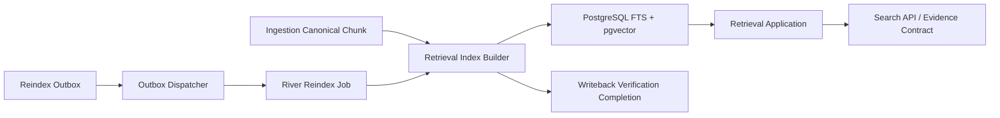
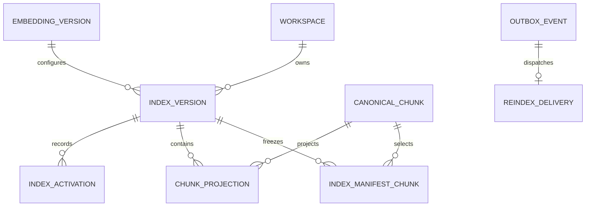

# M6 Retrieval Indexing And Search 技术设计

## 1. Architecture Boundary



- `internal/retrieval/domain`：Index/Embedding Version、Projection、Evidence 与状态不变量。
- `internal/retrieval/application`：Index Build、Activate、Search 和 Reindex 消费用例。
- `internal/retrieval/adapter/postgres`：FTS/pgvector、版本切换、查询与消费状态。
- `internal/platform/models`：项目自有 Embedding/Rerank Port 的直接协议 Adapter。
- `internal/workflow/adapter/river`：只承载 Reindex Job transport，不成为索引事实源。
- `internal/changecontrol`：只暴露验证完成 Port；不依赖 Retrieval 具体实现。

## 2. Data Model



- `embedding_version` 保存 provider/model/dimensions/config hash，不保存密钥。
- `index_version` 保存 tokenizer、embedding、fusion 配置、source snapshot、manifest hash、
  expected chunk count、状态和 degraded capabilities。
- `index_manifest_chunk` 冻结 Chunk ID、Workspace、Content Hash、Sequence 和策略版本；
  Ready 校验要求 Manifest 与 Projection 一一覆盖。
- `chunk_projection` 只保存引用、`tsvector`、向量和索引状态；正文仍由 Canonical Chunk 拥有。
- `reindex_delivery` 将 dispatched、processing、succeeded/failed 与 Outbox `published_at` 分离。
- Active 唯一性由部分唯一索引保证；激活事务将旧 Active→Retiring、目标 Ready→Active。

## 3. FTS And Vector Decision

- FTS：`simple` tsvector + `pg_trgm` 基线。Tokenizer ID/Version 属于 Index Version，未来可替换中文分词。
- Vector：使用 pgvector `vector` 可变维度列，通过 Embedding Version 和 `vector_dims` 校验。
- ANN：官方 HNSW 要求固定维度；在模型未锁定前不创建全局 HNSW。M10 根据 Active
  Embedding Version 创建部分表达式索引，如 `embedding::vector(n)` + model/version predicate。
- 低数据量以精确 cosine scan 为正确性基线，查询始终限制 Workspace、Index Version 和候选上限。

## 4. Outbox And Delivery Semantics

`published_at` 只表示事件已成功事务型派发到 River。独立 `reindex_delivery` 保存业务状态：

```text
pending -> dispatched -> processing -> succeeded
                              |-> retry_wait -> dispatched
                              |-> failed
                              |-> manual_recovery
```

Dispatcher 在同一事务内锁定 Outbox、创建/重放 Delivery、`InsertTx` River Job 并设置
`published_at`。Delivery 持久 attempt、next_attempt_at、稳定 failure class/code 和 lease；
业务重试由 Delivery/Workflow 事实控制，River 只负责同一 Job 的 transport redelivery。
Worker 以 Delivery ID 幂等执行；只有 Index 激活与 Change Control 完成归约在同一数据库
事务成功后，Delivery 才可 `succeeded`。

可确认没有持久副作用且明确不可重试的错误进入 `failed`；Commit/Index 激活结果未知、
跨模块状态无法安全判定或恢复 binding 冲突进入 `manual_recovery`，不能伪装 failed 后重建。

## 5. Controlled Reingestion

Writeback payload 的路径只是身份摘要，不是可直接索引的正文来源。Consumer 必须：

1. 校验 Workspace/Proposal/Revision/Approval/Execution/Git Commit binding。
2. 调用 `CaptureCommittedSourceVersion`：输入 Workspace、受控相对路径、result hash、Git
   commit、Proposal/Execution binding；安全读取并验证后，复用 Source identity，创建或
   精确重放唯一 Content Artifact + Source Version。
3. 使用返回的 SourceVersionID 调用已有 Ingestion Application，获取 Parse Projection/Chunk。
4. 构建 Retrieval Projection 并运行固定回归。
5. 激活索引并推进 Writeback/Proposal completed。

## 6. Shared Completion Transaction

M6-B 新增 Cross-Module PostgreSQL UoW，不能串联已提交的 `Activate` 与 Change Control
调用。`CompleteReindexTx` 在一个事务内：

1. 锁 Delivery、目标 Index、当前 Active、Writeback Execution 与 Proposal。
2. 校验 Build Manifest、Projection 完整性和回归结果。
3. 旧 Active→Retiring、目标 Ready→Active并追加 Activation。
4. Delivery→Succeeded。
5. Execution/Proposal `verifying→completed`。
6. Commit 后 Worker 才返回成功。

普通手动激活和 Writeback 完成激活复用 Retrieval PostgreSQL Adapter 的同一 tx-scoped
helper；跨模块 Adapter 拥有 pgx transaction，领域/Application 不暴露 pgx。

## 7. Search Flow

Lexical 与 Vector 使用同一过滤对象并并行查询，分别返回有界候选；Application 执行 RRF、
相邻 Chunk/历史 Revision 去重，再可选调用 Rerank Adapter。任一路失败只能按契约降级，
不能用空结果替代失败。

Evidence v1 只投影当前真实存在的 Source Version、Canonical Chunk、Source Span、受控路径
与内容 Hash；后续知识模型通过兼容扩展增加 Document/Revision/Topic/Conflict。

## 8. Compatibility And Rollback

- 只新增前向迁移，不修改 00001–00013。
- 新 Retrieval 模块未启用时，现有 Safe Writeback 继续停在 `index_pending`，不影响旧流程。
- 新 Index 构建失败不切换 Active；回滚应用时保留新表和旧 Active。
- 停用 Dispatcher 可阻止新 Reindex Job；已派发 Job 依赖 Delivery/Index 状态安全重放。

## 9. Key Risks

- Outbox ack 语义混淆：通过独立 Delivery 状态消除。
- 模型维度漂移：Embedding Version + vector_dims fail closed。
- 中文 FTS 召回不足：保留 pg_trgm 和 Tokenizer seam，以评测驱动升级。
- 大量向量 exact scan：当前为正确性基线，M10 用容量证据决定 HNSW/分区。
- Retrieval 与 Change Control 循环依赖：双方只依赖 Application Port，由 Composition Root 连接。
