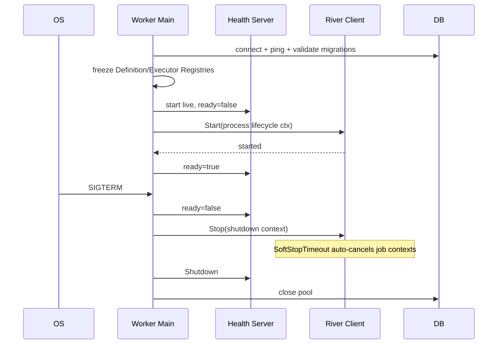

# M4-D River Operability And Delivery 技术设计

## 1. Boundaries

- `cmd/worker`：进程 Composition、signal、start/stop 顺序。
- `internal/platform/config`：运行时配置与交叉字段校验。
- `internal/platform/observability`：项目自有 logger/metrics/tracer 接口和 OpenTelemetry Adapter。
- `internal/workflow/runtime`：只暴露 readiness snapshot、active execution 和 shutdown 状态，不依赖 HTTP。
- `internal/workflow/httphealth` 或等价 Adapter：Worker `/livez|readyz`，不承载业务 API。
- `cmd/migrate`、`deploy/Dockerfile`、`deploy/compose.yml`：单一交付镜像和迁移门禁。

## 2. Process Lifecycle



River v0.40.0 `Start` 返回后后台运行。传给 Start 的 process lifecycle Context 不直接绑定 OS signal；signal 只向唯一 lifecycle 状态机提交 graceful 事件。Runtime/Supervisor 仅在检测到“继续执行可能扩大副作用”的稳定 fatal invariant 时提交 emergency 事件；测试可注入该事件。状态机以一次性 CAS 从 running 进入 graceful-stopping 或 emergency-stopping，首个事件决定调用 `Stop` 或 `StopAndCancel`，后续事件只记录，绝不串联两种 API。启动顺序保证 health server 可以报告启动失败但不会提前 ready。正常停机先摘 readiness，再单次调用 `Stop`；River 自己在 SoftStopTimeout 后取消任务 Context。若 Worker 忽略取消并超过外层 hard deadline，进程非零退出；这不代表领域副作用回滚。

## 3. Configuration Contract

建议环境变量：

- `ZHIXU_WORKER_QUEUE=workflow`
- `ZHIXU_WORKER_MAX_WORKERS=4`
- `ZHIXU_WORKER_JOB_TIMEOUT=15m`
- `ZHIXU_WORKER_RESCUE_STUCK_AFTER=30m`
- `ZHIXU_WORKFLOW_LEASE=2m`
- `ZHIXU_WORKFLOW_HEARTBEAT=30s`
- `ZHIXU_WORKER_SOFT_STOP_TIMEOUT=30s`
- `ZHIXU_WORKER_HARD_STOP_TIMEOUT=60s`（必须大于 SoftStopTimeout）
- `ZHIXU_WORKER_HEALTH_ADDR=0.0.0.0:8081`
- `ZHIXU_TELEMETRY_MODE=disabled|optional|required`
- `OTEL_EXPORTER_OTLP_ENDPOINT` 仅在 optional/required 时读取。

配置由统一 loader 解析，测试固定默认值。`RescueStuckJobsAfter` 必须大于 JobTimeout，lease 必须覆盖单次不可中断操作上限，heartbeat 小于 lease/3。

## 4. Readiness Model

```go
type Readiness struct {
    DatabaseOK, RiverSchemaOK, RiverStarted bool
    DefinitionsOK, ExecutorsOK, DependenciesOK bool
    ShuttingDown bool
    Code string
}
```

- `/livez`：进程未终止即 200。
- `/readyz`：所有必需位为 true 且未 shutting down 才 200；否则 503。
- Response 只返回稳定 code/version，不返回 DSN、Schema SQL、Registry 内容或 error cause。
- Runtime 依赖通过启动探针和周期轻量检查更新；不会因为单次 metrics exporter 失败把 optional telemetry 当作 Runtime 失败。

## 5. Observability

Application 使用项目自有接口，OpenTelemetry 类型只存在于 Adapter/Composition。Trace propagation 放在 River metadata 的固定脱敏字段；Job Args 仍只含 Node identity。

指标使用 bounded labels，不把 Workspace/Proposal/Run ID 作为高基数 metric label；这些 ID 只用于日志和 Trace。错误只记录 stable code/kind/class，不记录原始 cause。

## 6. Docker And Compose

- go-build stage 输出 `zhixu-api/zhixu-worker/zhixu-migrate`。
- runtime 继续 uid/gid 10001，安装只需 CA/Git/health probe 所需工具。
- migrate service 使用同一镜像，entrypoint `/app/zhixu-migrate`。
- worker healthcheck：`wget -q -O /dev/null http://127.0.0.1:8081/readyz`。
- API 和 Worker 依赖 migrate `service_completed_successfully`；Worker 不向宿主发布 health 端口。

## 7. Failure And Recovery

| 故障 | 行为 |
|---|---|
| DB 启动不可用 | ready=false；超过启动 deadline 非零退出 |
| River Validate 失败 | Worker 不启动消费；migrate 非零退出 |
| Registry 不完整 | fail-fast；ready=false |
| Telemetry optional 失败 | 记录稳定告警，Runtime 仍可 ready |
| Telemetry required 失败 | ready=false/启动失败 |
| SIGTERM | 摘 readiness，soft stop，等待 checkpoint |
| SoftStopTimeout | River 自动 cancel Context并继续等待 Work；超 hard deadline 非零退出，lease 到期恢复 |
| kill -9 | 新实例通过 River rescue + Workflow lease/checkpoint 恢复 |
| DB 短断 | Heartbeat 失败取消 Context；不开始新副作用 |

## 8. Compatibility And Rollback

- 新配置均有开发默认值；生产 secret 仍由环境注入。
- 回滚应用前停止 Worker；保留新 Schema 和 River Jobs，旧版本不得消费未知 job kind/schema。
- 不使用 River Down 做普通回滚。必要时先备份、停 API/Worker、验证目标版本兼容矩阵。

## 9. Rejected Alternatives

- 用 API `/readyz` 代表 Worker：不能证明 Registry/River 正常。
- 仅依赖 Docker restart policy：无法区分配置/迁移错误和暂时故障。
- 指标标签携带每个 Run/Proposal ID：造成高基数和成本失控。
- Telemetry exporter 失败时假装成功：隐藏可观测性缺口。
