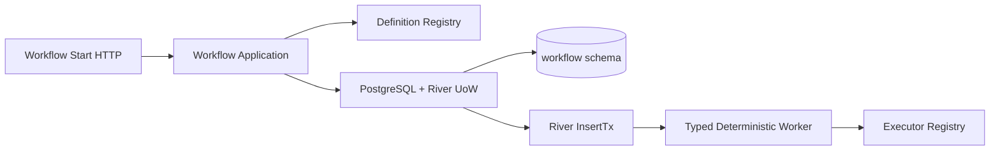
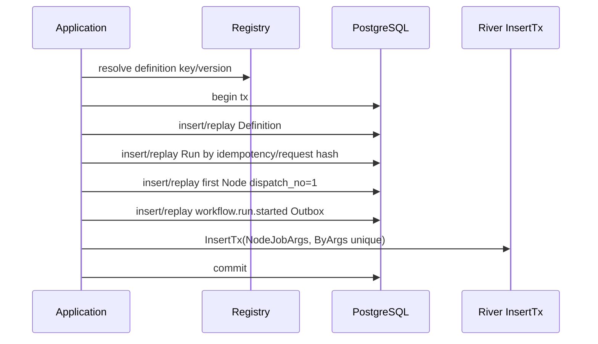

# M4-A River Runtime Foundation 技术设计

## 1. Boundaries



- Domain：Definition/Node/Job identity、Schema/Registry 不变量。
- Application：Registered Start、request hash、Executor 调用端口。
- PostgreSQL Adapter：tx-scoped Definition/Run/Node/Outbox SQL。
- River Adapter：Args、Workers、Client、InsertTx；不包含业务状态机。
- `cmd/migrate`：Goose + rivermigrate。

## 2. Version And Migration

- River/riverpgxv5 v0.40.0，Schema=`workflow`，当前 7 migrations；Goose 精确锁 v3.27.0（v3.27.2 的 Go 1.25.7 门禁与项目 1.25.4 不兼容）。
- `migrations/embed.go` 用 `//go:embed *.sql` 暴露唯一项目 SQL；`internal/platform/migration` 从 pool 配置建立池外专用 pgx session 持有 advisory lock，再通过 pgx pool 和 `stdlib.OpenDBFromPool` 构造 Goose Provider，执行项目 Up，再用同一 pool 构造 `rivermigrate.New(...Config{Schema:"workflow"})` 执行 River Up 与 Validate，因此 `database_max_conns=1` 仍可迁移。关闭 `*sql.DB` 不关闭底层 pgx pool。
- 00001–00010 含 PL/pgSQL dollar-quoted body 但没有 Goose `StatementBegin/End`，原始文件直接解析已证实失败。Migration Runner 使用只读 `fs.FS` wrapper，仅在读取 legacy 文件时注入 direction 内的 `StatementBegin/StatementEnd`；SQL 原文、版本和仓库文件保持不变。00011 起的新增复杂迁移必须在源文件中原生写 annotation，不继续扩大 compatibility wrapper 范围。
- River 每版本独立事务；项目与 River history 独立。升级失败再次执行幂等续迁。
- Docker/Compose 最终接线由 M4-D，但本任务提供可运行 migration binary 和单元/集成测试。

## 3. Registry Contracts

```go
type RegisteredDefinition struct {
    Key string
    Version int64
    Graph CanonicalGraph
    InputSchemaVersion int
}

type Executor interface {
    Execute(context.Context, ExecutionContext) (ExecutionResult, error)
}
```

Definition Registry 构建时 canonicalize 并计算 graph hash，验证 DAG 与所有 Executor/permission。Executor Registry freeze 后只读，`AddWorkerSafely` 重复错误成为 readiness failure。

## 4. Stable Job

```go
type NodeJobArgs struct {
    SchemaVersion int           `json:"schema_version"`
    NodeRunID     foundation.ID `json:"node_run_id" river:"unique"`
    DispatchNo    int           `json:"dispatch_no" river:"unique"`
}
func (NodeJobArgs) Kind() string { return "workflow_node_run_v1" }
```

River Client 使用 `river.Config{Schema:"workflow", Workers:..., Queues:...}`。v0.40.0 `Start` 直接返回；M4-D 负责完整生命周期。M4-A 测试 Client 可消费 Deterministic Node。

## 5. Transactional Start



锁序：Definition → Run → Node（node_key 升序）→ Outbox → River Job。首次与 replay 都先解析并锁定相同 Registered Definition，再按 `(workspace_id,idempotency_key)` 锁 Run并比较 request hash；锁住 Run 后不得反向访问 Definition，所有 identity 不一致均冲突。

## 6. Schema Changes

- `00011_river_runtime_foundation.sql` 独占本节字段；后续任务只能前向扩展。
- `workflow.run.idempotency_key/request_hash` nullable pair；partial unique for non-null。
- `workflow.node_run.idempotency_key/input_schema_version/output_schema_version/dispatch_no` nullable legacy；新行必填。
- Outbox 扩展稳定 `event_key/schema_version/event_version` 的基础字段，Runnable Job 不通过 Outbox 发布。
- 历史 active 行不回填猜测 identity；Runtime 明确拒绝。

## 7. Deterministic Node

测试 Definition 使用单节点纯函数（例如 canonical JSON hash），无外部副作用。M4-A 的真实 River smoke 只通过 test-only transport harness 证明 Job 可见性、typed Worker、Registry 解析和 Executor 输出；它不在生产代码中标记 Node succeeded，也不形成第二套 Claim/Complete Runtime。正式 DB-time Claim、Attempt 和 Completion 全部由 M4-B 首次实现。

## 8. Rollback

- 依赖/迁移失败不启动 Worker。
- 应用回滚保留前向 Schema/River Jobs；旧版本不得消费未知 Kind/Schema。
- River Down 不是发布回滚；仅 disposable DB 验证。

## 9. License And Upgrade

- River v0.40.0 使用 MPL-2.0，保持 vendor 中上游文件与 License，不修改 River 源码时项目领域代码不转为 MPL；分发镜像/源码包时保留声明。
- Goose v3.27.0 使用 MIT。升级到 v3.27.1+ 前必须先升级项目 Go/Docker 工具链并重跑 legacy FS、Provider、空库/旧库接管与 River migration 矩阵。
- 新增 ADR-0015 记录版本锁、Job Kind/Args 持久兼容、官方 River migrator、Goose legacy Adapter、升级/退出方案和项目 License 仍未冻结的发布风险。
