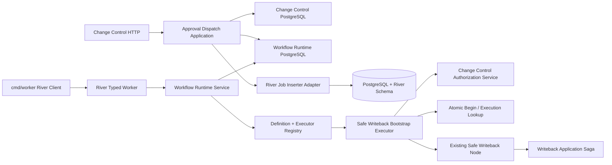
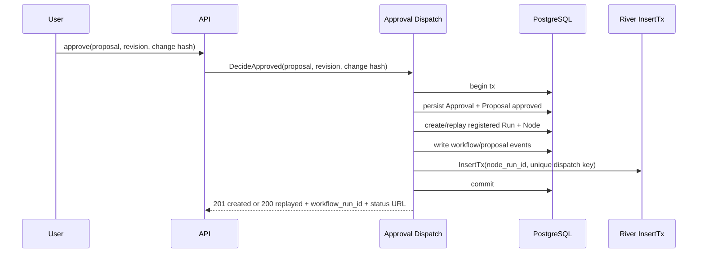
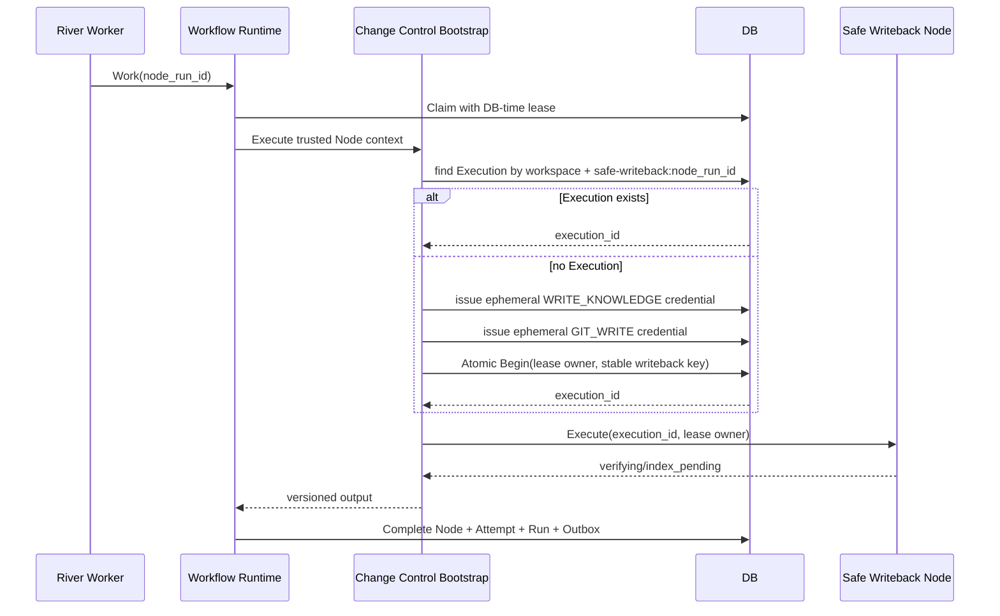

# River Workflow Runtime 技术设计

## 1. Architecture Decisions

| 决策 | 采用方案 | 原因 |
|---|---|---|
| 业务事实源 | PostgreSQL Workflow/Node/Attempt 与各领域 Saga | River 只负责投递，不能覆盖业务状态或恢复证据 |
| 产品触发 | Approved 决策后自动 Durable Dispatch | 与产品 PRD 演示闭环一致，避免审批后再出现第二套 Apply 命令 |
| Runnable 投递 | 领域事务内调用 River 官方 `InsertTx` | Node 与 Job 全有或全无，不需要扫描 pending Node |
| 执行边界 | 服务端 Definition Registry + Executor Registry | 客户端 Graph、模型和 Job payload 不能决定代码或权限 |
| Safe Writeback 启动 | River Worker Claim 后执行 pre-Begin bootstrap | Atomic Begin 需要 running lease，Credential 又不能持久化或进入 Job |
| Begin 响应丢失 | 用稳定 `safe-writeback:<node_run_id>` 查询既有 Execution | 恢复不依赖不可恢复 Credential，防止第二个 Execution |
| Attempt 模型 | 稳定 NodeRun + append-only NodeAttempt | 保持现有外键稳定，同时记录每次 delivery/owner/error 历史 |
| 时间 | Claim/Heartbeat/Complete/Retry/Fail 使用 DB time | 避免多 Worker 时钟漂移，与 Safe Writeback lease guard 一致 |
| 重试 | Workflow 先持久化计划，River 按计划延迟投递 | River Job 状态不成为 retry 事实源 |
| River 版本/迁移 | 精确锁 River/riverpgxv5 `v0.40.0`；只用官方 migrator | PoC 已证明与 Go 1.25.4、pgx 5.10.0、PostgreSQL 18 兼容 |

## 2. Module Boundaries



- `internal/workflow/domain`：Run/Node/Attempt 状态、Definition、Retry/Failure 分类和 Repository 端口；不依赖 River/pgx。
- `internal/workflow/application`：Registry、Runtime orchestration、状态归约、退避、Pause/Resume/Cancel。
- `internal/workflow/adapter/postgres`：DB-time lease、Attempt、Complete/Retry/Fail/后继和 Outbox 事务。
- `internal/workflow/adapter/river`：Job Args、typed Worker、`InsertTx`、River error 映射和 Client 生命周期。
- `internal/changecontrol/application`：Approval Dispatch 和 Safe Writeback Bootstrap；复用现有 Authorization/Begin/Saga。
- `internal/changecontrol/workflow`：继续只做已存在 Execution 的 Node Resume，不承担 Credential 或 River 生命周期。
- `cmd/api`：注入 Approval Dispatch；`cmd/worker`：构造 River Client、Registry、Runtime、Executor 和 readiness。

### 2.1 Cross-Schema Transaction Boundary

不暴露 `pgx.Tx` 或 River 类型到 Domain。新增项目自有原子 Repository 方法，由 PostgreSQL+River Adapter 实现：

```go
type DispatchJob struct {
    NodeRunID foundation.ID
    DispatchNo int
    ScheduledAt *time.Time
}

type ApprovalDispatchRepository interface {
    DecideApprovedAndDispatch(context.Context, ApprovalDispatchCommand, RegisteredDefinition, DispatchJob) (ApprovalDispatchResult, error)
}

type RuntimeRepository interface {
    StartAndDispatch(context.Context, StartRegisteredCommand, DispatchJob) (RunResult, error)
    CompleteAndDispatch(context.Context, CompleteCommand, []Successor, []DispatchJob) (CompleteResult, error)
    RetryAndDispatch(context.Context, RetryCommand, DispatchJob) (RetryResult, error)
}
```

Adapter 内部统一执行：`pool.Begin → 固定锁顺序 → Change Control/Workflow SQL helper → riverClient.InsertTx(ctx, tx, ...) → Commit`。SQL helper 接受 tx-scoped DB 接口但不开新事务。任何重复 Job、已存在绑定或 response-loss replay 都在该事务内返回明确 `Replayed`/Conflict；禁止 Application 顺序调用现有 `Approve` 和 `Start` 两个独立事务。

固定锁顺序按操作冻结：

1. Approval Dispatch：Proposal → requested Revision → existing Approval → Definition → Run → Nodes（按 node_key）→ Outbox → River Job。
2. Registered Workflow Start：Definition → Run → 本事务所需全部 Nodes（按 node_key 升序）→ Outbox → River Jobs（按 node_run_id/dispatch_no）。Start 不得先锁 Run 再反向访问 Definition。
3. 已存在 Run 的 Workflow 状态事务（Claim/Heartbeat/Complete/Retry/Fail/Human/Control）：Run → 本事务所需全部 Nodes（按 node_key 升序）→ current Attempt → Human Task 或 Control Command → Outbox → River Jobs（按 node_run_id/dispatch_no）。只有一个 Node 时也遵循同一顺序，必须重构现有 Node→Run Claim。
4. Authorization Issue：Proposal → Revision → Approval → Run → Node → Authorization insert。
5. Atomic Begin 保持现有安全顺序：两份 Authorization（按 ID 排序）→ Proposal → Revision → Approval → Run → Node → Execution；任何新增事务不得在持有 Proposal/Run/Node 后再反向锁 Authorization。

Approval Dispatch 与 Atomic Begin 不会在同一 Proposal 的首次路径并发：River Job 只有 Approval Dispatch 提交后才可见。仍必须用真实 PostgreSQL 覆盖 concurrent approve replay、claim、authorization issue、Begin 和 Complete，断言无 `40P01`、锁超时或偏态。

## 3. Registered Definition

首个产品 Definition：

```text
key: safe-writeback
version: 1
node: safe-writeback.apply@schema-v1
input: proposal_id + revision_id + approved_change_hash
output: existing Safe Writeback Node Output
terminal meaning: workflow succeeded, proposal verifying/index_pending
```

Registry 保存 canonical JSON 供 `workflow.definition.graph` 持久化和兼容检查。现有通用 Start HTTP 过渡为只接受 `definition_key/version/input`；旧 `graph/first_node_*` 字段若保留，必须完全匹配 Registry，随后在文档中标记废弃。

Schema binding：

- `change_control.proposal.workflow_run_id uuid NULL UNIQUE REFERENCES workflow.run(id)`，只允许 Approved Dispatch 从 NULL 设置一次。
- `workflow.run.idempotency_key/request_hash`，唯一 `(workspace_id,idempotency_key)`；相同 request hash 返回既有 Run，不同 hash 冲突。
- `workflow.node_run.idempotency_key/error_code/input_schema_version/output_schema_version`，Node key 与 idempotency key 均不可变。
- Safe Writeback Run key 由 Approval ID 派生；Node input 只保存 `proposal_id/revision_id/approved_change_hash/schema_version`，不保存正文或 Credential。

历史行迁移采用 expand-and-read-only：新增 Run/Node 幂等字段先允许 NULL，并使用 partial unique index；字段必须成对为空或成对有效。新 Runtime 写入全部非空。历史 terminal Run/Node 保持可查；历史 active 记录若缺少 Registry/幂等绑定则返回 `WORKFLOW_LEGACY_RUNTIME_UNSUPPORTED` 并禁止执行，不猜测回填。`proposal.workflow_run_id` 对旧 Proposal 保持 NULL；只有相同 Approved replay 且 Approval 有有效 `approved_git_head` 时才允许经过完整 UoW 创建绑定，历史 NULL Git baseline 仍拒绝写回。

## 4. Approval To Job Transaction



Rejected 只保存决策。Approved 的任一写入或 Job 插入失败均回滚；重复相同审批由不可变 Approval binding 派生并返回同一 Run/Node/Job，不新增审批幂等头。River Job unique key 绑定 `node_run_id + dispatch_no`；业务 Outbox 保留用户可观察事件，不承担 runnable Node 投递。

HTTP 响应契约：Approved 新建为 201、完全相同重放为 200，返回 Approval 原字段加 `workflow_run_id`、`workflow_status_url`、`dispatch_status=queued|running|replayed`；Rejected 新建/重放同样使用 201/200，但不返回 Workflow 字段。不同 Revision/Change Hash/Decision 继续返回 409。

`ApprovalDispatchCommand` 包含 `proposal_id/revision_id/change_hash/decision/approval_id/decided_at/approved_git_head` 和服务端 Registered Definition。首次审批或已有 Approval 但缺少完整 Run/Node/Job binding 的历史补建，继续执行 Target Hash 与 strict-clean attached Git snapshot 前置安全门；外部 I/O 不占数据库事务，UoW 在锁内重验 Proposal/Revision/Base/Change Hash。已有完整 Approval→Run→Node→Job binding 的相同请求直接进入 UoW exact replay，只验证持久绑定，不重新读取已被写回改变的文件/HEAD，否则 response-loss replay 会被错误拒绝。snapshot 后到 Begin 的竞态仍由 Atomic Begin 的 Base/HEAD/lease/CAS 再验证；不同决定继续冲突。

## 5. Job And Executor Contracts

```go
type NodeJobArgs struct {
    SchemaVersion int
    NodeRunID     foundation.ID
    DispatchNo    int
}

type Executor interface {
    Execute(context.Context, ExecutionContext) (ExecutionResult, error)
}

type ExecutionContext struct {
    WorkspaceID, RunID, NodeRunID foundation.ID
    NodeKind                      string
    InputSchemaVersion            int
    AttemptNo                     int
    DispatchNo                    int
    RetryNo                       int
    LeaseOwner                    string
    Input                         json.RawMessage
}

type ExecutionResult struct {
    Output  json.RawMessage
    Failure *FailureEnvelope
}

type FailureEnvelope struct {
    Class      FailureClass
    Code       string
    RetryAfter time.Duration
}
```

`LeaseOwner` 由 Worker instance ID + River Job ID + River Attempt + delivery nonce 派生，仅作为瞬时执行上下文和 Workflow lease binding，不写入 Job Args。`RetryAfter` 只接受受信 Adapter/Executor 提供的结构化值，裁剪到 Definition Retry Policy 上限；不得从原始错误文本解析。Runtime 在调用 Executor 前重新读取 Run/Node/Definition/Input，并校验 Workspace、Node Kind、Schema 和权限。

River v0.40.0 的 `Client.Start(ctx)` 实测在后台循环启动后立即返回，不再额外包 goroutine；这与一条泛化文档的“阻塞”描述冲突，以锁定版本源码、go doc 和真实 PoC 为准。具体类型为 `*river.Client[pgx.Tx]`，`InsertTx` 返回 `*rivertype.JobInsertResult`。Worker 注册使用 `AddWorkerSafely`，重复注册返回错误并阻止 readiness。

结果不变量：Success 要求 `Failure=nil` 且 Output 是符合版本 Schema 的 JSON；Failure 要求 `Failure!=nil` 且 Output 为空，Code 非空且不超过 128 字符。FailureClass 仅为 `retryable/non_retryable/manual_recovery/lease_lost/cancelled`。`retry_after < 0` 非法，`retry_after=0` 使用 Policy，只有 retryable 可携带提示，超过 Policy max 时裁剪。

`foundation.Error` 按以下优先级唯一映射：受信 Executor 已给出的 FailureClass → 特定稳定错误码 → 已证明的取消语义 → ErrorKind/Retryable 默认规则。特定 Code 可以覆盖较宽泛的 Kind，但每个输入只能命中一个最终分类分支：

- `dependency_unavailable`、`retryable_failure` 且 `Retryable=true` → retryable。
- `dependency_unavailable`、`retryable_failure` 且 `Retryable=false` → non_retryable。
- `consistency_violation`、`manual_recovery_required` → manual_recovery。
- `WORKFLOW_LEASE_LOST/WRITEBACK_LEASE_LOST` → lease_lost。
- Context cancel 且 Run 已请求取消 → cancelled。
- `invalid_input/not_found/version_conflict/permission_denied/non_retryable_failure` → non_retryable。
- 未分类 Executor error → `WORKFLOW_EXECUTOR_UNCLASSIFIED` non_retryable；数据库不可用导致状态事务无法提交时不生成 Failure，只交给 River 做 transport retry。

## 6. Safe Writeback Bootstrap



崩溃规则：

- Authorization 生成后、Begin 前：未消费记录短 TTL 后过期；下一 delivery 使用新的服务端签发 key，Credential 不恢复。
- Begin commit 前：事务回滚，无 Execution；重试重新 bootstrap。
- Begin commit 后响应丢失：下一 delivery 先按稳定写回 key查询 Execution，跳过 Credential 签发。
- Saga 副作用后、Workflow Complete 前：现有 Node/Saga checkpoint 幂等重放；只产生一个 Commit/Mapping/Reindex Outbox。

Repository 新增 `FindWritebackExecutionByKey(ctx, workspaceID, idempotencyKey)`，返回完整 Execution。Bootstrap 必须把查询结果与 Node input、Proposal 当前 Approval 和 Run/Node 绑定逐字段核对；存在 key 但绑定不同为 `WRITEBACK_EXECUTION_BINDING_CONFLICT`，进入 Manual，不得签发新 Credential。无需把 ExecutionID 回写 Node input；稳定 key 和不可变 Execution binding 是恢复事实源，现有 Safe Writeback Node Input 在内存中构造。

## 7. State And Attempt Model

Run 与 Node 使用独立 Go 类型和数据库 CHECK：

```text
Run:  pending → running → waiting_for_human | retry_wait | paused | succeeded | failed | cancelled
Node: pending → running → waiting_for_human | retry_wait | paused | succeeded | failed | cancelled
```

新增 append-only `workflow.node_attempt`：

- `id, node_run_id, attempt_no, dispatch_no, retry_no, river_job_id, river_job_attempt, delivery_id, lease_owner, lease_until`
- `status: running/succeeded/waiting_for_human/retry_scheduled/failed/cancelled/lease_lost/manual_recovery`
- `output_schema_version, output_hash, failure_class, error_kind, error_code, error_summary, next_attempt_at`
- `started_at, heartbeat_at, ended_at`
- 唯一 `(node_run_id, attempt_no)`；同一活动 `delivery_id` 只允许一条 Attempt

NodeRun 保存当前归约状态；现有 `node_run.attempt` 保留并定义为“最新成功取得 lease 的 attempt_no/lease generation”，每次 Claim 或过期恢复递增，不作为最大业务重试计数。Attempt 保存每次成功取得 Workflow lease 的历史。`dispatch_no` 是 Job generation：initial=1，每次 Runtime 创建新 River Job（business retry、Human resume、Pause resume、显式 recovery republish）递增；`retry_no` 只在 Executor 被分类为业务 Retryable 时递增。相同 River Job 重复 delivery 在活动 lease 下不创建 Attempt，lease 过期后由同一 Job 恢复时创建新 `attempt_no` 但沿用 dispatch/retry 编号；若旧 Job 已终止，需要显式 recovery republish，则只递增 dispatch_no。因此 infra crash、Pause/Resume 和 Human resume 都不消耗最大业务 retry。现有 `(run_id,node_key)` 继续保证每个 Definition 逻辑节点唯一，避免破坏 Change Control 对稳定 NodeRun ID 的外键。

## 8. Lease And Heartbeat

- Claim SQL 内部读取 `CURRENT_TIMESTAMP`，原子检查 pending/retry 到期/过期 running lease，并创建 Attempt。
- 默认 lease 和 heartbeat interval 由配置提供且满足 `heartbeat < lease/3`；测试使用短值，生产默认值在实施 PoC 后写入 `.env.example`。
- Heartbeat 失败或 DB 断连会取消 Executor Context。Safe Writeback 每个新副作用前已有 DB lease guard；通用 Runtime 返回后也必须再次验证 owner/attempt。
- Graceful Stop 停止获取新 Job，等待活动执行到 checkpoint；显式配置 `SoftStopTimeout`，超时由 River 取消 Worker Context。紧急路径使用 `StopAndCancel`；Worker 必须响应 Context，否则调用仍会等待 Work 返回。Node 最终由 lease expiry 和领域 checkpoint 恢复。

Worker 启动独立 health server：`/livez` 只证明进程事件循环存活；`/readyz` 同时验证 DB Ping、River schema version、River Client started、Definition/Executor Registry frozen 和所有启用 Definition 依赖可用。Compose worker healthcheck 访问容器内 `http://127.0.0.1:8081/readyz`。

## 9. Retry And Error Mapping

| 分类 | Workflow 动作 | River 动作 |
|---|---|---|
| Success | Complete 事务 | 返回 nil |
| Retryable | 结束当前 Attempt，Persist retry_wait/next_attempt，并 InsertTx 下一 Attempt 定时 Job | 当前 Job 成功结束；下一 Job 按持久计划执行 |
| NonRetryable | Fail Node/Run | no retry/cancel |
| Manual | Persist failed/manual recovery | no retry，保留证据 |
| LeaseLost | 不覆盖新 owner，Attempt lease_lost | 允许新 delivery |
| Cancelled | Persist cancelled | 停止执行 |

退避由项目 Runtime 计算并持久化：先令 `next_retry_no=current_retry_no+1`，再计算 `min(max, base * 2^(next_retry_no-1)) + deterministic_jitter(run,node,next_retry_no)`；外部 `Retry-After` 大于计算值时优先。达到最大次数后使用稳定 `RETRY_EXHAUSTED` 失败。River `InsertOpts.ScheduledAt` 只保证不提前，PoC 观察到约 0.1–3.9 秒正常调度延迟，因此不能用于精确定时，数据库 `next_attempt_at` 仍是事实源。River 自身重试只处理数据库不可用、进程崩溃等“尚未成功持久化 Workflow 分类”的传输故障；一旦 Retry/Fail/Complete 事务提交，当前 River Job 必须返回成功，避免形成第二套业务重试计数。

## 10. Completion And Successors

Complete/Fail/Retry 都在 Repository 事务内完成：

1. 锁定 Run、Node、Attempt，校验 owner/attempt/lease。
2. 保存 Output 或稳定错误。
3. 更新 Attempt 与 Node。
4. 根据 Registry Definition 和已完成依赖计算后继。
5. 创建唯一后继 Node 和 dispatch 计划，并通过 `InsertTx` 入队；Attempt 只在后继真正 Claim lease 时创建。
6. 写业务 Outbox。
7. 归约 Run 状态并提交。

多前驱通过唯一 `(run_id,node_key)` 与行锁保证只激活一次。相同完成重放返回既有结果；不同 Output/错误绑定返回冲突。

Pause/Resume/Cancel 使用 `Idempotency-Key + expected_version`：Pause 设置 `pause_requested_at` 并阻止新 Claim/后继入队；活动 Node 到 checkpoint 后转 paused，旧 River delivery 通过持久控制状态 benign no-op，不物理删除 Job也不改变计数。Resume 清除请求并仅为满足依赖的 Node 创建 Job：不存在或从未投递的 Node 首个 Job 使用 `dispatch_no=1`，已有 generation 的 Node 才使用 `dispatch_no+1`，`retry_no` 均不变。Cancel 设置 `cancel_requested_at`、逻辑取消 pending/retry work，并通过 Context 通知 running Node；不可中断副作用返回后不得继续下一步。控制面 HTTP 路由为 `/api/v1/workflows/{run_id}/pause|resume|cancel`，返回更新后的 Run 与版本。

控制面 request 为 `{ "expected_version": <positive integer> }` 且要求 `Idempotency-Key` 1..128 字符；response 为 `{workflow_run_id,status,version,status_url}`。稳定错误包括 `IDEMPOTENCY_KEY_REQUIRED` 400、`WORKFLOW_CONTROL_INVALID` 400、`WORKFLOW_RUN_NOT_FOUND` 404、`WORKFLOW_VERSION_CONFLICT` 409、`WORKFLOW_CONTROL_CONFLICT` 409。请求不接受 workspace_id，Repository 从 Run 解析 Workspace 并校验所有 Node/Definition 绑定，避免调用方伪造跨 Workspace 身份。当前部署仍是本地单用户安全边界，不声称已完成多用户认证；M5-05 接入 Session/API Token 后复用同一 Workspace capability seam。

## 11. Security And Observability

- Job Args 只含 `schema_version/node_run_id/dispatch_no`；所有业务输入从数据库加载。
- Attempt 的 error summary 由稳定 Error Code 和脱敏模板生成，不保存原始 Git stderr/路径/正文。
- 日志与 Trace 统一关联 Run/Node/Attempt/River Job/Workspace/Proposal；重复 delivery 不重复记录领域副作用成功审计。
- Readiness 分别报告 DB、River migration、Definition Registry、Executor Registry 和依赖状态；API readiness 不等于 Worker readiness。

业务 Outbox 本任务冻结最小事件：`change_control.proposal.approved`、`workflow.run.started`、`workflow.node.succeeded`、`workflow.node.retry_scheduled`、`workflow.node.failed`、`workflow.run.paused|resumed|cancelled`。`event_key=<event_type>:<aggregate_id>:<aggregate_version>`，payload 只含 `schema_version/workspace_id/workflow_run_id/node_run_id/proposal_id/status/version` 中适用字段，不含正文、Credential、路径或错误 cause。Runnable Node 绝不通过 Outbox 投递；M6 Reindex 事件保持 unpublished，Generic publisher 不在本任务实现。

## 12. Migration And Compatibility

- 新项目前向迁移扩展 Proposal→Run binding、Workflow idempotency、状态、NodeAttempt、错误/调度/控制字段和必要约束；不修改 `00003/00004`。
- M4-A 新增唯一 `cmd/migrate` 并构建 `zhixu-migrate`：精确锁 Goose v3.27.0，嵌入项目 SQL；由于 00001–00010 的 PL/pgSQL 缺少 Goose statement annotation且历史文件不可修改，使用只读 legacy FS wrapper 在内存中注入解析边界。真实 PostgreSQL 已验证原始直接运行失败、wrapper 空库/重复 Up和旧 shell-runner history接管成功。随后调用 `rivermigrate.New(riverpgxv5.New(pool), &rivermigrate.Config{Schema:"workflow"})` 执行 DirectionUp 和 Validate。M4-D 负责把该既有二进制接入 Dockerfile/Compose migrate service，不重建入口。顺序固定为项目 Goose Up（先创建 workflow schema）→ River Up → River Validate；项目 Goose history 与 `workflow.river_migration` 各自管理版本，不能伪装成一个整批原子事务。
- v0.40.0 当前有 7 个 River migration；Migrator 与 `river.Config.Schema` 必须同时显式为 `workflow`，不依赖 search_path。每次版本一个事务，失败后幂等续迁；生产默认不执行 Down。
- 旧 Run/Node 可读；只有已经具备新幂等/Schema binding 且 Registry 能解析的 pending/running 记录可恢复执行。缺少新字段的 legacy active 记录进入 `WORKFLOW_LEGACY_RUNTIME_UNSUPPORTED` 并停止副作用。
- 回滚应用版本前先停止 Worker；已创建 River Job 可保留，旧版本不得消费未知 schema。已提交 Safe Writeback Git 不做文件回滚。

## 13. Alternatives Rejected

- 自制 ticker 扫描 pending Node：制造第二队列且无法与 Node 原子提交。
- 在 River Args 保存 Credential：Secret 泄漏且响应丢失后无法安全恢复。
- Approval 后同步完成整个写回：阻塞 HTTP，无法获得 River delivery/heartbeat/retry 语义。
- Begin 前先创建带 ExecutionID 的 Job：Execution 尚不存在，形成 claim/Begin 循环。
- 让 River Job 状态直接驱动 Run/Node：丢失领域幂等、Human、补偿和长期兼容语义。
- 同时使用 Outbox publisher 和 InsertTx 投递 runnable Node：形成两个投递事实源。

## 14. Milestones And Stop Gates

- M4-A Runtime Foundation：River PoC/依赖/官方迁移、Registry、Cross-Schema UoW、Workflow identity/idempotency/dispatch。Attempt 独占归 M4-B。Stop gate：事务入队与 deterministic node 真实 River smoke 通过。
- M4-B Runtime State Machine：DB-time lease、heartbeat、Complete/Retry/Fail/后继、Human/Pause/Resume/Cancel。Stop gate：两 Worker、duplicate、retry/manual、控制面集成测试通过。
- M4-C Safe Writeback Dispatch：Approval 自动 dispatch、Execution exact lookup、pre-Begin bootstrap、真实 FS/Git smoke。Stop gate：全部崩溃窗口只产生一个 Execution/Commit/Mapping/Outbox。
- M4-D Operability：Worker readiness、graceful shutdown、metrics/trace、Compose/Docker、文档与全量门禁。前一 gate 未通过不得进入下一里程碑，也不得开放自动写回 HTTP。
