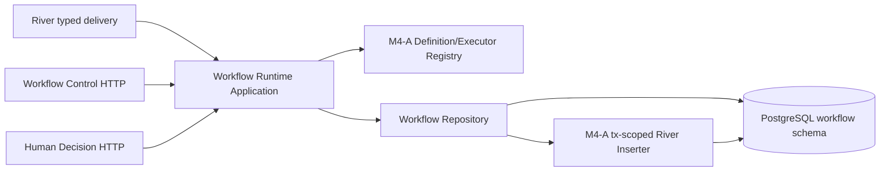
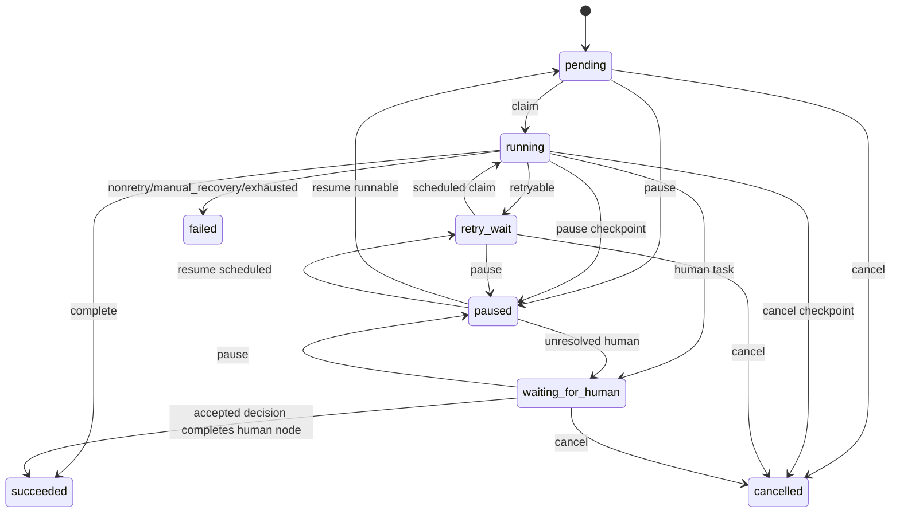

# M4-B Workflow Runtime State Machine 技术设计

## 1. Architecture Boundary



- Domain：状态、Failure 分类、Retry Policy、Attempt/Control 不变量；不依赖 pgx、River 或 HTTP。
- Application：Claim→Execute→归约编排、Heartbeat Context、Human/control command；只依赖端口。
- PostgreSQL Adapter：DB-time lease、冻结锁序、Attempt、Complete/Retry/Fail/后继与事务型 Job/Outbox。
- HTTP Adapter：Pause/Resume/Cancel 和既有 Human Submit 的输入校验、Problem Details/OpenAPI。
- M4-A Inserter 是唯一 runnable Node 投递口。本任务不得新增 scanner、ticker 或 Outbox-to-Node publisher。

## 2. State Model



Run 与 Node 使用不同 transition table。Run 是全部 Node 的归约：终态优先保持；cancel requested 阻断新工作；pause requested 在无活动 Node 后为 paused；存在 waiting human 为 waiting_for_human；存在 retry_wait 且无 running 为 retry_wait；存在 running/pending 为 running；全部 succeeded 才 succeeded；不可恢复失败为 failed。

Attempt 生命周期只前进一次：`running → succeeded|waiting_for_human|retry_scheduled|failed|manual_recovery|lease_lost|cancelled`。Attempt 终态行禁止业务字段更新，必要的审计修正以新事件表达。

## 3. Stable Identities And Counters

| Field | Owner | Increment point | Never increments on |
|---|---|---|---|
| `attempt_no` | NodeRun | successful lease acquisition | duplicate call under active lease |
| `dispatch_no` | NodeRun | transaction creates new River Job generation | same Job redelivery/lease reclaim |
| `retry_no` | NodeRun | committed business Retryable transition | crash, DB outage, reclaim, human/pause resume |
| `delivery_id` | River Adapter | derived from stable River Job identity/attempt metadata | application retries inside one delivery |

Recommended uniqueness:

- `UNIQUE(node_run_id, attempt_no)`.
- Partial unique active Attempt per Node.
- `UNIQUE(node_run_id, dispatch_no, delivery_id)` where delivery identity is available.
- M4-A River unique args bind `node_run_id + dispatch_no`.

## 4. Database-time Lease Contract

Application APIs pass `lease_duration`, never `now` or `lease_until`. SQL computes a single database timestamp in a CTE and uses it for eligibility, Attempt timestamps, Node timestamps and `lease_until = db_now + lease_duration`.

Claim transaction:

1. Lock Run `FOR UPDATE`.
2. Reject terminal, pause/cancel requested or incompatible status.
3. Lock Node `FOR UPDATE`.
4. Validate dispatch identity and runnable time; if running lease expired, terminate prior Attempt as lease_lost.
5. Allocate `attempt_no = latest + 1`, insert running Attempt, set Node running/owner/lease/version and reduce Run.
6. Commit and return DB-generated timestamps/version.

Heartbeat is a single fenced update or a short transaction and requires `node_id + owner + attempt_no + expected_node_version + lease_until > db_now`. It computes a new DB lease and returns `WORKFLOW_LEASE_LOST` for any miss. Application heartbeat cadence must be `< lease/3`; a miss cancels Executor Context.

All result transitions use the same fence. The owner string alone is never authority.

## 5. Global Lock Order

Every state-changing transaction follows:

1. `workflow.run` by ID.
2. `workflow.node_run` by deterministic `node_key ASC` (current node first only if it is also first by that order; otherwise lock full required set in order).
3. `workflow.node_attempt` by `(node_run_id, attempt_no)`.
4. `workflow.human_task` or `workflow.control_command` when applicable.
5. `workflow.outbox_event` inserts.
6. River `InsertTx` inserts.

No transaction may lock Attempt before Run, or perform River insertion before all Workflow rows are settled. For an operation whose Node set is derived from the Definition, resolve keys before acquiring Node locks. PostgreSQL deadlock tests run Complete/Retry/Human/Control concurrently and inspect retryable SQLSTATE separately from domain conflicts.

## 6. Error Classification And Retry

Domain owns one exhaustive mapping function:

```text
foundation.Error / ExecutionResult
  -> FailureEnvelope{class, error_kind, code, retry_after, redacted_summary}
  -> TransitionDecision{complete|retry|fail|manual_recovery|lease_lost|cancel}
```

No Adapter reclassifies an already classified domain failure. Unknown errors are NonRetryable with a stable code. Cancellation is Cancelled only when Context cancellation or persisted cancel request is proven; it cannot hide a dependency failure.

Retry calculation:

```text
next_retry_no = current_retry_no + 1
base_delay = min(max_delay, base * 2^(next_retry_no-1))
delay = min(max_delay, base_delay + deterministic_jitter(run,node,next_retry_no))
delay = max(delay, bounded_retry_after)
next_attempt_at = db_now + delay
```

Use saturating arithmetic. Jitter is deterministic for replay. RetryPolicy uses `max_retries`: initial execution has `current_retry_no=0`; a Retryable result may schedule the next generation only while `current_retry_no < max_retries`, computes `next_retry_no=current_retry_no+1`, then persists that value. attempt_no and River attempts never affect exhaustion. Retry transaction completes current Attempt, increments retry/dispatch, records next time, inserts unique scheduled Job, emits event and commits. A committed transaction causes the current River handler to return success even if its response to an internal caller was lost; replay queries the Attempt/dispatch binding.

## 7. Complete And DAG Activation

The canonical Definition supplies predecessor sets and node schemas. Complete locks the Run and all candidate successor Node keys in sorted order. It validates Output schema/hash, completes current Attempt/Node, then for each successor:

- create stable `(run_id,node_key)` NodeRun if absent; its first Job uses `dispatch_no=1`;
- activate only when every predecessor is succeeded;
- skip if already active/terminal or already has the same dispatch generation;
- for an existing NodeRun that needs a new generation, increment dispatch_no; then call the tx-scoped River Inserter;
- emit deterministic event key.

Run reduction occurs after successor activation inside the same transaction. Multi-predecessor races converge through unique constraints plus row locks. Replay of the same Attempt and Output hash returns the persisted result; a different hash is a conflict.

## 8. Human Flow

Creating a Human Task completes the Worker-held execution phase without completing the logical Human Node: Attempt ends with the dedicated `waiting_for_human` status, lease clears, Human Node becomes waiting_for_human, and Run reduces accordingly. Task ID, node, target version and schema binding are immutable.

Submit transaction locks Run→Human Node→Task, validates expiry/version/schema and decision hash, marks Task submitted, marks Human Node succeeded with versioned decision projection, activates canonical successors, inserts Jobs/Outbox and reduces Run. Same decision replay is idempotent. If paused, persist Task/Node completion but defer successor dispatch until Resume. Cancelled runs reject Submit.

This replaces the current behavior that moves the same Human Node back to pending.

## 9. Pause Resume Cancel

`workflow.control_command` stores run, command, idempotency key, request hash, expected version and serialized result. Handler validation happens before Application; Repository revalidates version and state under lock.

- Pause: persist request and set `pause_requested_at`. Pending/retry nodes become paused or remain scheduled-but-unclaimable. Running nodes observe cancellation signal at Runtime checkpoint and transition paused without claiming a new Attempt.
- Resume: require paused/nonterminal Run; clear pause request; evaluate waiting Human and runnable dependencies. A Node that has never been dispatched uses its initial `dispatch_no=1`; only a Node with an existing generation increments dispatch_no. Preserve retry_no and transactionally enqueue.
- Cancel: set `cancel_requested_at`; mark non-running nonterminal Nodes cancelled; running Node is fenced from new side effects through Context plus pre-result CAS. Once safe checkpoint returns, mark Attempt/Node cancelled and reduce Run cancelled.

旧 scheduled/available Job 不需要在 Control 事务内物理删除，Pause/Cancel 也不为失效单独递增 generation。Claim 先检查持久 pause/cancel 请求和 Node 状态；不再允许执行的旧 delivery 返回 `WORKFLOW_DELIVERY_STALE`。River Worker 将该结果视为 benign no-op并返回 nil，使旧 Job completed；不得 snooze、返回普通 error、创建 Attempt或改变 attempt/dispatch/retry 计数。Resume 真正插入新 Job 时，未投递 Node 使用初始 `dispatch_no=1`，已有 generation 的 Node 才 `dispatch_no+1`；只依据 Workflow 持久事实判断是否需要新 Job，不读取 River Job 状态作为业务事实源。

If Complete wins the Run lock before Pause/Cancel, its completion is honest and the subsequent command applies to remaining work. If control wins first, Complete observes the request and may only record a safe terminal/checkpoint result allowed by the state table. No path pretends an external side effect was reversed.

## 10. API Contract

```http
POST /api/v1/workflows/{run_id}/pause
POST /api/v1/workflows/{run_id}/resume
POST /api/v1/workflows/{run_id}/cancel
Idempotency-Key: 1..128 characters
Content-Type: application/json

{"expected_version": 3}
```

```json
{
  "workflow_run_id": "uuid",
  "status": "paused",
  "version": 4,
  "status_url": "/api/v1/workflows/uuid"
}
```

The path Run resolves Workspace from PostgreSQL. API never accepts a Workspace override. Stored command replay returns the original semantic result. Problem Details use existing foundation mapping and stable codes frozen in the PRD.

## 11. Migration Design

`00012_workflow_runtime_state_machine.sql` should:

- add independent Run/Node status constraints with `retry_wait/paused`;
- reuse M4-A 的 Node schema/version/dispatch 字段，只新增 retry、next attempt、failure 和 control projection columns；沿用现有 `node_run.attempt` 作为 latest-attempt 投影，不新增第二列，不重复定义前置迁移列；
- create append-only `node_attempt` and `control_command` tables;
- add successor/idempotency/event uniqueness and runnable/lease indexes;
- preserve existing `node_run.attempt` values without fabricating Attempt history; Go 层可映射为 `LatestAttemptNo`；
- preserve terminal rows; mark legacy active rows unsupported when required M4-A bindings are absent.

Compatibility tests build a database at the historical migration boundary, insert representative pending/running/waiting/terminal rows, then apply the new migration. Down is permitted only when no new-state rows/history exist; otherwise raise SQLSTATE `55000`. Application rollback stops Workers first and leaves forward schema in place.

## 12. Test Architecture

- Pure domain: transition tables, Run reduction, error mapping, retry arithmetic and secret redaction.
- PostgreSQL integration: DB clock skew, Claim/Heartbeat fencing, append-only Attempt, response-loss replay, Complete/Retry/Fail atomicity, multi-predecessor and control races.
- Real River integration: duplicate delivery, scheduled retry, lease reclaim, Human/Pause resume dispatch generations.
- HTTP/OpenAPI: header/body/UUID/status/error/idempotency/version contracts.
- Stress: two Workers plus concurrent control/result operations under `-race -count=20`, with invariant queries proving one active Attempt and one successor dispatch.
- Migration: empty/repeat/legacy upgrade/terminal read/active unsupported/guarded Down.

## 13. Risks And Rollback

| Risk | Mitigation | Rollback |
|---|---|---|
| Shared Status split breaks old readers | additive columns/types plus compatibility projection and contract tests | stop Worker; retain forward schema; restore prior binary for read-only terminal data |
| Control and result deadlock | one global lock order and sorted Node locks | disable control endpoints until race suite passes |
| River transport retry double-counts business retry | counters owned by Workflow transaction; committed result returns River success | query persisted dispatch/Attempt before republish |
| Legacy active rows are ambiguous | explicit unsupported failure, never infer Registry/Job identity | manual migration after evidence review |
| Pause/Cancel lies about external effects | checkpoint contract and honest completed result | stop further dispatch; retain recovery facts |
