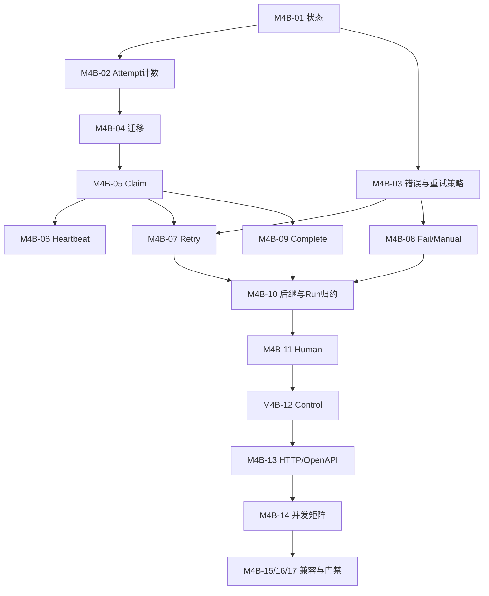

# M4-B Workflow Runtime State Machine 实施清单

> 本清单只覆盖状态机。M4-A Registry/River Inserter 是前置依赖；Approval/Safe Writeback 属于 M4-C，Worker 运维/部署属于 M4-D。

## Phase 1: Domain Contracts

1. [ ] **M4B-01 拆分状态与迁移表**
   - 影响：`internal/workflow/domain`。
   - 前置：M4-A Domain 基础。
   - 实现：RunStatus、NodeStatus、AttemptStatus 独立类型；加入 retry_wait/paused；冻结终态和合法迁移。
   - 验收：表驱动测试覆盖每个合法/非法边，Run/Node 不可误用同一 transition function。

2. [ ] **M4B-02 冻结 Attempt/Dispatch/Retry 模型**
   - 影响：Workflow Domain model/repository ports。
   - 前置：M4B-01。
   - 实现：NodeAttempt、计数不变量、delivery identity、lease fence、append-only contract。
   - 验收：duplicate delivery、reclaim、business retry、Human/Pause resume 的纯模型测试逐项证明计数语义。

3. [ ] **M4B-03 实现 Failure 分类与 Retry 计算**
   - 影响：Workflow Domain/Application policy。
   - 前置：M4B-01。
   - 实现：按“受信显式分类→特定 Code→取消语义→ErrorKind/Retryable”顺序的 exhaustive FailureClass mapping、FailureEnvelope、Retry-After 边界、指数退避和确定性 jitter。
   - 验收：所有 ErrorKind、未知 error、负/零/上限 Retry-After、溢出和 retry exhaustion 单测通过；摘要脱敏且有上限。

### Checkpoint A

- [ ] Domain tests 使用 `-race` 通过。
- [ ] Success/Failure 互斥和所有计数不变量有直接测试，不依赖 Repository 偶然行为。

## Phase 2: Schema And DB-time Lease

4. [ ] **M4B-04 新增前向 Workflow 状态机迁移**
   - 影响：新 migration、Workflow PostgreSQL migration tests。
   - 前置：M4B-01/02，M4-A migration 基础。
   - 实现：新增 `00012_workflow_runtime_state_machine.sql`，独立状态约束、Node retry/latest attempt/调度/控制投影、`node_attempt`、`control_command`、唯一约束和索引；复用 00011，不修改历史 migration。
   - 验收：空库 Up、重复 Up、历史 `00003` pending/running/waiting/terminal 数据升级、terminal 查询、legacy active unsupported、含新历史时 Down 返回 SQLSTATE `55000`。

5. [ ] **M4B-05 实现 DB-time Claim 与 lease reclaim**
   - 影响：PostgreSQL Repository、Application claim API。
   - 前置：M4B-02/04，M4-A stable dispatch args。
   - 实现：API 只传 duration；SQL 用单一 DB timestamp；Run→Node→Attempt 锁序；活动 lease fencing；过期 Attempt 归约 lease_lost 后 append 新 Attempt。
   - 验收：应用时间 ±24h 不改变资格；两连接并发只有一个 owner；reclaim 只新增一个 Attempt；pause/cancel Run 不可 Claim。

6. [ ] **M4B-06 实现 Heartbeat 与 Context 取消**
   - 影响：Repository/Application runtime heartbeat。
   - 前置：M4B-05。
   - 实现：owner+attempt+version+unexpired lease CAS；DB-time 延长；失败取消 Executor Context。
   - 验收：正常续租不增加任何计数；旧 owner、过期 lease、版本错和 DB 断连均不能续租，Executor 收到取消。

### Checkpoint B

- [ ] PostgreSQL integration 证明一个 Node 至多一个活动 Attempt。
- [ ] 锁序说明与 SQL 实现一致；Claim/Heartbeat 并发 `-count=20` 无死锁。

## Phase 3: Result Transitions And DAG

7. [ ] **M4B-07 实现 Retry 事务**
   - 影响：Domain ports、PostgreSQL Repository、M4-A tx River Inserter 接线。
   - 前置：M4B-03/05，M4-A Inserter。
   - 实现：fenced Attempt 结束、retry_wait、retry/dispatch 递增、next_attempt_at、Scheduled Job、Outbox 单事务。
   - 验收：commit/rollback/response loss、duplicate delivery 仅一套计数/Job/Event；transport crash 不增加 retry_no；到上限稳定失败。

8. [ ] **M4B-08 实现 Fail 与 Manual 事务**
   - 影响：Repository/Application result reducer。
   - 前置：M4B-03/05。
   - 实现：NonRetryable/Manual/Cancelled/LeaseLost 的唯一归约，保存稳定错误并清除 lease；无新 Job。
   - 验收：每类错误、晚到 owner、事务失败、响应丢失测试通过；Manual 摘要保留且 Secret 扫描通过。

9. [ ] **M4B-09 实现 Complete 与输出幂等**
   - 影响：Repository/Application complete contract。
   - 前置：M4B-05，M4-A Definition Registry。
   - 实现：fenced Complete、Output schema/hash/version、Attempt/Node/Outbox、重放与冲突。
   - 验收：相同 Output replay 成功；不同 Output 冲突；旧 owner失败；任一点故障全回滚。

10. [ ] **M4B-10 实现唯一后继激活与 Run 归约**
    - 影响：Repository DAG transition、M4-A Registry/Inserter。
    - 前置：M4B-07/08/09。
    - 实现：按 node_key 排序锁定、依赖满足判断、唯一 NodeRun/dispatch、InsertTx、Outbox、Run terminal/retry/wait reduction。
    - 验收：线性、分支、汇合、多前驱并发、部分失败、重复 Complete 下每个后继只有一个 dispatch；Run 不提前 succeeded。

### Checkpoint C

- [ ] Complete/Retry/Fail 与 Job/Outbox 原子性由故障注入证明。
- [ ] 两 Worker + duplicate/response-loss/multi-predecessor `-race -count=20` 通过。

## Phase 4: Human And Control Plane

11. [ ] **M4B-11 修正 Human Task 等待与提交语义**
    - 影响：Domain/Application/PostgreSQL Human Task。
    - 前置：M4B-09/10。
    - 实现：等待时释放 lease；提交完成 Human Node并激活后继；schema/version/expiry/decision hash 幂等；paused defer、cancelled reject。
    - 验收：等待不占 lease；相同 decision replay；不同 decision/过期/版本错冲突；后继仅一个 Job；不再把 Human Node 重置 pending。

12. [ ] **M4B-12 实现控制命令 Repository/Application**
    - 影响：Domain ports、PostgreSQL Repository、Runtime Context registry。
    - 前置：M4B-04/10/11。
    - 实现：control command request/result hash、expected_version、pause_requested/cancel_requested；Pause checkpoint、Resume dispatch、Cancel fencing。
    - 验收：幂等重放、绑定冲突、终态/非法状态、running/pending/retry/human 各状态测试；Pause/Cancel 的旧 delivery 返回 benign nil，且不 snooze、不 transport retry、不新增 Attempt或计数；Resume 真正入队时未投递 Node 使用 dispatch_no=1，已有 generation 的 Node 才 dispatch_no+1，retry_no均不变。

13. [ ] **M4B-13 增加 Pause/Resume/Cancel HTTP 与 OpenAPI**
    - 影响：API Handler/Composition、OpenAPI、Contract tests。
    - 前置：M4B-12。
    - 实现：三个 versioned endpoint、Idempotency-Key、expected_version、统一 response 和稳定 400/404/409；Workspace 从 Run 解析。
    - 验收：OpenAPI check；UUID/Header/JSON/version/idempotency/status/error contract 全覆盖；请求不能传或伪造 Workspace。

14. [ ] **M4B-14 验证控制面与结果事务竞态**
    - 影响：PostgreSQL/River integration tests。
    - 前置：M4B-12/13。
    - 实现：Pause/Cancel 同 Complete/Retry/Heartbeat，Resume 同过期 Job/Human Submit 的并发矩阵。
    - 验收：全局锁序无死锁；每场竞态只有一种合法最终状态；Pause/Cancel 后无新副作用/后继，已完成结果不被伪造撤销。

### Checkpoint D — M4-B Stop Gate

- [ ] 两 Worker、duplicate、lease reclaim、retry/nonretry/manual、后继、Human、Pause/Resume/Cancel 真实 PostgreSQL/River 集成通过。
- [ ] 未引入 Approval/SafeWriteback、部署、readiness、指标或第二队列实现。

## Phase 5: Compatibility And Quality Gate

15. [ ] **M4B-15 完成兼容与安全扫描**
    - 影响：migration/integration/security tests。
    - 前置：M4B-04..14。
    - 实现：旧数据查询、legacy active 明确错误、Attempt append-only trigger/permission contract、敏感字段扫描。
    - 验收：旧 terminal 可读不可重开；legacy active 不执行；DB/日志/Job Args/Outbox 不含正文、Credential、路径、stderr 或 lock token。

16. [ ] **M4B-16 同步本任务相关契约文档**
    - 影响：Workflow/API/database/recovery 文档与 backend spec，仅同步真实已实现行为。
    - 前置：M4B-13/15。
    - 实现：状态图、计数、锁序、错误矩阵、API、迁移和恢复命令；不宣称 M4-C/M4-D 完成。
    - 验收：文档术语/状态/API 与代码/OpenAPI/迁移逐项一致，无 TBD 或假完成描述。

17. [ ] **M4B-17 执行全量门禁与 Review**
    - 影响：本任务全部 diff。
    - 前置：M4B-01..16。
    - 验收命令：
      - `go test -race ./internal/workflow/...`
      - `go test -race -count=20 ./internal/workflow/...`
      - `go vet ./...`
      - `node api/openapi/check.mjs`
      - 真实 PostgreSQL/River state-machine integration suite
      - migration empty/repeat/upgrade/guarded-down suite
      - `git diff --check`
      - `go-review`、`sql-code-review`、Trellis full-scope check
    - 通过标准：当前范围内发现的问题已修复；任何未通过项阻止进入 M4-C。

## Dependency Graph

## Rollback Boundary

- 任一 Schema/锁序/并发门禁失败：停止 Worker 和控制端点，不进入 M4-C；保留前向 Schema，不执行破坏性 Down。
- River Job 已存在但状态机版本回退：旧应用不得消费未知 schema；先停止 Worker，再按 Workflow/Attempt 事实恢复。
- 状态事务提交响应丢失：只查询已持久化 Attempt/dispatch/control command，不盲目重发或修改计数。
