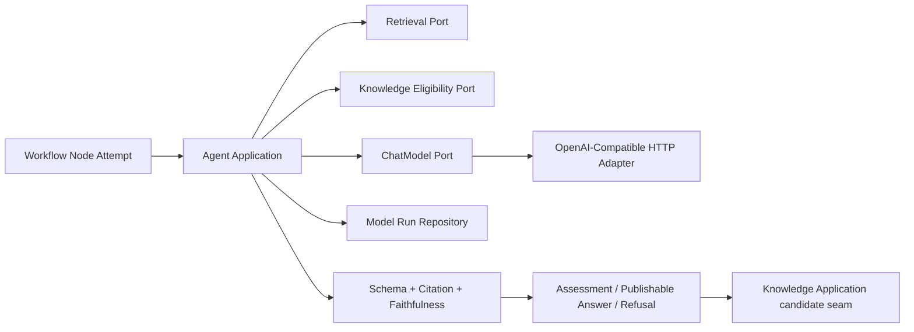
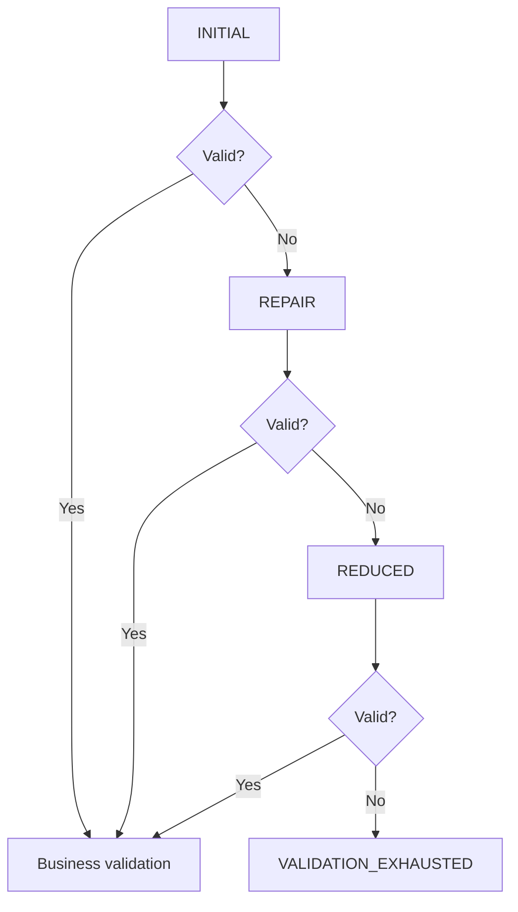

# M6-02 Agent Structured Output And Citation 技术设计

## 1. Architecture

依赖方向保持 `adapter/presentation -> application -> domain`。Agent Domain 不导入 Retrieval、Knowledge、
Workflow、pgx、HTTP 或 Provider 类型；Adapter 负责转换稳定 Port。

## 2. Module Responsibilities

- `internal/agent/domain`：任务 Schema、严格值对象、Model Run/Call 状态、Citation、Assertion、Answer、Refusal、错误码。
- `internal/agent/application`：Prompt/Schema/Profile Catalog、三阶段 Structured Runner、Relation Analyzer、RAG Answerer、Review 与调用预算。
- `internal/agent/adapter/postgres`：Model Run/Call UoW、CAS、replay、恢复查询。
- `internal/agent/adapter/retrieval`：Search/EvidenceReferenceService 转为 Agent Evidence。
- `internal/agent/adapter/knowledge`：批量 Eligibility、Confirmed/Disputed/Conflict 和候选命令适配。
- `internal/platform/models`：直接 OpenAI-Compatible Chat HTTP Adapter 与 Configured Factory。
- `eval/agent`：版本化 fixtures、offline metrics 和报告。

## 3. Structured Output

公共 Envelope 只保存 `result_type/schema_id/schema_version/model_run_ref`；Relation、Answer、Refusal、Review 使用
独立 payload。Decoder 逐 token 拒绝重复 key、尾随值、非法 UTF-8 和深度/大小越界，再执行任务 decoder 与领域校验。

每个 phase 是独立 Model Call；Application 是调用预算唯一 owner。Provider Adapter 不重试，Workflow 只在整个
Node Attempt 因明确 transient provider error 失败后决定重试。

## 4. Evidence And Eligibility

Agent Evidence Identity：`workspace_id/index_version_id/chunk_id/source_version_id/source_span_id`。Retrieval Port
返回有界 excerpt 与版本；Knowledge Eligibility Port 单批判断：

- Confirmed Claim/Relation：eligible formal evidence。
- Disputed Claim：eligible but conflict-marked，必须进入冲突解释。
- Suggested/Rejected/Deprecated/无绑定：ineligible。

Eligibility Repository 使用参数化数组和稳定排序，在一次查询中联合 Claim Source/Relation Evidence；最大 500。
Agent 不把 Active Index、rank 或模型判断当 Approved 资格。

## 5. Citation And Faithfulness

1. Identity：引用必须来自本次 Evidence set，且选择具体 Source Version + Span。
2. Openability：通过 Retrieval EvidenceReferenceService 复核 Artifact hash/range/excerpt。
3. Eligibility：通过 Knowledge Port；跨 Workspace 或无正式绑定 fail closed。
4. Semantic Support：Answer 拆为 Assertions，每项绑定 Citation；Review Model 输出逐 assertion verdict。

确定性前三层任何失败直接拒绝；Semantic Review 失败最多触发一次 Answer 重生成，Evidence 无效/不足则不重复生成，
直接 Refusal。Review Model 不可用时不发布高风险回答。

## 6. Relation Assessment

Relation Analyzer 接收新 Claim candidate、Applicability、双方 Evidence 和候选旧 Claims；模型输出五分类与解释，
Domain 调用 `knowledge/domain.MapAssessment` 冻结下一动作。Agent 只返回 candidate command input；Provenance、CAS、
幂等、Confirmation 和正式写入仍由 Knowledge Application 控制。

## 7. Model Run Persistence

Migration `00018_agent_runtime.sql` 新增：

| Table | Purpose | Key constraints |
|---|---|---|
| `agent.model_run` | 一次 Agent pipeline | Workspace/Workflow/Node/Attempt FK；一个 Node Attempt 一个 Run；版本快照；状态/CAS |
| `agent.model_call` | 每次 Provider call | `(model_run_id,call_no)` unique；phase；hash/usage/latency/error；状态机 |

Model Run 状态：`RUNNING -> SUCCEEDED | REFUSED | FAILED | UNKNOWN`。Model Call 状态：`STARTED -> SUCCEEDED |
FAILED | UNKNOWN`。调用前持久化 STARTED，完成后 CAS；进程中断保留 STARTED，由恢复扫描转 UNKNOWN，不重写成功。
Down 只允许空表，已有记录返回 `55000`。

不保存完整 Prompt/Evidence/raw response；保存 canonical request/response hash、字节数、token usage、耗时与 stable code。
`model_run_ref` 使用 Run UUID 字符串。

## 8. Chat Adapter And Configuration

Factory 配置：`provider=disabled|openai-compatible`、HTTPS/loopback endpoint、model、API key、adapter version、
timeout、max request/response bytes。禁 redirect；严格 Content-Type/JSON；校验 provider 返回 model 与 usage；错误体不外泄。
Ollama 使用 OpenAI-compatible endpoint；不维护 native payload。

错误矩阵：caller cancel non-retryable；deadline/429/502/503/504 retryable；401/403/4xx non-retryable；malformed/
oversized/wrong model response consistency violation；未知错误默认 non-retryable。

## 9. Evaluation

Offline dataset 固定输入、Evidence、模型结构化输出与期望结果，验证 Pipeline 与 metrics；不是生产 Fake fallback。
指标：五分类 confusion/precision/recall/F1、Conflict->Duplicate 高风险误判、Citation Precision/Coverage、Faithfulness、
Conflict Disclosure、Appropriate Refusal。M6-02 建立 baseline schema 和命令；真实模型 baseline/阈值最终由 M11-02 锁定。

## 10. Compatibility And Rollback

- 仅 Expand 新 Schema/包/配置；未配置 Chat 时旧 API/Worker 正常，Agent capability 明确 unavailable。
- Knowledge 增加批量 eligibility query，不改变现有命令和数据库事实。
- M6-04 通过 Agent Application 接入，不直接依赖 Provider/PostgreSQL。
- 应用回滚保留 Agent 数据；空数据可 Down，有数据 forward fix。

## 11. Key Trade-offs

- 专用 Model Run/Call 而非把多次调用塞入 Node output：增加两张表，但满足多 call、usage、crash 和可查询历史。
- Approved 暂以正式 Knowledge Evidence 为最小集：覆盖面保守，但不会把普通 Active Source 误当批准事实。
- 三阶段 repair 服从正式 PRD：成本高于一次 repair，因此调用预算固定且无额外 provider retry。
- Semantic Support 使用结构化 Review + Eval，不用脆弱 lexical heuristic 伪装事实蕴含判断。
