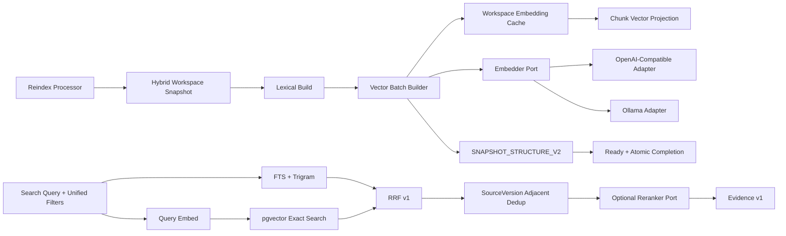

# M6-C Embedding And Hybrid Search 技术设计

## 1. Architecture Boundary



- `internal/retrieval/domain`：Embedding contract、Fusion v1、Search/Filter/Candidate/Evidence 不变量。
- `internal/retrieval/application`：Embedder/Reranker Port、Vector Batch Builder、Search 编排和降级规则。
- `internal/retrieval/adapter/postgres`：pending/cache 批量读写、Lexical/Vector 候选查询与 EXPLAIN。
- `internal/platform/models`：直接 HTTP OpenAI-Compatible/Ollama Embedder；不依赖领域数据库。
- `internal/platform/config` 与 Composition Root：读取 Endpoint/Key/Model/Dimensions/limits，构造 Adapter；
  领域与 Repository 不读取环境变量。

M6-C 同时升级 Worker Reindex Composition，使配置 Embedder 后的新 Snapshot 绑定 Embedding Version；
未配置时继续现有 V1 FTS-only。M6-C 不新增 HTTP Handler，M6-D 只适配 Application Search Contract，
不得复制查询/RRF/过滤规则。

## 2. Provider Contract

```go
type Embedder interface {
    Contract() EmbeddingContract
    Embed(context.Context, EmbedRequest) (EmbedResult, error)
}

type Reranker interface {
    Rerank(context.Context, RerankRequest) (RerankResult, error)
}
```

`EmbeddingContract` 与 `embedding_version` 字段精确对应，并额外拥有 `EndpointIdentity`、
`MaxBatchSize`、`MaxInputBytes`、`MaxBatchInputBytes`。Config Hash 对 Provider、Adapter/Version、Model、Dimensions、
Normalization、Distance、固定 Endpoint identity（不含 Credential）、limits 和影响结果的选项做
canonical SHA-256；运行时 Contract 必须重新计算并与持久版本绑定。项目安全上限为单批 1000 项、
单输入 10 MiB、单批正文 64 MiB，实际 Provider/部署配置只能更小。

OpenAI-Compatible 固定请求：`POST <base>/v1/embeddings`，`input=[]string`、`model`、
`encoding_format=float`，dimensions 非零时显式发送。按 `data.index` 排序并拒绝缺失、重复、越界。

Ollama 固定请求：`POST <base>/api/embed`，`input=[]string`、`model`、`truncate=false`；按
`embeddings` 数组顺序校验。Native Adapter 不退化为 OpenAI compatibility 路径，避免两套协议混读。

Base URL 禁止 userinfo/query/fragment；远程地址必须 HTTPS，HTTP 仅允许 loopback Ollama。该校验
复用现有模型 PoC 已验证规则并收敛到 `internal/platform/models` 唯一事实源。

新 Hybrid ingress 必须接受且只接受 canonical RRF v1 JSON；`fusion_config` 持久列是 `jsonb`，读取时
不能依赖原始空白或字段顺序，Repository 必须 strict decode 后重新编码为 canonical JSON。历史 V1
`fts_only`/两字段 RRF 配置继续按原语义 replay，不被七字段 RRF v1 追溯拒绝。

## 3. Migration 00016 And Cache

```text
retrieval.embedding_cache
  workspace_id
  embedding_version_id
  content_hash
  embedding vector
  created_at
  PK(workspace_id, embedding_version_id, content_hash)
```

- Embedding Version 是全局不可变配置身份；Cache 主键显式包含 Workspace + Embedding Version +
  Content Hash 形成租户隔离，并以 FK 证明 Embedding Version 存在。缓存不保存正文、Source 或路径。
- INSERT trigger 校验 `vector_dims`、有限非零范数；同 key exact vector 为 replay，不同 vector 为冲突。
- UPDATE/DELETE 禁止；Down 在任意 cache row 存在时返回 `55000`。
- Builder 先用 metadata/cache 查询选择受条数和累计正文上限约束的 page，再用一条
  `chunk_id=ANY($n)` 查询读取选中 miss 正文；保存缓存与 `chunk_projection` terminal update
  在同一事务中完成。
- cache 使用单条 `INSERT ... SELECT FROM unnest(...)`，Projection 使用单条
  `UPDATE ... FROM unnest(...)`；`pgx.Batch.Queue` 循环逐行 statement 不计作集合批量。

00016 同时把 Snapshot/Regression/Completion 兼容扩展到版本化 `SNAPSHOT_STRUCTURE_V2`：

- Workspace Snapshot 可选择 nil Embedding（V1 FTS-only）或已注册 Embedding Version（V2 Hybrid）。
- V2 Hash 输入包含 Embedding Version、vector ready/skipped/failed count、Manifest 闭包和 degraded。
- Delivery 仍只保存一个版本化 Regression tuple；不新增可漂移的“vector done”布尔值。Processor 恢复
  直接扫描 pending Projection，V2 Regression checkpoint 即完整向量阶段的持久证明。
- 00016 Down 恢复 V1 constraint/function 前先拒绝任何 cache 或 V2 Delivery/Hybrid Index 数据。

## 4. Vector Batch Flow

Application 只依赖两个深 Store 方法：`LoadVectorBuildPage` 与 `CommitVectorBuildBatch`。前者在短事务中
一次返回 pending Projection、缓存命中和必要的有界正文；cache hit 与 oversized 行不把正文带出
PostgreSQL。后者在一个事务中完成 cache exact insert/readback 与 Projection terminal update。历史
`SaveVectorBatch` 也已收敛到同一 cache-aware 内核，不保留绕过缓存写 ready vector 的第二路径。

1. 锁定/读取 Building Index、Embedding Version 与当前版本。
2. 按 Manifest sequence/chunk ID 领取最多 N 条且累计正文不超过 `MaxBatchInputBytes` 的
   lexical-ready + vector-pending 输入。
3. 按 Workspace/Embedding/Content Hash 批量命中 cache。
4. 对超出 Adapter `MaxInputBytes` 的输入生成 skipped/failed；其余 cache miss 组成一次 Embed batch。
5. 校验 Provider model、数量/顺序、维度、有限值、非零范数；按 Contract 执行 L2 normalization。
6. 单事务 exact insert cache + Save Projection terminal result；返回 processed/provider/cache counts。
7. 无 pending 行时 `Done=true`，Processor 执行 V2 Regression、Delivery checkpoint、Ready/Complete。

Builder 不在事务中持有远程 HTTP 调用。Provider 调用成功、数据库失败时允许再次调用；Embedding
是纯函数式可重建投影，提交后的响应丢失则由 cache/Projection 精确 replay，不产生业务偏态。
Cache 使用 `ON CONFLICT DO NOTHING` 后必须在下一条 SQL 中批量 readback，并逐 float32 精确比较；
并发写入不同向量时 fail closed，不能覆盖既有缓存。Processor 对已有 checkpoint 始终按持久
Index 的 Embedding binding 选择 V1/V2，而不是按 Worker 重启后的新默认配置改写历史。历史 Hybrid
page 已空时先返回 Done，不要求当前 Embedder Contract；仍有 pending 时当前配置必须精确匹配持久
Embedding Version，否则返回明确依赖不可用。

## 5. Search Model And SQL

统一 `SearchFilter` 仅包含当前可证明字段：Source/SourceVersion IDs、canonical path prefixes、
captured time range `[from,before)`。
路径前缀使用 `/` 分隔的 Workspace 相对路径，不接受绝对路径、反斜杠、`.`/`..` segment。
SQL 匹配固定为 `path = prefix OR path LIKE prefix || '/%'`，禁止使用会误匹配相邻名字的 `prefix%`。

Lexical 查询：

```sql
websearch_to_tsquery('simple', $query)
ts_rank_cd(search_vector, query)
similarity(canonical_chunk.content, $query)
```

pg_trgm `%` 在每次 Lexical Search 的短事务内固定 `similarity_threshold=0.3`，禁止继承连接级 GUC；
这样保持候选确定性并继续使用现有 trigram GIN。

以 FTS match 或 trigram match 入选，使用固定权重生成 lexical score，并保留两个原始分数。

Vector 查询根据持久 `distance_metric` 在 Adapter switch 中选择 `<=>`、`<#>` 或 `<->` 三个固定
SQL 模板。用户输入只作为 vector 参数，不进入 SQL 字符串。两路都 join Active Index、included
Source Manifest、SourceVersionProjection、active Chunk 与 Source Span，并共享同一 filter builder。

相同 Chunk 可由多个 included Source Manifest 引用。Candidate Query 先按 Chunk 排名，再用稳定
`source_id,source_version_id` 顺序聚合过滤后的 bounded provenance；Application 只给该 Chunk 一个
RRF rank，Evidence 返回多 provenance 和 `provenance_truncated`，防止 fan-out 改变 Top-K。

## 6. Fusion, Dedup And Degradation

RRF v1：`score = Σ 1/(k+rank)`；同分依次使用 best rank、Chunk ID。Provenance 或路径变化不得改变
Chunk 的排名身份。
Keyword 只使用 lexical rank；Semantic 只使用 vector rank；Hybrid 合并两路。

Dedup 按融合顺序遍历；只有两个候选的 canonical SourceVersion 集合完全相同且 sequence 相邻时，
才只保留更高排名项。来源集合不同或仅部分重叠时保留两项，避免删除低排名 Chunk 时丢失其独有
provenance。Evidence snippet 固定 4 KiB，Rerank text 固定 16 KiB，查询文本固定 8 KiB，最终结果
固定最多 100 项；候选配置上限为每路 500。

| 场景 | 结果 |
|---|---|
| FTS-only + keyword | 正常 Keyword |
| FTS-only + hybrid | Keyword + `vector`,`rerank` degraded |
| FTS-only + semantic | `RETRIEVAL_SEMANTIC_UNAVAILABLE` |
| Query Embed retryable 失败 + hybrid | Keyword + vector degraded |
| Query Embed contract/维度损坏 | fail closed |
| Rerank nil/retryable 失败 | RRF + rerank degraded |
| Rerank output 缺失/重复/额外 | fail closed |
| 两路真实零命中 | 空 items，非错误 |

## 7. Compatibility, Performance And Rollback

- 00014/00015 不修改；00016 只新增可重建 cache。旧 FTS-only Index、Delivery 和 Completion 行为不变。
- 00016 通过替换版本化 constraint/function 扩展 V2，不修改历史迁移文件；历史 V1 replay 仍按 V1 验证。
- exact vector scan 必须先过滤 Active Workspace/Index；候选上限默认小于 500，Rerank 上限更小。
- FTS GIN、trigram GIN 和 Workspace/Index B-tree 使用真实 PostgreSQL `EXPLAIN` 验证；exact scan
  只证明正确过滤与有界候选，不声称满足 50 万容量 P95。
- 回滚应用时可停用 Embedding/Search composition；保留缓存和 Projection。只有 cache 为空才 Down。
- Adapter Endpoint/Key 更新创建新 Config Hash/Embedding Version；不修改旧向量。
- 生产配置默认 `embedding_provider=disabled`；启用 `openai-compatible` 或 `ollama` 时，Composition Root
  构造 Adapter、注册/精确重放 Embedding Version、注入 VectorBuilder，并为新 Snapshot 生成 strict
  RRF v1。API Key、完整 Endpoint、正文和响应不进入 Config String、日志或错误。

## 8. Key Risks

- Provider batch 顺序漂移：OpenAI 按 index 重排，Ollama 数量/顺序严格验证。
- Cache 跨租户泄漏：key 含 Workspace，不做全局 Content Hash cache。
- Filter 两路漂移：PostgreSQL Adapter 共享 filter SQL/参数 builder 并做等集测试。
- 原始分数不可比：仅使用 rank-based RRF。
- Rerank 协议无标准：只冻结 Port，不伪造生产 Adapter。
- Token 语义混淆：现有 `token_count` 保持 lexical lexeme 定义；Provider usage 只用于 bounded metrics。
- V1/V2 语义漂移：新回归使用新 code/hash input，Completion 同时验证版本，绝不复用 V1 code 表示 Hybrid。
