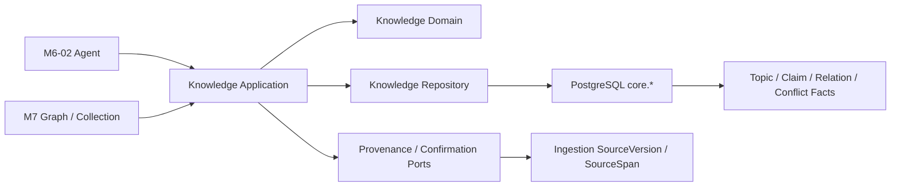
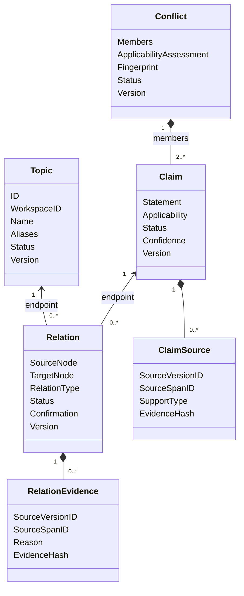
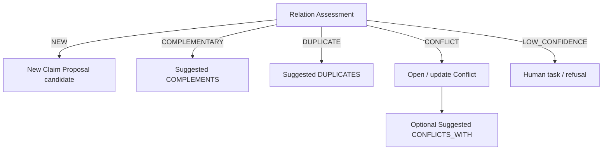

# M5-05 Knowledge Domain 技术设计

## 1. Boundary And Dependency



- `internal/knowledge/domain`：值对象、状态机、分类映射、兼容矩阵、规范化、fingerprint 和稳定错误。
- `internal/knowledge/application`：ID/Clock、Provenance/Confirmation Port、幂等命令、事务结果校验和批量查询上限。
- `internal/knowledge/adapter/postgres`：显式参数 SQL、高层 UoW、Workspace 绑定、CAS、数据库错误分类和批量读取。
- `migrations/00017_knowledge_domain.sql`：数据库最小防线、索引、不可变记录和 guarded Down。
- 本任务没有 Handler/Composition 接线；后续模块通过 Application 小接口接入，不允许直接访问 Adapter 表。

## 2. Domain Model



`ClaimSource` 与 `RelationEvidence` 共用 Provenance identity 结构和验证函数，但保持不同实体与表，避免把来源立场、关系理由、检索分数和 Proposal 摘要压成一个含糊 Evidence 聚合。

## 3. Canonical Values

### 3.1 Topic And Statement Text

- 输入必须为有效 UTF-8，去首尾空白，内部 Unicode 空白折叠为单个 ASCII space。
- Topic normalized name 使用 NFC + Unicode case-fold；展示 name 保留规范化后的原始大小写。
- Claim normalized statement 使用 NFC + 空白折叠，不 case-fold 正文语义；fingerprint 单独使用 case-fold 结果。
- Name/alias 最大 256 bytes，statement 最大 16 KiB，reason/summary 最大 4 KiB，idempotency key 最大 128 bytes。

### 3.2 Applicability V1

`Applicability` wire-independent value object：

```text
schema_version = "knowledge-applicability/v1"
value          = canonical JSON object, max 16 KiB, max depth 16
hash           = sha256(schema_version + "\n" + canonical_json)
```

Decoder 逐 token 检查重复 key、尾随值、非法 UTF-8、非有限数字和深度。Canonical encoder 递归排序 object key，数组保持顺序。M5-05 只可靠比较 hash 相等；“相近/重叠”必须由带理由的 `REVIEWED_OVERLAP` 显式输入，不在 Domain 猜测。

### 3.3 Evidence Hash

Claim Source 与 Relation Evidence 分别使用带类型前缀的 canonical payload 计算 SHA-256；Hash 覆盖 Workspace、owner、SourceVersion、SourceSpan、stance/reason、Applicability、model run ref 和 confirmation。两类 Hash 不互换。

## 4. Relation Assessment And Persisted Relation



`MapAssessment` 只返回下一领域动作描述，不执行数据库写入。M6-02 提供 Evidence 和模型版本后，Application 才能调用 SuggestRelation/OpenConflict。

## 5. Relation Endpoint Registry

| RelationType | Source | Target | Symmetric |
|---|---|---|---:|
| CITES | Claim | Claim | 否 |
| DERIVED_FROM | Claim | Claim | 否 |
| BELONGS_TO | Claim | Topic | 否 |
| SUPPORTS | Claim | Claim | 否 |
| COMPLEMENTS | Claim/Topic | 同类型 | 否 |
| DUPLICATES | Claim/Topic | 同类型 | 是 |
| CONFLICTS_WITH | Claim | Claim | 是 |
| PREREQUISITE_OF | Claim/Topic | 同类型 | 否 |
| VERSION_OF | Claim/Topic | 同类型 | 否 |
| IMPACTS | Claim/Topic | Claim/Topic | 否 |

Registry 是代码中的唯一兼容矩阵；数据库函数镜像同一表的最小防线。对称 canonical pair 按 `node_type` 再按 UUID byte/text 稳定排序。

## 6. State Machines

### Claim

```text
SUGGESTED -> CONFIRMED | INVALID
CONFIRMED -> DISPUTED | SUPERSEDED | DEPRECATED | INVALID
DISPUTED  -> CONFIRMED | SUPERSEDED | DEPRECATED | INVALID
```

### Relation

```text
SUGGESTED -> CONFIRMED | REJECTED
CONFIRMED -> STALE | DEPRECATED
STALE     -> CONFIRMED | REJECTED | DEPRECATED
REJECTED  -> SUGGESTED  (仅新 Evidence fingerprint)
```

### Conflict

```text
OPEN -> INVESTIGATING | DEFERRED
INVESTIGATING -> RESOLUTION_PROPOSED | DEFERRED
DEFERRED -> INVESTIGATING
RESOLUTION_PROPOSED -> RESOLVED | ACCEPTED_DIVERGENCE | INVESTIGATING
```

终结状态保留历史。数据库 trigger 拒绝非法状态和 version 非 `old+1`；Application 仍先执行 Domain 状态机，数据库只作最后防线。

## 7. Application Commands And Ports

### Commands

- `CreateTopic`
- `SuggestClaim`
- `ConfirmClaim`
- `TransitionClaim`
- `SuggestRelation`
- `ConfirmRelation`
- `TransitionRelation`
- `OpenConflict`
- `TransitionConflict`
- `GetClaims/GetRelations/GetConflicts`（批量、稳定排序、limit ≤ 500）

所有写命令包含 WorkspaceID、IdempotencyKey、RequestHash；修改命令增加 ExpectedVersion。Application 生成 ID/时间，Domain 规范化后调用 Repository UoW，并验证返回对象未越过 Workspace、版本或状态边界。

### Ports

```go
type ProvenanceVerifier interface {
    Verify(ctx context.Context, ref domain.ProvenanceRef) error
}

type ConfirmationVerifier interface {
    Verify(ctx context.Context, confirmation domain.Confirmation) error
}
```

PostgreSQL Repository 在写事务内再次验证 Provenance，避免 TOCTOU。`ConfirmationVerifier` 允许 M7-02 后续接入 typed Knowledge Proposal；本任务测试 source-derived 和 fake approved reference，但不把文件 Proposal 当通用审批。

## 8. Persistence Design

### Tables

| Table | Purpose | Key constraints |
|---|---|---|
| `core.topic` | Topic aggregate | Workspace normalized name unique; status/version; merged target same Workspace |
| `core.topic_alias` | immutable alias identity | Workspace normalized alias unique; cannot collide with topic name |
| `core.claim` | Claim aggregate | fingerprint/idempotency; applicability object/hash; status/version |
| `core.claim_source` | Claim provenance | immutable; owner/source/span Workspace binding; support type |
| `core.relation` | only formal edge fact | typed endpoints; canonical symmetric pair; status/version; unique edge |
| `core.relation_evidence` | relation provenance | immutable; owner/source/span binding; evidence hash |
| `core.conflict` | persistent conflict aggregate | fingerprint; applicability assessment; status/version |
| `core.conflict_member` | 2..N claim snapshots | same Workspace composite FK; immutable membership |
| `core.knowledge_command_receipt` | idempotent command result | `(workspace_id,idempotency_key)` unique; request hash + aggregate binding |

不建 `core.evidence` 和独立 `core.topic_claim`。若 M7 图查询需要 Topic–Claim 加速，只能由 `BELONGS_TO` Relation 生成不可写投影。

### Database Functions And Triggers

- `core.knowledge_validate_provenance_binding`：固定 JOIN 验证 Workspace/SourceVersion/Artifact/Projection/Span。
- `core.knowledge_validate_relation_endpoint`：固定 `topic|claim` 分支验证存在、Workspace 与允许生命周期。
- `core.knowledge_validate_claim_write`、`...relation_write`、`...conflict_write`：镜像初始状态、合法迁移与 version。
- deferred constraint trigger：Confirmed Claim 至少一个 SUPPORTS source；Confirmed Relation 至少一条 evidence；Conflict 提交时至少两个成员。
- immutable trigger：aliases、claim sources、relation evidence、conflict members、command receipts 禁止 UPDATE/DELETE。
- Down guard：任何业务表有记录时抛 `55000`。

### Indexes

- Topic/alias normalized value；Claim Workspace/status/fingerprint；Claim Source owner/source/span。
- Relation Workspace/status/source/target/type 与 canonical unique edge。
- Relation Evidence owner/source/span；Conflict Workspace/status/fingerprint；Conflict Member claim/conflict。
- 批量查询按 `(workspace_id,status,updated_at,id)` 或 owner ID 稳定排序，不为 JSONB 建无差别 GIN。

## 9. Transaction And Lock Order

固定锁序：Workspace scope → sorted Claim/Topic endpoints → owner aggregate → Evidence/Member rows → command receipt。

- ConfirmClaim：锁 Claim，验证 Provenance，追加 Claim Source，CAS 状态/version，写 receipt。
- ConfirmRelation：按 canonical endpoints 锁节点，再锁 Relation，验证 Evidence/Confirmation，追加 Evidence，CAS，写 receipt。
- OpenConflict：按 Claim ID 排序锁全部成员，创建 Conflict/Members，批量 CAS `CONFIRMED -> DISPUTED`，写 receipt。
- 相同幂等请求先读取 receipt 并返回持久结果；同键不同 request hash 返回 Version Conflict。

## 10. Error Matrix

| Condition | Foundation kind | Stable code |
|---|---|---|
| invalid text/JSON/enum/limit | InvalidInput | `KNOWLEDGE_*_INVALID` |
| stale expected version / idempotency misuse | VersionConflict | `KNOWLEDGE_VERSION_CONFLICT` / `KNOWLEDGE_IDEMPOTENCY_CONFLICT` |
| missing aggregate | NotFound | `KNOWLEDGE_*_NOT_FOUND` |
| cross Workspace / damaged Provenance / impossible state | ConsistencyViolation | `KNOWLEDGE_*_CONSISTENCY` |
| DB serialization/deadlock/lock timeout | RetryableFailure | `KNOWLEDGE_STORAGE_RETRYABLE` |
| missing port/database | DependencyUnavailable | `KNOWLEDGE_SERVICE_UNAVAILABLE` |

`23505` 需区分可重放与冲突；`23503/23514/55000` 映射 consistency；`40001/40P01/55P03` 保留 retryable。

## 11. Compatibility, Security And Performance

- 仅新增 Schema/Go 包，不修改现有 HTTP/OpenAPI、配置、端口或进程。
- 不修改 `00001`–`00016`；迁移以 Expand 方式前向部署。
- 所有 SQL 参数化，多态端点只进入固定分支；不接收表名/排序标识符。
- Provenance 不保存绝对路径、正文 snippet、Credential、DSN 或模型 Prompt；Evidence 打开继续走不可变 Artifact 服务。
- 列表和批量 Evidence 最大 500，避免 N+1；Graph cursor/path 和 500k P95 留 M7/M10。
- 旧应用可在 00017 存在时继续运行；若需要应用回滚，保留表和数据。已有业务数据时禁止 Down。

## 12. Key Trade-offs

- 选择 Claim Source/Relation Evidence 两个语义表，而非通用 Evidence：字段略有重复，但领域语义、权限和演进不会互相污染；Provenance 绑定函数仍只有一个事实源。
- 选择 `BELONGS_TO` Relation 作为 Topic–Claim 唯一事实，而非双写 topic_claim：避免 Graph/Collection 读取漂移，代价是后续热点查询可能需要只读投影。
- 选择 canonical JSON + 显式 reviewed overlap，而非在 M5-05 实现条件语义推理：保证确定性，M6-02 可在版本化模型输出中扩展。
- 选择 Confirmation Port，而非泛化现有文件 Proposal：保持 Safe Writeback 兼容，typed Knowledge Proposal 在 M7-02 以 Expand 迁移实现。

## 13. Rollback

- 代码回滚：停止调用 Knowledge Application，旧 API/Worker 不受影响。
- 数据库回滚：无业务数据时允许 00017 Down；已有任一 Topic/Claim/Relation/Conflict/Receipt 时拒绝 Down，保留数据并使用 forward fix。
- 若迁移或 Adapter 失败，禁止删除确认历史或回退为模型重建；通过新迁移修复。
