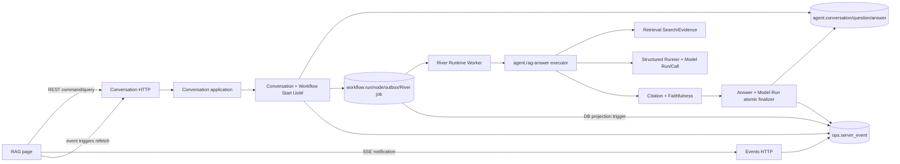

# M6-04 RAG Conversation API And SSE Design

## 1. Architecture Decision Summary

M6-04 在现有模块化单体中增加 `conversation` 产品模块，并扩展既有 Workflow/Agent 适配器。它不新建模型、检索或工具事实源。

| Concern | Single owner |
|---|---|
| Conversation、Question、已发布 Answer、Answer Feedback | `internal/conversation` + `agent.*` 表 |
| Workflow/Node/Attempt、retry/cancel/failure | `internal/workflow` + `workflow.*` 表 |
| Provider 调用、版本、Token、UNKNOWN | `internal/agent` + `agent.model_run/model_call` |
| Retrieval/Index/Evidence openability | `internal/retrieval` |
| Knowledge eligibility/conflict | `internal/knowledge` |
| Browser event replay cursor | `internal/events` + `ops.server_event` |
| Server state and final Answer in browser | TanStack Query typed clients |



## 2. Domain Model

### 2.1 Conversation

`Conversation` owns identity, Workspace, title, lifecycle, optimistic version and last activity. It does not own Workflow status and does not automatically persist Memory.

States are `open|archived`. M6-04 exposes create/list/read; archive mutation is reserved for later lifecycle UI. A Conversation permits one active Answer Workflow at a time.

### 2.2 Question

`Question` is append-only and owns:

- immutable user text;
- ordinal within Conversation;
- canonical retrieval scope and answer options;
- context upper bound and context hash;
- request hash and idempotency binding;
- created time.

It is not a generic Message and is not the same as the Search query produced during execution.

### 2.3 Answer

An Answer slot is preallocated when a Question is accepted. Stored publication states are:

```text
pending -> completed
pending -> refused
pending -> clarification_required
```

Workflow failure/retry/cancel/unknown remains a Workflow fact and is projected in Answer API responses while no publication exists. This prevents a duplicated state machine.

`completed` stores the new `agent.RAGAnswerResultV2`; `refused` stores `agent.RefusalResult`; `clarification_required` stores `conversation.ClarificationResult`. The result and retrieval summary are immutable after publication. `model_run_id` is required at publication.

RAG v2 is additive: v1 types, decoder and catalog entries remain available. V2 embeds the same evidence-bound answer fields and adds:

- `related_topics`: server-validated Topic ID/name/Citation bindings selected only from Knowledge-derived candidates;
- `follow_up_questions`: 1..5 bounded, non-factual suggestions.

Citation and Faithfulness gates operate on the v2 base answer projection; v2 metadata is preserved only after those gates pass.

### 2.4 Clarification

`Clarification` is a distinct structured conversational outcome containing `reason`, one bounded `question`, and optional bounded `suggested_scopes`. It is published only when Query Plan proves the meaning or scope cannot be inferred. The next user Question continues the same Conversation; Clarification is not Feedback-eligible.

### 2.5 Answer Feedback

Feedback is append-only and idempotent. Citation-specific types require an existing Citation in the immutable Answer result. It never updates Knowledge, Proposal or Answer content.

### 2.6 Conversation Turn

`Turn` is an API/UI read projection of one Question and its preallocated or published Answer. It is not persisted as another aggregate.

## 3. Database Design

Migration `00020_rag_conversation_sse.sql` adds:

### 3.1 `agent.conversation`

- `id`, `workspace_id`, `status`, nullable `title`, `version`;
- `last_activity_at`, `created_at`, `updated_at`, nullable `archived_at`;
- create `idempotency_key` and `request_hash`;
- unique `(workspace_id,idempotency_key)` and composite identity for Workspace-safe FKs;
- list index `(workspace_id,last_activity_at DESC,id ASC)`, matching the stable list order.

### 3.2 `agent.question`

- `id`, `workspace_id`, `conversation_id`, positive `ordinal`;
- bounded `question_text`, canonical `scope` JSON, answer options;
- `context_through_ordinal`, `context_hash`;
- `idempotency_key`, `request_hash`, `created_at`;
- unique `(conversation_id,ordinal)` and `(conversation_id,idempotency_key)`;
- immutable trigger and composite Workspace/Conversation FK.

### 3.3 `agent.answer`

- `id`, `workspace_id`, `conversation_id`, `question_id`, `workflow_run_id`;
- nullable `model_run_id`, `publication_status`, `result_type`, `result`, `result_hash`, `retrieval_summary`;
- `version`, `created_at`, `updated_at`, nullable `published_at`;
- one Answer per Question and one Answer per Workflow;
- `pending` bundle must contain no result/model/summary; terminal bundle must be complete;
- mutation trigger permits only exact `pending -> completed|refused|clarification_required` with `version+1`.

`retrieval_summary` is the recoverable source for the user-facing explanation panel. It stores at most three bounded rewrites, requested/effective mode, scope summary, Index/Embedding version IDs, candidate/selected/conflict counts and explicit degradations. It stores no Evidence excerpt, prompt or Provider response.

### 3.4 `agent.answer_feedback`

- `id`, Workspace/Answer binding, feedback type, nullable Citation ID/comment;
- `idempotency_key`, `request_hash`, `created_at`;
- unique `(answer_id,idempotency_key)` and append-only trigger.

### 3.5 `ops.server_event`

- `seq bigserial` is the SSE ID;
- Workspace, optional Conversation/Workflow IDs, event type, resource ref/version;
- `source_event_ref` unique per Workspace for exact projection replay;
- bounded JSON `payload_summary`, `schema_version`, `occurred_at`, `expires_at`;
- indexes `(workspace_id,seq)`, `(conversation_id,seq)` and expiry cleanup index.

The table is a replay projection, not audit or domain truth. Logical retention is 24 hours. M9 may add producers and shared frontend invalidation but reuses this cursor/table/API.

### 3.6 Workflow event projection

An insert trigger projects future `workflow.outbox_event` rows to `ops.server_event` using only Workspace, Run ID, event type and source event ID. It never copies internal payload. Conversation UoWs write their own events in the same transaction.

### 3.7 Migration rollback

Down is allowed only when the four Agent tables and `ops.server_event` contain no rows. Existing data returns SQLSTATE `55000`; production rollback is application rollback plus forward migration, not destructive data loss.

## 4. Transaction Boundaries

### 4.1 Create Conversation

One transaction validates Workspace, resolves idempotency, inserts Conversation and `conversation.created` event. Exact replay does not bump version/time.

### 4.2 Submit Question And Start Workflow

The cross-schema UoW follows the existing Approval dispatch pattern and reuses `workflowapplication.BuildRuntimeStartRequest` plus `workflowpostgres.RuntimeRepository.StartTx`:

1. lock Conversation;
2. detect exact replay or idempotency conflict;
3. reject another active Workflow;
4. read the bounded published context and compute canonical context hash;
5. allocate Question/Answer IDs and insert immutable Question;
6. build Workflow Input containing only IDs, ordinal, context hash and schema version;
7. atomically insert/replay Workflow Definition/Run/Node/Outbox/River Job;
8. insert pending Answer bound to returned Run;
9. advance Conversation version/activity;
10. insert summary events and commit.

Commit response loss is handled by re-running the same command and proving the exact Question/Answer/Workflow/Job binding.

### 4.3 Publish Answer And Model Run

The finalizer begins one transaction, locks Answer and Model Run, verifies Workspace/Run/Node/Attempt and result hashes, calls a new transaction-aware Agent repository finalization seam, then updates Answer/Conversation and inserts the terminal event. Exact terminal replay returns the existing publication.

This UoW prevents the dangerous split state where a published Answer refers to a nonterminal Model Run.

## 5. Workflow Contract

Definition:

```text
key: agent-rag-answer
version: 1
root node key: rag-answer
node kind: agent.rag-answer
input schema: 1
output schema: 1
allowed tools: []
required permission: READ_LOCAL
```

Question options are canonical enums:

```text
answer_depth: concise | standard | detailed (default standard)
output_format: markdown | outline (default markdown)
```

They are stored on Question and included in its request hash. Workflow Input still carries only Question identity and context hash; the executor reloads the immutable options from the Conversation fact source.

Input contains only:

```json
{
  "schema_version": 1,
  "conversation_id": "uuid",
  "question_id": "uuid",
  "answer_id": "uuid",
  "question_ordinal": 1,
  "context_hash": "sha256"
}
```

Output is a stable receipt, not a second Answer:

```json
{
  "schema_version": 1,
  "answer_id": "uuid",
  "publication_status": "completed",
  "result_type": "rag_answer|refusal|clarification",
  "model_run_id": "uuid",
  "result_hash": "sha256"
}
```

## 6. RAG Executor

The executor validates all Workflow identities, loads the immutable execution context and performs:

1. create or exact-replay one Model Run for the Node Attempt;
2. run a strict `agent.rag-query-plan/v1` PLAN call over bounded Conversation context;
3. when the plan requires missing information, publish `ClarificationResult` and its non-sensitive summary;
4. otherwise emit `rag.retrieval.started` and execute 1..3 bounded rewrites through Search;
5. deduplicate candidates by Citation/Chunk identity, retain stable ranking, and build the persistent retrieval summary;
6. when no candidates exist, finalize a refused Model Run and publish deterministic `NO_RELEVANT_EVIDENCE`;
7. derive an allowlisted Related Topic catalog from eligible evidence bindings;
8. use `RecordingChatModel` + `StructuredRunner` to generate strict `RAGAnswerResultV2` using frozen depth/format;
9. validate Topic bindings, emit `rag.validation.started`, and call `AnswerPublisher` on the base answer;
10. publish Answer, Refusal or Clarification atomically with Model Run terminal state and retrieval summary;
11. return only the stable publication receipt.

Migration `00020` and Agent domain add `ModelCallPhase=PLAN`, `ResultTypeClarification`, Query Plan/Clarification schemas and the RAG v2 catalog entry. Existing phases/result types/schema v1 remain valid.

On executor replay, a terminal Answer is validated and returned without a Provider call. Unknown Provider outcomes remain Workflow/Model Run failures and are never auto-replayed as success.

Conversation history is bounded and marked as user/assistant content, never as system policy. Evidence and Tool results remain untrusted data.

## 7. REST Contract

| Method | Path | Result |
|---|---|---|
| POST | `/api/v1/conversations` | 201 first create, 200 exact replay |
| GET | `/api/v1/conversations?workspace_id=&cursor=&limit=` | stable cursor page |
| GET | `/api/v1/conversations/{conversation_id}` | resource + ETag |
| POST | `/api/v1/conversations/{conversation_id}/questions` | 202 first accept, 200 exact replay |
| GET | `/api/v1/conversations/{conversation_id}/turns?cursor=&limit=` | Question/Answer read projections |
| GET | `/api/v1/answers/{answer_id}` | publication/clarification + retrieval summary + Workflow projection + ETag |
| POST | `/api/v1/answers/{answer_id}/feedback` | 201 first record, 200 exact replay |
| GET | `/api/v1/events?workspace_id=` | `text/event-stream` |

Command inputs use strict JSON and `Idempotency-Key`. Conversation and Answer ETags are weak version tags for future mutations; current create/append commands do not require If-Match.

List cursors are versioned base64url payloads bound to resource/sort and validated as untrusted input. They are not Search cursors, authorization tokens or persisted sessions and remain valid across process restarts.

All cross-Workspace misses map to the same Not Found. Error codes are stable and grouped under `CONVERSATION_*`, `RAG_*`, `ANSWER_*`, `ANSWER_FEEDBACK_*`, and `SSE_*`.

## 8. SSE Contract

Wire format:

```text
id: 123
event: answer.completed
data: {"schema_version":1,"id":"123","type":"answer.completed",...}

```

- heartbeat every 15 seconds as comment lines;
- poll/read pages are bounded and ordered by `seq`;
- validate replay window before sending SSE headers;
- `Last-Event-ID` is a positive decimal sequence;
- no ID starts from the current scoped high watermark;
- expired cursor returns Problem 409 and `details.action="refetch"`;
- client receives notification, then refetches authoritative Conversation/Answer/Workflow state.

The frontend uses a mandatory thin `web/src/events/**` owner for strict Envelope decoding, fetch-stream parsing, `Last-Event-ID` and targeted invalidation. M9 extends the same owner into a shared singleton connection and broader invalidation matrix.

## 9. Frontend Design

Routes:

- `/chat`: Conversation selection/create entry;
- `/chat/:conversationId`: active RAG page.

Desktop uses three stable regions: compact Conversation rail, main Answer timeline/composer, Evidence side panel. Mobile uses one main column with Conversation and Evidence drawers/tabs. No nested cards or marketing layout.

State ownership:

- TanStack Query: Conversation pages, Turns, Answer/Clarification, retrieval summary, Workflow and Feedback results;
- Router: Conversation ID and optional selected Citation;
- local state: unsubmitted Question, scope editor and panel visibility;
- event client: connection/last ID only; events trigger targeted refetch.

The client has one strict decoder owner for Conversation/RAG JSON and `web/src/events/**` as the sole SSE owner. It shows loading, empty, pending stage, degraded, reconnecting, clarification, refusal, conflict and error states explicitly, plus server-validated Related Topics and follow-up questions.

## 10. Security And Privacy

- Workspace remains a partition key until M10; deployment remains loopback-only.
- Question/history/evidence are never logged or placed in SSE/Workflow summaries.
- All user-controlled text is length/UTF-8/NUL checked at HTTP and domain boundaries.
- Markdown is rendered as text or through the existing safe policy; no `dangerouslySetInnerHTML`.
- Citation hrefs are server-derived from stable IDs; no model URL/path is trusted.
- Feedback Citation ID is validated against the published immutable Answer.
- SQL is parameterized, dynamic order is fixed, and page limits are bounded.

## 11. Compatibility And Rollout

- All HTTP paths and tables are additive; existing clients and migrations remain valid.
- Existing RAG/Refusal v1 envelopes remain unchanged.
- Existing relation executor and Tool Registry remain unchanged; the new Workflow has no tools.
- API and Worker readiness must fail closed if RAG dependencies differ: API can create/read Conversation only when DB is ready, but Question submission requires registered RAG Definition/Runtime; Worker registers RAG executor only when Retrieval, Knowledge, Chat and review dependencies are all real.
- Rollback stops new Question submission, drains/cancels RAG Workflow jobs, switches back to the previous binary and retains migration data for forward repair.

## 12. Risks

| Risk | Control |
|---|---|
| Question persisted without Workflow | cross-schema StartTx UoW and response-loss tests |
| Provider called twice after result commit loss | terminal Answer replay before model call; Model Run/Call receipts |
| Answer and Model Run disagree | single finalization transaction |
| SSE becomes truth | envelope contains summaries only; every consumer refetches |
| event retention creates unbounded scans | `(workspace_id,seq)` and expiry indexes, bounded pages; physical cleanup promoted in M9/M10 |
| unapproved/web evidence presented as fact | approved-only publication gate; unsupported modes fail explicitly |
| Conversation context races | one active Answer per Conversation and frozen ordinal/hash |
| M6 scope expands into full UI/auth/tool loop | explicit M9/M10/M11 and Tool Loop exclusions |
