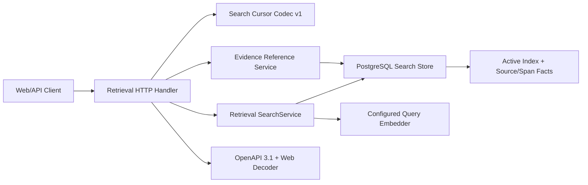

# M6-D Search API And Integration 技术设计

## 1. Boundary And Data Flow



- `internal/retrieval/http`：wire DTO、严格解码、HTTP 状态、href、分页切片；不拥有检索算法。
- `internal/retrieval/application`：继续拥有 Search；新增 Source Version/Span Reference Query Service 和
  Cursor Page 需要的有界结果窗口契约，但不导入 HTTP。
- `internal/retrieval/domain`：Source/Span reference、cursor fingerprint 输入和跨层验证；不编码 URL。
- `internal/retrieval/adapter/postgres`：Active Search、Source Version/Span binding 查询和 EXPLAIN。
- `internal/platform/models`：Worker/API 共享 Configured Embedder Factory。
- `internal/app` / `cmd/api`：Router/Composition Root 接线。

## 2. Search API Contract

```text
POST /api/v1/search
Content-Type: application/json

{
  "workspace_id": "uuid",
  "query": "text",
  "retrieval_mode": "hybrid",
  "filters": {
    "source_ids": ["uuid"],
    "source_version_ids": ["uuid"],
    "path_prefixes": ["docs"],
    "captured_at_from": "RFC3339",
    "captured_at_before": "RFC3339"
  },
  "cursor": "opaque-v1",
  "limit": 20
}
```

Handler 只负责 wire → `domain.SearchRequest`，并把 page limit/cursor 交给 Pagination Service。真正 Search
固定请求 top-100 窗口；API 在通过 Cursor 验证后切片。这样公开 API 没有 offset，同时每页重算仍受
M6-C 100 Evidence 上限、500 候选上限和 Active Index 约束保护。

## 3. Cursor V1

Cursor payload 使用 URL-safe base64 编码 canonical JSON：

```json
{
  "version": 1,
  "request_hash": "sha256",
  "index_version_id": "uuid",
  "result_hash": "sha256",
  "offset": 20
}
```

- `request_hash` 由规范化 Workspace/Query/Mode/Filter/Limit 生成；slice 排序后的 ID/path/time，时间使用 UTC。
- `result_hash` 覆盖 effective mode、Index/Query degradations、完整有序 top-100 的 Chunk ID、最终 rank、
  阶段存在性和可选 Rerank model version；后续页重算不一致即 stale，避免未来非确定 Reranker
  或能力漂移产生重复/漏项。
- Wire payload 与 HMAC-SHA256 signature 一起 URL-safe base64；生产 Composition Root 生成 32-byte
  进程内随机密钥，测试显式注入。Decoder 严格拒绝签名、未知字段、UUID/hash、offset 和长度异常。
- `crypto/rand` 失败时 Retrieval HTTP 依赖保持不可用并返回显式 503；禁止退化为固定键或无签名 Cursor。
- Cursor 不是授权凭据；它不包含正文、Secret、DSN 或绝对路径。Workspace 访问控制仍由服务端资源
  查询和未来 M10 Authorizer 执行。API 重启/跨实例后旧 Cursor 返回 invalid，客户端从第一页重启。
- 第二页先执行 Search，再比较 Index Version 与结果指纹；不一致返回 `RETRIEVAL_SEARCH_CURSOR_STALE`。

## 4. Response And Evidence Links

Response 顶层：

```text
workspace_id, requested_mode, effective_mode,
index_version_id, embedding_version_id?,
index_degraded_capabilities[], query_degradations[],
items[], next_cursor?
```

Evidence 将 `domain.EvidenceV1` 一一映射，不重算分数。每个 provenance 生成：

```text
/api/v1/workspaces/{workspace}/source-versions/{version}
/api/v1/workspaces/{workspace}/source-versions/{version}/spans/{span}
```

Source Version/Span Store 使用单条参数化 JOIN 验证 Workspace、Source Version、Source、Content Artifact、
`source_version_projection` 与 `source_span.parse_projection_id`。Span Service 再通过 Workspace Repository +
Filesystem Artifact Reader 读取不可变 managed artifact，验证全文 Hash/大小和 excerpt hash 后返回最多 4 KiB
UTF-8 excerpt。跨 Workspace 与 binding miss 都返回同一 NotFound；响应不返回 `workspace.root_path`、
`content_artifact.managed_location` 或绝对原路径，也不从当前 worktree 读取正文。

## 5. Error Matrix

| Condition | Foundation Kind | HTTP | Stable Code |
|---|---|---:|---|
| JSON/UUID/time/mode/filter/limit invalid | InvalidInput | 400 | `RETRIEVAL_SEARCH_REQUEST_INVALID` |
| Cursor malformed/HMAC mismatch/request mismatch/overflow | InvalidInput | 400 | `RETRIEVAL_SEARCH_CURSOR_INVALID` |
| Cursor Index or complete result fingerprint changed | VersionConflict | 409 | `RETRIEVAL_SEARCH_CURSOR_STALE` |
| Workspace has no Active Index | NotFound | 404 | existing Store code |
| Source Version/Span missing or cross-workspace | NotFound | 404 | `RETRIEVAL_EVIDENCE_REFERENCE_NOT_FOUND` |
| FTS-only Semantic | DependencyUnavailable | 503 | `RETRIEVAL_SEMANTIC_UNAVAILABLE` |
| retryable Provider/DB failure | Retryable/DependencyUnavailable | 503 | preserved stable code |
| damaged candidate/result/binding | ConsistencyViolation | 409 | preserved stable code |

Problem `details` 默认为空；Cursor stale 可返回不敏感的 `restart_required=true`，不返回当前 Query、路径或内部 SQL。

## 6. Composition

`models.NewConfiguredEmbedder(config.Config)` 成为唯一配置转换入口，Worker 和 API 都调用它。API 构造顺序：

```text
PostgreSQL Pool
  -> retrievalpostgres.Repository
  -> configured Query Embedder (nil when disabled)
  -> retrievalapplication.SearchService
  -> retrievalapplication.EvidenceReferenceService
  -> retrievalhttp.Handler
  -> app.Dependencies.Retrieval
```

Handler 以 nil Service 启动时返回显式 503，便于数据库初始化失败时保持路由契约，不返回假空结果。
Compose 必须给 app/worker 注入相同 Embedding 配置；RRF 是 Index 构建时持久事实，API 查询从 Active Index
读取，不依赖运行时 RRF 环境变量重算历史排名。

## 7. OpenAPI And Web Boundary

- OpenAPI schemas 将 stage score 分型：Lexical、VectorDistance、Fusion、Rerank，避免一个含糊 `score`。
- `web/src/api/search.ts` 是 wire decoder 唯一入口；Feature/Component 只消费解码后的 SearchResponse。
- 本任务不新增页面或 Query Hook；M9 在该边界上实现 UI。

## 8. Integration And Smoke

### PostgreSQL HTTP Integration

固定 Fixture 建立 Workspace、Source/Version/Projection/Span、Active FTS-only 与 Hybrid Index，使用
`httptest.Server` 走完整 Router，验证 Search、Cursor、href、Workspace isolation 和 Problem。

### River Fault Smoke

复用现有 `Test...ReindexRiverFaultSmoke` 的真实 Safe Writeback/HTTP Embedder/response-loss 注入；Completion 后
将 Search Handler 接到同一 Repository，经 HTTP 搜索 result hash 对应新 Chunk，再 GET Source Version/Span。

### Compose API Smoke

脚本创建 disposable Git Workspace 和 Markdown，启动 Compose，通过现有公开 API Scan/Ingestion/Create
Proposal/Approve，轮询 Proposal completed，然后调用 Hybrid Search。Embedding disabled 的期望是实际 Keyword
命中且 vector/rerank degraded。脚本必须 trap 清理 Compose volume 与临时目录，错误输出执行 Secret/路径 canary。

## 9. Compatibility, Rollback And Security

- 仅新增 API 路径/Schema/Handler，无数据库迁移；旧客户端不受影响。
- 回滚应用时删除新路由即可，现有 Active Index 与 M6-C Search Store 不变。
- Cursor v1 未来升级使用 `version` 分支；不接受未知版本。
- M6-D 只实现数据 Workspace 隔离。正式 Auth/CSRF/Capability 是 M10 发布门禁；在完成前部署继续只允许 loopback。
- 所有 Query 参数化；Filter/Mode/Distance 继续使用领域枚举和固定 SQL 模板。

## 10. Key Trade-offs

- 选择“重算 top-100 + HMAC Cursor 绑定 Index/完整结果指纹”，而不是持久 Search Session：避免新增
  会话表和清理任务，且结果漂移 fail closed；代价是后续页重复执行一次有界查询、API 重启后需从第一页开始。
- Source/Span 打开端点只返回经不可变 Artifact 校验的最大 4 KiB excerpt，不提供完整文件下载：满足
  引用可达与版本真实性，同时避免在 M6-D 提前实现文件预览/下载权限；M9/M10 可扩展受控预览。
