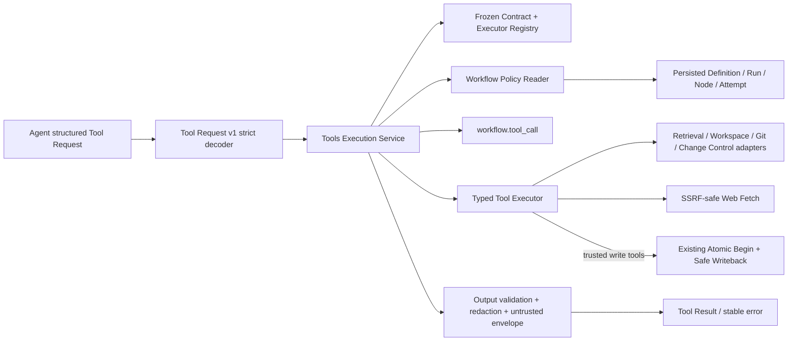
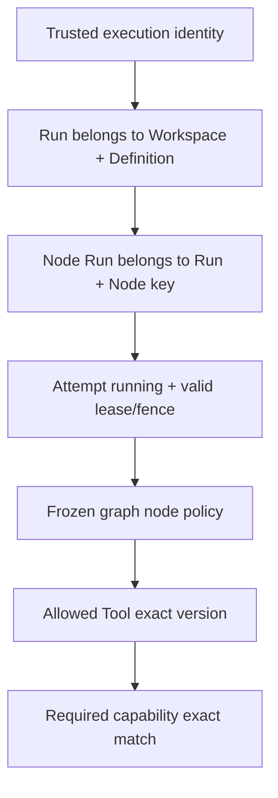
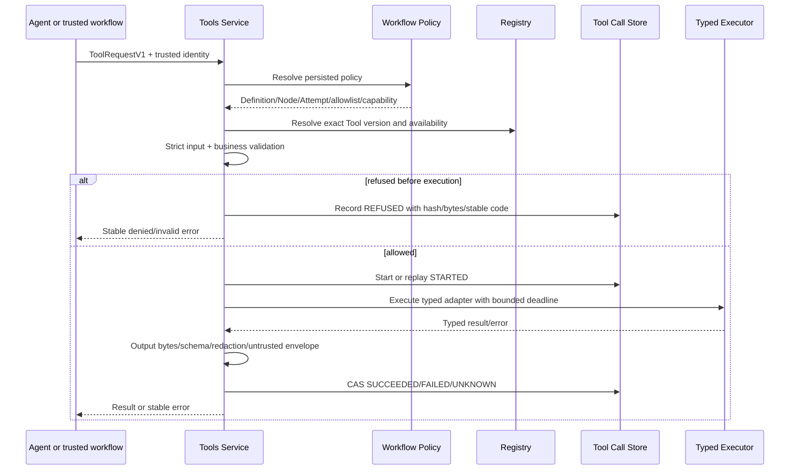
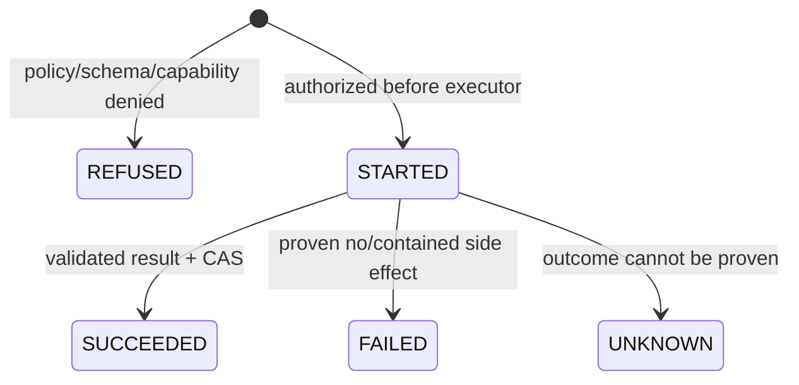

# M6-03 Tool Registry And Security 技术设计

## 1. Architecture



依赖方向：

```text
internal/capability                 # 七项普通 Capability 唯一词汇源
internal/tools/domain               # Tool/Call/Schema/状态/错误，不依赖外部模块
internal/tools/application          # Registry、Policy、Execution、Ports
internal/tools/adapter/*            # PostgreSQL/WebFetch/Agent/现有模块适配

workflow/application -> tools/domain contract catalog
tools/application -> workflow policy port implementation
tools adapters -> retrieval/workspace/changecontrol/platform application seams
```

`internal/capability` 只依赖标准库。Workflow 的 `Permission` 使用该类型的 alias；Tools Definition 直接使用同一类型。Change Control 的一次性 Approval Capability 保持更窄的独立类型，通过显式映射接收 `WRITE_KNOWLEDGE`/`GIT_WRITE`，避免把普通读取权限变成可签发 Token 的授权。

## 2. Canonical Capability Vocabulary

| Capability | 作用 | 典型 Tool | 是否还需 Approval Write Authorization |
|---|---|---|---:|
| `READ_LOCAL` | 读取当前 Workspace 受控对象 | Search/Read/Citation/Git Status | 否 |
| `READ_EXTERNAL` | 访问显式允许的公开网页 | FetchWebPage | 否 |
| `WRITE_PROPOSAL` | 创建候选或 Proposal | 当前无新增 Tool | 否 |
| `WRITE_KNOWLEDGE` | 进入批准知识写回 | ApplyApprovedPatch | 是 |
| `GIT_WRITE` | 进入批准 Git Commit | CreateGitCommit | 是 |
| `INDEX_MAINTENANCE` | 构建/切换受控 Index Version | RebuildIndex | 否，但仅维护 Workflow |
| `EVALUATION_RUN` | 运行版本化评测 | RunRegressionEvaluation | 否，但仅评测 Workflow |

`ADMIN_MAINTENANCE` 不进入 canonical catalog，也不在运行时自动映射。升级前查询不可变 Workflow Definition graph；有旧值时发布新 Definition Version，按具体 Tool/Node 唯一映射，无法唯一判断则禁止新 Run。

## 3. Module Responsibilities

### 3.1 `internal/tools/domain`

- `ToolRef{Name, Version}`、`SchemaRef{ID, Version}`、`Definition`。
- `SideEffectLevel`：`NONE`、`EXTERNAL_READ`、`DOMAIN_WRITE`、`IRREVERSIBLE_OR_UNKNOWN`。
- `InvocationPolicy`：`MODEL_REQUESTABLE`、`TRUSTED_WORKFLOW_ONLY`。
- `RetryPolicy`、`IdempotencyPolicy`、`OutputPolicy`、`SensitiveFieldPath`。
- `ToolRequestV1`：`schema_version/tool_name/arguments/reason`。
- `TrustedExecutionIdentity`：Workspace、Definition、Run、Node、Attempt、lease/fence 的不可变身份。
- `ToolCall` 状态机、idempotency binding、hash/summary/ref 值对象和稳定错误码。

Domain 不持有 Executor、不查 Workflow/Approval、不解析路径、不执行网络/命令，也不保存 raw request/output。

### 3.2 `internal/tools/application`

- `ContractRegistry`：注册 11 个版本化 contract，校验定义与 Schema/Decoder 一致性，Freeze 后只读和深拷贝。
- `ExecutorRegistry`：Worker 注册真实 typed Executor；API 不构造 Executor。Enabled contract 没有真实 Executor 时 Worker readiness 失败。
- `CatalogSnapshot`：精确解析 `name+version`，不提供运行时 `latest`；模型目录按配置、Executor availability、InvocationPolicy 和 Workflow policy 投影。
- `ExecutionService`：固定执行顺序、deadline、持久 Tool Call、幂等、输出边界和错误映射。
- `WorkflowPolicyReader`：从持久 Definition/Run/Node/Attempt/lease 解析不可变 Policy。
- `ToolCallRepository`：RecordRefused、Start/Replay、Finalize、MarkUnknown、Query timeline。
- `TrustedSideEffectRecorder`：为现有 Safe Writeback 记录两个逻辑写 Tool 与同一 durable execution ref，不拥有授权消费或副作用。
- Safe Writeback v1 的 frozen graph/hash 与空 `allowed_tools` 保持不变；两个写 Tool 不走普通模型 Tool allowlist，也不注册独立 File/Git Executor。它们由仅限既有 `writeback_execution`、已消费双授权和当前可信 lease 的分阶段 audit recorder 在真实文件/Git checkpoint 周围记录。

### 3.3 Adapters

- `adapter/postgres`：`workflow.tool_call`、policy query、CAS/replay/recovery。
- `adapter/webfetch`：Resolver/Dialer/Redirect/Content/HTML 安全边界。
- `adapter/agent`：Tool Request v1 JSON Schema 与 strict decoder；Provider raw `tool_calls` 仍 fail closed。
- `adapter/retrieval`：Search、Read、Citation、RebuildIndex、Regression Evaluation。
- `adapter/workspace`：Stable Object ID、ReadDocument/Source、Git Status。
- `adapter/changecontrol`：CalculateDiff 与 trusted write Tool audit bridge；实际写回继续走 M5 seam。

## 4. Tool Definition And Availability

Definition 至少包含：

```text
ref / description
input_schema_ref + input_schema_document + typed decoder
output_schema_ref + output_schema_document + typed decoder
required_capability
side_effect_level / invocation_policy
timeout / retry_policy / idempotency_policy
sensitive_fields / max_input_bytes / max_output_bytes
allowed_workflow_keys_and_versions
definition_hash
```

Registry 分离三个概念：

1. **Contract exists**：11 个核心 Tool 都有稳定 Definition 与 contract test。
2. **Deployment enabled**：配置允许该 Tool；Web Fetch 默认 disabled。
3. **Executable now**：Worker 注册真实 Executor，且当前 Workflow/Node policy 允许。

只有三者同时成立的 `MODEL_REQUESTABLE` Tool 才进入模型可见目录。不存在 Executor 时返回 `TOOL_CAPABILITY_UNAVAILABLE`，不能用 Fake 或空结果代替。`TRUSTED_WORKFLOW_ONLY` 写 Tool 从不进入普通模型目录。

## 5. Workflow Contract And Policy

`workflow.domain.NodeDefinition` 新增：

```go
AllowedTools []toolsdomain.ToolRef `json:"allowed_tools,omitempty"`
```

- canonicalization 对 `name+version` 排序、去重并深拷贝。
- 空/缺失集合表示禁止全部 Tool。
- 非空集合进入 graph hash；旧 Definition 没有该字段时序列化保持 `omitempty`，既有 hash 不变化。
- Definition Freeze 使用只读 Tool Contract Catalog 校验精确版本、required capability、workflow binding 和 invocation policy。
- 现有 Safe Writeback Definition v1 不增加 model tool allowlist，也不重算 hash。

Runtime `ExecutionContext` 增加 `DefinitionID/DefinitionVersion/DefinitionHash/NodeKey`。River Args 仍只保存稳定 Node Run/dispatch 身份，不复制权限和 Tool 列表。`WorkflowPolicyReader` 在调用时通过数据库交叉验证：



任何 drift、跨 Workspace、旧 delivery、过期 lease 或 Definition hash 不一致均在 Executor 前拒绝。

## 6. Strict JSON And Agent Contract

把 `internal/agent/domain/strictjson.go` 的通用 bounded token inspector 提取到无 Agent 语义的共享包，例如 `internal/foundation/strictjson`：

- shared 包负责 UTF-8、duplicate key、single document、depth/string/array/object/document byte limits 和 typed decode。
- Agent 保留现有 wrapper、默认限制和 `AGENT_STRUCTURED_OUTPUT_INVALID` 错误映射，M6-02 对外行为不变。
- Tools 使用独立限制和 `TOOL_REQUEST_INVALID`/`TOOL_INPUT_INVALID`/`TOOL_OUTPUT_INVALID`。
- Schema 文档用于模型与契约展示；typed decoder/validator 是运行时唯一实例校验。Golden corpus 同时验证文档和 decoder，防止 drift。

Tool Request v1 是单请求，而非无界数组：

```json
{
  "schema_version": 1,
  "tool_name": "SearchKnowledge",
  "arguments": {},
  "reason": "需要检索已批准知识"
}
```

M6-03 注册独立 Schema/Result Type，不修改 Relation/RAG/Refusal/Faithfulness v1。M6-04 负责 Tool loop、调用预算与将 `untrusted_data` Tool Result 重新交给模型；Provider 原生 `tool_calls` 在本期继续拒绝。

模型 Tool Request 先经过 strict decoder，再转换为独立 `PersistedToolInvocationV1`；持久 Node input 只包含
`schema_version/tool_name/arguments`，不保存模型自由文本 `reason`。M6-03 生产 `agent-rag` Definition 只允许
空参数或稳定 ID tuple 的 `ReadSource`、`ValidateCitation`、`ReadGitStatus`。`SearchKnowledge` query 与
`CalculateDiff` before/after 属于内容型参数，虽有真实 typed Executor，也不进入本期生产持久 Tool 目录；
M6-04 必须设计不复制 raw 内容的 request receipt 或同一受控 Agent Attempt 内执行 seam 后才能开放。
Workflow input 仍拒绝 Workspace、Capability、Approval、Credential、timeout、endpoint、path、command 和 Git args，
且不能复制到 `workflow.tool_call`、Node output、日志、Trace 或错误。Executor 使用受控常量 reason，不恢复模型原文。

## 7. Execution Pipeline



固定顺序不允许 Adapter 自行跳过：Request envelope → persisted policy → exact registry → capability/allowlist → typed input → idempotency/Tool Call → Executor → typed output → redaction → terminal CAS。

## 8. Tool Call Data Model

前向迁移：`00019_tool_registry_security.sql`，表 `workflow.tool_call`。

| Field group | Fields |
|---|---|
| Identity | `id`, `workspace_id`, `workflow_run_id`, `node_run_id`, `node_attempt_id`, `call_no` |
| Contract | `requested_tool_name`, nullable `tool_version/definition_hash/schema refs/capability/side_effect_level/invocation_policy` |
| Idempotency | nullable `idempotency_key`, `request_hash`, `request_bytes`, `request_summary` |
| Result | nullable `response_hash/response_summary/result_ref/side_effect_type/side_effect_id`, `response_bytes` |
| Lifecycle | `status`, `error_code`, `retryable`, `started_at`, nullable `completed_at`, `duration_ms`, `version` |

状态：



数据库约束：

- composite FK 证明 Run/Node/Attempt 与 Workspace 的归属；Start 时验证 Attempt running、lease/fence 有效。
- `UNIQUE(node_attempt_id, call_no)`；有副作用且 key 非空时 `UNIQUE(workspace_id,idempotency_key)` partial index。
- 同 key replay 必须比较完整 binding/request hash；不一致返回 idempotency conflict。
- identity/contract/request hash/started_at immutable；只允许 `STARTED -> terminal` 且 `version = old+1`。
- `REFUSED/FAILED` 必须有 error code；`SUCCEEDED` 必须有 response hash 或稳定 result ref；`UNKNOWN` 不允许伪造已验证结果。
- summary 必须是有界 JSON object；数据库不包含 raw args/output、Prompt、正文、Credential、URL secret、绝对路径或 stderr。
- DELETE 拒绝；Down 有数据时 SQLSTATE `55000`。

严格 JSON envelope 无法解析时仍由 Model Run/Call 记录 structured-output failure，不伪造 Tool Call；一旦获得合法 ToolRequestV1 和 trusted Attempt identity，unknown tool、Schema、Policy 与 Capability 拒绝都写 `REFUSED`。

## 9. Idempotency And Recovery

- 只读 Tool 默认由 Workflow 决定是否重试；Registry/Executor 不做隐藏重试。
- 有副作用 Tool 必须在外部调用前插入 STARTED；同 key/同 binding 返回既有 Call/result ref，不再次执行。
- `FAILED` 只用于能证明没有未记录副作用或副作用已由权威 receipt 明确失败的情况。
- 进程退出、连接断开、timeout 时无法证明结果，归 `UNKNOWN`；恢复器先查询 canonical domain receipt/side-effect ref，证明成功后 CAS 恢复，否则保持人工恢复。
- Safe Writeback 的 Tool Call 关联现有 `writeback_execution`，不会改变双授权消费、文件/Git checkpoint、Mapping/Reindex Outbox 或反向 Commit 语义。
- Safe Writeback audit 在 Atomic Begin 成功并完成 exact binding lookup 后创建：Apply Call 在文件副作用前 STARTED、`file_applied` checkpoint 后 SUCCEEDED；Git Call 在 `git_prepared` 后且 Commit 前 STARTED、`git_committed` checkpoint 后 SUCCEEDED。lease loss 由新 Attempt 根据权威 `writeback_execution`/FS/Git receipt reconciliation，不由通用 stale recovery 抢先归约 UNKNOWN。

## 10. SSRF-Safe Web Fetch

每一跳算法：

1. Parse URL；仅 `http/https`，拒绝 userinfo、opaque、缺 host、非法端口和超限 URL。
2. IP literal 直接校验；hostname 经可注入 Resolver 解析全部 A/AAAA，先 `Unmap()`。
3. 任一地址为 unspecified、loopback、private、link-local、multicast、CGNAT、metadata 或维护的保留网段时整跳拒绝。
4. Dial closure 只连接本跳验证的 IP snapshot；HTTP Host 与 TLS ServerName 保持原 hostname；禁止环境代理和再次 DNS。
5. 自动重定向关闭；收到 3xx 后关闭 body、解析 Location、计数并从步骤 1 重新授权。
6. 使用最早的 caller deadline/tool timeout；限制响应头和解压后 body `max+1`，超限返回空正文。
7. 只接受受控文本/HTML Content-Type；HTML 用 `golang.org/x/net/html` 解析，删除 script/style/noscript/template 内容并输出有界 UTF-8 文本。
8. 返回 final URL 的脱敏表示、fetched_at、content type、bytes、content hash 与 `untrusted_data=true`。

测试通过 fake Resolver/Dialer 将测试公网 IP 映射到本地 listener，不给生产实现增加 localhost bypass，也不访问真实互联网。

## 11. Core Tool Adapter Mapping

| Tool | Capability | Policy | Adapter seam |
|---|---|---|---|
| SearchKnowledge | READ_LOCAL | model requestable | Retrieval SearchService |
| ReadSource | READ_LOCAL | model requestable | immutable Source Version / Artifact reader |
| ReadDocument | READ_LOCAL | model requestable | EvidenceReferenceService / approved document projection |
| FetchWebPage | READ_EXTERNAL | model requestable, default disabled | SSRF-safe Web Fetch |
| ValidateCitation | READ_LOCAL | model requestable | batched citation/openability validator |
| CalculateDiff | none/exact node allowlist | model requestable | pure typed diff service |
| ReadGitStatus | READ_LOCAL | model requestable | existing Git Inspector, Workspace ID only |
| ApplyApprovedPatch | WRITE_KNOWLEDGE | trusted workflow only | existing Safe Writeback audit bridge |
| CreateGitCommit | GIT_WRITE | trusted workflow only | existing Safe Writeback audit bridge |
| RebuildIndex | INDEX_MAINTENANCE | maintenance workflow only | v1 contract-only unavailable；现有 Safe Writeback River Delivery 不接受同步 Tool 冒充 lease owner |
| RunRegressionEvaluation | EVALUATION_RUN | evaluation workflow only | v1 contract-only unavailable；现有 Reindex 结构回归与离线 Agent fixture 均不是 Dataset Evaluation |

`CalculateDiff` 不需要外部 Capability，但仍必须在 Node exact allowlist 中；“无 Capability”不等于任意 Workflow 可调用。

## 12. Error Contract

| Category | Stable examples | Retryable | Executor called |
|---|---|---:|---:|
| Request/Schema | `TOOL_REQUEST_INVALID`, `TOOL_INPUT_INVALID` | 否 | 否 |
| Registry/Availability | `TOOL_NOT_REGISTERED`, `TOOL_CAPABILITY_UNAVAILABLE` | 否 | 否 |
| Policy/Permission | `TOOL_NOT_ALLOWED`, `TOOL_PERMISSION_DENIED`, `TOOL_CONTEXT_STALE` | 否 | 否 |
| Idempotency | `TOOL_IDEMPOTENCY_CONFLICT` | 否 | 否 |
| Web security | `TOOL_SSRF_BLOCKED`, `TOOL_CONTENT_REJECTED` | 否 | 否 |
| Timeout/cancel | `TOOL_TIMEOUT`, `TOOL_CANCELED` | 按 Definition/Caller | 可能 |
| Adapter transient | `TOOL_DEPENDENCY_UNAVAILABLE` | 按 Definition | 是 |
| Output | `TOOL_OUTPUT_INVALID`, `TOOL_OUTPUT_TOO_LARGE` | 否 | 是 |
| Unknown outcome | `TOOL_OUTCOME_UNKNOWN` | 否，需恢复 | 是 |

稳定错误只返回阶段、code、retryable、correlation/tool_call_id；内部 URL、IP、path、body、stderr 和 Credential 不进入错误文本。

## 13. Configuration And Composition

- Tool contract catalog 在 API/Worker 共享构造并冻结。
- API 根据相同配置标记 enabled contracts，但不注入 Executor；Worker 为 enabled contracts 注入真实 Executor。
- Web Fetch 配置默认 disabled，包含 bounded timeout、max redirects、max decompressed bytes 和 allowed content types；不支持私网例外或环境代理。
- disabled 不注册普通 ExecutionService/可启动 Tool Definition，但进程仍可 ready；enabled 时 dependency/Executor/Definition 缺失才 readiness fail closed。
- `ReadDocument`、`RebuildIndex`、`RunRegressionEvaluation` 在真实 Application seam 落地前只存在 contract，不进入 Worker enabled executor subset 或模型目录；`SearchKnowledge`、`CalculateDiff` 虽有 typed Executor，也因内容型 request 尚无安全持久 receipt，不进入 M6-03 生产持久目录。后续补齐能力时发布新的 Workflow/Tool 版本，不原地扩展历史 Definition。
- M6-03 不增加公共 Tool execute API；可选 Tool timeline 只作为 Workflow 内部/未来查询 port，本期不扩大 HTTP 面。

## 14. Compatibility, Rollout And Rollback

- 先 Expand：新增 capability package、Tool contracts、Workflow `allowed_tools`、Execution identity 和 `workflow.tool_call`；再启用新 Tool Workflow。
- 旧 Definition 空 Tool allowlist，历史 graph hash 保持不变，不能因升级自动获得工具。
- 发布前执行旧 `ADMIN_MAINTENANCE` 探测；无记录直接废弃，有记录发布新版本并 drain 旧 Run，禁止原地 UPDATE。
- 应用回滚保留 `workflow.tool_call`；空表可 Down，有数据 forward fix。关闭 Web Fetch 不影响本地 Search/RAG。
- Tool Definition/Schema 变更发布新版本；运行中的 Run 继续使用启动时的精确版本。
- M10 后续接入 Session/API Token 与通用 Audit 时复用 canonical Capability 与 Tool Call 摘要，不改变 M6-03 内部执行不变量。

## 15. Key Trade-offs

- 使用项目自有 strict Tool Request 而非 Provider tool_calls：多一层 Schema/编排，但保留版本、repair、权限和持久事实的唯一控制面。
- Contract 与 Executor 分离：允许 API 校验 11 个稳定定义，同时不会为未配置能力创建 Fake；代价是 Composition readiness 需要双侧一致性测试。
- Tool Call 专表而非普通日志：增加迁移和恢复复杂度，但可证明 STARTED/UNKNOWN/幂等并满足敏感信息边界。
- 持久 Tool Workflow 只接受空参数/稳定 ID tuple：暂不在生产目录开放 Search query 与 Diff 正文，牺牲本期可见工具数量，换取 raw 内容不落 DB；M6-04 需用专用 request receipt 或同 Attempt 执行 seam 扩展。
- 每跳 validated-IP pinning 而非“解析一次再普通 HTTP”：实现更复杂，但这是阻止 DNS rebinding 和 redirect SSRF 的必要条件。
- HTML 输出纯文本而非通用 sanitizer HTML：能力更保守，但减少 XSS/事件属性和 Prompt 指令面，符合 RAG 数据用途。
- `ADMIN_MAINTENANCE` 不做兼容扩权 alias：旧不明确 Definition 需要人工迁移，但避免一个旧 Scope 同时获得索引与评测能力。
