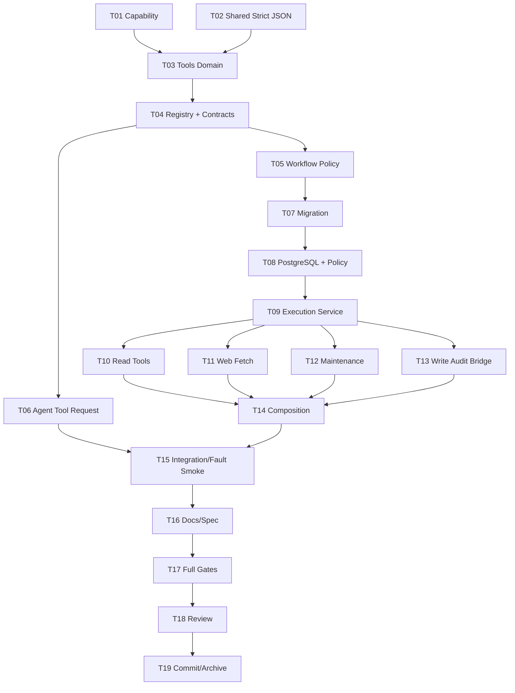

# M6-03 Tool Registry And Security 实施清单

## Ordered Tasks

| ID | Task | Primary impact | Prerequisite | Executable acceptance | Risk | Status |
|---|---|---|---|---|---|---|
| T00 | 收口 PRD、设计、研究和权限冲突 | task artifacts | none | PRD convergence；`design.md/implement.md` 存在；无阻塞 Open Decisions；`git diff --check` | 规划与实现分叉 | [x] |
| T01 | 建立 canonical Capability 叶子包并废弃旧维护权限 | `internal/capability`, workflow domain/composition/tests | T00 | 七项唯一值；Workflow Registry 接受新值并拒绝 `ADMIN_MAINTENANCE`；旧 Graph 探测测试 | 旧 Definition 被错误扩权 | [ ] |
| T02 | 提取共享 bounded strict JSON boundary，保持 Agent 契约不变 | `internal/foundation/strictjson`, `internal/agent/domain` | T00 | Agent 原测试与 count/race 通过；duplicate/UTF-8/trailing/depth/size 行为无变化 | M6-02 回归 | [ ] |
| T03 | 实现 Tools Domain contract、状态机、摘要和错误 | `internal/tools/domain` | T01,T02 | Definition/ToolRef/Schema/Request/Call/idempotency/status 单测；导出类型中文注释；无外层依赖 | 领域边界泄漏 | [ ] |
| T04 | 实现 Contract/Executor Registry 与 11 个 Definition contract | `internal/tools/application`, `internal/tools/adapter/catalog` | T03 | duplicate/freeze/deep-copy/latest/availability/contract-decoder drift 测试；11 Tool golden 全部通过 | 未实现 Tool 被假装可用 | [ ] |
| T05 | 扩展 Workflow `allowed_tools`、Definition hash 与 runtime identity | `internal/workflow/domain,application,adapter/river`, changecontrol workflow regression | T03,T04 | 空集合拒绝全部；非空排序/去重/精确版本；旧 graph hash 不漂移；Safe Writeback v1 hash 不变 | 历史 Workflow 漂移 | [ ] |
| T06 | 新增独立 Tool Request v1 Schema/decoder 与 Agent catalog bridge | `internal/tools/adapter/agent`, `internal/agent` | T02,T03,T04 | v1 request strict corpus；既有四类 Agent Schema 不变；Provider raw `tool_calls` 仍拒绝 | 放宽 Provider 边界 | [ ] |
| T07 | 新增 `00019_tool_registry_security.sql` 与迁移测试 | `migrations`, `internal/platform/migration` | T03,T05 | Up/repeat Up/empty Down→Up/FK/status/CAS/immutability/index/有数据 `55000` 全通过 | 不可逆数据丢失 | [ ] |
| T08 | 实现 PostgreSQL Tool Call Repository 与 Workflow Policy Reader | `internal/tools/adapter/postgres` | T05,T07 | real PG：cross-workspace/run/node/attempt/lease、RecordRefused、STARTED、terminal CAS、replay/conflict、crash→UNKNOWN、稳定排序 | 并发双执行/错误终态 | [ ] |
| T09 | 实现 ExecutionService 固定安全流水线 | `internal/tools/application` | T04,T08 | permission matrix、fail-before-executor、deadline/cancel、output validation/redaction、idempotency/UNKNOWN、Prompt Injection corpus | 校验顺序被绕过 | [ ] |
| T10 | 实现 Search/Read/Citation/Diff/GitStatus typed Adapters | `internal/tools/adapter/{retrieval,workspace,changecontrol}` | T09 | 与现有 Application contract 同测；stable ID；批量 Citation ≤500；无直接 SQL/path/git args；真实 FS/Git smoke | 第二事实源/N+1 | [ ] |
| T11 | 实现 SSRF-safe Web Fetch 与 HTML text parser | `internal/tools/adapter/webfetch`, config, `go.mod/sum` | T03,T09 | SSRF-01..11：mixed IP、rebind、redirect、TLS SNI、proxy disabled、gzip decoded limit、timeout/cancel、HTML canary；不访问公网 | SSRF/资源耗尽 | [ ] |
| T12 | 接入 RebuildIndex 与 Regression Evaluation typed Adapters | `internal/tools/adapter/retrieval`, retrieval/runtime | T01,T09 | 两项最小权限互斥；固定 Index/Dataset/Version/范围/幂等；无直接任意 SQL/command | 维护权限扩大 | [ ] |
| T13 | 接入 trusted write Tool audit bridge，不改变 M5 Atomic Begin | `internal/tools/adapter/changecontrol`, `internal/changecontrol/workflow` | T08,T09 | 普通 Agent 无法调用；合法 Safe Writeback 关联两个逻辑 Tool Call 与一个 execution ref；双授权仍同事务消费一次；fault/replay 零重复副作用 | 破坏唯一写入 seam | [ ] |
| T14 | 完成 API/Worker Composition、配置和 readiness | `cmd/api`, `cmd/worker`, `internal/platform/config`, Docker/Compose | T04,T05,T10,T11,T12,T13 | API contract/Worker executor 分离；disabled/unconfigured fail closed；生产无 Fake；Web Fetch 默认关闭 | API/Worker catalog 漂移 | [ ] |
| T15 | 完成真实 Workflow/River Tool 集成与 fault smoke | workflow/tools integration tests, scripts/smoke | T06,T08,T10,T13,T14 | 只读 Tool 全链：Agent request→Registry→ToolCall→untrusted result；写回 audit 全链；duplicate/lease reclaim/response loss 不重复 | Fake smoke 冒充真实闭环 | [ ] |
| T16 | 同步产品、架构、数据库、测试与 Trellis spec | `docs/product`, `docs/architecture`, `.trellis/spec/backend`, parent task | T01-T15 | Capability/Tool/Schema/迁移/运行命令与代码逐项核对；M6-04/M10 保持未完成 | 文档与行为分叉 | [ ] |
| T17 | 执行全量质量门禁与 Docker Tool smoke | all affected modules | T15,T16 | 定向 count/race、real PG、SSRF/CMD/Path、M5 回归、全仓 race/vet/make test/tidy、Docker/Compose smoke、diff check 全通过 | 环境型盲区 | [ ] |
| T18 | 主审查、独立安全/SQL/并发复验并修复 | diff/tests/docs | T17 | 主 Agent 使用 `go-review`、`sql-code-review`、`code-review-and-quality`；独立 reviewer 两轮内关闭 P0/P1 与当前范围 P2 | 审查结论未复现 | [ ] |
| T19 | 更新父任务、Journal，提交并归档 M6-03 | Trellis task/parent/workspace, Git | T18 | 业务提交、任务状态、归档提交可追踪；不 push；父任务 M6-03 标记完成并继续 M6-04 | 状态声称早于证据 | [ ] |

## Dependency Graph



T10、T11、T12 可在 T09 后按目录并行；T13 与它们并行但只有主 Agent整合 Change Control seam。公共 Capability、Workflow Domain、Migration、Registry 接口和 Composition 由主 Agent统一修改，避免多个实现者产生第二事实源。

## Validation Commands

按任务逐步执行，最终全量门禁为：

```bash
go test -race -count=20 ./internal/capability ./internal/foundation/strictjson ./internal/tools/domain ./internal/tools/application
go test -race ./internal/tools/... ./internal/agent/... ./internal/workflow/... ./internal/changecontrol/...
go test -race ./internal/platform/gitcli ./internal/platform/filesystem ./internal/retrieval/...
go test -race -run 'TestWebFetcher|TestDNSRebinding|TestRedirect|TestCommand|TestToolOutput' ./internal/tools/... ./internal/platform/gitcli
go test -race ./...
go vet ./...
make test
go mod tidy -diff
git diff --check
```

真实 PostgreSQL 使用现有 `ZHIXU_TEST_DATABASE_URL` 基准库并由测试创建 disposable database：

```bash
ZHIXU_TEST_DATABASE_URL='postgres://...' \
go test -race -tags=integration -count=1 -p 1 \
  ./internal/platform/migration \
  ./internal/tools/adapter/postgres \
  ./internal/workflow/adapter/postgres \
  ./internal/workflow/adapter/river \
  ./internal/changecontrol/adapter/postgres
```

Docker/Compose 必须实际执行 Tool，而不只检查 readiness：

```bash
make docker-build
docker compose -f deploy/compose.yml --env-file .env.example up -d --wait
# 运行固定 Tool Workflow smoke，查询 workflow.tool_call 与结果引用
# 运行未授权/Prompt Injection/fault smoke，证明 executor=0 或 UNKNOWN 可恢复
docker compose -f deploy/compose.yml --env-file .env.example down -v
```

真实外部 Web/Provider 未配置时记录 `SKIP`；本地 Resolver/Dialer/httptest 与真实 PostgreSQL/River/Filesystem/Git 门禁仍必须 PASS。

## Stop Gates

- 模型、Source、Tool Result、HTTP body 或 River Args 可以提供 Workspace、Capability、Approval、Credential、allowed tools、timeout、path、command 或 Git args：停止。
- Registry/Workflow/Change Control 各自维护不同 Capability 字符串或 `ADMIN_MAINTENANCE` 被自动扩权：停止。
- `ApplyApprovedPatch`/`CreateGitCommit` 新建直接 File/Git Executor、分开消费授权或绕过 Atomic Begin：停止。
- Input/Output Schema 失败仍调用 Executor、发布部分结果或返回空成功：停止。
- Web Fetch 使用默认 redirect、校验后按 hostname 二次 DNS、允许 mixed private/public IP、继承环境代理或用正则清 HTML：停止。
- Tool Call 在副作用后才记录 STARTED，或 crash/response-loss 自动标成功/重试：停止。
- raw Prompt/arguments/output、正文、Credential、Authorization、URL secret、绝对路径或 stderr 进入 DB/日志/Trace/error：停止。
- 有数据迁移可破坏性 Down，或全量门禁/独立审查未通过即提交归档：停止。

## Rollback Points

- T01-T06 为代码契约扩展；未启用 Tool Workflow 时可回滚应用，旧 Workflow 空 allowlist 不受影响。
- T07 后空表可 Down；有数据保留迁移并 forward fix，旧应用忽略新表。
- Web Fetch 可配置禁用并从模型目录移除，不影响本地 Search/Read。
- Tool Definition/Schema 以新版本替代，不重写历史 Call 或运行中 Workflow。
- 写 Tool audit bridge 可停止新增记录，但不能回滚或绕过既有 Safe Writeback execution；恢复以 Change Control 权威 receipt 为准。
- 发布保留上一镜像/二进制和迁移兼容窗口；回滚前先停止新 Tool Workflow，drain/标记 UNKNOWN，再切回旧版本。
