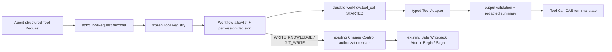

# M6-03 Tool Registry And Security：代码 Seam 研究

## 1. 研究范围与结论

本研究只扫描现有代码、迁移、API、测试和 M5/M6 文档，不修改业务代码。当前任务
`prd.md` 仍为 `TBD`，状态仍是 `planning`，因此本文件只能为后续 `prd.md/design.md/implement.md`
提供事实和建议，不能替代正式验收标准。

结论：仓库当前不存在 `internal/tools`、Tool Registry、Tool Call 领域模型或 Tool Call 持久表；
M6-03 应新增独立 Tools 深模块和 `workflow.tool_call` 前向迁移，但必须复用 M5-03/M5-04
已经完成的审批写授权与 Safe Writeback Saga，不能再创建第二套授权表、授权状态机、文件写入或 Git
执行路径。模型侧继续只输出项目自有的结构化 Tool Request；不能把 OpenAI `tool_calls` 当作权限事实或
直接执行入口。

推荐主数据流：



## 2. 当前实现事实

### 2.1 Tools 模块与 Tool Call 持久化均缺失

- 目标目录已在规范中预留为 `internal/tools/`，职责是 Tool Registry、授权、执行和审计，见
  `.trellis/spec/backend/directory-structure.md:33-36`；实际 `internal/` 目录没有 `tools`。
- 架构把 Tools 定义为独立深模块，对外只有 `Register/Authorize/Execute`，隐藏 Schema、权限、超时和审计，
  见 `docs/architecture/module-architecture.md:265-278`。
- 数据库设计把 `tool_call` 放在 Workflow 事实域，并要求至少保存 node、tool、permission、请求/响应摘要、
  幂等键与状态，见 `docs/architecture/database-design.md:461-470`；当前迁移只到
  `00018_agent_runtime.sql`，没有 `tool_call` 表。
- `internal/platform/observability` 已预留 `tool_call_id` correlation，并自动进入日志和 Trace，见
  `internal/platform/observability/correlation.go:10-25`、`:87-108` 与
  `internal/platform/observability/tracing.go:271-297`，可直接复用，不应在 Tools 内再建一套 Context key。
- 当前不存在 `internal/audit` 或 append-only Audit 表；M10-01 才负责完整 Audit。M6-03 仍需保存 Tool Call
  业务事实和受限摘要，但不应伪装成完整 M10 Audit 已完成。

### 2.2 Workflow Registry 是可复用模式，但运行时权限上下文尚不完整

- Workflow 已有冻结式 Registry：`ExecutorRegistry` 按 `kind + input_schema_version` 注册并冻结，支持
  API 只登记 contract、Worker 登记真实 executor，见
  `internal/workflow/application/executor_registry.go:95-114`、`:117-155`、`:171-217`。
- `DefinitionRegistry.Freeze` 已校验 Schema、`required_permissions` 与 Executor contract，见
  `internal/workflow/application/definition_registry.go:86-105`。Tools Registry 应复用“注册 → 完整校验 → 冻结 →
  解析时深拷贝/只读”的工程模式，但不要让 Tools 与 Workflow 共享可变 map 或复制同一个 registry 实例。
- Workflow 的权限枚举与 Node 声明位于
  `internal/workflow/domain/definition.go:5-15`、`:24-33`。当前 Node 只有
  `RequiredPermissions`，没有产品要求的 `allowed_tools`；因此“有 READ_EXTERNAL”仍不能证明本 Node 可以调用
  任意 READ_EXTERNAL 工具。
- Workflow Start 会把 canonical graph 持久化，但首个 Node Run 只保存 kind/schema/input，不保存 permission
  快照，见 `internal/workflow/application/start_runtime.go:209-238`。
- River Worker Claim 后只按 `node_type + input_schema_version` 解析 Executor，并传入 Workspace/Run/Node/Attempt、
  kind/schema/input；`ExecutionContext` 没有 Definition ID/version、Node key、required permissions 或 allowed tools，
  见 `internal/workflow/adapter/river/runtime_worker.go:97-133` 与
  `internal/workflow/application/executor_registry.go:16-26`。
- 因此 M6-03 不能信任 Tool Request 自带 permission/workflow 信息，也不能只凭 Executor kind 推断权限。必须
  从服务端持久 Workflow Definition/Run/Node 获取允许工具和权限，或在 Claim 后传入由数据库事实构造的不可变
  Tool Execution Policy。

### 2.3 Agent 当前没有 Tool Request Schema，并主动拒绝 Provider 原生 Tool Call

- 产品文档要求 Agent 只输出 `tool_name/arguments/reason`，Registry 负责 allowlist、Schema、权限、执行和审计，
  见 `docs/architecture/agent-rag-architecture.md:264-278`。
- 当前 Agent 四类 v1 输出模型只包含 Relation/RAG/Refusal/Faithfulness 字段；仓库中没有 `ToolRequest` 或
  `tool_requests` 类型。唯一文档声明在 `docs/product/PRD.md:3101-3112`。
- `ChatRequest` 当前只有 messages、output schema 和 token 上限，没有 Provider tool definition，见
  `internal/agent/application/chat.go:53-63`。
- OpenAI-Compatible Adapter 使用 `response_format=json_schema`，并在响应出现任何 Provider `tool_calls` 时直接
  判为非法，见 `internal/platform/models/chat_openai.go:52-84`、`:105-125`、`:128-149`。
- 该行为应保留：M6-03 的 Tool Request 应作为项目自有严格 JSON 输出类型进入 Tools Application，不能直接启用
  Provider 原生 Tool Call 后绕过 Model Run、Schema Repair、Workflow 权限与 Tool Call 持久化。
- M6-02 的四类 v1 Schema 已冻结且严格拒绝未知字段。不要直接给现有 v1 payload 增加可选
  `tool_requests`；应新增独立、版本化 Tool Request Schema/Result Type，或显式发布受影响 Schema v2。

### 2.4 Composition Root 已具备“API contract / Worker implementation”分离模式

- API 进程在 Chat enabled 时只登记 Agent Executor contract 和 Definition，不构造模型 executor，见
  `cmd/api/main.go:270-304`、`:311-335`。
- Worker 构造真实 Safe Writeback/Agent Executor，再冻结 Executor/Definition Registry，见
  `cmd/worker/main.go:315-359`。
- M6-03 应采用同一模式：API 仅需要冻结 Tool Definition contract 以验证可启动 Workflow；Worker 才注入真实
  Tool Adapter 和 Tool Call Repository。Tool capability disabled 时不得注册可执行 Definition，也不得放置 Fake
  生产 fallback。
- 当前 HTTP Router 仅挂载 Workspace、Workflow、Change Control、Ingestion、Retrieval，见
  `internal/app/router.go:34-49`、`:81-103`；OpenAPI 也没有直接 Tool Execute endpoint。M6-03 不应新增模型或用户
  可直接调用的通用 `/tools/{name}:execute`，否则会在 M10 Auth/CSRF/Capability 落地前扩大越权面。

## 3. M5-03 / M5-04 必须复用的安全事实源

### 3.1 M5-03 ToolAuthorization 已完整实现，禁止重造

- `changecontrol.domain.ToolAuthorization` 已拥有 Workspace/Run/Node/Proposal/Revision/Approval、Tool、Capability、
  Scope、Change Hash、Target Version、token hash、幂等和生命周期，见
  `internal/changecontrol/domain/authorization.go:17-51`。
- `AuthorizationRepository` 已定义 workflow context 校验、签发、查询、消费和撤销，见
  `internal/changecontrol/domain/authorization.go:92-99`。
- `ValidateAuthorizationConsumeBinding` 已比较所有不可变绑定；`ValidateToolBinding` 已把
  `WRITE_KNOWLEDGE -> ApplyApprovedPatch`、`GIT_WRITE -> CreateGitCommit` 固定，见
  `internal/changecontrol/domain/authorization.go:101-147`。
- Application 在签发前复核 Proposal/Approval/Change Hash/Target/Workflow，且 Credential 只首次返回并立即清除
  token hash，见 `internal/changecontrol/application/service.go:337-402`；消费路径再次完成完整绑定和当前事实校验，
  见 `internal/changecontrol/application/service.go:405-453`。
- 数据库表、5 分钟 TTL、唯一幂等/token hash、状态约束、不可变字段和 Workflow/Approval 触发器已经存在，见
  `migrations/00008_write_authorization.sql:1-36`、`:38-98`、`:100-157`。

M6-03 禁止：

1. 新建 `tools.tool_authorization`、`workflow.tool_authorization` 或第二套 token/TTL/status。
2. 让 Tool Request 携带 Credential、Capability、Proposal/Approval、Target Version 或服务端身份。
3. 把普通 Workflow permission 当成 Approval Write Authorization。
4. 在 Tools Application 复制 Proposal/Approval/Change Hash/Target Version 校验规则。

正确 seam：Tools Application 对普通 permission/allowlist 做服务端判定；写工具进入
Change Control 公开端口，由 Change Control 继续拥有一次性授权的签发/消费和稳定错误码。

### 3.2 M5-04 Safe Writeback 是唯一写副作用路径，禁止绕过

- Safe Writeback Definition 已声明 `WRITE_KNOWLEDGE + GIT_WRITE`，见
  `internal/changecontrol/workflow/contract.go:46-61`。
- Bootstrap Executor 只在可信 Workflow 执行上下文中签发两份瞬时授权，然后调用 Atomic Begin；Credential 在
  Begin 后立即清空，见 `internal/changecontrol/workflow/bootstrap.go:62-145`、`:148-165`。
- Atomic Begin 在同一 PostgreSQL 事务内锁定/校验两份授权、校验 running lease 并消费，见
  `internal/changecontrol/adapter/postgres/repository_writeback.go:263-355`。
- `writeback_execution` 触发器再次证明两份授权、审批、Workflow 和目标绑定，见
  `migrations/00009_safe_writeback.sql:147-183`、`:185-259`。
- Git 执行已有固定 executable、参数数组、环境清理、超时取消和输出上限，见
  `internal/platform/gitcli/runner.go:14-88`、`:91-114`；正式 Commit 还经过 Diff、raw blob、immutable tree 与
  `update-ref expected-old`，入口见 `internal/platform/gitcli/writeback_commit.go:17-80`。

M6-03 禁止：

1. 为 `ApplyApprovedPatch` 新建直接 localfs executor。
2. 为 `CreateGitCommit` 新建接受模型 Git args/commit message 的 executor。
3. 把两份授权拆成两个独立、可任意排序的模型副作用调用。
4. 让 Tool Registry 先消费授权、再调用现有 Safe Writeback；这会破坏 Atomic Begin 的事务不变量。

建议：这两个工具在 Registry 中标记为 `trusted_workflow_only/approval_bound`，不进入模型可请求目录；若 M6-03
需要为现有写回补 Tool Call 可追踪性，只增加幂等 Tool Call 记录/关联层，真实执行仍委托现有
`changecontrolworkflow.BootstrapExecutor` / `WritebackService`，且不能改变双授权 Atomic Begin 顺序。

## 4. 单一事实源风险与文档冲突

### 4.1 Permission 枚举存在冲突

- 当前代码/产品 PRD 使用 `ADMIN_MAINTENANCE`，见
  `internal/workflow/domain/definition.go:8-15` 与 `docs/product/PRD.md:2547-2555`。
- `tool-security.md` 与父任务设计使用更细的 `INDEX_MAINTENANCE`、`EVALUATION_RUN`，见
  `docs/architecture/tool-security.md:33-44` 与
  `.trellis/tasks/07-16-product-delivery/design.md:173-180`。

为避免未经批准的破坏性权限拆分，M6-03 v1 建议以产品 PRD和现有公共代码的
`ADMIN_MAINTENANCE` 为兼容基线；若正式 PRD 决定拆分权限，必须版本化 Workflow Definition、更新所有
Composition allowlist/测试/文档，不能同时保留两套字符串并让不同模块各自解释。

### 4.2 普通 Tool Permission 与 Approval Write Authorization 不是同一概念

- Workflow Permission 表示 Node 是否可请求一类能力。
- Change Control `Capability` 表示一份审批绑定的一次性写授权，只允许两类，见
  `internal/changecontrol/domain/authorization.go:27-33`、`:122-147`。

字符串相同不代表语义相同。Tools Domain 可以拥有普通 `Permission` 的唯一枚举，并让
`workflow.domain.Permission` 以 type alias/const alias 保持源码兼容；Change Control 继续保留更窄的授权类型和
显式映射，避免 Tools 与 Change Control 形成循环依赖或把 READ 权限误当作可签发 token 的 Capability。

### 4.3 Registry、Schema 和 Decoder 不能各自成为第二事实源

- Agent RuntimeCatalog 已采用“JSON Schema 文档 + strict decoder”的模式，见
  `internal/agent/application/catalog.go:41-58`、`:246-269`。
- 当前通用代码只验证 Schema 文档本身是有界 JSON，并不提供任意实例的通用 JSON Schema validator。

Tools Definition 必须让一个版本同时拥有：公开 JSON Schema、唯一 strict decoder/validator 和输出 sanitizer；
测试要证明它们一致。不能在 Tool Registry、Adapter 和 Workflow Node 三处各写一次参数字段/默认值。

### 4.4 Tool Definition allowlist 与 Workflow allowlist 是两个不同维度

- Registry allowlist 回答“这个服务版本是否存在该工具”。
- Workflow Node `allowed_tools` 回答“当前 Definition/Node 是否允许调用它”。
- Permission 回答“该工具要求的能力是否被当前 Node 声明”。
- Approval Authorization 回答“当前批准写入是否有一次性副作用授权”。

四者必须全部通过，不能互相替代。当前 Workflow Node 缺 `allowed_tools`，需在新 Definition 版本中新增；空集合
应表示禁止所有模型 Tool Request，不能解释为允许全部。

## 5. 建议新增的 Domain / Application / Adapter

### 5.1 `internal/tools/domain`

建议拥有以下稳定类型，不依赖 Workflow、Change Control、HTTP、pgx、模型或文件系统：

```go
type Permission string
type SideEffectLevel string
type InvocationPolicy string // model_requestable | trusted_workflow_only
type ToolRef struct { Name string; Version int64 }

type Definition struct {
    Ref ToolRef
    Description string
    InputSchema, OutputSchema json.RawMessage
    Permission Permission
    SideEffectLevel SideEffectLevel
    Timeout time.Duration
    RetryPolicy RetryPolicy
    IdempotencyPolicy IdempotencyPolicy
    SensitiveFields []string
    InvocationPolicy InvocationPolicy
}

type Request struct {
    ToolName string          `json:"tool_name"`
    Arguments json.RawMessage `json:"arguments"`
    Reason string            `json:"reason"`
}

type Call struct {
    ID, WorkspaceID, WorkflowRunID, NodeRunID, NodeAttemptID foundation.ID
    Tool ToolRef
    Permission Permission
    Status CallStatus
    IdempotencyKey, RequestHash, ResultHash, ErrorCode string
    RequestSummary, ResultSummary string
    Version int64
    StartedAt time.Time
    CompletedAt *time.Time
}
```

约束：

- Request 只允许 `tool_name/arguments/reason`，严格拒绝 permission、workspace、run/node、timeout、endpoint、
  credential、approval 和命令参数字段。
- `arguments` 必须是单个 JSON object，拒绝 duplicate key、未知字段、尾随值、过深/过大对象。
- Call 保存 hash、计数和脱敏摘要，不保存原始参数、网页正文、Source、Credential、绝对路径、Authorization、
  raw output 或命令 stderr。
- 有副作用调用必须先持久化 STARTED；超时/结果不明为 UNKNOWN，不得标记 FAILED 后自动重试。

### 5.2 `internal/tools/application`

建议拆为三个小 seam：

1. `Registry`
   - `RegisterDefinition`、`RegisterContract`、`RegisterExecutor`、`Freeze`、`Resolve`。
   - API 可只登记 contract；Worker 登记 executor；重复/未知 schema/未冻结解析 fail closed。
   - 定义 key 使用 `name + version`，执行 key同样带 version，避免“latest”漂移。

2. `ExecutionService`
   - 输入必须是可信 `ExecutionContext` + 结构化 `Request`，而不是只传 Request。
   - 固定顺序：解析 request → Registry resolve → Workflow policy → permission → input decoder → Start/Replay
     Tool Call → deadline → typed executor → output validator/sanitizer → CAS finalize。
   - 任一校验失败都不调用 Adapter；未注册工具、prompt injection 伪造 permission、跨 Workspace/Run/Node、过期
     lease 均 fail closed。

3. Ports

```go
type WorkflowPolicyReader interface {
    ResolveToolPolicy(ctx context.Context, identity WorkflowExecutionIdentity) (ToolPolicy, error)
}

type CallRepository interface {
    StartCall(context.Context, domain.Call) (domain.Call, bool, error)
    FinalizeCall(context.Context, FinalizeCall) (domain.Call, bool, error)
    MarkUnknown(context.Context, MarkUnknownCall) (domain.Call, bool, error)
}

type Executor interface {
    Execute(context.Context, ExecutionRequest) (ExecutionResult, error)
}
```

`WorkflowPolicyReader` 从服务端 Definition/Run/Node/Attempt 和有效 lease 读取允许工具与权限；不能由 Agent 或 API
构造。`CallRepository` 拥有并发、幂等、状态 CAS 与 response-loss replay；Executor 只实现具体工具，不写 Call 状态。

### 5.3 `internal/tools/adapter/postgres`

- 读写 `workflow.tool_call`；沿用项目 pgx + 显式列 + 参数化 SQL。
- Start 在一个事务中验证 Run/Node/Attempt 同 Workspace、Attempt running、lease 未过期、Definition/Node binding，
  并插入或精确重放幂等记录。
- Finalize 只允许 STARTED → SUCCEEDED/FAILED/UNKNOWN，使用 version CAS；terminal 同绑定重放返回既有结果，
  不同 hash/identity 返回冲突。
- 不查询或修改 `change_control.tool_authorization` 的业务状态；写工具授权仍通过 Change Control 端口和 Atomic
  Begin。Tool Call 可保存 `authorization_ref` 或 `side_effect_ref` 作为可选引用，但不能复制授权字段。

### 5.4 具体 Adapter 复用边界

| 工具 | 应复用的现有 seam | 禁止方式 | M6-03 建议 |
|---|---|---|---|
| SearchKnowledge | `retrieval/application.SearchService.Search`（`internal/retrieval/application/search.go:66-87`） | Tools 直接查 Retrieval SQL | typed read adapter，固定 Workspace/limit/filter 上限 |
| ReadSource / ReadDocument | `EvidenceReferenceService`/不可变 Artifact reader（`internal/retrieval/application/evidence_reference.go:70-140`） | 接受模型绝对/相对路径并读工作树 | 只接受稳定 SourceVersion/Span ID |
| ValidateCitation | Agent/ Retrieval 批量 Citation opener（M6-02） | 逐条 DB/Artifact N+1 | 复用 batch seam，最多 500 |
| FetchWebPage | 当前无正式 Adapter | 复用 Chat/Embedding client 或普通 redirect client | 新建专用 SSRF-safe Adapter；默认 capability disabled |
| CalculateDiff | Change Control 领域纯函数/批准内容 | 调 Git 任意 diff args | 纯函数 typed adapter，不执行 shell |
| ReadGitStatus | 现有 Git inspector（`internal/platform/gitcli/writeback_inspect.go:69-92`） | 暴露 `git` args/目录 | 只传 Workspace ID，返回受限摘要 |
| ApplyApprovedPatch / CreateGitCommit | M5-03/04 Bootstrap + Atomic Begin + Saga | 新 localfs/Git executor 或分步消费授权 | `trusted_workflow_only` 元数据/记录层，实际执行保持 M5 seam |
| RebuildIndex | Retrieval 的版本化 Reindex/Workflow seam | 直接改 Active Index 或任意 SQL | 仅提交受控 Workflow/Outbox，不同步执行 |
| RunRegressionEvaluation | Retrieval Regression Service（`internal/retrieval/application/regression.go:19-51`） | 任意命令名/脚本路径 | typed、版本化、受 `ADMIN_MAINTENANCE` 限制 |

第一期不应为了“注册完整工具名”创建空 executor。没有真实 Adapter/权限闭环的工具可以只保留在文档计划，不能在
生产 Registry 声明为 available。

### 5.5 `internal/tools/adapter/webfetch`

当前没有可复用的通用网页抓取 Adapter；模型 HTTP Adapter 只校验配置 endpoint，不满足用户 URL 逐跳 SSRF。
专用 Adapter 至少需要：

- 仅 `http/https`，禁止 userinfo、fragment、非标准不透明 URL；域名/IP 长度有界。
- 自有 `net.Resolver`/DialContext seam：DNS 结果全部检查，拒绝 unspecified、loopback、private、link-local、
  multicast、CGNAT、documentation/benchmark 和云 metadata；实际连接必须钉住所验证地址，防 DNS rebinding。
- redirect policy 每一跳重新解析、解析 DNS、校验目标，并限制次数；禁止自动携带 Authorization/Cookie。
- timeout、最大响应字节、允许 Content-Type、UTF-8/HTML 清理和 URL/抓取时间/content hash 输出。
- output 作为 untrusted data，不拼成 System Message；日志/Tool Call 只保留 canonical URL 摘要/hash，不保存正文。

测试必须使用注入 Resolver/Dialer 和本地 `httptest`，覆盖 redirect 到 loopback/private/metadata、DNS rebinding、
IPv4/IPv6、超大 body、压缩炸弹、错误 Content-Type、timeout/cancel 和 response loss。

## 6. 公共接口与兼容性影响

### 6.1 Workflow Domain / Registry

建议新增 `NodeDefinition.AllowedTools []toolsdomain.ToolRef`（或稳定 name/version 引用），并在 canonicalization 时排序、
去重、验证。`omitempty` + 空集合必须保持现有 Definition graph hash 不变；只有真正启用 Tool 的新 Definition 才发布
新版本。

`DefinitionRegistry` 需要注入只读 Tool Contract Catalog，并在 Freeze 时验证：

- allowed tool 精确版本已注册；
- tool required permission 属于 Node RequiredPermissions；
- `trusted_workflow_only` 不能出现在 model-requestable Node；
- capability disabled 时对应 Definition 不注册。

现有 `SafeWritebackDefinitionVersion=1` 不应为了 M6-03 改图或重算
`safeWritebackGraphHash`（`internal/changecontrol/workflow/contract.go:18-35`）。

### 6.2 Workflow Runtime ExecutionContext

至少补充由 Claim 事实产生的 `DefinitionID`、`NodeKey`；Tool Application 再通过 `WorkflowPolicyReader` 加载 canonical
policy。不要把未经数据库复核的 `[]Permission/[]AllowedTool` 作为 executor 可自由修改的 slice 直接相信。

如果选择把完整 policy snapshot 放进 `ExecutionContext`，则必须：

- Runtime Claim 在同一数据库事务内从 `run.definition_id + node.node_key` 解析；
- 返回深拷贝/不可变值；
- Executor 不能扩大权限；
- 测试覆盖 Definition/Node drift、跨 Run/Workspace、过期 Attempt 和旧 delivery。

### 6.3 Agent Domain / Runtime Catalog

- 新增独立 `ToolRequest` 输出 Schema/Result Type 与 strict decoder，不破坏 M6-02 v1。
- 工具目录只由服务端选择并放入受信 Prompt/Schema；Source/用户文本中的工具名、permission 和 reason 都是数据。
- `ModelRun/ModelCall` 继续只记录模型调用；Tool Call 是独立事实源，通过 Node Attempt 关联，不能把 Tool Call
  压入 Model Call raw response 或 Node output。
- Provider 原生 `tool_calls` 继续拒绝；若未来启用，必须先做新的 Adapter contract/Schema 版本和同等安全门禁。

### 6.4 Change Control

只新增最小公开端口适配（如需要）：

- 查询已存在 Safe Writeback Execution 的 exact binding；
- 由 trusted workflow 调用现有 Bootstrap/Begin；
- 返回 durable side-effect reference 供 Tool Call 关联。

不得改变 `ToolAuthorization` 表、Credential 生命周期、`ValidateToolBinding` 或 Atomic Begin 锁/消费顺序。

### 6.5 API / OpenAPI

- M6-03 不新增通用执行 API。
- 如果本期需要“Tool Call 可审计”查询，可只扩展 Workflow detail 的只读子资源/投影，并且响应只含稳定 ID、tool、
  permission、status、摘要、时间、error code、side-effect ref；不返回 arguments/raw output/Credential/URL 正文。
- M10 Auth 未落地前，不能把 Workspace 隔离或 loopback 网络当作用户身份/Capability 已完成。

## 7. 建议迁移 `00019_tool_registry_security.sql`

Tool Definition 建议继续采用代码内版本化冻结 Registry；每条 Tool Call 保存 definition version/hash，以便历史可追踪。
除非正式设计明确需要运行时动态注册，不建议本期新增可变 `tool_definition` 表。

`workflow.tool_call` 建议字段：

- identity：`id, workspace_id, workflow_run_id, node_run_id, node_attempt_id`。
- definition：`tool_name, tool_version, tool_definition_hash, permission, side_effect_level`。
- idempotency：`idempotency_key, request_hash, request_bytes`。
- result：`response_hash nullable, response_bytes, request_summary, response_summary, error_code`。
- lifecycle：`status, started_at, completed_at, version`。
- optional refs：`authorization_id nullable` 或稳定 `side_effect_type/side_effect_id`，只存引用，不复制授权正文。

约束/索引：

- FK 同 Workspace 交叉绑定 Run/Node/Attempt；Node Attempt 必须属于 Node。
- `UNIQUE(workspace_id,idempotency_key)`；需要额外唯一约束保证一个 Node Attempt 内逻辑 call_no 或 request identity。
- identity/definition/request hash/started_at immutable；version 必须 `old+1`。
- status 插入只能 STARTED；只允许 `STARTED -> SUCCEEDED|FAILED|UNKNOWN`。
- terminal timestamp/hash/bytes/error code 一致；UNKNOWN 不能声称有已验证 output。
- 拒绝 DELETE；Down 在存在 Tool Call 数据时使用 SQLSTATE `55000` guarded fail，遵循 00017/00018 模式。
- 索引至少覆盖 `(workflow_run_id,node_run_id,started_at,id)`、`(workspace_id,status,started_at,id)` 和
  optional side-effect ref。

是否持久化“权限/Schema 阶段就被拒绝”的 request，需要正式设计冻结：推荐写受限 `rejected` 安全事实或 M10 Audit
事件，但不能保存任意工具名/arguments 原文。若 `tool_call` 生命周期只表示已授权执行，则 Registry rejection 至少通过
脱敏安全日志/Trace 记录，并明确不宣称完整 Audit。

## 8. 建议实施依赖顺序

1. **冻结 PRD/设计**：解决 Permission 枚举冲突、首期真实工具集合、Tool Call rejected/unknown 语义、是否提供只读
   Workflow Tool Call API；不得在 `TBD` 验收下直接编码。
2. **Tools Domain**：Permission/ToolRef/Definition/Request/Call/状态机、严格边界、稳定错误码与单测。
3. **Tool Registry**：contract/implementation 分离、冻结、definition hash、Schema/decoder 一致性、duplicate/unknown/frozen
   测试。
4. **Workflow contract 扩展**：`AllowedTools`、Definition Freeze 交叉校验、Execution identity/policy reader；保证现有
   Definition v1 hash 不漂移。
5. **00019 + PostgreSQL Adapter**：Tool Call START/replay/finalize/unknown、同 Workspace/FK/lease/CAS、迁移
   Up/重复 Up/guarded Down/response-loss/race 测试。
6. **ExecutionService**：固定安全流水线、deadline、output sanitizer、correlation；permission matrix、prompt injection、
   unknown tool、schema fuzz、duplicate side effect 测试。
7. **只读真实工具 Adapter**：优先 SearchKnowledge、ReadSource/ValidateCitation，全部复用现有 Application seam；没有
   真实 seam 的工具不注册。
8. **WebFetch Adapter**：默认关闭，逐跳 SSRF/DNS rebinding/redirect/size/content-type/HTML 安全 contract。
9. **M5 集成**：只增加 Tool Call 可追踪包装/引用（如正式 PRD要求），复用 Bootstrap + Atomic Begin；跑现有
   M5-03/M5-04 fault/race/PG/Git/FS 全套回归，证明无第二次授权消费或副作用。
10. **Agent Tool Request**：独立 versioned schema/prompt/decoder，保持 Provider tool_calls rejected；模型伪造权限、
    credential、endpoint、绝对路径均被 strict decoder/Registry 拒绝。
11. **Composition/API/docs**：API contract/Worker executor 分离、capability disabled fail closed；按决定添加只读投影，
    更新 OpenAPI、tool-security、interfaces/database/testing 文档。
12. **全量门禁**：`go test -race ./...`、`go vet ./...`、真实 PostgreSQL、Workflow/River fault、SSRF/command
    injection、M5 writeback smoke、OpenAPI drift、Docker Compose、go-review/sql-code-review/独立审查。

## 9. 测试锚点

### Domain / Registry

- duplicate name/version、冻结后注册、未冻结解析、unknown schema/permission/executor。
- Tool Request duplicate key、unknown field、null/非 object arguments、深度/字段/数组/字符串/总字节越界。
- Tool Definition input/output schema 与 decoder drift；sensitive field summary 不泄漏 canary。
- `allowed_tools` 空集合禁止全部，permission 有但 tool 未 allow 仍拒绝，tool allow 但 permission 缺失仍拒绝。

### PostgreSQL / Workflow

- Run/Node/Attempt/Workspace 交叉错绑、Attempt 非 running、lease 过期、旧 delivery、Definition/Node drift。
- 同绑定并发 start 只有一个 Tool Call；同 key 不同 request hash 冲突；terminal response-loss 精确 replay。
- STARTED crash → UNKNOWN；UNKNOWN side effect 不自动再次执行。
- Tool Call 迁移空库/重复 Up/Down→Up 与有数据 guarded Down。

### Security

- Prompt Injection 伪造 tool、permission、approval、credential、endpoint、timeout、idempotency key。
- 未注册/未 allow/permission 缺失/Chat disabled/WebFetch disabled。
- Path traversal、symlink、NUL、绝对路径只通过稳定 ID adapter，复用现有 Workspace/Artifact 安全边界。
- SSRF：loopback/private/link-local/metadata/IPv6/redirect/DNS rebinding/credential URL/oversize/compression。
- Command injection：工具参数不能决定 executable/subcommand/working directory/env；Git 回归证明仍使用现有固定 runner。
- Tool output 作为 untrusted data；HTML 清理、secret redaction、超大输出失败或受控截断，不能进入 System Message。

### M5 不回归

- M5-03 authorization 签发/过期/撤销/并发一次性消费全部保留。
- Safe Writeback 两份授权仍在同一 Atomic Begin 事务消费；Tool Call 包装失败不能导致已消费一份授权。
- response loss/duplicate delivery/lease reclaim 不重复文件写、Commit、Mapping、Reindex Outbox 或 Tool Call terminal
  结果。
- 模型/API/日志/Trace/Tool Call 表均不含 Credential、token hash、正文、绝对路径或 Git stderr。

## 10. 可直接写入 design.md 的关键决策

1. Tools 是独立深模块；`workflow.tool_call` 是工具执行事实源，日志/Trace 不是事实源。
2. 模型只产生项目自有结构化 Tool Request；Provider `tool_calls` 继续 fail closed。
3. Tool 执行资格必须同时满足：Frozen Registry 存在、Workflow Node allowlist、Node permission、输入 Schema/业务
   校验；写工具还必须满足既有 Change Control Approval Write Authorization。
4. M5-03 `change_control.tool_authorization` 和 M5-04 Safe Writeback Atomic Begin/Saga 是唯一写授权与副作用 seam；
   M6-03 只编排/记录，不复制或绕过。
5. Tool Call 在 Adapter 前持久化 STARTED；成功/失败/未知使用 CAS 归约，有副作用的 UNKNOWN 不自动重试。
6. Tool Call 只保存 version/hash/bytes/脱敏摘要和稳定引用，不保存 raw args/output、Credential、正文、URL 内容、
   绝对路径或命令 stderr。
7. 首期只注册有真实 Adapter 和完整安全闭环的工具；不存在的能力明确 unavailable，禁止 Fake/空成功。
8. 不新增通用 Tool Execute HTTP API；只读 Workflow Tool Call 投影是否本期提供由 PRD明确。

## 11. 当前必须在 PRD/设计中明确的事项

- 首期真实工具集合：建议 P0 为 SearchKnowledge、ReadSource/ValidateCitation 与 Tool Call 基础设施；WebFetch 为
  capability 默认关闭但具备真实安全 Adapter；写工具只做现有 M5 seam 的受信集成，不接受模型直接执行。
- 权限名采用现有 `ADMIN_MAINTENANCE`，还是版本化拆为 `INDEX_MAINTENANCE/EVALUATION_RUN`。
- `workflow.tool_call` 是否保存 rejected 请求；若保存，必须定义无已注册 Definition 时的受限 name/hash 规则。
- Tool Call 和 M5 两份 write authorization 的关联形状（一行一个逻辑工具，或只关联 durable writeback
  execution）；不能以此改变 Atomic Begin。
- M6-03 是否提供只读 Tool Call API，或留给 M6-04 Workflow/会话时间线统一暴露。
