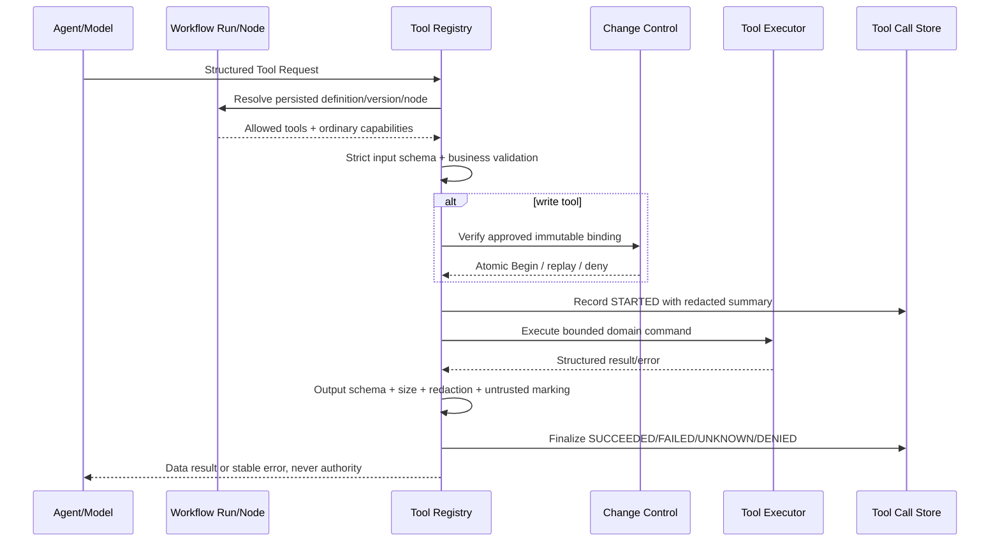

# M6-03 产品与安全契约研究

> 研究范围：M6-03 Tool Registry、Schema、Capability、SSRF、命令与输出安全。本文只收敛产品与安全契约，不修改业务代码，也不提前实现 M6-04 或 M10。

## 1. 事实优先级与结论

本子任务沿用父任务事实优先级：父任务 `prd.md/design.md/implement.md` 高于正式 PRD，正式 PRD高于其他架构文档，已接受 ADR 约束不可绕过（`.trellis/tasks/07-16-product-delivery/prd.md:9-20`）。

M6-03 的产品目标不是提供一个“模型可任意调用函数”的通用框架，而是建立唯一、服务端拥有、可冻结、可审计的 Tool 执行边界：Agent 只能提出结构化 Tool Request；Workflow Definition 决定当前 Run/Node 可见的工具与普通 Capability；Tool Registry 重新验证定义、Schema、业务约束、权限、一次性写授权、超时、幂等和输出安全后，才可调用具体 Adapter。模型、Source、网页和 Tool Output 都不能成为授权事实源（`docs/product/PRD.md:2515-2591`、`docs/architecture/tool-security.md:3-17`、`docs/architecture/agent-rag-architecture.md:264-278`）。

产品价值是同时满足三件事：

1. 用户可让 Agent 使用检索、证据、网页、Git/索引等外部能力，但权限仍由用户批准和服务端 Workflow 控制。
2. Prompt Injection、越权参数、重复请求、依赖失败或恶意 Tool Output 不会变成文件、Git、网络或模型上下文副作用。
3. 每次尝试都能用稳定 ID、版本、权限、结果和错误追踪，同时不记录 Secret、正文、绝对路径或未脱敏原始响应。

## 2. 权威需求事实

### 2.1 产品不变量

- Agent 可以读取、检索、分析和生成 Proposal，但不能直接创建、覆盖、移动或删除正式知识；Approval 是一次性写权限的前置条件（`docs/product/PRD.md:271-275`）。
- 所有正式知识写入必须经过 Proposal → Evidence Validation → Approval → Version Check → Atomic Begin → 文件/Git 持久检查点 → Reindex/Regression；任何模块不得绕过（`docs/product/PRD.md:277-283`）。
- Agent 不直接访问文件系统、数据库和 Git，只能生成结构化结果或调用授权工具（`docs/product/PRD.md:4180-4183`；`docs/architecture/adr/0008-proposal-approval-write-seam.md:5-12`）。
- Workflow、Prompt 和 Structured Output Schema 必须稳定版本化，运行中的任务继续使用启动版本（`docs/architecture/adr/0012-version-workflows-prompts-schemas.md:5-12`）。Tool 的输入/输出 JSON 同样受 `schema_version` 总规则约束（`docs/product/PRD.md:3489-3496`）。
- Eino/LangChain 等框架不得拥有 Tool Permission、Workflow 持久状态或 Write Authorization；当前主模块明确不采用 Eino（`docs/architecture/adr/0013-eino-adoption-gate.md:9-23`、`docs/architecture/adr/0007-no-langchain-core-dependency.md:5-12`）。

### 2.2 Tool 定义与执行

Tool Definition 至少包含 name、description、input/output schema、permissions、side-effect level、timeout、retry/idempotency policy、sensitive fields 与 allowed workflows（`docs/architecture/tool-security.md:19-31`）。PRD 还要求 Tool Call 具备工具名、Schema、权限、超时、副作用、幂等和日志脱敏规则（`docs/product/PRD.md:2535-2545`）。

调用顺序必须是：注册表查找 → 输入 Schema → 业务校验 → Workflow/Capability/Approval 授权 → 幂等判定 → Executor/Adapter → 输出边界 → Tool Call 持久记录。参数校验失败不得执行工具，模型不能调用未注册或当前 Workflow 未允许的工具（`docs/product/PRD.md:2556-2562`、`docs/architecture/tool-security.md:119-129`）。

### 2.3 写权限

身份/普通 Capability 与 Approval Write Authorization 是两层不同授权。登录或高 Scope API Token 仍不能直接获得 Apply Knowledge/Git Write；一次性写授权必须绑定 Workspace、Workflow Run、Node、Proposal、Revision、Approval、Approved Change Hash、Target Version、Expiry 与工具/作用域（`docs/architecture/security.md:76-95`、`docs/architecture/tool-security.md:45-76`、`docs/architecture/adr/0014-single-user-authentication.md:9-18`）。

M5 已实现两份独立写授权和 Atomic Begin：`WRITE_KNOWLEDGE` 与 `GIT_WRITE` 必须在同一 PostgreSQL 事务中校验/消费，再进入 Durable Safe Writeback；授权消费不等于副作用完成（`docs/architecture/tool-security.md:68-74`）。M6-03 不得另建一条可由模型分别执行文件和 Git 的写路径。

### 2.4 Prompt Injection、网络与输出

- System Policy、Source 和 Tool Result 必须分角色；Source/网页/Tool Result 均为 untrusted data，权限只由服务端 Workflow 决定（`docs/product/PRD.md:3746-3752`、`docs/architecture/tool-security.md:119-141`）。
- FetchWebPage 默认关闭；只允许 HTTP/HTTPS；必须阻止 loopback、private、link-local、multicast 和云 metadata，逐跳校验 DNS/IP/redirect，限制时间、重定向、类型和大小（`docs/product/PRD.md:2564-2570`、`docs/architecture/tool-security.md:171-178`、`docs/architecture/security.md:131-136`）。
- Tool Output 必须通过输出 Schema、限制大小、脱敏 Secret、清理 HTML，并且不能直接成为下一条 System Message（`docs/architecture/tool-security.md:180-186`）。
- 命令执行只能使用固定可执行文件、参数数组、固定工作目录和有界输出；不存在任意 shell 工具。Git 继续使用已冻结的命令白名单和参数边界（`docs/architecture/tool-security.md:151-169`）。

### 2.5 审计与失败语义

每次 Tool Call 至少记录 Workflow/Node、Tool、权限、参数摘要、目标、幂等键、开始/结束、耗时、结果/错误；不得保存完整 API Key、Authorization 或不必要全文（`docs/product/PRD.md:2572-2584`、`docs/architecture/tool-security.md:204-223`）。失败必须使用稳定错误类别，不能以 HTTP/Node 成功掩盖业务失败（`docs/product/PRD.md:2650-2661`、`docs/product/PRD.md:3502-3509`）。

## 3. 用户与系统角色

| 角色 | 可以做什么 | 明确不能做什么 | 事实依据 |
|---|---|---|---|
| 个人用户 / Approver | 选择是否允许网页；审阅 Proposal、Diff、证据和影响；批准/拒绝；查看 Tool 时间线 | 不能用普通登录状态绕过 Proposal/Approval；不能把客户端 expected HEAD 或授权字段写进服务端事实 | `docs/product/PRD.md:1364-1418`, `docs/architecture/adr/0014-single-user-authentication.md:16-18` |
| Web/API 调用者 | 在通过身份与普通 Capability 后发起 Workflow/命令 | 不能直接调用内部写工具或签发 Write Authorization | `docs/architecture/tool-security.md:45-53`, `docs/architecture/security.md:89-95` |
| Workflow Definition / Node | 服务端声明当前节点允许的 Tool、普通 Capability、Schema、超时、重试与幂等策略 | 运行时不能由模型文本扩大 Tool/Capability；旧 Run 不切换到新定义 | `docs/product/PRD.md:2450-2470`, `docs/architecture/adr/0012-version-workflows-prompts-schemas.md:5-12` |
| Agent / Model | 看到当前节点允许的 Tool Definition；只提出结构化 Tool Request 和 reason | 不能直接执行、授权、自我批准、构造 Credential、绝对路径、Git 参数或未注册工具 | `docs/product/PRD.md:3080-3123`, `docs/architecture/agent-rag-architecture.md:264-278` |
| Tool Registry | 解析冻结 Tool Definition；验证 Run/Node、Tool allowlist、Schema、业务规则、Capability、写授权、幂等、timeout 与输出；写 Tool Call 事实 | 不能信任模型自报的 Workspace/Identity/Permission；不能静默 fallback | `docs/architecture/tool-security.md:7-17`, `docs/architecture/interfaces-and-adapters.md:286-303` |
| Tool Executor / Adapter | 只执行已通过 Registry 的有界领域命令，并返回结构化结果或稳定错误 | 不能自行扩大权限、拼 shell、读取任意路径或绕过 Registry 产生第二写入 seam | `docs/architecture/interfaces-and-adapters.md:7-14`, `docs/architecture/tool-security.md:143-169` |
| Change Control | 拥有 Proposal/Approval/Write Authorization 和 Safe Writeback 事实；原子消费双写授权 | 不把 Credential 暴露给模型、API 查询、日志或可恢复存储 | `docs/architecture/database-design.md:759-772`, `docs/architecture/tool-security.md:66-76` |
| Source / 网页 / Tool Output | 仅作为不可信数据进入解析、模型或后续 Tool | 不能改变 System Policy、Tool allowlist、Capability、Workspace 或 Approval | `docs/product/PRD.md:2560-2562`, `docs/architecture/security.md:123-129` |

## 4. Capability 与核心 Tool 矩阵

以下矩阵只使用文档明确列出的 11 个核心 Tool（`docs/product/PRD.md:2521-2533`）。`无外部能力` 不是新增 Capability 枚举，只表示纯函数执行不需要访问 Workspace、网络或副作用系统。

| Tool | 最小普通 Capability | 副作用 | 附加门禁 | 模型可见性 |
|---|---|---:|---|---|
| SearchKnowledge | `READ_LOCAL` | 否 | Workspace + frozen Index/Scope；有界查询和 Evidence 输出 | 仅当前 Workflow/Node allowlist |
| ReadSource | `READ_LOCAL` | 否 | Stable ID；Workspace/Source Version/Artifact 完整绑定；禁止任意路径 | 仅当前 Workflow/Node allowlist |
| ReadDocument | `READ_LOCAL` | 否 | Stable ID；只读批准知识或显式允许的范围 | 仅当前 Workflow/Node allowlist |
| FetchWebPage | `READ_EXTERNAL` | 外部读取 | 默认关闭；任务/Workspace 显式策略；完整 SSRF 门禁 | 只有策略开启且 Adapter 可用时可见 |
| ValidateCitation | `READ_LOCAL` | 否 | 复用完整 Citation tuple、Workspace/Index 和不可变 Artifact 校验 | 可作为确定性 Validation Tool；不得以模型判断替代 |
| CalculateDiff | 无外部能力 | 否 | 纯函数；仅接受上游已授权且有界内容；输出 Schema/大小限制 | 可见时仍受 Workflow allowlist |
| ReadGitStatus | `READ_LOCAL` | 否 | 服务端 Workspace ID；固定 Git Inspector；不接受任意 repo/path/args | 仅受控 Workflow |
| ApplyApprovedPatch | `WRITE_KNOWLEDGE` | 是 | 一次性 Approval Write Authorization + Target CAS；必须属于 Atomic Safe Writeback | **不向普通 Agent 暴露独立执行** |
| CreateGitCommit | `GIT_WRITE` | 是 | 一次性 Approval Write Authorization + approved HEAD/immutable tree/ref CAS；与 Patch 双授权原子 Begin | **不向普通 Agent 暴露独立执行** |
| RebuildIndex | `INDEX_MAINTENANCE` | 是 | 明确 Workspace、范围、Index Version、幂等键；不得激活未通过回归版本 | 仅维护 Workflow |
| RunRegressionEvaluation | `EVALUATION_RUN` | 有持久结果 | 固定数据集/版本/范围、幂等键；不能借评测触发知识写入 | 仅评测/验证 Workflow |

`WRITE_PROPOSAL` 是文档定义的普通 Capability，但 11 个核心 Tool 中没有明确的 `CreateProposal` Tool；本期不得凭经验新增工具名。Proposal 继续由现有 Application/Agent structured action 进入唯一 Change Control seam，除非后续 PRD/设计显式增加该 Tool。

### 4.1 普通 Capability 与一次性写授权

| 普通 Capability | 仅凭 Workflow/身份上下文可执行 | 是否还要一次性 Approval 授权 |
|---|---|---:|
| `READ_LOCAL` | 读取当前 Workspace 的受控对象 | 否 |
| `READ_EXTERNAL` | 在显式 web policy 下抓取公开 HTTP/HTTPS | 否 |
| `WRITE_PROPOSAL` | 创建候选或进入 Proposal Application seam | 否，但不能产生正式知识副作用 |
| `WRITE_KNOWLEDGE` | 只能发起受控写回检查 | **是** |
| `GIT_WRITE` | 只能发起受控 Git 写检查 | **是** |
| `INDEX_MAINTENANCE` | 构建/切换受控 Index Version | 否；仍要求维护 Workflow/版本/幂等 |
| `EVALUATION_RUN` | 运行版本化评测 | 否；不得扩大到知识写入 |

## 5. 核心业务流程

任何在 Registry 之前失败的外部调用尝试也需要留下安全阻断记录；但持久记录只能保存稳定 ID、版本、Hash、计数和脱敏摘要，不能为了“可审计”复制完整请求/正文/响应。

## 6. In Scope

1. 新建项目自有 `internal/tools` Domain/Application 边界，包含不可变、版本化 Tool Definition、严格 Tool Request/Result、Registry、Executor Port、Policy Decision 与 Tool Call Repository Port。
2. Composition Root 注册并冻结 Tool Definition；API 可共享 definition contract，只有 Worker 注册真实 Executor，延续现有 Workflow Executor contract/implementation 分离模式。
3. Workflow Definition/Node 与 Tool Definition 形成服务端双向约束：调用必须同时满足“Node 允许 Tool”和“Tool 允许该 Workflow/Node”；Run 使用启动时的精确版本。
4. 覆盖 11 个 PRD 核心 Tool 的真实 Definition；已有 Retrieval、Evidence、Git、Writeback、Reindex/Evaluation 能力通过 Adapter 复用，禁止复制业务规则或直接查业务表。
5. 提供真实 FetchWebPage Adapter 与默认关闭策略，完成逐跳 SSRF、DNS rebinding、redirect、timeout、content type/size、HTML 清理和输出 provenance。
6. 对命令类 Adapter 执行固定 executable/参数数组/工作目录/输出预算；不提供 shell、任意命令名、任意 Git 参数或任意路径工具。
7. 输入/输出 strict JSON Schema、业务校验、请求/响应字节预算、取消/timeout、显式 retry classification、幂等/replay/unknown result 语义。
8. 复用 M5 `tool_authorization` 和 Atomic Safe Writeback；写 Tool 不可作为两个可独立由模型执行的副作用入口。
9. 持久化 Tool Call 执行事实和安全阻断结果，提供可供 M10 append-only Audit/Observability 消费的稳定摘要；本期就必须满足 Tool 调用可追踪和敏感字段不落库。
10. 权限矩阵、Prompt Injection、Schema fuzz、SSRF、redirect/DNS rebinding、path/symlink、command injection、duplicate side effect、timeout/cancel、output redaction 和真实 Adapter integration 测试。

## 7. Out of Scope

- M10 的正式登录、Cookie Session、API Token、CSRF/Origin、Capability Middleware 与自托管公网交付；M6-03 只允许持久化 Workflow 内部调用，不能新增 public Tool invoke API 或 allow-all Authorizer（`docs/architecture/security.md:72-74`、`docs/architecture/interfaces-and-adapters.md:373-376`）。
- M10 的通用 append-only Audit 查询、OTel/Metrics 全链路和 UI 审计中心；但 M6-03 不能因此省略专用 Tool Call 持久事实和脱敏。
- M6-04 Conversation、RAG HTTP API、SSE 流式回答、反馈和前端交互。
- 多用户/RBAC、Agent Swarm、Agent 自主创建 Agent、拖拽工作流、自定义插件市场和第三方连接器（`docs/product/PRD.md:4661-4678`）。
- 任意 shell/脚本执行、任意 Git remote/push/fetch/history rewrite、任意文件路径读取或写入。
- 私网、loopback、link-local 或 metadata 的 SSRF allowlist 绕过。M6-03 的可选 hostname allowlist只能进一步收窄公开目标；若未来确需私网连接器，必须另立需求和威胁模型。
- 新增未被 PRD 命名的 `CreateProposal` Tool；不改变 Proposal/Approval 的唯一写入 seam。
- 把 Deterministic Fake、空响应、静默降级或“未配置即成功”作为生产能力。

## 8. 文档与当前实现冲突

| 编号 | 冲突/缺口 | 证据 | 本任务采用的解决方向 |
|---|---|---|---|
| C-01 | 维护权限名不一致：PRD/现代码是 `ADMIN_MAINTENANCE`，父设计与 Tool Security 是 `INDEX_MAINTENANCE`；现代码没有 `EVALUATION_RUN` | `docs/product/PRD.md:2547-2554`; `.trellis/tasks/07-16-product-delivery/design.md:173-181`; `docs/architecture/tool-security.md:33-44`; `internal/workflow/domain/definition.go:8-15` | 以父设计为高优先级，冻结 `INDEX_MAINTENANCE` 与 `EVALUATION_RUN`；实施时同步 PRD/Workflow Catalog/测试，不能同时保留两个同义维护权限 |
| C-02 | PRD 有 11 个核心 Tool，Tool Security“核心工具”只展开 7 个 | `docs/product/PRD.md:2521-2533`; `docs/architecture/tool-security.md:78-118` | 11 个名称是产品范围；Tool Security 未展开的 ValidateCitation、ReadGitStatus、RunRegressionEvaluation 仍需 Definition/Adapter/测试，不另增工具 |
| C-03 | PRD Agent 通用输出声明 `tool_requests`，M6-02 四类结构化输出没有 ToolRequest；当前 OpenAI Adapter明确拒绝原生 `tool_calls` | `docs/product/PRD.md:3101-3112`; `internal/agent/domain/output.go:15-36`; `internal/platform/models/chat_openai.go:105-125` | 增加项目自有、版本化、严格 Tool Request 契约或专用 Schema；不直接信任 Provider raw tool call，也不静默改变已有 v1 Schema |
| C-04 | 文档要求调用前身份/Capability，但正式 Auth 被安排到 M10 | `docs/architecture/tool-security.md:45-53`; `.trellis/tasks/07-16-product-delivery/implement.md:63-64`; `docs/architecture/security.md:72-74` | M6-03 仅开放服务端持久 Workflow/Node 调用并保留 verified identity/capability port；public API、自托管和身份类 AC 留 M10，M6-03 不宣称完成完整认证 |
| C-05 | PRD 把 ApplyApprovedPatch/CreateGitCommit 列为独立 Tool；现有安全闭环要求双授权 Atomic Begin 后执行组合 Safe Writeback | `docs/product/PRD.md:2528-2532`; `docs/product/PRD.md:1426-1436`; `docs/architecture/tool-security.md:68-74` | 保留两个逻辑 Tool/审计身份，但禁止普通 Agent 独立执行；只允许批准后的 Safe Writeback Workflow 原子消费双授权并执行/重放 |
| C-06 | “所有 Tool Call 可审计”属于 M6-03，但通用 append-only Audit 排到 M10 | `docs/product/PRD.md:2572-2591`; `.trellis/tasks/07-16-product-delivery/implement.md:63-64` | M6-03 落地专用 Tool Call 持久事实和 audit sink；M10 扩展登录/设置/全局查询与 OTel，不得把 M6-03 的执行审计推迟为空壳 |
| C-07 | PRD 文义允许“可信列表”例外访问内网；Security/Tool Security 要求阻止私网/回环/metadata | `docs/product/PRD.md:2564-2570`; `docs/architecture/security.md:131-136`; `docs/architecture/tool-security.md:171-178` | 本期 allowlist 只能收窄公开 hostname，不能绕过地址类别阻断；私网例外不进入 M6-03 |
| C-08 | Tool Definition 要求 allowed_workflows，PRD 要求当前 Workflow allowlist；当前 Node 只声明 `RequiredPermissions`，没有 Tool allowlist | `docs/architecture/tool-security.md:19-31`; `docs/product/PRD.md:2556-2559`; `internal/workflow/domain/definition.go:24-33` | 设计中新增版本化 Workflow/Node Tool allowlist 或等价服务端绑定，并在 Registry 同时校验 Tool→Workflow 与 Node→Tool |
| C-09 | `WRITE_PROPOSAL` 是 Capability，但核心 Tool 没有 Proposal 创建工具 | `docs/product/PRD.md:2547-2554`; `docs/product/PRD.md:2521-2533` | 保留 Capability 供 Workflow/Application seam 使用，不凭经验新增工具名；Proposal 仍走现有 Change Control Application |
| C-10 | 当前仓库没有 `internal/tools`、通用 Tool Definition/Registry/Tool Call 表或 FetchWeb Adapter；已有能力分散在 Workflow、Change Control、Retrieval 与 Observability | `internal/workflow/application/executor_registry.go:100-216`; `migrations/00008_write_authorization.sql:1-35`; `internal/platform/observability/redaction.go:14-23` | 新模块只编排和集中策略，复用现有深模块 Port；禁止复制 Retrieval SQL、Writeback 状态机、Git 安全或日志脱敏规则 |

## 9. 可执行 Acceptance Criteria

以下 AC 应写入本任务 `prd.md/implement.md` 并由代码、数据库、测试和运行证据共同关闭。

### Registry 与契约

- [ ] AC-T01：Tool Registry 对 Tool name + version 唯一注册；重复、空/非法字段、未知 Schema/Capability/Workflow、冻结后注册均返回稳定错误，且 Registry 未冻结时不可执行。
- [ ] AC-T02：每个 Tool Definition 包含 input/output Schema、普通 Capability、side-effect level、timeout、retry/idempotency policy、sensitive fields 与 allowed workflow/node binding；Run 记录精确版本，旧 Run 不漂移到新定义。
- [ ] AC-T03：项目自有 Tool Request 使用 strict JSON：拒绝 invalid UTF-8、duplicate key、unknown field、trailing value、错误类型/枚举、超长 name/reason、无界 arguments 和缺失 schema version；Provider raw `tool_calls` 不能直接进入 Executor。
- [ ] AC-T04：Composition Root 在 Chat/Web/Tool capability disabled 时不注册虚假 Tool/Executor；模型可见列表不包含不可用工具，直接解析返回稳定 capability unavailable。

### 权限与写安全

- [ ] AC-T05：表 4 的每个核心 Tool 通过 permission matrix；缺少 Workflow/Node allowlist、普通 Capability、Workspace/Run/Node 绑定或 Tool→Workflow 绑定时，在任何 Adapter 调用前 fail closed。
- [ ] AC-T06：模型参数中的 Workspace、Identity、Capability、allowed tools、Approval、Credential、Target Version 或 timeout 不能覆盖服务端持久事实；Prompt Injection corpus 对“忽略规则/读 Secret/访问 Workspace 外/自动批准/调用未注册工具”全部拒绝并记录安全阻断。
- [ ] AC-T07：ApplyApprovedPatch/CreateGitCommit 不可由普通 Agent 分别执行；只有 approved Proposal 的 Safe Writeback Workflow 能在现有 Atomic Begin 中原子校验/消费双授权。过期、撤销、错误 Credential、Change Hash/Target/Run/Node/Scope 漂移均零副作用。
- [ ] AC-T08：读取工具只接受 Stable Object ID；路径穿越、NUL、absolute path、父链/目标 symlink、跨 Workspace 或对象绑定损坏统一拒绝，不泄漏其他 Workspace 元数据。

### SSRF、命令和输出

- [ ] AC-T09：FetchWebPage 默认关闭；只有持久化任务/Workspace web policy 与 `READ_EXTERNAL` 同时允许才执行。只接受 HTTP/HTTPS，缺少策略时不得网络出站。
- [ ] AC-T10：SSRF 测试覆盖 loopback、private、link-local、multicast、云 metadata、DNS 多地址与 rebinding；每次 redirect 重新解析/校验，并把连接限定在已验证地址。hostname allowlist不能放行被阻断地址类别。
- [ ] AC-T11：Web Fetch 有 redirect、timeout、响应字节、Content-Type 和 HTML 清理上限；输出包含 URL/抓取时间/内容 Hash 的产品 provenance，但日志/Tool Call summary 对 Secret query/header 脱敏。
- [ ] AC-T12：命令路径不存在 shell 拼接；可执行文件、工作目录和参数形状固定，用户/模型输入不能成为命令名、Git option 或任意 pathspec。command injection、超时和 stdout/stderr 超限测试均在副作用前失败。
- [ ] AC-T13：所有 Tool 输出先通过 output Schema、业务规则和字节预算；Secret、Authorization、Credential、绝对路径、完整正文和 raw response 不进入返回摘要、日志、Trace 或数据库。Web/Source/Tool Output 进入模型时仍标记 untrusted data，不可成为 System Message。

### 幂等、故障与审计

- [ ] AC-T14：所有副作用 Tool 要求有界 idempotency key；相同 key + 相同 canonical request 返回既有结果，不重复副作用；相同 key + 不同 request hash 返回冲突；结果未知进入 `UNKNOWN`/`MANUAL_RECOVERY_REQUIRED`，不得盲目重试。
- [ ] AC-T15：Read/Search/Web 可按 Tool Definition 的 retry policy 由 Workflow 重试；Registry/Adapter 不进行隐藏重试或 Provider/Tool fallback。timeout、caller cancel、transient/non-transient 错误分类通过 contract test。
- [ ] AC-T16：每次请求尝试持久化 Tool Call：Workspace、Workflow/Node/Attempt、Tool name/version、permission、request hash + redacted summary、target summary、idempotency key、started/ended/duration、status、result hash + redacted summary、error code；拒绝/失败/未知同样可查询。不得持久化 Credential、完整 Authorization、Prompt、Source、Evidence、绝对路径或 raw body。
- [ ] AC-T17：Tool Call 状态与幂等结果使用数据库唯一性/CAS 防止双成功；真实 PostgreSQL并发测试证明重复消息、Worker crash/reclaim 和响应丢失不会产生两次外部副作用或两条互相矛盾终态。

### 集成与质量门禁

- [ ] AC-T18：11 个核心 Tool 均有 Definition contract test；有正式 Adapter 的 Tool 运行同一 Fake/real adapter contract。生产不允许 Fake、空成功或静默降级。
- [ ] AC-T19：至少一条真实 Workflow integration 证明“Agent Tool Request → Registry → Search/Read Tool → Tool Call persistence → untrusted result”；一条真实批准 Safe Writeback integration 证明逻辑写 Tool audit 与现有 Atomic Begin/幂等恢复保持一致。
- [ ] AC-T20：执行并通过 `go test -race ./internal/tools/... ./internal/workflow/... ./internal/changecontrol/... ./internal/platform/...`、真实 PostgreSQL integration、SSRF/command security suite、`go vet ./...`、`go mod tidy -diff`、`git diff --check`、Docker/Worker readiness smoke；主 Agent 执行 Go/SQL/通用 Review，并由独立只读 Agent 审查权限、数据库、并发和安全边界。
- [ ] AC-T21：同步 `docs/product/PRD.md` 的 Capability 命名、`docs/architecture/tool-security.md`、`security.md`、`interfaces-and-adapters.md`、`agent-rag-architecture.md`、数据库/API/测试文档与 Trellis spec；不得把 M10 Auth 或 M6-04 RAG API 标记为本期已完成。

## 10. 当前代码可复用事实与实现影响

- 当前没有 `internal/tools` 目录，也没有通用 Tool Definition/Registry/Tool Call migration；`change_control.tool_authorization` 只覆盖两类一次性写授权（`migrations/00008_write_authorization.sql:1-35`）。
- Workflow 已有可冻结的 Definition/Executor Registry、Schema/Permission allowlist 和 API contract/Worker executor 分离，可复用其 immutable registry 模式，但 Tool Registry 应是独立深模块，不能把 Tool 定义塞进 Node Executor Registry（`internal/workflow/application/executor_registry.go:48-114`, `internal/workflow/application/executor_registry.go:117-216`）。
- 当前 Workflow Permission 包含 `ADMIN_MAINTENANCE`，需在 M6-03 统一到父设计的 `INDEX_MAINTENANCE` 并补 `EVALUATION_RUN`（`internal/workflow/domain/definition.go:5-15`）。
- M5 Write Authorization 已在 Domain 和数据库同时限制 Tool/Capability、TTL、Approval/Workflow/Target 绑定；M6-03 必须调用该事实源而不是复制判断（`internal/changecontrol/domain/authorization.go:27-50`, `internal/changecontrol/domain/authorization.go:101-167`; `migrations/00008_write_authorization.sql:38-95`）。
- M6-02 已把任务输入标记为 untrusted data，并对模型原生 `tool_calls` fail closed；M6-03 应在此基础上增加项目自有 Tool Request，而不是放松当前 Chat response validator（`internal/agent/application/runner.go:211-229`; `internal/platform/models/chat_openai.go:105-125`）。
- 已有 observability fail-closed redaction 可复用，但 Tool Definition 的 `sensitive_fields` 仍需做结构化字段级投影；不能仅依赖日志正则清洗（`internal/platform/observability/redaction.go:14-23`, `internal/platform/observability/redaction.go:87-194`）。

## 11. 需要主任务在设计阶段冻结的决策

这些问题不需要用户扩范围确认，但必须由 M6-03 `design.md` 给出唯一实现契约后再写业务代码：

1. Tool Definition/Tool Call 的数据库 Schema、状态机、唯一键和版本字段；要与 Workflow Attempt、Change Control Authorization 保持单一事实源。
2. Tool Request 是独立专用 Agent Schema，还是在需要 Tool 的任务 Schema 中以版本升级加入；不得修改已有 v1 历史语义。
3. Workflow/Node Tool allowlist 的具体字段与版本绑定方式；必须同时支持 API contract registry 与 Worker executor registry。
4. ApplyApprovedPatch/CreateGitCommit 的“逻辑 Tool Call 审计”如何映射到现有组合 Safe Writeback execution，不能拆开 Atomic Begin。
5. FetchWebPage 的持久 web policy 来源，以及 Fetch 结果进入 Source Version 还是仅作为一次性 Evidence；必须服从 M6-04 RAG 和现有 Source 不可变契约，不能在 M6-03 猜第二套内容事实源。
