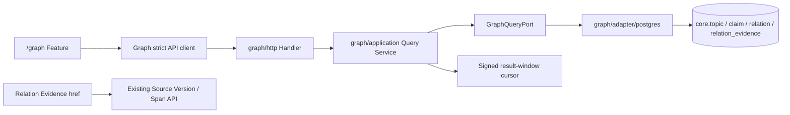

# M7-01 Graph Projection And Queries Design

## Decision Summary

1. 新建 `internal/graph` 只读深模块；Knowledge 继续唯一拥有 Topic/Claim/Relation 写模型。
2. v1 先使用 PostgreSQL canonical facts 的 direct query projection，不新增 Graph 表或双写。仅以 EXPLAIN/压测证据触发可重建 projection。
3. Global 与 depth-1 pagination 使用“规范请求 + 有界结果 fingerprint + HMAC offset cursor”，结果变化显式 stale；depth 2/3 是单次有界快照。
4. Neighborhood 使用双向参数化 adjacency SQL；depth 2/3 按完整 frontier 分层批量展开，最多三次固定查询。这样可以在进入下一层前可靠执行 node/edge/frontier 硬预算，避免 recursive CTE 先生成不完整层或无界中间结果。Path 使用应用层批量双向 BFS，并在只读 repeatable-read 快照中批量展开 frontier，禁止逐节点 N+1。
5. Graph edge 只带 Evidence summary/href；Relation Evidence 独立分页延迟加载。
6. 前端先交付 bounded SVG/CSS + 列表 fallback，不为尚未证明的容量需要提前引入图可视化依赖。

## Module Boundary

依赖方向：Graph Application 依赖自己的 read port 和 Knowledge 的公开 enum/value vocabulary；PostgreSQL Adapter 读取 Knowledge 表但不调用 Knowledge 内部 Repository；HTTP 不直接访问数据库。

## Domain Read Models

- `NodeRef{Type,ID}`：复用 `knowledge/domain.NodeRef`。
- `GraphNode` 是以 `type` 判别的 union：Topic 节点返回 name/description/topic_status/version；Claim 节点返回 statement（响应按 UTF-8 边界截断到 512 bytes 的 display summary）、claim_status/confidence/applicability/version。不同类型字段不得以含糊 nullable bag 表达。
- `GraphEdge`：relation_id、source/target、type、status、traversal_direction、confidence、version、evidence_count、evidence_fingerprint、evidence_href。
- `GraphPageMeta`：snapshot/result fingerprint、next_cursor、complete、truncated、reason、counts。
- `GlobalCluster`：Topic node + direct claim count + incident confirmed relation count + cluster score + updated_at。
- `Neighborhood`：center、nodes、edges、layer_counts、completed_depth、meta。
- `PathResult`：`found|not_found`、nodes、edges、hop_count、explored_nodes；timeout/budget 使用 Problem，不返回 partial path。
- `RelationDetail` 只含 Relation 本体字段与 Evidence summary；`RelationEvidencePage` 的每项拥有 reason、applicability、provenance、confirmation 和 source/span href。

Application 必须验证：Workspace 一致、NodeRef 合法、edge closure、唯一 node/edge、稳定顺序、depth/limit/budget、path continuity、Adapter 返回上限。

## Query Algorithms

### Global

直接按 Active Topic 聚合：`direct_claim_count` 是通过 Confirmed BELONGS_TO 直接归属且状态为 Confirmed/Disputed 的 distinct Claim 数；`incident_relation_count` 是 Topic 本身或这些成员 Claim 参与的 distinct Confirmed Relation 数，跨 cluster Relation 对每个涉及 cluster 各计一次但在同一 cluster 内不重复。`claim_min_confidence` 只保留非 null 且达标的成员 Claim，`relation_min_confidence` 只保留非 null 且达标的 incident Relation，所有 count/score 都在过滤后重算。`cluster_score = direct_claim_count + incident_relation_count`。先对规范过滤生成最多固定窗口（初始 500 cluster）的稳定有序结果，再计算 fingerprint；cursor 绑定 fingerprint 和 offset。若窗口超限返回 truncated，要求过滤/搜索，而非继续全量扫描。

排序冻结为 `(cluster_score DESC, cluster_updated_at DESC, topic_id ASC)`；`cluster_updated_at` 为 Topic、成员 Claim 和计入 Relation 的最大 updated_at。任何影响结果或排序的数据变化使 cursor stale，前端从第一页恢复。

### Neighborhood

- depth=1：source/target 两侧 `UNION ALL`，固定过滤并按 `(relation_type, source_type, source_id, target_type, target_id, relation_id)` 排序，生成有界结果窗口/cursor。
- depth=2/3：每层把完整 frontier 作为 typed ID 数组一次展开，最多执行三次固定 adjacency 查询并维护 visited NodeRef；只有完整层进入响应。请求显式携带 `max_frontier`（1..500），任一下一层超过 node、edge 或 frontier budget 时整层丢弃并返回上一 completed depth + `NODE_BUDGET|EDGE_BUDGET|FRONTIER_BUDGET`。该方案替代无法在递归中安全停止不完整层的无界 recursive CTE；固定层数批查询不是逐节点 N+1。context/statement timeout返回 Problem，不伪造 partial success。
- 每次结果批量 union hydration Topic/Claim；Evidence 只 `COUNT`/fingerprint，不加载正文。

Neighborhood 过滤适用于中心节点和邻接节点。`node_types` 明确排除中心类型，或中心为 Topic 且 `topic_ids` 明确不包含中心时，请求直接非法；其余中心节点因生命周期、状态、置信度或更新时间过滤不可见时，与不存在/跨 Workspace 统一返回 Node Not Found。`topic_ids` 限制结果中的所有 Topic 节点，Claim 不直接受该字段限制。depth=1 的 `max_edges` 仍是最多 1000 的业务预算，但 application result-window 固定最多 500 条边；超过窗口返回 `RESULT_WINDOW_LIMIT`，不把 page `limit` 误作 SQL 总窗口上限。

### Path

`QueryPort.FindPath` 保持原子查询边界，PostgreSQL Adapter 在单个只读 `REPEATABLE READ` 事务中编排双向 BFS；不把 snapshot open/close 生命周期泄漏到 Application 公共接口。默认 traversal=`BOTH`，每轮把较小 frontier 作为数组参数一次展开，维护两侧完整层与每个节点的 lexicographically-minimal shortest prefix/suffix。有向 Relation 在 BOTH 下可正反探索但记录实际 traversal direction，对称 Relation 始终双向；请求可收紧为 `OUTBOUND|INBOUND`。发现 meeting 后继续到 `forward_depth + backward_depth >= best_hop`，收集所有 best-hop candidates，再按完整 `(node_type,node_id,relation_id...)` path key 选最小。达到 deadline/max depth/max visited 时返回明确 Problem。Frontier SQL 只读取轻量 Relation arc；最终选中路径后一次批量 hydrate Relation/Evidence summary，禁止逐节点或逐 Evidence 查询。

无路径时用独立、受限查询返回最多 5 个 Active Topic：Claim 的 membership 是其 Confirmed BELONGS_TO Topic 集，Topic 的 membership 是只含自身的 singleton；两端 membership 取交集。不同 Topic→Topic 固定为空，Topic→Claim 仅当 Claim 属于该 Topic 时返回它。该字段明确不是 path edge。语义相似建议不在本任务实现。

### Node Search

单独的 Workspace-scoped bounded query 搜索 Active Topic name/alias 与 Confirmed/Disputed Claim normalized statement。输入规范化后 2..256 bytes，默认 20/最大 50；排序为 exact normalized match、prefix match、node type、node id。首版不做任意 substring/semantic search，避免无索引扫描；最终 Search API 返回 discriminated GraphNode summary，供 Local/Path 选择未加载节点。

## Persistence And Indexes

先对现有 `idx_knowledge_relation_source/target` 跑真实计划；只有代表性与容量 EXPLAIN 证明退化时才设计 additive migration，具体列序以最终 SQL predicate/order 和证据为准，禁止凭设计猜 partial predicate 或 INCLUDE 列。

Evidence 分页复用 owner index，如排序需要则追加 `(workspace_id, relation_id, created_at, id)`。所有 migration 有空库/repeat Up、真实查询计划和 guarded rollback 策略。

T07 实测结论：在真实 PostgreSQL 代表夹具上，生产 `neighborhoodDepthOneSQL`、多节点 `neighborhoodFrontierSQL`、`pathFrontierSQL` 与 `relationEvidenceWindowSQL` 分别命中 `idx_knowledge_relation_source`、`idx_knowledge_relation_target`、`idx_knowledge_relation_evidence_owner`，目标 Relation/Evidence 表无顺序扫描。当前没有证据支持新增 `00024`；参数化多状态查询也不能可靠利用只针对 Confirmed 的 partial predicate，因此保留 00017 基础索引并避免写放大。Global 全 Workspace 聚合及 20k Node/100k Relation 的 5 次预热、30 次采样、p95/BUFFERS 仍由 T12 验证；若该容量证据显示退化，再按实际计划评估带 status 的非 partial 复合索引。

## Cursor Contract

Cursor v1 属于 Application 基础契约，在 SQL 分页前实现 codec port 与测试。它是 base64url JSON + HMAC-SHA256：`version, query_kind, workspace_id, canonical_request_hash, result_fingerprint, limit, offset`，最大 2048 bytes。服务端重新计算同一有界结果；签名/绑定非法为 `GRAPH_CURSOR_INVALID`，结果 fingerprint 变化为 `GRAPH_CURSOR_STALE`。Cursor 不是授权凭据、持久 session 或无限遍历状态；HTTP 只传递 opaque string，不重新实现规则。

## HTTP And Errors

建议 endpoint：

- `POST /api/v1/graph/global`
- `POST /api/v1/graph/neighborhood`
- `POST /api/v1/graph/path`
- `GET /api/v1/graph/nodes?query=...&limit=...`
- `GET /api/v1/graph/nodes/{type}/{id}`
- `GET /api/v1/graph/relations/{id}`
- `GET /api/v1/graph/relations/{id}/evidence`

Workspace 通过既有 header/请求约定显式传入并进入 canonical hash。POST 用于复杂过滤且保持纯 Query。

稳定错误至少包括：`GRAPH_REQUEST_INVALID`、`GRAPH_CURSOR_INVALID`、`GRAPH_CURSOR_STALE`、`GRAPH_NODE_NOT_FOUND`、`GRAPH_RELATION_NOT_FOUND`、`GRAPH_QUERY_TIMEOUT`、`GRAPH_QUERY_BUDGET_EXCEEDED`、`GRAPH_DEPENDENCY_UNAVAILABLE`、`GRAPH_PROJECTION_INCONSISTENT`。

## Frontend

`web/src/api/graph.ts` 是唯一 unknown→domain decoder/client；`features/graph/query-keys.ts` 绑定 Workspace、mode、filters、center/path。Router 拥有 mode/center/filter，TanStack Query 拥有结果，局部只持选择、缩放和 fallback 状态。

首屏限定结果用 SVG/CSS 布局并提供节点搜索、图例和列表；局部节点锁定/固定坐标只保存在当前页面会话。超预算或 layout exception 切换列表。节点 shape + label，edge line style + status label。Relation drawer 首次打开才请求 Evidence。响应的 `truncated/stale/degraded` 必须可见，不能空图假成功。

## Security, Performance And Operability

- SQL 全参数化；enum 白名单；统一 Workspace Not Found。
- Handler deadline 略大于 DB `statement_timeout`；路径事务只读且每轮批量。
- 日志只记录 Workspace/Node/Relation ID、计数、耗时、错误码，不记录 Claim 正文、Evidence、绝对路径。
- Graph 依赖缺失时 route 返回 503，普通 API/readiness 不被假装 healthy。
- 监控/测试记录 query kind、nodes/edges、completed depth、explored、truncated、DB duration。

## Compatibility And Rollback

所有 API、模块、索引 additive；现有 Knowledge/Retrieval 行为不变。回滚先移除 Graph route/UI，再回退只读 adapter；索引可在确认无依赖后删除。若新增 stored projection，只能前向停用并保留事实表，不删除 Knowledge 数据。

## Resolved Documentation Gaps

- 本期正式节点只支持 Topic/Claim；最终六类节点保留 additive 扩展。
- Path 按无权、默认 BOTH、Confirmed 默认、确定性单条最短路径冻结。
- 查询发现 Missing Evidence 只报告 diagnostic，不在 Query 中写 STALE。
- Candidate overlay、Health、Timeline、布局保存均不属于 M7-01。
