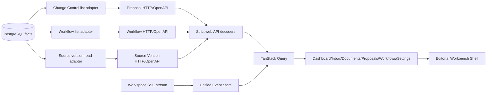

# M9 业务前端、Diff 与统一 SSE UX 技术设计

## 1. Architecture Direction

本任务采用纵向切片：领域 Owner 提供有界只读列表接口，前端 Typed Boundary 严格解码，Feature 通过 TanStack Query 消费，App Shell 只组合页面和统一 SSE Event Store。



不建立一个跨所有 Schema 的“Dashboard 事实表”或前端聚合缓存。Proposal、Workflow 由各自模块拥有；Source Version Inbox Read Model 只做查询投影，不推进领域状态。

## 2. Backend Interfaces

### 2.1 Source Version Read Model

在 Retrieval/Workspace 现有 Source Version HTTP 邻近位置增加：

```text
GET /api/v1/workspaces/{workspace_id}/source-versions
  ?status=&security_status=&cursor=&limit=
```

返回 `SourceVersionPage`：Source/Version identity、relative path、size、mime、captured_at、latest ingestion attempt、workflow binding、active-index selection。排序固定为 `captured_at DESC, id DESC`。

为保证空或稀疏 Workspace 的 keyset 查询不会扫描其他 Workspace，`core.source_version` 增加由 `core.source.workspace_id` 派生的持久 `workspace_id` 镜像键；生产写入显式携带已持久 Source 的 Workspace，兼容 trigger 只服务旧 writer，并由 Source/Content Artifact 两条复合外键验证归属。列表根索引固定为 `(workspace_id,captured_at DESC,id DESC)`，latest Attempt 使用 `(source_version_id,started_at DESC,id DESC)`。

### 2.2 Proposal List

扩展 Change Control Repository/Application/HTTP：

```text
GET /api/v1/workspaces/{workspace_id}/proposals
  ?status=&proposal_type=&risk=&cursor=&limit=
```

摘要包含 Proposal/Revision identity、status/type/target/risk、created/updated、approval/workflow binding。详情继续使用 `GET /proposals/{id}`。

`change_control.proposal.risk_level` 是唯一等级事实，创建请求必须显式携带并进入 v2 request hash；Revision `risk` 只保存面向审阅者的自由文本说明。历史 v1 只允许持久记录的精确重放，等价 v2 可以重放历史 v1，v1 不得反向重放新建 v2。Semantic Candidate Proposal 固定为 `HIGH`。

### 2.3 Workflow List

扩展 Workflow Runtime read interface：

```text
GET /api/v1/workspaces/{workspace_id}/workflows
  ?status=&cursor=&limit=
```

返回 Run identity、definition key/version、status/version、created/updated/completed、waiting-for-human 投影。节点/Tool/Token 暂无公共契约时不伪造。

### 2.4 Cursor Contract

- Cursor 是 opaque base64url JSON 文档，绑定 schema version、kind、workspace、filters、last timestamp 和 last ID。
- 解码拒绝未知字段、非法 UUID/时间/枚举、跨 Workspace/filter 复用和超长输入。
- SQL 使用 keyset predicate 与 `limit + 1`，最大 100；不返回 total，不使用 offset/page。
- Cursor 不是身份凭据；正式授权仍由 M10 提供。

## 3. Proposal Diff

### File Patch

新增受控只读 endpoint 或扩展 preflight response，返回：

- current content（仅目标 Workspace 安全路径，大小有界）
- current hash
- base hash match
- proposed content 已来自 Proposal detail

前端 route-lazy 加载 Diff Viewer。只有 `current_hash == base_hash` 时称为“基线 → Proposal”；否则称为“当前文件 → Proposal（基线已漂移）”，阻止批准并显示 NEEDS_REVISION 语义。正文不写入 Query persistence/Browser Storage。

### Knowledge Change

使用结构化 endpoint/type/relation/evidence/版本面板，不使用文本 Diff Viewer。

## 4. Frontend Module Shape

```text
web/src/
  app/
    AppShell.tsx
    navigation.ts
  shared/
    ui/                 # shadcn open-code primitives
    format/
  api/
    source-versions.ts
    proposals.ts
    workflows.ts
  events/
    event-store.tsx
    invalidation-map.ts
  features/
    dashboard/
    inbox/
    documents/
    proposals/
    workflows/
    settings/
  routes/AppRoutes.tsx
```

Routes 只做 lazy composition；Feature 不互相深层导入。共享展示模型进入 `domain-ui` 或 `shared`，wire type 停在 `api`。

## 5. UI/UX Direction

“编辑部式知识操作台”强调资料、证据、版本与异常：

- warm parchment surface + ink typography；标题使用中文友好的 serif/display stack，正文使用清晰 sans stack。
- 左侧导航像档案索引，页面头部像编辑台 folio；状态采用图标、标签、边框和文字共同表达。
- Dashboard 不做等权卡片墙：严重异常占据顶部，待办与最近活动形成主次分栏。
- Proposal Detail 是审阅台：摘要/风险在上，Diff 为主区域，证据/回滚/审批为侧栏；移动端使用 Radix Dialog/Sheet。
- reduced-motion 下关闭非必要过渡；所有交互保留 44px 触控尺寸。

## 6. shadcn-related Component Strategy

采用 shadcn 的 open-code 所有权和 Radix seam，不运行会覆盖现有 CSS 的全量 Tailwind init：

- `@radix-ui/react-dialog`, `dropdown-menu`, `tabs`, `tooltip`, `slot`
- `class-variance-authority`, `clsx`, `lucide-react`
- UI primitives 源码归项目所有，使用 CSS variables 和 variant props。

不让 Radix 类型进入 Domain UI。未来若迁移完整 shadcn/Tailwind，只替换 shared UI implementation，不改变 Feature interface。

## 7. Unified SSE Event Store

- Provider 位于 Active Workspace 与 QueryClient 之上，Workspace 切换时关闭旧连接。
- sessionStorage 仅保存 `Last-Event-ID`，key 按 Workspace；不保存事件正文或业务状态。
- 中央 invalidation map 将 resource/event type 映射到 Query Key Families。RAG 原 hook 改为消费 Provider 状态，不再创建连接。
- Cursor recovery 先执行 registry 中所有 Workspace recovery callbacks；全部成功才删除 cursor。失败保持 `recovery_failed` 并允许用户重试。
- Event Store 暴露 `connecting|open|reconnecting|recovery_failed|closed`，Shell 和页面可展示但不能据此推断业务终态。

## 8. Compatibility And Rollback

- 新 GET endpoint 为 additive；Proposal POST 路径保持不变，但创建请求有意收紧为必须显式提交 `risk_level`，旧的无等级新建请求返回 400。Proposal/Workflow detail 与 Graph/RAG 路径保持兼容。
- `00030`–`00033` 按 Expand、并发索引、精确回填和 Contract 分阶段执行；旧 Source Version writer 可在 Expand 阶段由 trigger 补齐 Workspace，新应用始终显式写入。Contract 后 `risk_level/workspace_id` 均为无默认的 `NOT NULL`，复合 FK 与不可变 trigger 阻止漂移。
- 发布回滚优先保留 additive 列、索引和约束并回退应用；存在 Proposal 等受保护业务数据时 Down 必须以 SQLSTATE `55000` 拒绝，禁止静默删列或覆盖历史。
- 前端新 Shell 必须保留现有 `/`, `/graph`, `/chat`, `/chat/:conversationId` 路由语义。
- 若 Radix 依赖造成构建/样式问题，可删除 shared UI implementation 并回退到原生语义元素；Feature props 不变。

## 9. Security And Performance

- Source content endpoint 通过现有 Workspace safe reader，限制正文大小，不返回绝对 root、managed locator 或 Secret。
- SQL 全部参数化；筛选枚举白名单；limit 有界；列表查询目标为固定查询次数，无 N+1。
- 路由 lazy split；Diff Viewer 单独 chunk；Evidence/正文按用户动作加载并在离开详情时清缓存。
- 所有写操作使用现有 Approval/Workflow seam，不新增浏览器直写或 optimistic approval。
