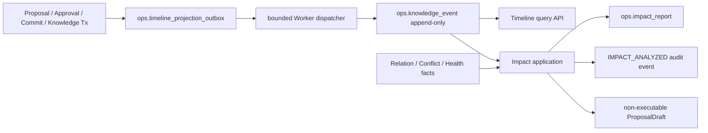

# M7-04 Knowledge Timeline 与 Impact Analysis 设计

## Decision Summary

1. Timeline 是正式领域事务的 append-only 查询投影，不是第二事实源；客户端没有 Event 写入口。
2. 领域事务只追加最小 `timeline_projection_outbox` source，Worker 以短事务投影并用 stable source binding/CAS 保证重放。
3. Impact Analysis 是只读分析命令：读取同 Workspace 下游事实、保存唯一报告、记录 Audit，绝不级联写 Knowledge。
4. 当前只交付不可执行 `ProposalDraft` 边界，不伪造已创建 Change Control Proposal；真正 Proposal 等 owner 契约成熟后 additive 接入。
5. M7 只纳入 `IMPACT_ANALYZED` Audit slice 及其直接依赖，不把 M10-01 的 OTel/Metrics/全域 Audit 宣称带入。
6. 因工作区混入多项未来开发，最终事实以隔离 Git index snapshot 为准，shared composition/OpenAPI 文件按 hunk 收敛。

## Architecture And Ownership

依赖方向固定为 HTTP -> Application -> Domain ports；PostgreSQL/Audit adapter 实现 ports。Domain/Application 不依赖 chi、pgx、Worker、Cookie、文件或 Git 类型。Worker 只调用 `TimelineProjectionPort`，不拥有 SQL 或事务。

## Timeline Domain Contract

- `KnowledgeEvent` 固定 schema `knowledge-event/v1`，身份为 UUID，包含 Workspace、Event/Aggregate 类型、可选 Aggregate ID、stable source ref/version、受限摘要/payload/correlation 和时间。
- 当前事件集合覆盖 Proposal create、Approval grant/reject、Git commit、Version publish/supersede、Relation confirm/deprecate、Conflict open/transition/resolve、Health Issue detected/resolved、Impact analyzed 和 corrective event。
- `source_event_ref` 是 Workspace 内的幂等事实身份；同 ref 内容不同是 consistency violation。
- 查询使用 `(occurred_at DESC, id DESC)` keyset；Application 对 Repository 结果再次验证 Workspace、数量、顺序和 next position。
- cursor 文档固定 schema，HMAC key 每进程生成，绑定 Workspace、canonical filter、limit 和 position；重启后旧 cursor 明确失效，不降级为 offset。

## Projection Persistence

`00037_timeline_impact_hardening.sql` 负责：

- 硬化 `ops.knowledge_event` 和 `ops.impact_report` 约束、索引和 append-only trigger。
- 建立 `ops.timeline_projection_outbox`，状态仅允许 `PENDING -> PROJECTED|POISONED`。
- 在 Proposal、Approval、Proposal Commit、Knowledge Command Receipt、Health Issue insert/resolve 与 Impact Report 事务中 enqueue stable source，并 replay-safe backfill 既有事实。
- Worker 每次 `FOR UPDATE SKIP LOCKED` 领取一行，在同一短事务校验、append/replay Event、CAS 完成；绑定漂移写 POISONED 后返回 `MANUAL_RECOVERY_REQUIRED`。
- Down 仅用于测试；存在 Event、Report 或 Outbox 时 SQLSTATE `55000` 拒绝，生产回滚使用 forward fix。

## Worker Recovery

- Composition 构造 `TimelineProjectionDispatcher` 后，Worker 启动阶段立即执行一次最多 `MaxTimelineProjectionBatch` 的 dispatch，再进入既有维护 ticker。
- 每个 ticker 继续处理一个有界 batch；不在单轮无限 drain，避免 Timeline backlog 阻止 Health/其他维护任务。
- 健康数据库与有界 backlog 下，首批在 Worker 启动阶段处理，后续批次每个维护周期推进；本任务不承诺独立 wall-clock SLA。
- startup/tick 错误写稳定 error code、processed/projected/replayed/poisoned counts，不记录 payload。POISONED 不再自动重试；M10 运维任务提供告警和修复入口。

## Impact Report And Draft Boundary

首次分析流程：

1. 按 `(workspace_id, source_event_id)` 查询既有报告；存在则校验并 replay。
2. 在相同 Workspace predicate 下读取 Event，再以一条有界 UNION 查询读取 Relation、Conflict、Health Issue。
3. 校验、稳定排序和去重对象，计算 source/version-bound fingerprint 与 summary。
4. `INSERT ... ON CONFLICT DO NOTHING` 保存唯一报告；冲突 winner 必须与候选完整相同。
5. 以 report ID 为 UUID v5 namespace、HTTP 幂等键为 name 派生 Audit Event ID并写 `IMPACT_ANALYZED`。
6. 只为明确 `requires_proposal=true` 且有 owner 的对象生成 Draft；当前 production reader 对未接 owner 的对象保持 false。

`ProposalDraft` 不是 Change Control Proposal，不携带 Approval ID、Authorization 或执行能力。实施时删除未接入生产的 `ImpactProposalPort/CreateProposal` 死 seam；未来 owner 以新 task 重新增加有持久化、HTTP/OpenAPI 和集成测试的契约。

## Audit Boundary

- `internal/audit` 提供 Event/Recorder/PostgreSQL append-only 最小模块；`internal/knowledge/adapter/audit` 只转换 Impact 摘要。
- Audit canonical JSON 在写前递归 redaction，重复 key、Secret/JWT/路径泄漏和非 canonical 数据 fail closed；持久读回发现明文 Secret 也 fail closed。
- actor 从已验证 auth Principal 解析：Session -> USER，API Token -> API_TOKEN，其他不伪装为用户。
- Timeline 与 Audit 保持不同事实：Timeline 解释业务演进，Audit 记录谁发起了分析。二者只用稳定 ID correlation，不复制载荷。

## HTTP And Security Contract

公开路径：

- `GET /api/v1/workspaces/{workspace_id}/timeline`
- `GET /api/v1/workspaces/{workspace_id}/timeline/{event_id}`
- `POST /api/v1/workspaces/{workspace_id}/timeline/{event_id}/impact-analysis`
- `GET /api/v1/workspaces/{workspace_id}/impact-reports/{report_id}`

GET 需要 `READ_LOCAL`；Impact POST 需要 `WRITE_PROPOSAL`，Session 请求还需要 Origin/CSRF。POST 只接受 `application/json` 且 body 为 `{}`；`Idempotency-Key` 必填。OpenAPI checker锁定 path、status、Problem、strict schema、cursor bounds、无 Event write 和 SystemStatus capability。

## Shared-File Isolation

以下文件同时含未来功能，不能整文件提交：`cmd/api/main.go`、`cmd/worker/main.go`、`internal/app/router*.go`、`internal/auth/http/handler*.go`、`api/openapi/*`、`Makefile`、部分 docs/system-status Web 文件。

实施使用独立临时 index 或由 `HEAD` 加白名单 patch 构造 task snapshot；禁止 `git add .`。所有测试、review 和最终 commit 针对该 snapshot，commit tree 必须与最终审核 tree 一致。工作区 Review/Export/Capacity/Trellis 改动保持未暂存。

## Compatibility And Rollback

- 迁移是 additive/forward-only；旧 API 不变，新 path 和 SystemStatus 字段 additive。
- 应用回滚可停止新 API/Worker wiring，数据库保留 Event/Report/Outbox，不执行有数据 Down。
- cursor 进程重启失效是已有安全取舍；客户端收到 invalid 后从首页重查。
- 如果 Audit 或 Timeline 依赖无法组装，对应 capability 显示 unavailable，不能以空结果伪装成功。
