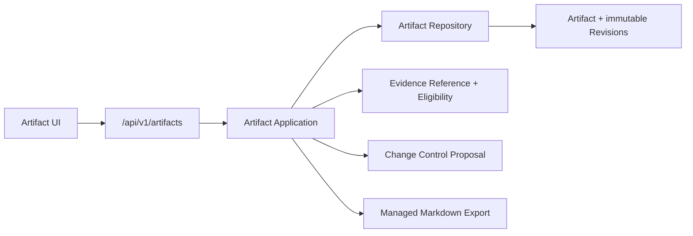

# M8-01 Artifact 产物闭环设计

## Boundary

`internal/artifact/domain` 保持 Artifact 状态机、Revision hash、Coverage/Gap 和发布边界的唯一事实源。Application 编排 ID、时间、Repository、证据校验和 Change Control Proposal；PostgreSQL 只保存领域允许的状态与不可变快照；HTTP 只严格解码、验证请求身份和映射 Problem Details。

## State And Persistence

- 新迁移扩展 `learning.artifact` 与 `learning.artifact_revision` 到领域的状态、`current_revision_id`、`source_coverage`、`content_hash`、creator 与 generation metadata；历史列仅在兼容读取需要时保留，不在 Adapter 中做隐式状态翻译。
- `learning.artifact_command` 存 Workspace + Idempotency Key + request hash + command type + authoritative response binding。相同请求精确重放，不同 payload 冲突。
- 新 Revision 插入、Artifact current pointer/coverage/status/version CAS、命令 receipt 在同一事务内完成。Repository 通过 `(id, workspace_id, version)` compare-and-swap 防止并发覆盖。
- 同一 Workspace + Idempotency Key 在事务内先取得 PostgreSQL advisory lock，再读取 receipt；并发的相同完整 binding 精确重放，不同 binding 稳定冲突。
- Revision 的 JSON 只存 canonical domain 内容；读取后重新验证 hash、current pointer、Workspace 和版本，任何不一致 fail closed。

## Evidence And Section Flow

1. `SubmitOutline` 写入新的 immutable Revision，并进入 `OUTLINE_REVIEW`。
2. `ApproveOutline` 冻结下一 Revision，进入 `GENERATING`。
3. Section command 先将请求的 Source Version/Span 批量交给 Retrieval Evidence Reference，再由 Knowledge Eligibility 校验批准知识资格；服务端重建 Citation 的 hash、excerpt 与 verified 标记。
4. 领域 `RecordSection` 生成下一 Revision。所有大纲章节齐全才进入 `DRAFT`；GAP/PARTIAL 规则由 Domain 二次强制。
5. `ApproveDraft` 只批准 Artifact Draft。导出与 Publish Proposal 不改变正式知识事实。
6. `StartRevision` 让 DRAFT/APPROVED/EXPORTED 回到 `GENERATING`；人工 GAP 或受控生成可替换已有章节，并由 `RecordSection` 冻结新的不可变 Revision。

## Publish And Export

- Markdown 导出由 Artifact 自有持久记录绑定 Artifact Revision hash、输出 hash/size/path 和时间；文件路径只能位于 Workspace managed export 目录，使用原子写入和 0600 权限。
- Publish command 在 Artifact 事务外构建不可变 `PUBLISH_ARTIFACT` payload，在同一个逻辑请求内通过 Change Control 创建 typed Proposal。Proposal 反向引用 Artifact/Revision/版本/hash；未批准 Proposal 没有 Document、Git 或 Index 副作用。
- Export/Publish 在文件系统或 Change Control 调用前，先以 `(workspace_id, artifact_id)` 持久化一条完整 binding reservation。相同 owner 可在 response loss 后恢复，不同 key、command 或普通 Artifact transition 在外部调用前返回稳定冲突。
- Artifact 状态、export/publication side fact、command receipt 与 reservation 删除必须在同一数据库事务闭合。数据库 trigger 禁止修改 reservation，也禁止在对应新版本、side fact 和 receipt 尚未持久化时提前删除。
- Change Control 执行阶段不得重新读取当前 Artifact 代替 Proposal 中冻结的 Revision；后续 Safe Writeback/Document 接入必须验证原绑定。

## Public Contract

- Query：Workspace Artifact cursor list、Artifact current state/detail、导出结果。
- Command：plan、submit/approve outline、record/revise section、approve draft、export Markdown、create publish proposal。每个 command 使用 `Idempotency-Key`，版本化命令含 `expected_version`。
- authenticated GET 需要 `READ_LOCAL`；Artifact 命令需要 `WRITE_PROPOSAL`，正式 Proposal 的 Approval 仍需要 `WRITE_KNOWLEDGE`。
- API、OpenAPI 和 TypeScript decoder 使用同一枚举/字段集合。客户端只能把当前服务端数据展示为 Artifact，不能自行解释 Citation 可信性。

## Compatibility And Rollback

- 只新增前向迁移；Down 在存在 Artifact、command receipt、generation、export/publication 或 pending reservation 数据时返回 SQLSTATE `55000`。
- 失败部署回滚到旧二进制时保留 Artifact 数据，之后使用 forward fix；不删除 Revision 或导出证据。
- 任何 Citation/Proposal/文件结果无法证明一致性时返回稳定错误并保留未完成状态，不能生成空成功或降级为非验证正文。
