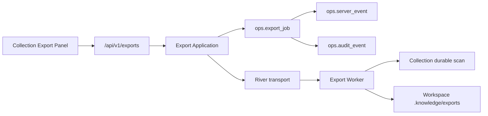

# M9-03 Smart Collection 异步导出闭环设计

## Boundary

`internal/export/domain` 拥有 Job/request/result/lifecycle 不变量；Application 编排授权、快照、prepared result、文件、审计与投递；PostgreSQL Adapter 负责同一事务内的状态 CAS、Server Event 和下载 Audit；River 只携带 `{workspace_id, export_id}`；LocalFS 只操作 Workspace 下受控导出目录。

## Durable Job And Idempotency

- 扩展尚未提交的 `00036_export_hardening.sql`，为 Job 增加 canonical `request_hash`、请求 TTL 秒数、单调 `version`、`read_model_revision`、`exact_count`、prepared timestamp、仅内部可见的 `prepared_staging_path`、清理状态/次数/错误和 `file_deleted_at`；约束字段组合、时间顺序、staging/final 路径、hash、size 和状态。
- request hash 覆盖 Workspace、Collection ID/version/query hash、kind、schema version、规范化 fields、redaction、include-sensitive、requested actor/capability 与请求 TTL。`expires_at` 只在首次插入时计算，重放不重新延长。
- `Create` 在事务中先对 `(workspace_id, idempotency_key)` 取得 advisory lock，再读取已有 Job 并比较 request hash；仅在不存在时读取并锁定当前 ACTIVE Collection 定义、校验 version/query hash 后插入。
- 同 key exact replay 返回既有 Job，即使 Collection 已归档、变化或 Job 已过期；不同 canonical request 返回 `EXPORT_IDEMPOTENCY_CONFLICT`。

## Execution And Crash Recovery

Worker 使用以下顺序，每一步都可重复：

1. `Claim` 使用 PostgreSQL 当前时间取得或接管租约并递增 attempt/version；执行 context 的 deadline 严格早于 lease expiry。
2. 若 Job 已有 prepared binding，跳过 Collection 读取，直接验证 staging/final 文件与持久化 path/hash/size。
3. 若尚未 prepared，读取固定 Collection version/query hash 的 durable scan。适配器校验每页同一 read-model revision、exact count 和 cursor binding，Application 再校验 Workspace、Collection、version、query hash、revision、count。
4. Render 产生确定性 bytes；LocalFS 先 create-only 写入受控 staging，计算 SHA-256/size。`Prepare` 只在 owner 匹配、数据库租约仍有效且任务未过期时，持久化 read-model revision、exact count、staging/final path、hash 和 size。
5. LocalFS 将已绑定 staging 原子提升为 `.knowledge/exports/<export-id>.md|json`；若 final 已存在，只接受 hash/size 完全一致。`Complete`/`Fail` 必须同时以 PostgreSQL 当前时间校验 owner、lease 与 `expires_at`；若已到期，原子归约为 `EXPIRED` 并把 staging/final 交给 cleanup，绝不写入 `SUCCEEDED`/`FAILED`。

崩溃语义：Prepare 前只可能遗留无引用 staging，由 sweep 按宽限期删除；Prepare 后 Job 已拥有不可变结果 binding，任何 owner 的恢复都不得重读 Collection；提升后 Complete 前崩溃通过 final hash/size 验证后完成。过期或租约失效的旧 owner 无权 Prepare、Complete 或 Fail。

## Lifecycle, Cleanup And Recovery

- `Get`、`List` 在返回前归约当前页已到期的活动/成功 Job；Worker 启动和固定周期执行有界 recovery + cleanup sweep。
- recovery 只重新投递 `PENDING` 和租约已过期的 `RUNNING`。DB 成功、River 失败时 Job 保持 `PENDING`，重复投递由 Claim/CAS 吸收。
- cleanup 候选是已过期且 `file_deleted_at IS NULL` 的 Job；它按持久化 prepared staging locator 与 final path 幂等删除两者，只有二者均不存在后才记录 `file_deleted_at`，失败递增次数并保存有界错误供下轮重试。
- orphan sweep 只扫描受控 `.knowledge/exports` staging 命名空间，对超过宽限期且无 Job prepared staging binding 的文件删除；有 prepared binding 的 staging 只能由所属 Job 的恢复或 cleanup 处理，绝不扫描或删除用户普通 Workspace 文件。
- Job、hash、下载统计和 Audit 不随 TTL 删除。迁移 Down 在存在不可降级的 Export 事实时以 SQLSTATE `55000` 拒绝。

## Audit And Server Events

- Export Repository 注入 `events.application.Appender`，在 Create/Claim/Prepare/Complete/Fail/Expire/Cleanup 的同一事务追加 `export.*` Server Event，`resource_ref=export_job:<id>`，`resource_version=job.version`，payload 只含状态/阶段等有界摘要。
- Server Event 的 `source_event_ref` 由 Export ID + version + transition 唯一确定，事务重试精确重放。前端增加 `export_job` resource，按 Workspace/Collection Export query key 定向失效；SSE 断线仍由 2 秒轮询兜底。
- `Download` 接收从认证上下文构造的 actor。文件验证成功后，Repository 在一个 PostgreSQL 事务中 CAS 增加 download count/time 并通过 Audit `AppendTx` 写入 `export.download`，metadata 仅含 Export ID、hash、size 和“服务端结果已准备返回”的 outcome。
- Audit 不声称客户端完整接收；响应写出失败不回滚已提交的服务端准备事实。授权拒绝继续由认证/安全审计边界记录。

## Security And File Contract

- 所有路由按 Workspace 绑定并要求当前 `READ_LOCAL`。普通 `MASKED` 导出可使用现有本地模式身份；`FULL + include_sensitive` 只接受已认证 Session/API Token actor，不能使用隐式 system/local fallback。
- 字段只能来自固定 allowlist。默认字段和前端请求为 `MASKED`；Secret 永不进入 render input，Source path 只输出安全相对表示，文本对 `= + - @` 等危险前缀执行一致的文本防护。
- LocalFS 使用 canonical Workspace root、最终 symlink 校验、固定相对路径、create-only/atomic rename 和 `0600`；API 从不返回服务器 file path。
- Download 在每次返回前重验 canonical path、symlink、hash 和 size；不一致返回 `EXPORT_RESULT_INCONSISTENT`，不增加成功统计。

## Public HTTP Contract

- `POST /api/v1/exports`：必填 `Idempotency-Key`；仅公开 `MARKDOWN|METADATA_JSON`。首次 `202`，exact replay `200`，返回 `Location` 与 `Cache-Control: no-store`。
- `GET /api/v1/exports/{export_id}?workspace_id=...`：返回严格 Job projection，不暴露 `file_path`；prepared 前 revision/count/result 字段为空，状态字段组合必须一致。
- `GET /api/v1/workspaces/{workspace_id}/exports?collection_id=...&limit=...&cursor=...`：`collection_id` 进入查询和 opaque cursor identity，按 `created_at,id` 稳定分页。
- `GET /api/v1/exports/{export_id}/download?workspace_id=...`：成功返回固定 Content-Type、Content-Disposition、Content-Length、`Cache-Control: private, no-store` 与 `X-Content-Type-Options: nosniff`；未完成 `409`、过期 `410`、不一致 `500`。
- Problem 至少固定 `EXPORT_REQUEST_INVALID`、`EXPORT_PERMISSION_DENIED`、`EXPORT_NOT_FOUND`、`EXPORT_IDEMPOTENCY_CONFLICT`、`EXPORT_RESULT_NOT_READY`、`EXPORT_EXPIRED`、`EXPORT_DEPENDENCY_UNAVAILABLE`、`EXPORT_RESULT_INCONSISTENT`。

## Frontend Contract

- `web/src/api/exports.ts` 是唯一 wire owner：严格解码 Job/Page/Problem/下载响应，校验 UUID、RFC3339、hash、枚举、重复 fields、Workspace/Collection/version/query hash 与状态字段组合。
- Query key 至少绑定 `collection-exports + workspaceId + collectionId + cursor`。Workspace 切换清除旧 Export cache；cursor 只在内存中作为 opaque token，不进入 URL/Storage。
- `CollectionExportPanel` 嵌入现有 Collection 详情，不新增路由。首版只选择 Markdown/Metadata JSON，使用安全默认字段、`MASKED`、服务端默认 24 小时，不提供敏感开关。
- 创建 mutation 把 variables 与 Idempotency-Key 作为同一重试单元；网络/响应丢失保留原 key。显式“重新创建”才生成新 key。
- `PENDING/RUNNING` 每 2 秒轮询，SSE 到达立即失效；终态停止。`SUCCEEDED` 通过 `authFetch` 下载 Blob 并刷新统计；`FAILED/EXPIRED` 提供新建入口，历史 `CANCELLED` fixture 只验证兼容展示且不提供取消操作；ARCHIVED Collection 禁用创建并说明原因。

## Compatibility And Rollback

- 只做前向 schema 扩展，不改已提交迁移历史。旧二进制无法表达 prepared/cleanup/event 合同，部署回滚保留数据并采用 forward fix，不删除 Job/Audit。
- UI 与 API 新增能力不改变现有 Collection URL、查询结果和三种视图；Artifact Export 路由/schema 保持独立。
- 任一 Snapshot、DB、River、文件或 Audit 绑定无法证明一致时 fail closed；禁止空成功、静默 fallback 或重新生成已 prepared 的内容。
