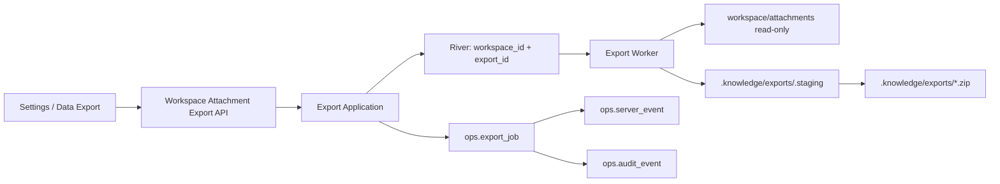

# M9 Export 附件与 AC-33 收口设计

## 1. Boundary And Sequence

本任务复用 M9-03 的 PostgreSQL Job、River 投递、prepared result、LocalFS、下载 Audit 与 SSE 生命周期，但附件来源和公开入口保持 Workspace-scoped。实施必须先恢复现有 Collection Export 安全基线，再扩展 tagged scope；任何附件代码都不能建立在会覆盖 final 或无绑定删除的 FileStore 上。



模块职责：Domain 拥有 scope/kind/request/job/result 不变量；Application 编排扫描、归档与生命周期；PostgreSQL Adapter 拥有幂等、租约、prepared/cleanup/download 事实；附件 Scanner 只读固定源目录；LocalFS 只写/验/删受控 Export 生成物；HTTP/OpenAPI 与 Web 只投影 tagged public contract。

## 2. Baseline Repair Gate

- `FileStore` 保持深接口：`Stage`、create-only `Promote`、`Read`、`DeletePrepared(workspace,path,expected_hash,expected_size)` 与 `DeleteOrphan(workspace,path)`。不得合并为无 binding 的通用 `Delete`。
- `Promote` 使用 hard-link 或平台等价 no-replace primitive。若 final 已存在，只在其 hash/size 与 prepared binding 完全一致时视为幂等恢复；否则返回一致性冲突，保留 final 与 staging。
- cleanup 删除 prepared 文件前重新验证 canonical path、非 symlink、regular file、hash 与 size。mismatch 返回受限错误并保留现场；orphan 只能处理严格 `.knowledge/exports/.staging` 命名空间中无 prepared binding 的文件。
- 恢复 `TestM9OnlyAcceptsDeliveredKindsAndFields`、prepared mismatch preservation、final conflict 内容保持及 barrier 控制的并发 publish 测试。该 gate 未通过，不进入附件扩展。
- Collection renderer、HTTP、OpenAPI 与 Web 删除 `evaluation|audit_summary` 占位并拒绝 `EVALUATION_JSON|AUDIT_JSON`；历史数据库枚举存在不等于公开能力。

## 3. Tagged Scope And Persistence

Domain 使用穷尽 tagged union：

```text
COLLECTION
  kind: MARKDOWN | METADATA_JSON
  collection_id + collection_version + query_hash
  schema_version: export/v1

WORKSPACE_ATTACHMENTS
  kind: ATTACHMENTS_ZIP
  no collection fields
  schema_version: attachment-export/v1
  attachment_root_contract_version: workspace-attachments/v1
  content_policy: RAW_USER_OWNED
```

新前向 migration（实施时取得下一个未占用编号）执行：

1. 增加 `scope_kind`，以 `COLLECTION` 回填既有行并设为非空；允许 Collection binding 列对 attachment scope 为 NULL。
2. 增加 `attachment_root_contract_version`、`manifest_sha256`、`entry_count` 与 `total_uncompressed_bytes` 等冻结事实；沿用 prepared staging/final path、archive SHA-256/size、lease、expiry、cleanup 和 download facts。
3. 替换相关 CHECK 为互斥组合：Collection scope 必须完整绑定 Collection 且附件字段为空；Workspace attachment scope 必须无 Collection binding、kind/schema/root/policy 固定且 prepared 后 manifest/result facts 完整。
4. 更新 kind/path 扩展名约束以支持 `.zip`，但不放开 Evaluation/Audit；只在新 migration 中调整已存在 constraint，不改 `00036`。
5. Down 仅在没有 attachment scope 事实时允许；存在不可降级行返回 SQLSTATE `55000`。发布回滚保留数据并 forward fix。

同一 migration 增加持久 attachment capability gate，默认 `disabled` 并绑定 `workspace-attachments/v1` contract version。兼容 release 中，新 API/Worker 必须能解码 tagged union，所有 Collection 查询/恢复显式过滤 `COLLECTION`，attachment create/claim 在 gate 关闭时返回 unavailable。部署控制面确认全部 API/Worker 实例声明支持同一 contract version 后才原子启用；gate 再次关闭只停止新建和新 claim，不删除或降级既有 Job。启用后不支持新 union 的旧二进制不再是允许的回滚目标，只能保留兼容 release 或 forward fix。

request hash 覆盖 Workspace、tagged scope、kind、schema/root/limit contract version、content policy、actor/capability 与首次 TTL。Create 在 `(workspace_id,idempotency_key)` advisory lock 下先 exact replay；只有不存在既有 Job 才插入。附件内容不进入 request hash，首次 Worker 执行产生的 manifest/result binding 才冻结实际输入。

## 4. Attachment Scanner And Deterministic Archive

源 root 固定为 canonical Workspace root 下的 `attachments/`。目录缺失返回稳定 `EXPORT_ATTACHMENT_ROOT_NOT_FOUND`；已存在空目录生成 zero-entry archive。Scanner 不创建、修复、chmod、rename 或删除源目录/文件。

扫描合同：

- 先打开并验证 Workspace root directory handle；后续所有目录和文件都使用 fd-relative `openat`/`os.Root` 等价逐组件 no-follow 打开，并比较 parent/entry identity，绝不把检查后的绝对路径交给普通 `os.Open`。只接受 regular file 且 link count 为 1，拒绝 symlink、device、FIFO、socket、祖先替换与目录逃逸。
- 相对路径必须是有效 UTF-8，slash-normalized，无绝对路径、空 segment、`.`、`..`、NUL 或反斜杠逃逸；同时对 normalized path、Unicode NFC 和 case-fold key 建唯一集合，碰撞即失败。
- v1 上限为 10,000 entries、单文件 256 MiB、总未压缩 1 GiB、最终 ZIP 1 GiB。检查过程使用有界 buffer/stream，不把全部附件读入内存；任何超限整体失败。
- 第一阶段按规范 path 排序并读取/hash，记录文件 identity、size 和 SHA-256；写 ZIP 时重新打开并逐流比较 identity/size/hash。写完后必须重新遍历目录并比较完整 canonical path/identity 集合，再复核每个 entry；新增、删除、替换或内容变化使本次 staging 无效，禁止 Prepare。

manifest 使用稳定 JSON schema `attachment-export/v1`，包含 Workspace ID、root contract version、entry count、total bytes 和排序后的 `{path,sha256,size}`；不含绝对路径、server locator、源 mode/mtime、正文或扫描结果。ZIP 依次写根级 `manifest.json` 与 `attachments/<relative-path>`，使用 `zip.Store`、固定时间、固定文件 mode、固定 UTF-8 flags、无 comment/extra field。相同冻结输入应得到相同 manifest SHA-256 和 archive SHA-256。

## 5. Durable Execution And Cleanup

```text
Claim
  -> bounded scan/hash
  -> deterministic ZIP in create-only staging
  -> Prepare(manifest digest, entry count/bytes, staging/final, archive hash/size)
  -> create-only Promote
  -> Complete
```

- Claim/Prepare/Complete/Fail 比较 Job version、lease owner、数据库当前时间的 lease 与 expiry。Worker deadline 严格早于 lease expiry。
- Prepare 前崩溃只留下无绑定 staging，由宽限期 orphan sweep 处理；Prepare 后恢复只能验证同一 manifest/archive binding，不再打开 `attachments/`。
- final 已存在且 binding 一致时可继续 Complete；不一致时 fail closed 并保留证据。旧 owner、租约过期或 Job 到期均不得提交成功/失败终态。
- Get/List/sweep 以数据库时间归约到期 Job。cleanup 只删除 binding 匹配的 staging/final ZIP；源目录不在扫描 namespace，也不能作为删除参数。
- Create/Claim/Prepare/Complete/Fail/Expire/Cleanup 与对应 `export.*` Server Event 同事务。payload 仅含 scope、状态、entry count/bytes 等有界摘要，不含路径列表。

## 6. Authorization, Download And Audit

- Attachment Create/List/Get/Download 均显式要求当前 Workspace `READ_LOCAL`。local disabled 模式使用稳定 local actor；required 模式使用 Session/API Token，并沿用 CSRF/Origin 与 Bearer scope 规则。
- `RAW_USER_OWNED` 表示下载包含原始附件字节；请求不提供 redaction/include-sensitive 开关，响应和 Settings 清楚投影该 policy。控制面不记录附件正文或完整文件名列表。
- 下载前验证 Job scope/status/expiry、canonical generated path、symlink、archive hash 与 size。非成功矩阵：未完成 `409`、过期 `410`、权限不足 `403`、不存在/跨 Workspace `404`、结果不一致 `500`、依赖不可用 `503`。
- 成功响应使用 `application/zip`、受控 ASCII filename、Content-Length、`Cache-Control: private, no-store` 和 `X-Content-Type-Options: nosniff`。
- 文件验证成功后，Repository 在一个 PostgreSQL transaction 中增加统计并追加 `export.download` Audit；metadata 只含 actor、Export ID、scope、archive hash/size、entry count 与 `server_outcome=prepared_for_return`。

## 7. Public HTTP And Frontend Contract

为避免改变既有 Collection 创建/list contract，新增显式路由：

```text
POST /api/v1/workspaces/{workspace_id}/attachment-exports
GET  /api/v1/workspaces/{workspace_id}/attachment-exports?limit=...&cursor=...
GET  /api/v1/workspaces/{workspace_id}/attachment-exports/{export_id}
GET  /api/v1/workspaces/{workspace_id}/attachment-exports/{export_id}/download
```

Create 要求 `Idempotency-Key`，body 只接受 `kind=ATTACHMENTS_ZIP`、schema/root version、`RAW_USER_OWNED` 与 TTL；首次返回 `202`，exact replay 返回 `200`。List 使用 `created_at DESC,id DESC` 的 opaque cursor，并把 Workspace、scope 与 limit 编入 identity。公开 Job 是 scope-tagged DTO，仅 attachment success 投影 manifest digest、entry count/bytes、archive hash/size 和下载 URL，不暴露内部 path。

前端新增独立 attachment-export wire owner；共用低层 Problem/authFetch 时仍由各 scope decoder 校验自己的完整字段组合。Settings Query key 使用 `['workspace-attachment-exports',workspaceId,cursor]`，detail key绑定 Workspace+Export ID；Workspace 切换先取消再清除旧 cache。

活动 Job 每 2 秒轮询，`export.*` SSE 只定向 invalidation，REST 是唯一终态。response-loss 重试复用 request+key，显式新建或 `FAILED/EXPIRED` 重试才换 key。下载经 authFetch 严格验证 Content-Type/Disposition/Length/no-store/nosniff、Blob size 与 Job hash/size；完成后回查统计。Settings 展示 raw policy、状态、entry count/bytes、创建/过期时间和错误恢复，不伪造扫描进度。

## 8. Compatibility And Rollback

- 既有 Collection endpoints、two-kind union、cursor、Job 历史和 `.md/.json` 文件合同保持不变；Collection UI 不显示附件 kind。
- 发布采用 compatibility -> activation 两阶段：migration 与兼容二进制先上线，gate 默认关闭；所有实例就绪后再启用。混部期 Collection API/maintenance 只读 `COLLECTION`，attachment 路由/claim fail closed。
- gate 启用后如需停止能力，先关闭 gate并等待在途 lease 归约；不得回滚到不识别 tagged union 的旧二进制。已有 attachment rows 时保持兼容二进制并 forward fix，不执行破坏性 Down。
- 任一 DB、source identity、archive、LocalFS、Audit 或 wire binding 无法证明一致时 fail closed；不存在从占位字段、dummy Collection 或重新扫描 prepared Job 得到成功的 fallback。
- 共享 OpenAPI、Worker、migration 与 LocalFS 文件必须逐 hunk 整合当前工作树，先确认 ownership，再暂存本任务范围。
