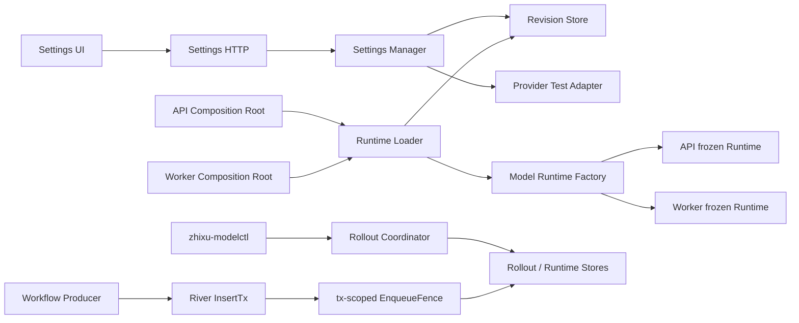

# 技术设计：开发环境一键启动与模型配置

## 1. 边界与原则

本任务保持单一 Trellis Task：一键入口、模型配置和 smoke 清理共同修改同一 Compose 生命周期，最终验收必须在同一真实开发栈完成；拆成子任务会增加配置版本与启动脚本漂移风险。

核心不变量：

1. 无模型也能启动，模型能力显式 disabled/degraded。
2. desired、active 和 applied revision 含义唯一：desired 是最新保存版本，active 是全局已提交版本，applied 是具体进程实际加载版本。
3. Secret 只以 API 请求瞬时明文、进程内短生命周期明文和数据库 AEAD 密文存在。
4. 保存不等于生效；只有固定 target 的 rollout 提交，且 API/Worker 同 revision ready 后才视为 applied。
5. 开发服务只暴露 loopback；应用永不获得 Docker Socket。
6. 清理只能作用于可证明属于知序 smoke 的资源。

## 2. 运行拓扑

```text
./zhixu
  -> Docker Compose project: deploy (兼容现有 volume)
       -> postgres
       -> model-settings-key-init -> zhixu-model-secrets volume
       -> migrate
       -> modelctl -> rollout/preflight/recovery
       -> app      -> app-model-relay -> host Ollama
       -> worker   -> worker-model-relay -> host Ollama
       -> firewall -> proxy -> 127.0.0.1:${ZHIXU_HTTP_PORT}
```

API、Worker、Migrate 和 `zhixu-modelctl` 继续使用同一运行镜像的不同 entrypoint。Key init 使用固定、最小的受信镜像或现有运行镜像，以 root 在仅含主密钥的 named volume 中幂等生成 32-byte key：目录为 `0700 10001:10001`，Key 文件为 `0400 10001:10001`，临时文件原子 rename。已有文件只校验、永不覆盖；API、Worker 和 modelctl 以 `:ro` 挂载，其他服务不挂载。

## 3. 一键入口

仓库根目录新增可执行 `zhixu` shell 入口：

- `./zhixu up`：依赖检查 -> 首次 `.env` 初始化 -> 创建 `workspace` -> Compose auth/config 预检 -> build/up/wait -> API 与 Worker readiness -> 输出 URL。
- `./zhixu restart`：通过 modelctl 执行受控 rollout，只在候选 API/Worker prepared 且 target 固定后提交 active；失败自动恢复旧 active。
- `./zhixu status`：显示 Compose 状态、API/Worker readiness、访问地址。
- `./zhixu logs [service]`：跟随受限服务日志。
- `./zhixu down`：停止并保留 volumes。
- `./zhixu reset`：显式确认后才允许 `down -v`，并说明模型配置密文和主密钥一起删除。

脚本固定从仓库根解析路径，不依赖调用者当前目录；项目名默认 `deploy` 以复用当前数据库卷。Makefile 旧入口改为委托脚本或保留兼容 wrapper，普通 `compose-down` 不再隐式销毁数据。

## 4. 数据模型、版本与加密

新增 migration `00064_model_settings.sql`，包含：

### `ops.model_settings_revisions`

- append-only `revision bigint` 主键；revision 0 表示无行的 disabled bootstrap
- Chat：provider、base URL、model、model version、adapter version、timeout、request/response byte limit
- Embedding：provider、base URL、model、dimensions、normalization、distance metric、batch/input/response limit、timeout
- 两组 Secret：`key_id`、`nonce`、`ciphertext`，禁用时为空
- `created_at`、`created_by`；已提交 revision 不 UPDATE/DELETE
- 数据库约束只维护结构不变量；完整 Provider 规则由共享 config validation 拥有

高级 timeout/batch/byte limit 不进入 UI，但必须作为 resolved 值冻结在每个 immutable revision 中：首个 revision 使用当时代码安全默认，后续 PUT 复制当前 desired 的高级值。这样代码默认升级也不会悄悄改变既有 Embedding config hash 或 API/Worker 运行契约。

### `ops.model_settings_state`

- singleton；`desired_revision` 和 `active_revision`
- rollout：`rollout_id`、`target_revision`、`previous_active_revision`、`phase`、`lease_expires_at`
- `phase` 仅允许 `idle|validating|draining|applying|verifying|failed`
- `last_error_code` 只保存稳定脱敏码

PUT 与 rollout begin 都锁定该 singleton row。PUT 在有效 rollout 期间返回 409；begin 在同一事务中固定当时的 desired 为 target，因此两个进程不再各自读取一个可变化的“最新版本”。

### `ops.model_settings_runtime`

- `role`：`api|worker` 主键
- `instance_id`、`applied_revision`、`rollout_id`
- `phase`：`active|quiescing|quiesced|prepared|verifying|unavailable`
- `applied_at`、`heartbeat_at`

API/Worker 在完成配置解密与 Factory 构造后以 instance CAS 登记 applied revision；旧 instance 失去行所有权后停止。heartbeat 默认 5 秒，超过 20 秒视为 stale。Settings GET 仅在 desired=active、两个 role 都 fresh/active 且 applied=active 时返回 `restart_required=false`。

### AEAD

- 标准库 AES-256-GCM。
- 主密钥文件为 base64 编码 32 bytes；`key_id=SHA-256(key)` 的受控短标识。
- AAD 绑定设置 revision、用途（chat/embedding）、schema version、Provider 和规范化 Base URL，防止密文跨版本、跨字段或跨目标替换。
- `keep` 在同一事务中先用旧 revision AAD 解密，再用新 revision AAD 和新 nonce 重加密；改变 Provider/Base URL 时禁止 keep，必须 replace。Key 不可用时 keep 失败，只有对所有已配置 Secret 显式 replace/clear 才能恢复。
- 更新采用事务 + expected revision；先验证/加密完整候选，再插入 immutable revision 并更新 desired，不覆盖有效设置为半成品。
- 解密、Key 不匹配或文件缺失时模型 capability fail closed，日志只记录稳定错误码。

## 5. 配置加载与版本语义

新增 `internal/modelsettings` 深模块（domain/application/postgres/http/runtime），不让 Handler、launcher 或 Composition Root 直接操作 SQL、AEAD 或 rollout 状态机。

```text
static Defaults/YAML/Env
  -> database connection
  -> managed model settings loader(active or fixed rollout target)
  -> overlay model-only fields
  -> existing Config model validation
  -> existing NewConfiguredChatModel/NewConfiguredEmbedder
  -> freeze registries
  -> record applied revision
```

managed settings 只在显式开发 Compose 配置启用；普通二进制直接运行仍保持现有 Env/YAML 行为。若没有数据库设置，revision 0 使用 disabled 默认。managed mode 下数据库 revision 覆盖全部模型身份字段，不能再被 `.env` 中旧的 Chat/Embedding provider/secret 覆盖；非模型配置仍保持 Env 优先级。

保存新 revision 不影响当前进程；普通进程始终加载 active。连接测试是显式外部检查，不作为保存的隐式副作用。旧 Index/Model Run 继续引用旧版本事实，新模型执行只在 rollout 完成后使用新 active。

### Rollout 状态机

`./zhixu restart` 通过镜像内 `zhixu-modelctl` 执行，modelctl 只有数据库和只读 Key 权限，不挂 Docker Socket：

1. `begin` 锁定 state row，固定 `rollout_id + target=desired + previous_active` 并取得带过期时间的 lease；此后 PUT 被拒绝。
2. `validating` 用一次性容器分别按 API/Worker 路径加载 target、解密并构造正式 Factory。失败时旧进程不停止，active 不变。
3. `draining` 启用下述 runtime fence，阻止新的 Workflow mutation 和所有后台入队，并立即 QueuePause 阻止新 claim；旧 Worker 只完成已在执行的 attempt，running=0 后登记 quiesced。尚未 claim 的 ready/scheduled/retry job 保留，候选 commit 后才在新 active 下执行。超时则 abort，继续使用旧 active，不强杀在途任务。
4. launcher 停止 proxy/relay/app/worker，进入 `applying`；新 API/Worker 只能读取该 rollout 的固定 target，构造完成后登记 `prepared`，在 commit 前不接收外部流量、不消费队列。
5. 两个 role 的 fresh prepared 记录和内部 health 都通过后进入 `verifying`；任一失败则 active 仍为 previous，launcher 停止候选并恢复旧 API/Worker。
6. `commit` 原子设置 `active=target` 并结束 rollout；已加载 target 的两个进程转为 active，launcher 重建 firewall/proxy、等待 readiness 与 revision 屏障后报告成功。

脚本以 trap 在失败/信号路径执行 abort/recovery。若 launcher 被 SIGKILL，下一次 `up/restart` 检测过期 lease，恢复 previous active 后再开始新 rollout。这里的 heartbeat/gate 只控制停服切换，不替换进程内 Adapter，因此不构成热加载。

### Runtime control contract

- API 与 Worker 各运行一个轻量 control watcher：每 1 秒读取 state，每 5 秒以 `(role, instance_id, rollout_id)` CAS heartbeat；进程失去 runtime row 所有权、rollout id 改变或加载 revision 与授权 target/active 不一致时立即 fail closed 并退出。
- 所有可能插入 Workflow/River job 的 HTTP Service、后台 dispatcher 和 retry/rescue producer 都复用一个数据库 `EnqueueFence`。fence 在与 job insert 相同事务内锁定 model settings state row 并确认 phase 允许入队；因此 `draining` 提交后不存在“旧请求晚提交”的竞态。Handler 可先快速返回 503，但数据库 fence 是最终边界。
- 进入 draining 后，modelctl 在 state row fence 生效后立即 QueuePause；API watcher 在本地 producer gate 关闭后把自身从 active CAS 为 quiescing，Worker watcher 停止本地 dispatcher并等待已 claim job。Worker active job counter 归零后以同一 rollout id CAS 为 quiesced；ready/scheduled/retry job 不被删除或改写。
- `abort/recover` 必须用相同 rollout id 与有效/过期 lease CAS：恢复 previous active、QueueResume 并清除 gate。只有仍拥有 runtime row、且已加载 previous active 的旧 instance 可以从 quiescing/quiesced 回到 active；候选或 stale instance 不得恢复、heartbeat 或覆盖新 instance。
- candidate 启动后接管对应 role 的 runtime row并登记 prepared；River queue 保持 paused，proxy 保持停止。commit 后 QueueResume，两个 watcher 确认 active 后才恢复 proxy。读接口和 Settings GET 在旧 API drain 阶段保持可用。

Workflow queue item 本身不宣称模型版本；Worker 在每次真正开始 model attempt 时，在 active/rollout fence 下冻结 revision，并让新 Model Run/Call、Embedding Version 或 Index Version 持久事实引用该模型身份。因此 queued job 可以跨 rollout 等待，但同一个已开始 attempt 不会跨 revision 热切换。

## 6. HTTP 与授权契约

### GET `/api/v1/settings/models`

返回：

- `desired_revision`、`active_revision`
- `desired_settings`：完整非敏感 Chat/Embedding draft 摘要，供表单编辑
- `active_settings`：当前实际运行目标的非敏感 Chat/Embedding 摘要；revision 0 固定返回 canonical disabled summary
- `runtime.api`、`runtime.worker`：applied revision、phase、fresh boolean，不返回 instance id/内部错误
- `restart_required`
- `rollout`：脱敏 phase/target/retryable 状态
- active capability `disabled|configured|unavailable`

两个 settings 摘要各自只含非敏感字段和 `api_key_configured`。Header：`Cache-Control: no-store`。不返回密文、Key 长度、掩码内容、instance id 或完整内部诊断。

### PUT `/api/v1/settings/models`

- 必需 `expected_revision`
- Chat 与 Embedding 完整替换
- Secret action 为 tagged union：`keep|replace|clear`；只有 replace 接受 write-only value
- 严格 JSON、未知/重复字段拒绝
- 409 返回当前 revision，不回显设置 Secret
- 先共享校验，再原子保存；保存不发外部请求

### POST `/api/v1/settings/models/test`

- `target=chat|embedding`
- 接受对应 draft 和 Secret action，不持久化
- `keep` 只允许当前 desired 中相同 Provider + 规范化 Base URL；改变目标必须 replace
- Chat 发最小严格 JSON-schema 请求；Embedding 发单条最小文本并验证维度
- 复用正式 Adapter 的 hardened transport、URL、redirect、timeout、响应大小、Content-Type、模型回显与脱敏错误分类

required auth 下，Handler 二次确认 Principal 来源为 Cookie Session；Bearer API Token 始终拒绝。development disabled 模式仅在既有 loopback Compose 边界开放。OpenAPI 与前端 decoder 同步严格更新。

## 7. Settings 前端

新增独立 `web/src/api/model-settings.ts`，唯一拥有 wire decoder、request encoder 和 Problem 映射。Query key 不绑定 Workspace，因为设置属于单实例系统，但认证切换时必须清除。

Settings 的 Model tab 拆为两个并列但独立的配置区：

- Provider 下拉
- Base URL
- Model
- Chat Model Version
- Embedding Dimensions、Normalization、Distance
- API Key password input：默认空且表示 keep，通过单独“清除”控制避免歧义
- 每区“测试连接”，整页“保存”

表单编辑 `desired_settings`，旁边明确展示只读 `active_settings` 与差异；revision 0 使用 canonical disabled，不用 null 猜测。页面显示 desired/active/applied revision 与 restart-required 状态；保存后不显示假成功 applied。Secret 不进入 URL/Storage，成功后清空输入。覆盖 loading、disabled、configured、test pending/result、save pending/error/conflict、rollout in progress、restart required 与 unavailable。

## 8. 本地模型网络

保持 Adapter 的 loopback HTTP 安全规则。开发 Compose 默认始终运行两个低开销 socat relay，分别通过 `network_mode: service:app|worker` 在各自 `127.0.0.1:11434` 监听，并只转发固定 `host.docker.internal:11434`；Linux `host-gateway` 兼容映射只配置在 app/worker namespace owner，relay 继承网络命名空间且不重复声明网络配置。Settings 的 Ollama preset 只允许该固定 loopback 端点，不允许任意 HTTP 私网 host。

远程 OpenAI-compatible endpoint 必须是 HTTPS，并统一使用专用 Transport：`Proxy=nil`、禁止 redirect、每次解析/连接均拒绝 loopback、RFC1918、链路本地、multicast、unspecified 和保留地址，TLS SNI 保持原 hostname。该边界同时用于 test 与正式 Adapter，防止保存后绕过。若宿主 Ollama 未运行或 host gateway 不可用，连接测试返回稳定不可用；不静默切换 Provider。

## 9. Smoke 与一次性清理

四个 smoke trap 使用 `down --volumes --remove-orphans --rmi local`。测试用随机 project/name，清理后断言本次 image label/name 不存在。

本机一次性清理流程：

1. 快照运行中容器、`deploy` project、volume 与其他 Compose project。
2. 枚举精确四类 smoke 镜像。
3. 对每个 Image ID 再检查容器引用；有引用则跳过并报告。
4. 删除其余镜像。
5. 验证四类计数为 0，原运行栈/其他项目状态不变。

不删除全局 BuildKit cache、测试 PostgreSQL 容器或 volume。

## 10. 兼容、回滚与故障

- 回滚代码前保留 `00064` 表和密文；旧二进制忽略它们，Env/YAML disabled 配置仍可启动。
- Key init 只在文件不存在时生成。Key volume 丢失后新 Key 与 revision 中的 `key_id` 不匹配，模型 capability unavailable、基础 API 与 Settings ready；不改写旧密文。用户恢复原 volume/Key，或对每个已配置 Secret 显式 replace/clear 后保存新 desired，再 restart；keep 返回稳定不可恢复错误。
- 新 revision 无法预检、排空或 prepared：active 保持 previous，旧栈自动恢复，Settings 可修正 desired 后再次 restart。提交前候选不接收外部任务，因此回滚不会产生跨版本任务。
- Worker 未应用：launcher restart 失败且不报告成功；Settings 继续显示 mismatch。
- 数据库 unavailable：Settings unavailable，不影响已有 API 对数据库故障的现有降级语义。

## 11. 架构深化规划

本节约束实现形状，不改变前述产品、HTTP、持久化和 rollout 契约。目标是让调用方只理解自身用例，避免把 Settings 管理、进程启动、modelctl 状态机、Provider 网络和 River 事务细节堆入同一个浅 `Service`/`Repository` Interface。

### 11.1 三个调用面，三个深 Module

| 调用方 | Module | 目标 Interface | 隐藏的 Implementation |
| --- | --- | --- | --- |
| Settings HTTP | Settings Manager | `Snapshot`、`Save`、`Test` | strict command、Secret action、AEAD、optimistic revision、Provider test 与脱敏错误 |
| API / Worker Composition Root | Runtime Loader | `Prepare` | active/fixed-target 选择、解密、model-only overlay、Factory 校验、revision binding |
| `zhixu-modelctl` | Rollout Coordinator | `Open`、`Recover` | lease、合法 phase、CAS、previous/target、runtime freshness 与 commit/abort |

建议的 Interface 形状如下；类型名可沿用仓库风格调整，但调用面不得重新合并成通用命令总线：

```go
type SettingsManager interface {
	Snapshot(context.Context) (domain.Snapshot, error)
	Save(context.Context, SaveCommand) (domain.Snapshot, error)
	Test(context.Context, TestCommand) (domain.TestResult, error)
}

type RuntimeLoader interface {
	Prepare(context.Context, RuntimeRequest) (*RuntimeSession, error)
}

type RolloutCoordinator interface {
	Open(context.Context, RolloutRequest) (*RolloutSession, error)
	Recover(context.Context) (RecoveryResult, error)
}
```

- `SettingsManager.Test` 在 Module 内完成 draft Secret 解析、正式 Factory 构造、最小 Provider 请求和临时 Secret 销毁；HTTP 不接收 `ResolvedSettings`，避免凭据生命周期泄漏到 Handler。
- `RuntimeSession` 只向 Composition Root 提供固定 revision、不可变 Model Runtime 和 `Ready/Run` 生命周期。调用顺序固定为 `Prepare -> 构造角色专属 Registry -> Ready -> Run watcher`；任一步失败都不得登记 active/prepared。
- `RolloutSession` 以 rollout id 恢复，向 modelctl 暴露业务阶段动作，不让脚本传 `expected_phase` 或自行拼 CAS。跨进程恢复仍以 PostgreSQL 状态为准，内存 Session 不是事实源。
- 现有大 `Repository` 按 Revision Store、Rollout Store、Runtime Store 三个内部 seam 收窄；同一个 PostgreSQL Adapter 可以实现三者，测试分别使用 fake。它们是 Module 内部 seam，不注入 HTTP、Composition Root 或脚本。

### 11.2 EnqueueFence 是事务 Adapter，不是 Settings 方法

正确性边界位于 River `InsertTx` 使用的同一个 `pgx.Tx`：

```text
producer transaction
  -> lock ops.model_settings_state
  -> verify enqueue phase
  -> insert workflow/outbox facts
  -> River InsertTx
  -> commit
```

- `EnqueueFence.CheckEnqueue(ctx, pgx.Tx)` 由 model settings PostgreSQL Adapter 实现，并注入 River Adapter；它不经过非事务的 `SettingsManager` 或 `RuntimeLoader`。
- 删除无 transaction 参数的 `CheckEnqueueAllowed` Service/Repository 路径，否则“先检查、后入队”仍存在 draining 后晚提交竞态。
- HTTP 的本地 producer gate 只用于快速返回 503；数据库 fence 才是最终不变量。
- 所有 typed job inserter、后台 dispatcher、retry/rescue producer 必须经过同一 River insertion helper。River 自身对已存在 Job 的 claim/retry 不伪装成新的业务 enqueue。

### 11.3 每个进程只构造一个冻结 Model Runtime

新增一个 Adapter-owned `ModelRuntime` Factory，统一构造 Chat、Embedding 及其 Contract：

```text
static Config 或 managed fixed revision
  -> 唯一 model-only overlay / validation
  -> NewConfiguredModelRuntime
  -> immutable Chat + ChatContract
  -> immutable Embedder + EmbeddingContract
  -> API/Worker 角色专属 Registry 与 Executor
```

- API 与 Worker 各有自己的 Runtime，不跨进程共享对象；managed mode 下二者必须绑定同一 active/target revision 和相同 Contract。
- Worker 内 Tool、RAG、Artifact、Reindex 复用同一冻结 Embedder；是否可复用的前提由 Adapter 并发安全 contract test 锁定，而不是由调用方猜测。
- Chat/Embedding capability、Contract 和 Adapter 必须来自同一次 Factory 结果。Composition Root 不再分别读取 `cfg.ChatProvider` 后自行推导能力。
- 角色专属 Workflow Definition、Executor 和 Catalog 仍由各自 Composition Root 组装，不把 Workflow 类型塞进 Model Runtime。
- `ResolvedSettings` 只在 Runtime Loader/Factory 内短暂存在；完成 Adapter 构造后销毁临时 Secret buffer。日志、错误和 Runtime 的 `String/GoString` 均不得包含 Secret 或完整 Endpoint。
- 不做热加载。运行中状态变化只让 watcher 关闭 gate、排空或退出；新 revision 必须由候选进程重新构造完整 Runtime。

### 11.4 Model Transport 保持为 Adapter 内部 seam

正式 Chat、Embedding 和 Settings Test 继续只通过现有高层 Model Factory；DNS resolver、dialer 和 HTTP Transport 是 `internal/platform/models` 的内部 seam，不新增公共网络工具包。

单次新连接必须按以下顺序执行：

1. 使用规范化原 hostname，拒绝 userinfo、query、fragment 和不允许的 scheme。
2. `Proxy=nil`，禁止 redirect；TLS 请求 URL 与 SNI 保留原 hostname。
3. 解析全部 A/AAAA 地址；任一地址是 loopback、RFC1918、link-local、multicast、unspecified 或保留地址时，整个结果 fail closed。
4. 仅对全部通过校验的地址按解析顺序逐个连接，首个连接失败后尝试下一地址，并服从同一个 context deadline。
5. 只有受控 Ollama preset 的固定 loopback hostname 可以解析到 loopback；不能扩展为任意私网 HTTP allowlist。

连接池复用不宣称“每个 HTTP request 都重新 DNS”；契约是每次建立新连接重新解析和校验。测试必须主动关闭 idle connection 或使用新 Client，避免把连接复用误当作 DNS rebinding 覆盖。

### 11.5 关键数据流



### 11.6 必须保持的不变量

1. `Save` 只推进 desired；active 与当前进程 Runtime 不变。
2. Runtime Loader 只能加载当前 active，或由有效 rollout id 固定的 target；调用方不能直接指定任意 revision。
3. Chat、Embedding、Registry 全部构造成功后才能登记 active/prepared；不存在半构造 Runtime。
4. commit 前 API 与 Worker 都必须 fresh/prepared 且 applied revision 等于 target；commit 后才恢复入口和 Queue。
5. draining state row 生效后，不存在能提交的新 Workflow/River Job；已开始 attempt 保持原 revision，未 claim Job 等待新 active。
6. Save、Test 和正式 Adapter 复用相同 endpoint identity、Factory validation 与 hardened transport；Test 成功不能绕过正式路径约束。
7. GET、Problem、Audit、日志、metrics、trace、URL 和浏览器缓存均不出现 Secret、密文、Key 长度或 instance id。
8. static mode 保持现有 Env/YAML 行为；关闭 managed mode 即可回滚应用代码，不删除 revision 表、数据卷或 Key volume。

### 11.7 增量迁移与回滚点

1. **锁定 Interface 与失败矩阵**：先增加 Settings Manager、Runtime Loader、Rollout Coordinator 的 contract tests；暂不改启动路径。
2. **深化 Transport**：补 mixed DNS、rebind、IPv4/IPv6 fallback、TLS hostname、loopback preset 测试，再切换 Chat/Embedding/Test 共用路径。失败可单独回退到旧 Factory，不触及数据库事实。
3. **引入单一 Model Runtime**：先在 static mode 替换 API/Worker 重复 Factory，再验证所有消费者 Contract 一致；此阶段不启用 managed mode。
4. **接入 revision 与 Secret**：实现 Revision Store、AEAD 和 model-only overlay；Settings Save/Test 可上线，但保存仍不改变 active。
5. **接入 Runtime Session 与 EnqueueFence**：完成 applied registration、watcher、tx fence、QueuePause/Resume 和 attempt revision binding；故障时关闭 managed mode并继续使用 static disabled 配置。
6. **接入 Rollout Coordinator 与 launcher**：完成候选 preflight、drain、prepared、commit、abort/recover，再允许 `./zhixu restart` 报告成功。
7. **最后接入 Settings UI 与真实 Compose 验收**：前端只消费稳定 HTTP contract，不参与 rollout 编排。

每一步先通过局部 contract，再替换旧调用点；禁止保留“旧 Factory + 新 Runtime”双事实源作为长期 fallback。

### 11.8 验收与后续拆单

- `cmd/api`、`cmd/worker` 不再直接多次调用 `NewConfiguredChatModel/NewConfiguredEmbedder`，只消费一次冻结 Runtime。
- Settings Handler 不直接接触 Repository、Sealer、`ResolvedSettings`、pgx 或 Provider Client。
- modelctl 不传 expected phase，不拼 SQL，不自行判断 runtime freshness。
- modelsettings Application 不导入 pgx/River/HTTP 类型；tx-scoped fence 留在 PostgreSQL/River Adapter seam。
- Transport 测试通过 package-private resolver/dialer seam 注入，不为测试扩大生产 Interface。
- Semantic Link scope、通用前端 wire decoder 和 Workflow catalog assembly 不纳入本任务，分别建立后续任务，避免与 rollout 高风险修改形成一个不可回滚 diff。
