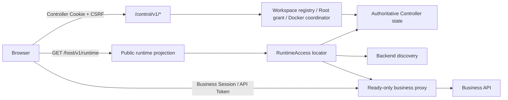

# 首页公开访问与控制操作授权拆分技术设计

## 1. Design Objective

把当前“Controller 会话 -> 全量控制状态 -> 业务认证 -> 业务路由”的串行门禁拆为三条独立边界：

1. 匿名本机浏览器可读取最小运行时可达性。
2. 普通业务数据和操作由现有业务认证/Capability 保护。
3. 宿主机路径、Workspace 控制和 Docker 生命周期仍由 Controller 会话保护。

本设计不把 Controller 凭证降级为可选安全检查，也不把浏览器缓存提升为事实源。

## 2. Target Architecture



权限矩阵：

| 能力 | 无 Controller Session | 有业务 Session | 有 Controller Session |
| --- | --- | --- | --- |
| SPA 静态资源 | 允许 | 允许 | 允许 |
| 最小运行时投影 | 允许，精确 Host、无 CORS | 允许 | 允许 |
| 普通业务路由/API | 由业务 `required|disabled` 决定 | 允许，仍受 Capability/审批约束 | Controller Session 本身不授权 |
| `/`、`/workspace` 控制页面 | 显示控制授权门禁 | 业务 Session 不授权 | 允许读取完整控制状态 |
| Workspace/Docker 控制命令 | 拒绝 | 业务 Session 不授权 | 还需 Origin、CSRF、If-Match、幂等键 |

## 3. Public Runtime Projection

### 3.1 HTTP Contract

新增 `GET /host/v1/runtime`。该 URL 位于独立只读命名空间，不复用 `/control/v1/state`，也不根据 Cookie 返回两种 Schema。顶层 `Handler` 必须把整个 `/host` 前缀分发给独立 `hostRouter()`；`/host`、`/host/`、未知 `/host/v1/*` 返回固定 JSON Problem，绝不回落 SPA HTML。

成功响应使用专用结构：

```json
{
  "status": "ready",
  "active_workspace_id": "00000000-0000-4000-8000-000000000000",
  "poll_after_ms": 1000
}
```

状态约束：

| 权威状态 | `status` | `active_workspace_id` | 前端行为 |
| --- | --- | --- | --- |
| Runtime waiting、Active 为空、无非终态 operation | `waiting` | `null` | 保留入口/连接目录提示，不挂载业务 Provider |
| Runtime/API/Worker ready、Active 非空且 available、ID 合法、无非终态 operation，且 backend discovery 成功 | `ready` | 当前不透明 UUID | 进入业务认证与业务路由 |
| Runtime waiting 但 Active 非空、switching/recovery failed、任一 process 非 ready、Active unavailable、非法/矛盾组合 | `unavailable` | `null` | 卸载业务树、清缓存/SSE，显示脱敏不可用状态 |
| terminal operation + 完整 ready 状态 | `ready` | 当前不透明 UUID | terminal 历史不阻断业务 |
| State 或 backend discovery 失败 | HTTP 503 Problem | 不返回 | fail closed 并按有界退避重试 |

响应规则：

- Host 校验在任何 Store/Runtime 读取前执行；错误固定为 `403 HOST_REQUEST_INVALID`，不得回显实际或期望 Host。
- success、403、404、405、503 全部设置 `Cache-Control: no-store`，不设置任何 `Access-Control-Allow-*`。
- `poll_after_ms` 将 State 值 clamp 到命名常量 `500..5000` 毫秒；前端严格接受同一区间，避免忙轮询或异常长时间不重查。
- `active_workspace_id` 只在 ready 时出现有效 UUID；waiting/unavailable 必须为 `null`。
- 不返回 Workspace 名称/路径/最近列表、operation、runtime 进程详情、state version、Controller instance、Session/CSRF 或 secret。
- 任意 State/backend 内部错误固定映射为 `503 RUNTIME_ACCESS_UNAVAILABLE`、消息“业务运行时状态暂不可用”、`retryable=true`，不包含 `operation_id`、`field_errors` 或底层文本。
- 非 GET/HEAD 方法固定返回 `405 HOST_METHOD_NOT_ALLOWED`；未知 `/host/v1/*` 固定返回 `404 HOST_ROUTE_NOT_FOUND`。HEAD 由 GET 路由语义处理且不返回 body，不触发任何 mutation。

### 3.2 Single Readiness Rule

将现有 `BackendLocator` 深化为一次读取的 `RuntimeAccess` locator：先读取一次 `State`，使用无副作用判定函数得到 waiting/ready/unavailable；只有 state-ready 才调用 `Runtime.CurrentBackend`。返回值内部包含公开状态、Workspace ID、clamped poll interval 和仅供代理使用的 backend URL。由以下两处共同使用：

- 业务代理：只在 locator 返回 ready 且 URL 合法时转发。
- `GET /host/v1/runtime`：调用同一 locator，但只序列化 `waiting|ready|unavailable`、ready Workspace ID 和 poll interval，绝不序列化 URL。

公开投影只用于发现，不能替代业务代理的逐请求 locator 重查。浏览器在拿到 ready 后到业务请求发出前若发生切换，代理仍返回 `503 RUNTIME_NOT_READY`。代理在自身生成的 runtime 503/502 上增加 `X-Zhixu-Runtime-Status: unavailable`；普通业务 API 的 503 不带此头。REST/SSE 共享边界只根据该头通知 RuntimeAccessProvider 立即 fail closed 并刷新，避免每个领域客户端重复解析 Problem。

## 4. Frontend Composition

Controller 模式目标组合：

```text
BrowserRouter
  HostControlProvider              // 始终保持同一实例，只在控制路由恢复/轮询控制状态
    RuntimeAccessProvider          // 始终挂载，唯一发布权威 Active Workspace
      / or /workspace
      ControllerWorkspacePage
      all other business routes
        RuntimeAccessBoundary      // waiting/unavailable/ready
          AuthProvider             // 独立业务认证
          AuthBoundary
          WorkspaceCacheBoundary
          EventStoreProvider
          AppRoutes
```

关键规则：

- `RuntimeAccessProvider` 负责获取/轮询公开投影，并成为 Controller 模式下 Active Workspace 的唯一权威发布者。
- `HostControlProvider` 在 ControllerApp 生命周期内保持同一实例，原始 Fragment Token 只进入它的一次性 ref；路由往返不会重放 Token。它只在 `/`、`/workspace` 或首次 Token 交接时恢复/轮询控制状态，普通业务路由不会主动探测控制 Session。
- `HostControlProvider` 不再因为 Controller 401、实例变化或 Session 过期清空业务 Workspace；它只管理控制页面所需的会话、完整状态和命令。
- `/` 与 `/workspace` 在顶层路由先被控制页面截获；`AppRoutes` 中同名路由保留给 Direct 模式，避免破坏现有直接运行语义。
- 普通业务深链保持原 URL。ready 后进入业务认证；waiting/unavailable 时在原 URL 显示明确状态，不重定向为 `/workspace` 或假成功 `/dashboard`。
- 启动器现有 `/#control=...` 流程保留。Fragment 从地址栏移除后由常驻 `HostControlProvider` 最多交换一次；`/#control -> /dashboard -> /workspace` 的第二次控制页进入只读 Cookie Session，不重放 Bootstrap Token。Controller Token 不参与公开投影或业务 API。

## 5. Active Workspace and Cache Lifecycle

Controller 模式不再从 `localStorage` 恢复 Workspace 身份；`zhixu.active-workspace-id` 最多保留为不可直接发布的兼容提示，首版可以完全忽略。`active-workspace.ts` 必须区分运行模式：Direct 模式保留原本地存储行为，Controller 模式只接受 RuntimeAccessProvider 发布的进程内权威值，且 storage event 不能改变当前业务作用域。

1. 页面启动时不得仅凭 storage 值挂载业务树；Controller 模式初始有效 ID 固定为空。
2. 首次权威投影返回前，公开运行时状态为 loading。
3. ready 时先完成上一个 Workspace 的清理，再发布新的 ID。
4. waiting、unavailable、请求失败或 ready ID 变化时，先将有效 ID 置空并卸载业务树。
5. `clearWorkspaceRuntimeState` 取消并移除旧 Workspace Query；`EventStoreProvider` 随业务树卸载或 ID 变化关闭 SSE。
6. 清理完成前不得发布 B；陈旧响应、Abort 后响应和乱序轮询不得覆盖更新状态。
7. Controller 模式的设置页只能导航到 `/workspace`，不得自行清空或改写 Active Workspace；Direct 模式的连接/清除行为保持原样。

三字段投影不承诺浏览器一定观察到同一 Workspace 的瞬时 `ready -> unavailable -> ready`。只有实际观察到非 ready、locator 请求失败、代理 runtime-invalid header 或 Workspace ID 改变时才卸载；A -> B 始终严格先清 A 后发布 B。若同 ID runtime 在两次轮询间完成换代且没有请求失败，继续复用同一 Workspace cache，SSE 自身负责重连；本任务不公开 grant generation/runtime epoch。

## 6. Business Authentication Behavior

- `ZHIXU_AUTH_MODE=required`：Runtime ready 后先显示现有 AuthBoundary；成功建立业务 Session 后才挂载 Query/SSE/页面。
- `ZHIXU_AUTH_MODE=disabled`：仅项目既有 loopback development 约束下直接进入业务页面。这是用户选择 B 后接受的本机访问模型，不代表 Host Controller 写权限开放。
- Controller Cookie 的 `Path=/control/` 保持不变；业务代理继续剥离 Controller Cookie、Bootstrap Bearer 和 Controller CSRF，只保留业务凭证。
- 普通设置可读取业务认证后的 Workspace/模型/导出等数据；任何“切换工作区”动作只导航到受保护的 `/workspace`，不得从普通设置直接调用 Host Controller 命令。

## 7. Information Disclosure Boundary

- 公共投影只暴露运行状态和不透明 UUID；完整 `/control/v1/state` 继续保持 401 路径不泄漏回归测试。
- Dashboard 中无实际交互价值的宿主路径 tooltip 应移除，避免把路径作为隐藏 DOM 文本扩散；设置中的路径仍属于业务认证后的现有 Workspace 详情，不进入公共投影。
- 控制 Session、CSRF、Bootstrap Token 不写入 localStorage、Query cache、日志、错误或业务请求。
- 公开状态错误只显示“运行时暂不可用/重试”，不能转发 Store、Docker 或操作内部错误详情。

## 8. Compatibility

- Direct 模式继续使用现有 `AuthProvider -> WorkspaceCacheBoundary -> EventStoreProvider -> AppRoutes` 组合，不调用 `/host/v1/runtime`。
- `/control/v1/session`、`/control/v1/state` 及所有 mutation 的 URL、Schema、Cookie、ETag 与错误契约不变。
- 业务 API/OpenAPI 不新增 Workspace bootstrap 契约；Host Controller 仍是运行时发现和代理门禁的唯一入口。
- 现有有效 Controller Session 可以继续进入控制页；Session 失效只在控制页显示授权提示。

## 9. Failure and Recovery

- Public projection 网络/503 或代理 runtime-invalid header：立即停止发布 ready，卸载业务树，进入本地 unavailable 与有界退避；恢复后重新通过业务认证状态进入，不能在同一失败循环中反复挂载。
- Controller Session 401：不影响仍 ready 的业务树；只清控制 Session/CSRF。
- Host Controller 进程重启：网络失败期间允许业务树卸载；公开 locator 恢复 ready 后复用仍有效的业务 Session。
- `zhixu restart`：runtime 会被撤销并重建；必须经历不可用/恢复，只保证 durable Active 恢复，不承诺无中断。
- Workspace switch：投影先 unavailable，所有浏览器各自清理旧 Workspace；新 runtime 验证完成后才发布新 ID。
- Runtime proxy race：业务请求返回 `RUNTIME_NOT_READY`，前端触发公开投影刷新，不把错误解释为空数据。
- 回滚：可恢复为改动前前端门禁和删除 `/host/v1/runtime`；不涉及数据库迁移或持久数据格式，代码回滚无需数据处理。

## 10. Test Strategy

- Go 单元/HTTP：完整矛盾状态矩阵、State+backend 单次 locator、Host/no-store/no-CORS、严格字段、canary 错误脱敏、整个 `/host` 404/405/HEAD、poll clamp、写接口匿名拒绝、代理 header 与竞态。
- Frontend API：严格 decoder、非法组合、Abort、轮询区间和 Problem 映射。
- Component：Controller/业务路由分流、required/disabled、陈旧 localStorage、乱序响应、A -> unavailable -> B、runtime invalidation header、Controller 401 不卸载业务树、控制 Token 路由往返只交换一次。
- Browser：1440x900 与 390x844；两个隔离 context；裸 `/dashboard` 和业务深链；`/workspace` 控制门禁；Controller restart；Workspace switch；console/network/DOM 无凭证和公共宿主路径泄漏。

## 11. Trade-offs

- 公开不透明 Workspace UUID 比纯静态首页公开面略大，但这是新浏览器进入真实工作台所需的最小发现信息；业务事实仍需业务认证。
- 持续轮询增加少量本机请求，但能让所有浏览器独立感知切换与恢复；服务端有界间隔和页面卸载清理控制成本。
- 保留两套认证增加概念数量，但二者保护的资产不同：业务认证保护知识数据，Controller 认证保护宿主机与运行时控制。合并它们会扩大任一凭证的权限。
