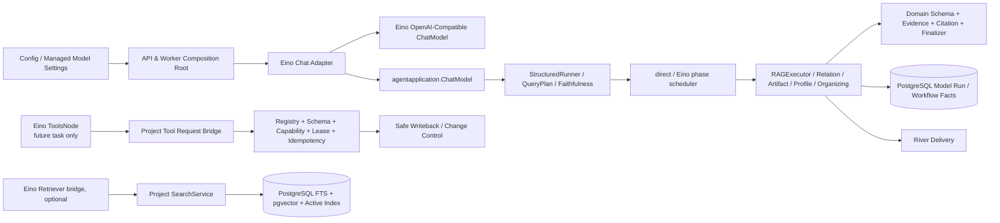

# Eino 分层迁移技术设计

## 1. 设计决策

采用“Eino AI 能力层 + 知序业务/持久层”的分层方案：

- Eino 在本任务中只负责 ChatModel、短流程 Graph 和 Callback/Trace。受控 Tool Calling 必须由后续独立任务重新通过持久 Attempt 与权限门禁；本任务 Stage 4 结论为 No-Go。
- 知序的 `agentapplication`、`retrievalapplication`、`tools`、`workflow` Port 继续是稳定边界；Eino 类型只允许出现在 Adapter、Infrastructure 和短流程 Composition 内。
- PostgreSQL 是 Workflow、Model Run/Call、Tool Call、Evidence/Citation、Proposal/Approval 和 Writeback 的唯一持久事实源；River 只负责投递和领取。
- 第一阶段不启用 Eino ADK、Checkpoint/Interrupt、自动重试或 Eino 内置长期 Agent 状态，避免和现有恢复协议形成双账。
- 实施第一步必须新增“分层正式采用 Eino”ADR，并明确 supersede ADR-0013 的“不正式采用”结论；在该 ADR 合入前不修改主模块依赖。

## 2. 目标架构

Eino Graph 的节点只能调用图中已有项目 Port；Graph 的生命周期必须短于一个 Worker Node Attempt 的 timeout，不能持有 River lease 或直接写外部副作用。

## 3. 迁移矩阵

下表给每项能力只分配一个主类别；同一行中的“保留边界”表示即使采用 Eino，也不能移动的项目契约。

| 正式能力/入口 | 主类别 | 目标与保留边界 | 阶段 |
|---|---|---|---|
| `internal/platform/models/chat_openai.go` Provider transport | **替换为 Eino** | 用 Eino OpenAI extension 实现项目 `ChatModel`；项目继续拥有安全 HTTP client、动态 Schema、严格 response/usage 校验和稳定错误 | 1 |
| 模型组件 Callback/Trace | **通过项目 Port 适配** | Eino callback 接入 `internal/platform/observability`；只写 telemetry，不替代 Model Run/Call/Audit | 2 |
| `internal/agent/application/runner.go` Structured Output 调度 | **通过项目 Port 适配** | 二次 Go/No-Go 通过后，Eino Graph 只实现内部 `INITIAL/REPAIR/REDUCED` 调度；Facade、decoder、预算、错误和审计保留 | 3，可选 |
| 关系评估 `internal/agent/adapter/workflow/executor.go` | **保留自研** | 继续拥有五分类语义、版本绑定和发布规则；只复用注入的 Eino-backed Chat/可选 Runner | 随 1/3 验证 |
| RAG `internal/agent/adapter/workflow/rag_executor.go`、`internal/agent/application/rag.go` | **保留自研** | 继续拥有 Query Plan、检索、Evidence、Citation/Faithfulness、拒答、progress 和 terminal proposal | 随 1/3 验证 |
| Artifact `internal/artifact/workflow/executor.go` | **保留自研** | 继续拥有 evidence eligibility、Revision 和原子 finalizer；只复用注入的模型/Runner | 随 1/3 验证 |
| Capture Profile `internal/capture/profile/generator.go` | **保留自研** | 继续拥有 frozen source、Profile Revision/Evidence、能力降级和完成事务 | 随 1/3 验证 |
| Organizing `internal/organizing/workflow/generation.go` | **保留自研** | 继续拥有模板/标签约束、Human Task、Artifact/Proposal 输出和终态 | 随 1/3 验证 |
| 只读模型 Tool Call | **通过项目 Port 适配** | Eino `ToolCallingChatModel`/`ToolsNode` 只解析和短路由；执行仍进入项目 `ToolRequest`、Policy、Capability、lease/fence 和 receipt | 4，可选 |
| `SearchService`、FTS/pgvector、RRF、Active Index | **保留自研** | 不用 Eino Retriever 重写 PostgreSQL 检索；若未来 Graph 有具体消费者，再单独增加只调用 `SearchService` 的 bridge | 后续独立任务 |
| OpenAI/Ollama Embedding transport | **暂不迁移** | 当前 Eino extension 未完成稳定版本与合同门禁；保留项目批量、顺序、维度、归一化和版本绑定 | 后续独立任务 |
| Rerank | **暂不迁移** | 当前没有生产 Provider，先完成 Provider 选型和结果合同，再讨论 Eino Adapter | 后续独立任务 |
| Token Streaming | **暂不迁移** | 当前 SSE 是持久阶段通知而非 Token Stream；有明确产品需求后另立 API/前端任务 | 后续独立任务 |
| Eino ADK、Checkpoint/Interrupt、长期 Agent 状态 | **暂不迁移** | 不与 PostgreSQL/River 建立第二套恢复事实；除非未来 ADR 重做恢复模型 | 后续独立任务 |
| `runtime.go`、模型设置、Credential/Revision/Readiness | **保留自研** | 项目配置负责校验并构造私有 Adapter；SDK 只保留发起认证请求所需的最小 Credential，API/Worker 继续共享不暴露密钥的 immutable runtime | 全程 |
| `RecordingChatModel`、Model Run/Call/Audit | **保留自研** | 每次 Provider 调用前后仍持久化项目事实；Eino callback 不能替代 | 全程 |
| Workflow/River/PostgreSQL、Human Task、Outbox/补偿 | **保留自研** | 唯一持久工作流状态、投递、lease、重试、暂停/恢复和人工恢复边界 | 全程 |
| Tool Registry/Policy/执行、Change Control/Safe Writeback | **保留自研** | 写操作、审批、幂等、Git/Reindex 和未知结果恢复绝不交给 Graph/ToolsNode | 全程 |

`poc/eino/chatgraph` 只作为测试和构造参考，不直接复制其 contract 到生产代码；前端、数据库 Schema 和已有 API 契约在本计划中不变。

## 4. 关键契约设计

### 4.1 Eino Chat Adapter

建议新增 `internal/platform/models/eino_chat.go`（命名以实现阶段实际包结构为准），实现 `agentapplication.ChatModel` 和现有 `Contract()`：

1. Composition Root 用现有 `newModelHTTPClient` 构造禁止重定向、DNS/IP 校验和 TLS 下限的 `http.Client`；Credential 只保留在发起认证请求所需的私有 Adapter/SDK client，不进入 Runtime contract、日志、错误或格式化输出。
2. `Chat` 入口先调用现有 `ValidateChatRequest`，将项目消息映射为 `schema.Message`。
3. 通过 Eino OpenAI `WithRequestPayloadModifier` 注入当前 request 的冻结 JSON Schema；不把 Schema 放进全局共享可变配置。
4. 通过 response modifier/受控 metadata 读取原始响应，复用现有单 choice、assistant、`finish_reason=stop`、无 Tool Call、model echo、usage 和响应大小校验。
5. 将 Eino `schema.ResponseMeta.Usage` 映射回项目 `domain.TokenUsage`；无法获得完整 usage 时 fail closed，不能把零值当成功。
6. 对 Eino 错误做稳定映射：取消、deadline、429、5xx、401/403、重定向和 schema/provider 拒绝必须保持既有错误分类；Adapter 不自动重试。
7. 使用请求级 option 而非修改共享模型；并发请求不得共享可变 Schema、Tool 列表或 response metadata。

### 4.2 Graph 边界

第三阶段只在 `StructuredRunner` 内建立一个有限 Graph：`initial_call_validate -> repair_call_validate -> reduced_call_validate`，每个节点后按成功终态提前结束。最多消费三次模型响应；严格 decoder、原始响应字节闭包、token/byte/time budget 和稳定错误仍由项目代码掌握。

Application 新增项目自有 `StructuredPhaseScheduler` Port 和受控 `StructuredPhaseRun` state handle；现有 for-loop 是 direct 实现，Eino `compose.Graph` 位于 `internal/agent/adapter/eino`。这样 `internal/agent/application` 不导入 Eino 类型，五类消费者仍只依赖项目 Facade。

Graph 的节点输入/输出保持项目自有 DTO，所有模型节点仍调用注入的项目 `ChatModel`，因此 `RecordingChatModel` 继续完整记录 Model Call。Graph 不保存 checkpoint、不自动重试、不直接写 DB/file/Git；失败返回项目稳定错误，由 River 按原 Node Retry Policy 决定是否重试。

完整 RAG 的 Query Plan、Retrieval/Eligibility、Answer、Citation/Faithfulness、拒答和 terminal proposal 仍由 `RAGExecutor` 编排。只有 Structured Output 短 Graph 通过等价门禁并产生明确收益后，才另立任务评估是否值得迁移更大范围的 RAG 编排。

阶段 2 后的 Go/No-Go 结论为 GO：Relation、RAG、Artifact、Capture、Organizing 五个生产消费者复用相同分支，满足复用门槛。该结论只授权上述短 Graph，不授权完整 RAG Graph、Checkpoint、Tool 或持久状态。

### 4.3 Tool Bridge（本任务 No-Go，冻结未来边界）

当前 Chat/RAG 没有可信持久 Attempt、lease/fence 与确定性 `call_no` 来源，现有 Chat Adapter 也明确拒绝
`ToolCalls`，因此本任务不创建无生产消费者的 bridge，也不注册 Eino ToolsNode。未来独立任务中的 Eino 工具
只能实现 `Info`/`InvokableRun` 到项目 Tool Registry 的转换：

- Eino 只接收脱敏的工具 schema，不接收 Capability token、Approval token、绝对路径或 Credential。
- `InvokableRun` 只产生项目 `ToolRequest`；服务端重新从持久 Workflow/Node/Attempt 解析权限和 lease。
- 只读工具先行；写工具仍由 trusted Safe Writeback audit bridge 处理，不能注册为普通 Eino Tool。
- Tool Call 结果未知时保持 `UNKNOWN/manual_recovery`，不得由 Graph 直接返回成功。

## 5. 运行时切换与回滚

第一阶段保留旧 `OpenAICompatibleChatModel`，新增 Eino 实现并在 Composition Root 提供显式内部选择（实现方式可为受控配置/工厂参数，不能复用表示身份的 `ChatAdapterVersion` 字段）。默认切换前先在离线 contract fixture 和真实 Provider smoke 上对照两套输出。

阶段 3 的 scheduler 选择按固定 consumer ID 独立配置，使 RAG、关系评估、Artifact、Capture、Organizing 能逐个灰度；该 ID 只控制内部实现，不进入业务身份、数据库契约或 API。

回滚只切回旧 Adapter，不改变 `agentapplication.ChatModel`、Model Run/Call、Workflow input 或数据库；Structured Output Graph 为五个消费者保留独立 direct 路径。Tool Calling 当前没有生产注册或运行路径，无需回滚动作。

## 6. 依赖与发布

- 根模块锁定经过测试的 Eino core 与 OpenAI extension 版本；不直接把当前 pseudo-version 的 Embedding extension 纳入第一阶段。
- 同步 `go.mod`、`go.sum`、`vendor/`、`vendor/modules.txt`、Docker 构建和 CI 缓存；保留 `poc/eino` 作为迁移回归样例，直到主模块门禁关闭。
- 记录 Eino 及扩展许可证、间接依赖数量和升级策略；升级必须先过同一 contract/eval 门禁。

## 7. 关键风险与缓解

| 风险 | 缓解 |
|---|---|
| 动态 Schema 无法按调用传入 | request payload modifier + httptest；失败则暂留旧 Adapter |
| Eino 错误包装改变 River 重试 | 稳定错误映射单测/故障注入；关闭框架自动 retry |
| StreamReader 未 Close 泄漏 | 每条 Stream 路径 `defer Close`，race/goleak/取消测试；当前 SSE 不改 |
| Eino checkpoint 与 Workflow 双账 | 第一阶段禁用 checkpoint；PostgreSQL 唯一恢复事实源 |
| Tool 绕过权限或重复副作用 | 当前 No-Go；未来只读 Tool 也必须经项目 Registry/Policy/lease/fence/receipt |
| Embedding extension 版本不稳 | 保留项目 Adapter，单独评估稳定版本和 Provider smoke |
| vendor/镜像构建失败 | 依赖迁移单独提交并执行 vendor、Docker、CI 门禁 |

## 8. 实施结果

- 阶段 1 已实现 Eino OpenAI-Compatible Chat Adapter，保留 direct Adapter；两者继续实现项目 `ChatModel` 合同，默认选择 direct。
- 阶段 2 已实现请求级 Eino Callback/Trace 旁路；不读取 Prompt/响应正文/raw error，不替代 Model Run/Call 或 Workflow Progress。
- 阶段 3 的 Go 决策已执行：固定三节点 Eino Graph 通过项目 `StructuredPhaseScheduler` Port 接入五个消费者。计数包装器测试证明消费者实际调用 Graph，而不是仅保存 selector；真实 PostgreSQL/River RAG 门禁证明 transport 重投递不重复 Provider/Model Call 或业务终态。
- 阶段 4 为 No-Go：没有新增 ToolsNode、Tool bridge 或运行时开关；未来边界按 4.3 节冻结。
- Eino core/OpenAI extension 已锁定并同步 vendor；Embedding/Retriever/Rerank、完整 RAG Graph、Streaming、Checkpoint 和 Tool Calling 没有进入主运行路径。
- 真实 OpenAI-Compatible Provider smoke 已用生产 Eino Adapter 对本地 Ollama `0.32.6` + `qwen3:0.6b` 连续通过两次；`reasoning`/`reasoning_content` 只作为显式 string/null allowlist 接收后丢弃，其他未知字段继续拒绝。该结果只证明协议兼容，direct Adapter/scheduler 与五个独立 selector 仍保留为灰度默认和回滚路径。
