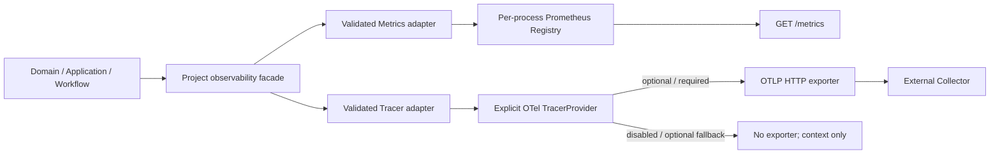

# OpenTelemetry 与 Prometheus 可观测性设计

## 1. 设计目标

以成熟 SDK 替换当前生产占位实现，同时保留项目已有的窄接口与安全合同：

- Trace 在 API 与 River consumer 形成真实、可导出的异步父子链路。
- Metrics 在所有 telemetry mode 下通过 API/Worker `/metrics` 抓取。
- disabled/optional/required 只控制 OTLP Trace exporter 的启动行为。
- SDK、collector、handler 和生命周期细节不进入 Domain/Application。
- 任何错误、日志、Trace 或 exposition 都不能泄露 endpoint、Secret、正文或路径。

## 2. 总体架构

`Telemetry` 是 Composition Root 获得的唯一运行时 bundle，拥有 project `Metrics`、project `Tracer`、Prometheus HTTP handler、Trace Provider 关闭函数和安全状态。Prometheus Registry 不需要关闭；HTTP server 仍由 API/Worker 现有 lifecycle 所有。

系统不托管或自动启动 Collector、Prometheus Server、Grafana、Jaeger 或 Tempo。默认 `disabled` 完全不需要这些外部进程；只有用户显式切换模式并提供 endpoint 时才产生 OTLP 出站流量。

## 3. 边界和接口

### 3.1 保留的项目合同

- 保留 `Metrics.Record(context.Context, Measurement) error`。
- 保留 `Tracer.Start(context.Context, string, ...TraceAttribute)` 和 project `Span`。
- 保留 `TraceContext`、`EncodeTraceMetadata`、`DecodeTraceMetadata` 以及只有 `traceparent` 的 River metadata shape。
- 保留 `Telemetry.Status()` 的 `Mode`、`Exporting`、`Degraded`、`Code`；其中 `Exporting` 明确定义为“OTLP Trace 正在导出”，不代表 Metrics 是否启用。
- 保留 `MemoryMetrics`/`MemoryTracer` 作为测试 spy；它们不参与生产初始化。

### 3.2 收窄占位 seam

删除或收窄 `ProviderFactory`、`ExternalExport`、`MemoryProvider` 等只为未来实现预留的生产 seam。测试通过以下稳定边界注入：

- OTel SDK 的 `SpanExporter`/in-memory recorder；
- `httptest.Server` 假 OTLP Collector；
- 隔离的 Prometheus Registry 和 `prometheus/testutil`；
- Composition Root 的 project `Tracer`/`Metrics` 参数。

第三方类型只允许出现在 `internal/platform/observability` 的私有实现或相应白盒测试中。`internal/observability` 最多暴露标准库 `http.Handler`，不重导出 OTel/Prometheus 类型。

### 3.3 TelemetryOptions

`TelemetryOptions` 在现有 `Mode`、`Endpoint` 基础上接收稳定资源身份：

- `ServiceName`: `cfg.AppName + "-api"` 或 `cfg.AppName + "-worker"`；
- `ServiceVersion`: `cfg.Version`；
- `Environment`: `cfg.Environment`。

启动探针、batch 和 exporter timeout 使用 platform 内部有界默认值；不增加新的环境变量。测试可通过包内 option/clock/exporter 构造 seam 控制超时，但该 seam 不进入 facade。

## 4. Trace 设计

### 4.1 Provider 初始化

每个进程只创建一个显式 `sdktrace.TracerProvider`，不调用 `otel.SetTracerProvider`。流程如下：

1. 先创建 Prometheus Registry/Adapter；任何 collector 注册错误对所有模式都直接启动失败。
2. 校验 mode/resource identity。disabled 不读取或构造 endpoint client。
3. disabled 创建无 exporter 的 SDK Provider，使用 parent-based、root drop sampler，保证 SpanContext 生成与 parent 继承。
4. optional/required 使用 `otlptracehttp.New` 创建 OTLP/HTTP exporter，配置已验证绝对 endpoint、短超时和有界 retry。
5. 用安全包装 `SpanExporter` 把所有底层 export errors 折叠为 `ErrTelemetryExporterRequired` 类稳定 sentinel，不把 raw error 交给日志。
6. 创建 BatchSpanProcessor 和 Resource；Resource 只含 service name、service version、deployment environment。
7. 创建并结束无敏感 attribute 的 `telemetry.startup` span，随后在独立有界 context 中 `ForceFlush`。这一步产生真实 OTLP 请求，是启动门禁。
8. 成功时状态为 exporting。失败时先关闭半初始化 Provider：optional 创建无 exporter Provider 并标记 degraded；required 返回稳定错误。

配置/collector 注册失败不是 exporter 可用性降级，optional 也不得吞掉；只有 OTLP 构造或启动探针失败触发 optional fallback。

### 4.2 Context 权威值与兼容投影

OTel `trace.SpanContext` 是运行时 context 中的权威 parent。项目函数继续负责安全边界：

- `WithTraceContext` 先执行现有 W3C 格式/全零校验，再构造 remote SpanContext 写入 context，并同步 Correlation TraceID。
- `TraceContextFromContext` 从当前 OTel SpanContext 投影项目 `TraceContext`；为测试兼容，可在迁移期读取旧 project context，但最终只保留一个事实源。
- `EncodeTraceMetadata` 只输出校验后的 `traceparent`。
- `DecodeTraceMetadata` 继续拒绝多余项目字段。River 自有 `river:*` recovery metadata 仍由现有 adapter 单独处理。
- 不使用 `propagation.NewCompositeTextMapPropagator` 自动传播 baggage/tracestate，避免扩大持久化合同。

无 exporter Provider 仍创建 child span context，所以 disabled 和 optional fallback 下 API 响应 header、producer metadata 和 consumer parent 均连续。

### 4.3 Project Tracer Adapter

`otelTracer.Start` 在调用 SDK 前执行现有 `validateTraceInput`，随后：

- 从 context 读取 OTel parent；
- 创建 span，并将新 SpanContext 同步到 project Correlation；
- 对初始和后续 attributes 逐项执行 key 校验及 `redactString`；
- `RecordError(code)` 只接受稳定 error code，将 OTel status 设置为 Error，并写入固定 `error.code` attribute；不调用 `span.RecordError(rawErr)`；
- `End` 幂等交由 SDK span 保证，project wrapper 不持有 endpoint 或 exporter。

不启用全局自动 instrumentation。本任务只创建：

- API `http.request` span；
- River 公共 runtime node consumer/execution span，建议稳定名 `workflow.node.consume`，attributes 仅使用已允许 correlation 和稳定 `node_kind`/result/error code。

`/metrics`、`/livez`、`/readyz` 在 request trace middleware 中直接跳过，避免每次抓取/探活生成 span。现有 request ID、日志和 HTTP 合同不改变。

### 4.4 River consumer

`RuntimeWorkerObservability` 增加 project `Tracer`；Composition Root 将 `telemetry.Tracer()` 与 Metrics 一同注入。`Work` 的顺序保持：

1. 严格校验 Job Args/metadata；
2. 解码 parent `traceparent`；
3. 完成 claim；stale delivery 仍按原合同直接成功，不制造领域执行 span；
4. 写入 correlation；
5. 创建 `workflow.node.consume` child span，并让 heartbeat/executor/transition 共用 traced context；
6. 根据稳定 transition/result 设置 attributes 或 error code，再结束 span。

consumer span 不改变 Claim/Heartbeat/Complete/Fail 的事务与错误语义。其他 retrieval/export worker 继续保留现有传播，但不在本任务扩展全量 spans。

## 5. Metrics 设计

### 5.1 Registry 与 collectors

每个 `Telemetry` 创建一个 `prometheus.NewRegistry()`，通过可返回错误的 `Register` 显式注册：

- 十个项目 collector；
- `prometheus.NewGoCollector()`；
- `prometheus.NewProcessCollector(prometheus.ProcessCollectorOpts{})`。

不使用全局 registry，不在 `Record` 时创建 collector，不把 mode/endpoint 作为 label。重复 descriptor、非法 metric 定义或注册失败是本地编程/启动错误，不受 optional fallback 影响。

### 5.2 项目 Metric 映射

映射以 `research/observability-integration.md` 表格为冻结合同。规则：

- 每次 `Record` 首先调用 `Measurement.Validate()`；验证失败不触碰 collector。
- Counter -> `Add(value)`；Gauge -> `Set(value)`；Histogram -> `Observe(value/1000)`。
- 每个 Vec 的 label names 由对应 metric definition 的 allowed labels 按稳定顺序固定。
- optional label 缺失时传空字符串。未知 label 永远在项目验证层被拒绝。
- Histogram 使用 `prometheus.ExponentialBuckets(0.01, 2, 18)`，覆盖约 10ms 至 21.8 分钟，另有 `+Inf`。
- Adapter 并发安全依赖 client_golang collector；不复制一份内存 measurement 作为生产事实源。

### 5.3 HTTP handler

`Telemetry.MetricsHandler()` 返回由 `promhttp.HandlerFor(customRegistry, HandlerOpts{...})` 构造的标准库 `http.Handler`：

- 启用 OpenMetrics 协商；
- 设置有限 `MaxRequestsInFlight`；
- handler error 不包含业务数据；
- 不用 promhttp 自观测 handler，避免向同一 registry 递归记录抓取。

API 在顶层 router 注册 `GET /metrics`，位于 `/api/v1` auth group 外，因此不进入业务鉴权/CSRF。Worker 把现有 health handler 与 `/metrics` 组合为同一个 ops mux，继续监听 `WorkerHealthAddr`。Compose 不新增宿主端口发布。

### 5.4 轻量默认形态与能力边界

默认运行（`ZHIXU_TELEMETRY_MODE=disabled`）：

- 应用自身输出结构化日志；
- API/Worker 提供 `/livez`、`/readyz`、`/metrics`；
- 不启动 Collector、Prometheus Server、Grafana 或 Trace 后端；
- 不创建 OTLP exporter，不发送 Trace，不产生 OTLP 网络请求；
- 仍在进程内记录有界 Metrics 并维持 TraceContext 传播。

直接抓取 `/metrics` 可以回答“现在的队列/活跃 Worker 是多少”和“本次进程启动后发生了多少错误、耗时分布如何”，但它本身不记住过去每次抓取，进程重启后累计值也重置。跨时间趋势需 Prometheus Server 定期抓取并持久化；Grafana 仅在需要图表时添加。

复杂问题临时排查：

1. 用户在项目外手动启动本地 OTLP/HTTP Collector；若需 UI/存储，同时启动 Jaeger、Tempo 等 Trace 后端。
2. 显式设置 `ZHIXU_TELEMETRY_MODE=optional` 或 `required` 以及 `OTEL_EXPORTER_OTLP_ENDPOINT`。个人本地临时排障默认建议 `optional`，避免 Collector 停止阻塞业务启动；需要强启动保证时才使用 `required`。
3. 重启 API/Worker 以加载静态配置；本任务不引入动态 reload。
4. 排查结束后清空 `OTEL_EXPORTER_OTLP_ENDPOINT`、恢复 `disabled` 并重启进程，即停止外部 Trace 导出；disabled 保持现有 fail-fast 合同，不允许残留 endpoint。

Collector 单独运行只能接收/转发或调试输出 Trace，不等于可查询的历史/UI；查看完整调用路径需 Collector 将 Trace 送入 Jaeger、Tempo 等后端。

Metrics 在三种 mode 下始终启用：

| Mode | OTel Provider | 启动探针 | Prometheus |
| --- | --- | --- | --- |
| disabled | 无 exporter | 无网络 | 启用 |
| optional 成功 | OTLP exporter | 必须成功 | 启用 |
| optional 失败 | 无 exporter，degraded | 已尝试且失败 | 启用 |
| required 成功 | OTLP exporter | 必须成功 | 启用 |
| required 失败 | 不启动进程 | 已尝试且失败 | registry 随进程退出 |

## 6. 生命周期与错误

### 6.1 启动

- API/Worker 在创建 listener 和报告 ready 前完成 Telemetry 初始化。
- 每个初始化步骤登记已创建资源；后续失败按逆序关闭。
- required 探针失败必须在 listener 启动前返回；optional 失败必须关闭 exporter 后才创建 fallback。
- 状态/log 仅输出固定 code：`TELEMETRY_DISABLED`、`TELEMETRY_EXPORTING`、`TELEMETRY_EXPORTER_UNAVAILABLE`。

### 6.2 关闭

- `Telemetry.Shutdown(ctx)` 使用 `sync.Once`，并发/重复调用返回同一稳定结果。
- API 先停止 HTTP server、等待 request spans 结束，再调用 Telemetry Shutdown。
- Worker 先 `BeginShutdown`、停止 River 与后台循环、等待 consumer spans 结束，再记录 shutdown metric，最后 ForceFlush/Shutdown Trace Provider。
- Prometheus Registry 没有 close；Worker ops server 可按现有顺序停止。shutdown metric 在 registry 中仍可由测试 gather 验证，但进程退出后的外部最后一次 scrape 不属于本任务的可靠交付保证。
- context 超时或 SDK shutdown error 对外统一为 `ErrTelemetryShutdown`，不得拼接 raw error。

### 6.3 运行期故障

required 只约束启动。运行期 Collector 故障由 BatchSpanProcessor 有界队列、retry 和丢弃处理，不改变 HTTP/River 业务返回，也不触发 Worker fatal invariant。包装 exporter 只返回稳定错误；若记录日志/内部计数，必须限频且无 endpoint。

## 7. 测试设计

### 7.1 Trace/OTLP

- SDK span recorder：root/child、remote parent、resource attributes、status/error code、attribute redaction。
- fake OTLP/HTTP Collector：解析 protobuf，覆盖 200、拒绝、超时、响应正文 Secret、启动 probe 与 shutdown flush。
- 模式矩阵：disabled 零网络且 context 连续；optional 成功/降级；required 成功/fail-fast。
- 并发/重复 Shutdown：exporter start/shutdown/flush 调用计数恰好一次，无 race。
- API -> River：响应与 metadata 同 TraceID，consumer ParentSpanID 指向 producer/API 当前 span；reserved metadata 合同不变。

### 7.2 Prometheus

- `prometheus/testutil`/Gather：十个映射、类型、names、fixed labels、empty optional label、counter add、gauge set、ms-to-seconds 和 buckets。
- 真实 `httptest` scrape：API 与 Worker `/metrics` 200、content type/exposition、Go/process metric、OpenMetrics 协商。
- disabled/optional degraded 下 `/metrics` 仍可用。
- 未知 kind/name、缺必填、额外 label、UUID、长 ID、Secret、路径在 collector 前失败且 exposition 无 canary。
- 并发 `Record` 配合 `go test -race`。

### 7.3 Composition 与兼容

- API required 在 Listen 前失败；Worker required 在 health listener/ready 前失败。
- Worker ops mux 同时保留 `/livez`、`/readyz` 与新增 `/metrics`。
- 现有 Problem Details、system status、River args/metadata、shutdown/replay metrics 测试不回归。
- config Viper loader、Compose contract、vendor build 和 Secret scan 通过。

## 8. 发布、回滚与延后项

默认发布保持 disabled，不携带或启动任何可观测后端。需要 Trace 时先在项目外准备可接收 OTLP/HTTP 的 Collector，再将服务从 disabled 切到 optional，验证 Trace 后才考虑 required。Prometheus 抓取路径依赖现有本机/容器网络边界，不新增公网路由。

回滚可作为一个代码/依赖单位撤回：OTel/Prom Adapter、Composition wiring、两个 `/metrics` 路由和模块/vendor。没有数据库迁移或业务数据补偿。

延后：全量 `otelhttp`/pgx/River 自动 instrumentation、OTLP logs、Collector/Prometheus/Grafana/Jaeger/Tempo 部署、Metrics 历史存储、Dashboard/告警、Trace 内建 UI、baggage/tracestate 持久化、运行期 required kill-switch。
