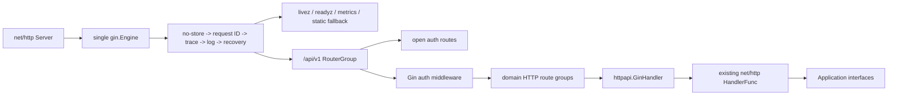

# Gin HTTP Migration Design

## 1. Design Objective

在不改变公开 HTTP、安全、SSE、上传下载和领域行为的前提下，用唯一 Gin Engine 替换 Chi Router，并让框架耦合止于
HTTP/Composition 边界。最终代码必须删除 Chi 依赖和迁移适配，不以重写全部业务 Handler 为迁移成功的必要条件。

## 2. Constraints And Evidence

- 公开 wire 事实源是 `api/openapi/openapi.json`；当前冻结基线为 SHA-256
  `e08fc4686bbaa2fa2a522a7ff9d394ca5362310b6e9f9a7266b5f2bedd88a928`、154 paths、182 operations。
- `internal/app/router.go` 是唯一生产 HTTP Composition Root；现有 25 个领域/认证 Handler 注册 179 个 operation，
  app 自身注册 `/livez`、`/readyz`、`/api/v1/system/status` 3 个 operation，合计与 OpenAPI 182 个 operation 对等。
  `/metrics` 是依赖存在时注册、但不属于该 OpenAPI operation 集合的运维端点。
- Gin `v1.12.0` 官方源码确认提供 `gin.New`、Router Group、`NoRoute`、`NoMethod`、
  `HandleMethodNotAllowed`、`WrapF`/`WrapH`、route introspection、validator binding 和实现 `http.Flusher` 的 ResponseWriter。
- Gin 默认尾斜杠重定向、默认 404/405 body、默认 logger/recovery 和自动 binding response 都不能直接采用，因为会改变既有契约。
- 项目已有 `internal/httpapi` 的严格 JSON、Problem 和 `go-playground/validator/v10` 直接依赖；框架迁移不得建立第二套错误或校验事实源。

## 3. Mature Framework Gate

Gin 是用户和路线图明确批准的硬约束；本设计仍按 ADR-0019 检查标准库、当前 Chi 方案和 Gin 的覆盖边界。

| 加权需求 | 权重 | Gin 覆盖 | 说明 |
| --- | ---: | ---: | --- |
| 路由、分组、参数、404/405 | 20 | 20 | Engine/RouterGroup/NoRoute/NoMethod 原生覆盖 |
| `net/http`、SSE、上传下载互操作 | 15 | 15 | 官方 WrapF/WrapH，Writer 保留标准接口 |
| Middleware 顺序、状态和 recovery | 15 | 12 | 链和 Writer 状态原生覆盖；脱敏日志/Problem recovery 保留项目策略 |
| JSON binding 与 validator | 20 | 14 | validator 原生集成；项目严格 Unicode/body/single-document 规则必须保留 |
| runtime route inventory 与测试 | 10 | 10 | `Engine.Routes()` 可直接枚举 method/path |
| Go 版本、维护、文档、许可证 | 10 | 10 | v1.12.0、Go 1.25、MIT、官方文档/测试满足当前基线 |
| 生态与团队复用 | 10 | 10 | 符合用户选择和后续 Gin 生态方向 |
| **合计** | **100** | **91** | 超过 80%；差异只保留项目安全/契约策略和薄适配 |

强制项结论：Gin 与 Go 1.25.4、现有部署和 `net/http` Server 兼容；框架类型可隔离在 HTTP/Composition；
严格 JSON、Problem、安全门禁、SSE 和测试可通过公开扩展点保持。因此采用 Gin，不引入另一个 Router 框架。

## 4. Target Architecture



### 4.1 Engine Configuration

使用 `gin.New()`，不使用 `gin.Default()`。创建时显式设置：

- `RedirectTrailingSlash = false`
- `RedirectFixedPath = false`
- `HandleMethodNotAllowed = true`
- `RemoveExtraSlash = false`
- `UseRawPath = true`、`UseEscapedPath = false`、`UnescapePathValues = false`，保持 Chi 对 `RawPath` 和编码参数的处理基线
- `ContextWithFallback = false`，Application 只接收 `Request.Context()`
- `ForwardedByClientIP = false`、`RemoteIPHeaders = nil`、`TrustedPlatform = ""`，并执行 `SetTrustedProxies(nil)`；项目当前不依赖 Gin `ClientIP`

`NoRoute` 先兼容 Chi 对不支持 HTTP method 的 405 语义，再根据 `/api/` 前缀选择稳定 API Problem 或现有静态资源 fallback；
`NoMethod` 删除 Gin 自动增加而 Chi 基线没有的 `Allow` Header，并写项目 `METHOD_NOT_ALLOWED` Problem。所有默认 Gin 文本错误正文被禁用。
不使用 Gin `StaticFS`，以免改变静态 fallback、HEAD 行为和 runtime route inventory。

### 4.2 Route Registration And Handler Bridge

- 每个 HTTP Handler 的 `Routes`/`OpenRoutes`/`ProtectedRoutes` 接受 `gin.IRouter`。
- 路由方法改用 `GET/POST/PUT/PATCH/DELETE`。所有动态参数先统一为 OpenAPI 的 canonical snake_case 名称，再从
  Chi `{workspaceID}`/`{workspace_id}` 等混合语法改为 Gin `:workspace_id`；这是必要条件，因为 Gin 会对同一动态分支的不同参数名 panic。
- `internal/httpapi.GinHandler(http.HandlerFunc)` 预先调用官方 `gin.WrapF`；请求进入业务 Handler 前，把
  `gin.Context.Params` 写入 Go 标准库 `request.SetPathValue`。业务 Handler 使用 `request.PathValue`，不依赖 Gin Context。
- 该 bridge 不做路由匹配、错误处理、binding、鉴权或 Middleware 组合，因此不是第二套 Router；最终只保留这一处 Gin/stdlib 互操作边界。
- 日志把 Gin `:id` route template 规范化为 OpenAPI canonical `{id}` 形式，继续避免实际 path 进入日志。

### 4.3 Middleware

- app 全局 Middleware 改为 `gin.HandlerFunc`，使用 `Context.Next/Abort`。request log 安装嵌入 `gin.ResponseWriter` 的显式
  response-start tracker，记录 Handler 对 `WriteHeader/Write/WriteString/Flush` 的调用，并保留 Flusher/Hijacker/Pusher/Unwrap 能力。
- auth Middleware 改为 Gin Middleware；认证成功后只把 Principal 写入 `request.Context()`，Application 调用方式不变；
  失败先写既有 Problem，再 `Abort()`。
- panic recovery 保留现有 bounded stack、敏感信息约束和 `http.ErrAbortHandler` 特例；started 判定使用上述 tracker，避免 Gin
  延迟提交 `WriteHeader(204)` 或预加载 404/405 导致误判。响应已经开始时只记录脱敏日志，不追加 500 Problem。
- Review 的 no-store group Middleware 改为 Gin group Middleware；其他业务 Handler 不新增框架 Middleware。

### 4.4 Strict JSON And Validator

- 不使用会自动写 400 的 `Bind*`；`internal/httpapi.DecodeJSON` 继续拥有 body 大小、Unicode、unknown field、single-document 规则。
- 在 `internal/httpapi` 增加并发安全的 validator helper，使用 `validator.New(validator.WithRequiredStructEnabled())`。
- 只把已有明确错误映射和测试的通用字段约束改为 `validate` tag，例如正数/范围/集合长度；Handler 仍负责把 validator error 映射成原有
  status/code/message。
- canonical ID、Capability、Workspace ownership、Origin/CSRF、跨字段组合和领域状态转换继续使用现有项目代码。

### 4.5 SSE, Upload And Download

- SSE、multipart 和下载 Handler 继续接收 `http.ResponseWriter`/`*http.Request`；Gin Writer 通过 bridge 提供
  `http.Flusher` 和流式写入能力。
- 不使用 Gin SSE renderer 改写现有 named-event/message wire，不使用 Gin multipart convenience API 绕过当前大小和文件安全规则。
- 专项测试锁定 response-started recovery、heartbeat/flush、Last-Event-ID、Content-Disposition 和 multipart 上限。

## 5. Migration Batches

1. **Baseline and shared boundary**：冻结 OpenAPI/hash/route count，增加 Gin bridge、validator helper 和配置契约测试。
2. **Composition and security**：迁移 app Engine/global Middleware、auth routes/Middleware、404/405/static/metrics。
3. **Domain routes A**：Workspace、Workflow、Change Control、Collection、Health、Ingestion、Retrieval、Graph/Candidate。
4. **Domain routes B**：Conversation、Events、Knowledge、Artifact、Authoring、Capture、Organizing、Document History、Git Sync、Model Settings。
5. **Domain routes C**：Export、Review、Learning Path、Memory、Interview，并验证 SSE/upload/download 特殊边界。
6. **Tests and cleanup**：迁移所有测试 Router，建立 Gin runtime/OpenAPI route inventory，删除 Chi import/dependency/vendor，更新文档。

批次可由不同子代理修改互不重叠的领域目录；主会话负责共享 `internal/httpapi`、`internal/app`、`internal/auth/http`、
当前脏改的 `internal/modelsettings/http`、依赖文件、集成与最终审查。最终提交不包含临时 Chi/Gin 双 Router。

## 6. Compatibility And Data Flow

请求数据流保持：

```text
net/http request
  -> Gin route match and global middleware
  -> auth/security middleware
  -> GinHandler sets stdlib PathValue
  -> existing strict decode and HTTP DTO mapping
  -> Application interface
  -> existing Problem/JSON/SSE/file response
```

不修改数据库、领域对象、Application command/query、Repository、Workflow、OpenAPI DTO 或前端 decoder。Gin Context
不跨过 Handler 路由注册和 Middleware；Principal、trace、request ID 继续通过标准 `context.Context` 传递。

## 7. Rollback And Release

- 开发期间按文件批次验证，但最终分支始终收敛为单 Gin Engine；不提交临时双 Router adapter。
- 发布回滚使用迁移提交的整体 revert，并重新构建原 Chi artifact；无数据库迁移或数据回滚。
- 若某领域批次行为不对等，先回退该批次源码并保持旧部署，不用 fallback Router 掩盖失败。
- 发布前以 runtime route/OpenAPI 对比、全仓测试和安全/SSE/文件专项门禁证明可切换；未通过时不更新路线图完成态。

## 8. Risks And Mitigations

| 风险 | 缓解 |
| --- | --- |
| Gin 默认 redirect/错误正文/Allow Header 改变契约 | 显式 Engine 配置和 404/405/尾斜杠/unsupported method 测试 |
| 混用 camelCase/snake_case 动态参数导致 Gin 注册 panic | 全量使用 OpenAPI snake_case 参数名；测试断言 NewRouter 不 panic |
| `:id` 模板进入日志或 Capability 漂移 | 日志规范化为 OpenAPI `{id}`；Capability 继续使用既有显式表和原始 path matcher |
| Gin 延迟 WriteHeader 使 response-started recovery 误判 | 显式 tracker 及 200/204/Write/Flush/NoRoute panic 专项测试 |
| 自动 binding 放宽严格 JSON | 不使用自动 response binding；保留 strictjson/httpapi owner |
| 大规模机械修改漏文件 | runtime route inventory、Chi 全仓零命中、go list/test/vet/tidy/vendor 门禁 |
| 当前 Model Settings/OpenAPI 脏改被覆盖 | 主会话独占重叠文件，修改前后审阅用户 diff并只做增量编辑 |
| Gin 依赖扩大 vendor | 锁定 v1.12.0，`go mod tidy -diff`、vendor 一致性和构建验证 |
