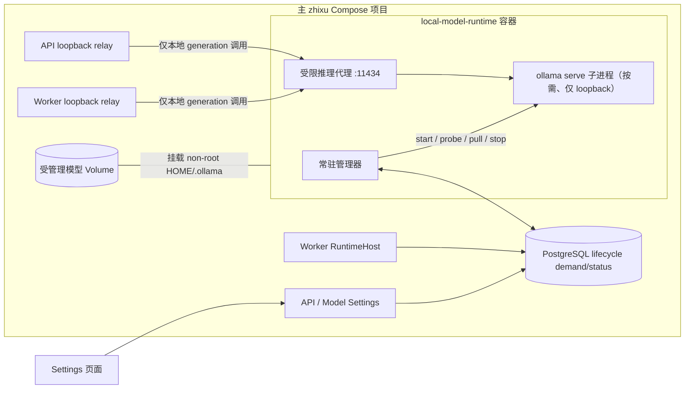

# 技术设计

## 1. 设计结论

采用一个属于主 `zhixu` Compose 项目的 `local-model-runtime` 管理容器。容器内常驻一个低内存管理器，并把 `ollama serve` 作为唯一、按需启动的受管子进程；模型权重存放在独立的 project-owned Docker Volume，通过 non-root HOME `/var/lib/zhixu/ollama/.ollama` 挂载给同一容器。

```text
主 zhixu 项目
├─ app
├─ worker
└─ local-model-runtime  小型管理容器
      ├─ 管理器进程
      ├─ ollama serve   需要本地模型时才启动
      └─ 挂载 /var/lib/zhixu/ollama/.ollama
             │
             └─ Docker Volume，里面保存模型文件
```

这不是“小型管理容器 + 第二个 Ollama 容器 + 第三个存储容器”。实际只有一个新增的长期 Compose service：

| 层次 | 形态 | 生命周期 | 责任 |
|---|---|---|---|
| 控制面 | `local-model-runtime` 容器内的管理器进程 | 随主 `zhixu` 项目常驻 | 观察持久需求、启动/停止子进程、下载模型、上报进度与故障 |
| 计算面 | 同一容器内的 `ollama serve` 子进程及其 model runner | 仅在有效本地需求存在时运行 | 提供 Chat/Embedding Ollama API，加载模型并执行推理 |
| 数据面 | project-owned Docker Volume | 独立于容器和进程持久存在 | 保存模型 manifest/blob；停止服务、切换线上或重建容器均不删除 |

该结构是当前约束下的最佳适配方案，而不是所有 Ollama 部署的普遍唯一方案。它用一个小型常驻控制面换取设置页即时自动化，同时避免业务容器获得 Docker 权限，也避免恢复宿主机常驻 daemon。若产品只允许 launcher 命令后生效，或允许 API 直接控制 Docker，结构可以更少；但这两种前提都与本任务已确认需求冲突。

“小型”特指全线上稳态的常驻进程内存，不表示镜像或模型磁盘很小。当前 legacy 官方 `0.9.6` arm64 image 约 3.62 GB，最终镜像和模型卷继续占磁盘；本任务解决的是不使用本地模型时约 700 MiB 的常驻运行内存。

## 2. 为什么三层不是重复

### 2.1 管理器必须比 `ollama serve` 活得更久

用户要求在 Settings 的 Test/Apply 发生时立即启动本地能力，并在所有有效需求消失后自动停止。`./zhixu up` 完成后会退出，API/Worker 又不能获得 Docker Socket，因此必须有一个持续存在的、权限窄于 Docker 的执行者。

管理器只负责生命周期和状态，不执行模型推理。它在全线上稳态仍运行，但不启动 `ollama serve`，所以不会保留当前观测到的约 700 MiB Ollama 空闲 RSS。管理器空闲 RSS 必须通过真实 Compose 验收记录，不能仅以“Go 进程通常很小”作为容量承诺。

### 2.2 `ollama serve` 必须能独立停止

当前实测表明 `/api/ps` 为空、模型 `keep_alive=0` 时，`ollama serve` 自身仍约占 700 MiB；只卸载模型不能完成释放内存的目标。因此重型服务必须是管理器能够启动、监护和完整终止的子进程，而不能同时作为容器 PID 1 永久运行。

管理器停止时先只向 `ollama serve` PID 发送 SIGTERM，让 Ollama 自己关闭 HTTP、卸载并等待 model runner；仅在内部 grace 超时后才向独立 PGID 发送 SIGKILL 兜底。确认端口关闭、`Wait` 完成且无 serve/runner 残留后才报告 `stopped`。

### 2.3 Volume 必须比两种进程活得更久

模型权重是磁盘数据，不应与运行内存或容器 writable layer绑定。Volume 挂载后，`ollama serve` 每次启动都直接读取同一 `/var/lib/zhixu/ollama/.ollama`；模型缺失时自动 pull 也写入这里。停止服务不会复制、移动或删除模型，下次启动可以直接复用。

Volume 本身不运行进程，不占用模型推理内存；它只持续占用磁盘。普通线上/本地切换不得自动 prune，只有显式 reset/清理流程才能删除经 ownership 验证的受管理卷。

## 3. First-Principles Constraints

1. `desired` 只是已保存配置；只有 active、live activation、连接测试和仍被持有的 generation 才能形成运行需求。
2. online -> local 必须先启动服务、准备 exact 模型并通过生产 Adapter Probe，才允许 target 进入 prepared/commit。
3. local -> online 不能只看 active revision；旧 generation 的在途 Workflow、Search、Reindex 或历史 acquire 释放前仍可能访问 Ollama。
4. API/Worker 不能挂 Docker Socket、调用任意宿主命令或决定容器/卷/image 名称。
5. Settings 请求、浏览器轮询或单个 API 进程崩溃不能成为生命周期事实源；下载进度与需求必须持久化并可恢复。
6. Chat 与 Embedding 共用一个 Ollama 服务；任一需要即运行，两者和所有 lease 都不需要才停止。
7. 终止运行时只释放内存，不能隐式删除模型数据；旧数据迁移必须可回滚。

## 4. Deployment Topology

### 2026-08-14 Implementation Status And Release Blockers

以下是实现盘点，不改变本设计的目标拓扑或最终契约。

| Area | Current implementation | Release status |
|---|---|---|
| 容器与网络 | `compose.yml` 已有 `local-model-runtime`、volume/credential one-shot、non-root/read-only/cap-drop、固定 relay upstream；`external-static` overlay 不连接 lifecycle DB。manager 已在 `:11434` 提供 `/healthz` 与仅 `POST /v1/chat/completions`、`POST /api/embed` 的代理，child 固定 loopback `:11435`。 | 当前 Docker Desktop 的 disposable Compose 已用受控 HTTPS fixture 验证五种线上/本地模式、全线上 child absence、单 child 和 idle 内存；仍缺原生 Linux、Docker daemon restart、显式强制 crash/signal/reap 和真实公网出口。 |
| 生命周期基础 | `internal/localmodelruntime` 已有单 child manager、TERM/PGID-KILL/Wait、DB-time manager lease、demand union、pull/progress persistence、empty-demand stop 和 operation/hold CAS。每次 Pull 前由 PostgreSQL 原子递增 `attempt_no`，最多 3 次；`created_at + 6h` 的 DB-time sweep 会终结 queued 至 probing 的非终态 operation 并同事务释放 hold。`ready` 明确为 production probe 前的非终态。空卷遇到 active 本地 revision 时，只能由固定数据库函数从当前 active settings 推导并 seed `active_recovery` operation，manager 不能提交任意模型。 | 管理容器重启、cached model复用和 `child_epoch` 单调恢复已通过真实 Compose；仍缺 resolved digest set 的 ready binding、child crash 和 Docker daemon recovery 验收。 |
| 设置与 Test | Chat/Embedding 已有显式 `ollama` provider、固定 relay、无 Key；本地 Test 以 `Idempotency-Key` seed/join持久 operation + hold，ready 后由 DB-time lease 保证唯一 production probe；并发 joiner 等待，取消后回到 ready。 | 仍是同步 HTTP；缺 202/poll/刷新恢复和同 Session/target supersede，不能关闭 AC11/AC12。 |
| Activation/generation | `RuntimeHost` 的 generation hold 创建/续租/释放已接入；StartActivation 同事务 seed operation + preparation hold，arming 前验证 exact ready，Finalize/Fail/expiry 终结并释放。 | disposable Compose 已证明正常 online -> local 与 local -> online 最终停止；仍需证明 pre-commit 本地准备失败和旧 generation 在途期间不得提前停止。 |
| 用户投影与迁移 | Snapshot/OpenAPI/strict Web 已投影 local runtime/latest operation/progress/error；launcher 已实现 exact legacy 检测、显式确认、只读复制、marker/空间校验、目标 Probe、失败恢复和旧卷保留。 | 单一 latest operation 不能完整表达 active-ready 与 candidate-progress 并存；legacy 流程只有 fake-Docker 契约，尚无真实 `0.9.6 -> 0.32.9` store/多架构验收，AC13 仍是发布阻塞。 |

数据库权限按窄 port 落地：migration `00080` 创建专用 NOLOGIN role，只授予 lifecycle 状态读取、settings state 限定列和
`managed_ollama_revision_requirements` 投影视图读取；该视图不暴露 Endpoint 或 Secret。manager 的十条写路径只能调用固定
`SECURITY DEFINER` 函数，函数固定 `search_path` 并执行 owner/epoch/version/phase CAS。operation claim 本身不能创建需求；
API/Worker seed Test/Activation，active recovery 则只能由数据库从当前 active settings 推导。恢复失败会稳定重放；明确成功后
若同一模型再次缺失，才创建下一 recovery generation。migration 与 credential-init 都拒绝危险角色属性或任意 membership。已在 disposable PostgreSQL 18 完成
迁移、角色 ACL、函数 `search_path`/PUBLIC 检查和 lifecycle CAS 烟测；并发 CAS 和剩余发布环境门禁仍需单独验收。

### 2026-08-14 Docker Desktop Evidence

直接运行 `./deploy/managed-ollama-compose-smoke.sh` 的隔离验收结果如下；脚本使用独立 Compose project、数据库和模型卷，结束时
精确清理测试资源，不接触主项目数据。

| Scenario | Observed result |
|---|---|
| 受控 HTTPS 线上 fixture -> Chat 本地 -> Embedding 本地 -> 两者本地 -> 受控线上 fixture | 五段均成功；线上段无 child，本地段只有一个 `ollama serve`，Chat/Embedding 共用该 child。 |
| 模型复用 | 已缓存模型 identity 保持一致，重启管理容器后没有新增 pull。 |
| 管理容器重启 | owner 被新 manager 接管，`child_epoch` 不回退，最终恢复一个 ready child；这不等同于 Docker daemon restart。 |
| 全线上 60 秒内存采样 | anonymous RSS 峰值 6.39 MiB，manager process RSS 峰值 9.69 MiB；相对 700 MiB 基线下降 99.1%，满足 AC1 的数值门槛。 |

本证据仅覆盖当前 Docker Desktop 和受控 HTTPS fixture 的正常路径，不证明公网 Provider 出口。原生 Linux、Docker daemon
restart、强制 child crash/进程回收、真实 legacy migration、浏览器刷新和旧 generation 在途栅栏仍按第 13 节作为发布门禁。



### 4.1 网络

- 管理容器加入现有 external `zhixu-runtime` network，并提供固定 Compose DNS alias；不发布 `11434` 到宿主机或 LAN。
- 管理器自身在容器网络端口 `11434` 提供受限推理代理，只允许项目实际使用的 `POST /v1/chat/completions` 与 `POST /api/embed` 及有界请求；pull/show/tags/delete 等管理 API 不对其他容器开放。
- `ollama serve` 绑定另一个固定 loopback-only child port。管理器从 loopback 执行 tags/show/pull/health；受限代理再把批准的推理请求转到 child。
- API/Worker 继续只访问各自 namespace 内的 `127.0.0.1:11434` relay；relay 上游从 `host.docker.internal:11434` 改为管理容器的固定 alias/代理端口。
- Relay listener 可以常驻，但 active 为线上/disabled 时业务 Adapter 不会访问它；`ollama serve` 停止不影响基础 app/worker readiness。
- 当前 Docker Desktop 已由 disposable Compose 验证 anchor namespace 可通过 external network DNS 访问管理容器；原生 Linux
  仍必须单独验证，且两个平台都不得发布 host/LAN 端口。

### 4.2 权限

- `local-model-runtime` 不挂 Docker Socket、Workspace、模型设置 Secret volume 或宿主 bind；不接收任意 shell/argv、image、volume 或容器名。
- 它只拥有受管理模型卷的写权限、访问 PostgreSQL 窄 lifecycle port 的权限，以及启动固定 `/usr/bin/ollama serve` 子进程的能力。
- manager 使用单独的最小权限 PostgreSQL role，只能调用 lifecycle views/functions并写限定状态；credential通过独立 project-owned secret file/volume交付，不复用app广权限密码，也不挂载模型设置加密Key。
- 目标是 non-root、无 privileged、无额外 device/capability；最终 pinned Ollama image 的 user、volume permission、只读 rootfs 与 `cap_drop` 能力需要用真实镜像验证。
- GPU 设备授权不在 MVP 范围，不根据宿主能力自动扩大权限。

### 4.3 Container Process Contract

- 专用 Dockerfile 以最终批准并 pin tag/digest 的官方 Ollama image为final stage，再复制静态Go supervisor；不能只把一个Ollama binary复制到当前Alpine runtime，因为官方image还包含runner libraries。
- Compose固定 `init: true`，由Docker init作为PID 1；entrypoint直接执行supervisor，不经过shell。supervisor只管理一个fixed child executable。
- 固定 `restart: unless-stopped`、明确 `stop_signal: SIGTERM` 与经smoke校准的 `stop_grace_period`。容器级SIGTERM要求supervisor停止接收新准备、完成child TERM/Wait/PGID-KILL兜底后退出。
- manager与child使用同一non-root UID。child从空环境构造allowlist，不继承manager的DB credential；这避免Secret传播，但不虚构不同UID隔离。若未来要求不同UID，需另行批准root/CAP_SETUID边界。
- child环境只允许固定 `PATH`、`HOME`、loopback `OLLAMA_HOST`、`OLLAMA_MODELS`、`OLLAMA_NOPRUNE=true` 与批准的有界性能项；禁止 `append(os.Environ(), ...)`。
- 增加只运行一次、无network/Socket/Secret的volume-init service，为空managed volume创建schema marker并chown到non-root UID；常驻manager不以root运行。
- manager liveness/Compose health只证明supervisor和窄proxy存活；child stopped是全线上健康态，child readiness只进入PostgreSQL/Snapshot。

### 4.4 Static Overlay Compatibility

本自动生命周期只属于managed Compose模式。base Compose给manager固定、不可由Settings或数据库覆盖的 `ZHIXU_LOCAL_MODEL_RUNTIME_MODE=managed`；static overlay将其改为 `external-static`，同时把两个relay upstream显式恢复为 `host.docker.internal:11434`。

`external-static` 下manager只提供healthy idle/liveness，不连接/claim lifecycle表、不创建operation、不启动child、不pull；static app/worker也不调用managed lifecycle ports。该部署枚举只来自受校验Compose，用户模型字段不能伪造。rendered Compose正负契约与真实smoke必须证明static local配置只访问host Ollama、child始终absent且零pull。

### 4.5 Workspace Root Identity Rebinding

项目运行依赖 Workspace root fingerprint。若同一个 canonical path 的目录对象被替换，普通启动必须先把 Workspace 标记为
`migration_required/WORKSPACE_ROOT_IDENTITY_CHANGED` 并撤销运行时绑定，不能自动接受新目录。唯一恢复入口是宿主 launcher 的
`workspace rebind --confirm REBIND`，且保持原 Workspace ID、root path 和业务引用不变。

重绑定事务固定取得 Workspace ID、旧/新 fingerprint、control state、mutation gate 和 registry/runtime 锁；只有 control/gate
全空、Workspace inactive、所有 Runtime unavailable 且不存在 Git capture checkpoint 时，才能追加一条 immutable binding history，
递增 binding generation，并在同一 PostgreSQL transaction 追加脱敏 `workspace.root.rebound` Audit。History 的 deferred constraint
反向校验 Registry、Audit ID、transaction ID、时间、版本和 fingerprint，避免只写部分事实。提交后仍必须走普通 Workspace switch，
由原有 grant generation 和 runtime registration 机制激活 API/Worker；响应丢失只允许凭 exact history+Audit 幂等恢复。

该路径是 forward-only：产生 history 后 migration Down 必须拒绝。已有 Git capture lineage 不允许靠重绑定重置，必须另行设计可审计的
rebaseline。Launcher 在最终 selection 写入前失败时先停止未提交 Runtime，再按数据库事实恢复；不得创建新 Workspace、级联迁移业务数据
或清理旧记录。

## 5. Durable Demand And Status

### 5.1 单一需求函数

集中定义 `RequiresManagedOllama(settings)`，输出是否需要本地运行时及 canonical exact model set：

- Chat provider=`ollama`：加入 Chat model，固定 `chat_completions` 与系统 Relay，无 API Key。
- Embedding provider=`ollama`：加入 Embedding model，固定原生 `/api/embed` Adapter 与系统 Relay，无 API Key。
- Chat/Embedding 都需要时对模型集合去重，只使用一个服务。
- 新配置不得通过 URL 猜测本地意图；历史 append-only revision 仅保留 exact fixed Relay 的窄兼容读取。
- 该纯函数只在managed settings路径产生lifecycle intent；static配置继续由原有static runtime读取，禁止进入manager demand。
- requirement先以用户的requested model ref形成hash；operation在本地存在/下载并验证后记录resolved manifest digest/size，ready绑定requested hash + resolved digest set。已验证本地副本不因远程tag漂移后台重拉；MVP仅在本地缺失时pull。

### 5.2 PostgreSQL 是持久协调面

不新增可由业务传入命令的 lifecycle HTTP 控制端口。API/Worker 通过 PostgreSQL 的窄 application port 写入/续租需求并读取状态；管理器通过专用投影视图获取 canonical model requirement，并只通过固定 `SECURITY DEFINER` 函数写入有限状态与进度。函数必须保留 owner/epoch/version/phase fence，且不得创建 API/Worker 尚未 seed 的 operation。

持久事实分为：

- singleton manager ownership/heartbeat、requirement version、observed phase、ready requirement hash、稳定错误与 retryability；
- generation/test/preparation hold：owner kind、role/instance、exact revision/operation、canonical model set/hash、DB-time lease；
- async preparation operation：exact target、逐模型 pulling/progress/verified、终态与安全错误。

supervisor 专用数据库 role/credential 属于该安全边界的一部分：独立 credential-init 生成/复用随机凭据，migration 用管理员连接创建 NOLOGIN role；两者都 fail closed 校验危险属性和双向 membership，credential-init 校验后才启用 LOGIN。manager 容器只读挂载该 credential 文件。credential volume 加入 launcher/Compose 精确 allowlist；普通 down 保留，reset 随 managed 项目数据删除。`ollama serve` child 与 manager 同属 non-root UID，但从空环境 allowlist 启动，不继承 credential；该约束防止意外传播，不承诺对恶意同 UID 进程的强隔离。

active revision 与 live rollout 的基础需求由权威 settings state 派生，不复制成第二个 active 指针。hold 只表达无法从 state 推导的 candidate、retiring、historical 与 test 生命周期。

### 5.3 需求集合

每轮一致快照计算：

```text
active/local baseline
∪ preparing|arming|activating rollout 的 previous/target local requirement
∪ fresh API/Worker generation holds
∪ fresh connection-test/preparation holds
= 当前必须保持 ready 的模型集合
```

- desired-only 不参与，Save-only 不 start、不 pull。
- DB 不可达、状态非法或 manager 失去 ownership 时 fail safe：已经运行的 Ollama 不因“不知道”而停止。
- requirement version 使用 CAS/fencing；start/pull/stop 在数据库事务外执行，完成后只有 version 仍匹配才确认 observed 状态。

## 6. Manager And Child State Machine

对外稳定阶段：

```text
stopped -> starting -> pulling -> ready -> stopping -> stopped
              \-----------> failed <---------/
```

管理器本身另有 `fresh|unavailable` 观测，不把 stale 的历史 `ready` 当作当前事实。

### 6.1 Start

1. 取得 singleton manager ownership 并读取 exact requirement version。
2. 若需求为空，保持 child absent。
3. 若需求非空且 child absent，使用固定 binary/env/workdir 启动新进程组；业务输入不能成为 argv 或环境变量名。
4. 等待固定 loopback/version/tags health，通过后进入模型检查。
5. 重复 Ensure 对同一 requirement 合并，不生成第二个子进程。

### 6.2 Pull And Verify

1. 使用 `/api/tags`/`/api/show` 判断 exact 模型是否存在。
2. 缺失模型按 canonical 去重集合串行调用结构化 `/api/pull`，解析有界进度并持久化。
3. 下载结束后重新验证 exact model；随后 API/Worker 使用生产 Chat/Embedding Adapter Probe。
4. 浏览器刷新或 HTTP 断开后按 operation/requirement version 恢复，不重复下载。
5. 只准备当前 Test/activation exact target；不扫描历史 revision，不自动 prune。
6. 每个 pull attempt 默认连续 5 分钟无进度即取消，整个 preparation operation 最多消费 3 次、最长 6 小时。`(operation_id, attempt_no)` 是持久 attempt identity；`attempt_no` 必须在调用 `/api/pull` 前由 PostgreSQL 原子递增，operation 级累计进度不后退。终态 operation 不可重开，显式 Retry 创建新 operation。

### 6.3 Scheduling, Supersede And Terminal Cleanup

- active recovery优先于activation，activation优先于connection test；不同模型串行pull，相同requested ref附着同一in-flight model preparation。
- 同一Idempotency-Key+request hash只join；同key不同hash冲突。
- 新的不同Test draft把同Session/target旧非终态Test标为`superseded`，取消其manager claim/stream并释放test hold；partial blobs保留供未来resume，不自动删除。
- live activation target由rollout冻结，不允许supersede或用户cancel。preparation预算耗尽时operation failed、rollout走现有pre-commit failed并释放target/candidate holds；用户Retry创建新rollout/operation。
- operation terminal/superseded、generation Close或TTL crash recovery都必须exactly-once释放对应hold；active/rollout baseline demand是否仍保活child独立计算。

### 6.4 Stop

只有以下条件同时成立才允许停止：

```text
rollout 已 idle/failed 且没有 live local target
AND active revision 不需要 Ollama
AND API/Worker fresh 且已 applied active
AND 没有 fresh generation/test/preparation hold
AND manager 仍持有匹配 requirement version 的 ownership
```

管理器先标记 `stopping` 并让窄proxy拒绝新的local readiness；只向serve PID发送SIGTERM并等待其主动卸载runner，内部grace超时后才对独立PGID发SIGKILL，随后exactly-once `Wait`/reap并确认端口与进程树清空，最后才CAS为 `stopped`。Stop失败不回滚已经成功的online activation；状态保持retryable failed并继续调和。

### 6.5 Crash Recovery

- manager container 重启：从 PostgreSQL demand 与实际 child absence 重建；需要本地时重新 start/pull/verify，不依赖内存状态。
- child 意外退出：有需求时带退避重启并标记 degraded；无需求时收敛为 stopped。
- DB 不可达：不做 stop；保留已有 child，重连后重新计算。
- 新 hold 与 stop 竞态：hold 先推进 requirement version；即使旧 stop 完成，新调用也必须等匹配新 version 的 ready 后才能访问 Relay。

## 7. Integration With Hot Activation

### 7.1 Connection Test

```text
解析本地 draft
-> 创建持久 test/preparation operation + hold
-> 等 manager ready/pull complete
-> 用生产 Adapter Probe
-> 写入终态并释放 hold
-> 若无其他需求，异步 stop
```

测试不保存 revision，不修改 desired/active/applied。自动 pull 可能超过现有同步请求时限，因此本地测试采用完整可恢复的异步 operation：POST以Idempotency-Key启动/附着operation，manager完成start/pull/verify，API侧有lease的runner再执行生产Adapter Probe并持久化terminal result。远程测试保留现有同步路径。

### 7.2 online -> local Apply

1. StartActivation 冻结 exact target 并进入 `preparing`。
2. target requirement/hold 使 manager start/pull/ready。
3. API/Worker generation factory 在 Build 前等待匹配 requirement hash 的 fresh ready。
4. 两端再用生产 Adapter Build+Probe，成功后 participant 才能 prepared。
5. 后续 arming/commit/applied/finalize 沿用现有两 role 协议；manager 不是第三个 participant。

任何 manager/start/pull/Probe 失败都是 pre-commit failure，previous active/applied 保持不变。

### 7.3 local -> online Apply

- preparing/arming/activating 全程保留 previous local baseline。
- active commit 为 online 后仍等待 API/Worker applied、Finalize 和旧 generation hold 全部释放。
- 最后一个 hold 释放后 manager 异步停止 child；停止失败只影响 local runtime 状态，不反向回滚 online settings。

### 7.4 Historical Generation

本地 historical generation 在不属于 active/candidate/retiring 且 refcount 归零时释放 hold并从历史 resident cache 关闭；未来 exact revision acquisition 必须先重新建立 hold、等待 Ollama ready，再 Build/Probe。不得在 Ollama 已停时直接调用 Relay后 fallback current。

## 8. Settings And Wire Contract

- Chat 与 Embedding Provider 都显式提供 `本地 Ollama`；本地模式不显示可编辑 URL/API Key，只显示“本机（系统管理）”。
- Snapshot 在现有 desired/active/API applied/Worker applied/rollout 之外增加严格的 local runtime 投影，至少区分 desired required、active required/ready、operation phase、target revision、fresh、稳定错误与 retryability。
- UI 分开展示“旧 active 是否仍可服务”和“新 target 是否正在 starting/pulling”，不能用一个徽标覆盖两种事实。
- transitional phase 与 async pull 时继续轮询；刷新、重连和响应丢失均以权威 Snapshot/operation 恢复。
- 对外不返回 Docker/container ID、host path、完整 model inventory、原始 Ollama/Docker output、DSN、Secret 或线上 Endpoint。

## 9. Managed Volume And Legacy Migration

### 9.1 Target Volume

新模型卷由主 Compose project 创建并带 canonical project/volume 与项目 owner/schema labels，经volume-init写入schema marker/chown后，唯一挂载到 `local-model-runtime:/var/lib/zhixu/ollama/.ollama`。普通 `down` 保留卷；只有现有显式 `reset --confirm DELETE` 等价边界才能删除经完整 ownership 验证的 managed volume。child固定 `OLLAMA_NOPRUNE=true`，按需反复启动不得触发未声明的自动prune。

### 9.2 One-Time Legacy Migration

当前 legacy source 为 `zhixu-eino-live-ollama` + `zhixu-eino-live-models`。它们没有新项目 ownership，禁止直接 adopt 或自动删除。

迁移由可信宿主 launcher 执行，不由 Settings/API/manager 容器执行：

1. 检测 exact legacy 名称并验证 image、端口、mount、privilege、device、引用关系；任何额外资源都 fail closed。
2. 要求显式确认，记录 `/api/version` 与 `/api/tags` 的 model name/digest/size、source fingerprint和所需空间；用`statfs`确认destination有足够临时空间。
3. 停止 legacy container，确认旧卷仍存在且 host port 已释放。
4. 创建带完整 ownership 的新 volume；只有destination为空才开始，用固定、无网络、source read-only/destination write-only 的 one-shot helper复制。完成后写含source fingerprint/model snapshot的completion marker；非空但marker缺失/不匹配时fail closed，不盲目merge。
5. 先用同 `0.9.6` 或已在disposable copy证明store-compatible的pin启动新管理runtime，验证tags/digest/size和当前需要模型的生产Probe；存储升级与数据复制不合并成一个不可诊断步骤。
6. 成功后移除旧 container，但保留旧 source volume 为回滚备份；旧卷清理是另一个显式确认操作。
7. 任一步失败时停止/移除新 managed runtime，保留两份数据并尝试恢复 legacy；回滚失败则报告人工恢复，不删除 source。

目标版本对 `0.9.6` 模型存储格式的兼容性必须在 disposable copy 上验证；无法证明时不得在原卷上试升级。重复迁移遇到matching completion marker应幂等返回成功；partial/nonmatching destination必须走明确恢复或清理确认。

## 10. Security Boundary

- 浏览器只提交 model settings/operation 意图；不能选择 container、volume、binary、argv 或 Docker 动作。
- API/Worker 只通过 typed lifecycle port 和现有 Relay使用本地模型；不获得 Docker Socket或宿主命令能力。
- manager 接收的模型名必须经过 canonical grammar/长度校验并仅进入 Ollama JSON request；不能进入 shell、label、path 或 Compose参数。
- manager PostgreSQL账号最小授权，只读安全 requirement projection并写 lifecycle state/progress；不能读取 model setting Secret envelope或其他业务表。
- 网络代理只允许批准的method/path/body/response范围；child原生管理API只绑定loopback，其他项目容器不能调用pull/delete或任意Ollama路径。
- 日志/HTTP/数据库状态不保存 Secret、完整 Endpoint、上游正文、Docker stderr、host path或任意命令文本。

## 11. Alternatives Considered

| 方案 | 结果 | 未采用原因 |
|---|---|---|
| 主 Compose 小型管理容器 + 按需 child（本方案） | Settings 即时自动化；重进程可完全退出；无 Docker Socket/宿主 daemon | 接受一个小型常驻进程，并需实现窄 supervisor |
| 宿主机常驻 lifecycle agent | 可让整个 Ollama container 不存在 | 重新引入 launchd/systemd、PID/log/凭据/升级/休眠恢复，修订 ADR-0020/0022 范围更大 |
| launcher-only Compose profile | 架构最少 | 只能在下次 `./zhixu up/restart` 收敛，不能响应 Settings Test/Apply |
| Docker Socket controller container | 可以启停独立 Ollama container | Socket 近似宿主控制；参数级 ownership难限制，违反现有硬门禁 |
| 永久运行官方 Ollama container，仅卸载模型 | 实现简单 | 实测空闲 `ollama serve` 仍约 700 MiB，不能解决问题 |

## 12. Compatibility And ADR

- 不重写历史 append-only settings revision；新增显式 Chat provider=`ollama`，旧 `openai-compatible + exact fixed Relay` 仅兼容读取/重建。
- 本地 Chat MVP 固定 `chat_completions`；不因最新文档支持而假定 legacy/目标镜像支持 Responses。
- 正常 Settings Apply 不重启 API/Worker/PostgreSQL；manager 作为主项目的可选 capability控制面，基础线上/disabled Settings 不以 Ollama ready 为前置。
- 实施时新增 ADR，明确本方案补充 ADR-0020 的 one-shot host boundary与 ADR-0022 的“无新增独立模型微服务”约束：manager不托管Web、不拥有Docker，也不代理线上/通用业务；它只提供固定Chat/Embedding窄代理并管理同容器固定子进程。

## 13. Release Gates And Technical Probes

以下不是待用户决定的产品问题，但在实现合并前必须用真实环境证明：

1. pinned Ollama版本与 legacy `0.9.6` volume copy的只读兼容性；失败时 migration必须 fail closed。
2. 专用官方base image在arm64/amd64上的non-root、volume-init/permission、`init:true`、signal/process-group、child runner回收、只读rootfs和`OLLAMA_NOPRUNE=true`能力。
3. Docker Desktop与原生 Linux下，anchor namespace relay到 Compose DNS alias的连通性和LAN不可达性。当前 Docker Desktop 已通过；原生 Linux待验收。
4. all-online稳态不存在 `ollama serve`/runner；60秒多点采样证明supervisor idle process/cgroup anonymous RSS不高于64 MiB且相对约700 MiB基线下降至少80%。当前 Docker Desktop 已以6.39 MiB anon、9.69 MiB manager RSS通过；raw Docker total因page cache只作辅助，不给整个active container设置64 MiB limit。
5. Chat-only、Embedding-only、两者本地共享实例、online↔local、long in-flight lease 和自动 pull 恢复的真实 Compose smoke。受控 fixture 正常切换已通过；long in-flight 与失败路径待验收。
6. legacy迁移复制、校验、回滚、磁盘不足、目标版本不兼容和旧卷保留。
7. managed/static rendered Compose分别保持manager DNS与legacy host upstream语义；manager、volume-init、credential-init和legacy-copy one-shot均进入exact service/volume allowlist与down/reset测试。
