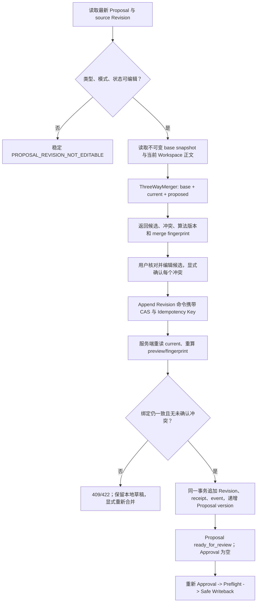

# Proposal Revision 编辑与三方合并技术设计

## 1. Design Objective

在不增加第二条正式写入路径的前提下，为普通 `file_patch/REPLACE` Proposal 补齐两类能力：

1. 在 `ready_for_review` 状态编辑当前 Proposal，创建新的不可变 Revision。
2. 在目标文件相对旧 Revision 基线发生漂移、Proposal 进入 `needs_revision` 后，通过服务端三方合并形成新 Revision。

新 Revision 仍必须重新审批，并继续沿用现有 Approval、Apply Preflight、Write Authorization、Safe Writeback、Git CAS、Commit 和索引链路。本设计不改变 `restore_document` 的严格恢复语义，也不扩展结构化 Proposal。

## 2. Current Constraints

- `proposal_revision` 已按 `(proposal_id, revision_no)` 唯一且禁止更新/删除，但创建路径只写 `revision_no=1`，Repository 没有追加 Revision 命令。
- Proposal 领域已有乐观锁 `version`，但当前 Proposal HTTP/Web detail 没有暴露该字段。
- Proposal 没有显式 `current_revision_id`；Repository 通过 `ORDER BY revision_no DESC` 推断最新 Revision，数据库无法把“当前 Revision 已切换”和 Proposal CAS/状态变化约束为同一事实。
- 当前只保存 `base_hash`，没有保存生成 Revision 时的精确基线正文；SHA-256 不能还原正文，已经漂移的历史 Revision 不能凭当前文件或 Git 猜测 base。
- `GetProposal` 只投影最新 Revision 及其 Approval，没有历史 Revision list/detail，因此“旧 Revision、Diff、Approval 可读”尚无 API 支撑。
- `workflow_run_id` 当前不可变地绑定在 Proposal 上。一个 Proposal 创建第二个可审批 Revision 后，Proposal 级唯一绑定无法表达每个 Approval 各自的 Workflow。
- 当前 Web 只展示 `current -> proposed` 双向 Diff；漂移时禁用批准并要求重新生成。
- 当前审阅正文上限是 1 MiB；Safe Writeback 的结果正文上限是 10 MiB。首期合并继续使用 1 MiB 审阅上限，避免一次响应同时返回多份大正文。

## 3. Decisions

| 主题 | 决定 | 原因 |
| --- | --- | --- |
| 合并规则归属 | Domain/Application 定义绑定与校验，Adapter 执行成熟三方合并实现 | 浏览器不能成为一致性事实源；第三方类型与冲突标记不能泄漏进 Domain |
| 合并引擎 | 复用运行环境已有 Git CLI，固定 `git-merge-file/diff3/myers/marker32/v1`，封装为窄 `ThreeWayMerger` port | 项目已依赖 Git CLI；覆盖文本 diff3、非重叠自动合并和冲突检测，无新增 npm/Go 依赖 |
| 前端编辑器 | 复用现有 Monaco runtime，抽取共享 `MonacoTextEditor`；不使用不存在的 Monaco MergeEditor API | 保持现有模型 URI、worker、detach/dispose 和懒加载契约 |
| Revision 写入 | 只追加，不更新旧 Revision；新 Revision 的 base 固定为创建命令观察到的当前 Workspace 正文 | 保留审计历史，同时让下一次 Approval/CAS 有新的精确基线 |
| 当前 Revision | Proposal 增加显式 `current_revision_id`，所有审批、授权和执行新能力都要求 exact Revision 等于该指针 | 防止用最大序号推断，也防止旧 credential 在新 Revision 再批准后复活 |
| 合并预览 | 无持久副作用的服务端预览；客户端不上传 base/current/proposed | 三份输入全部来自服务端权威事实，避免伪造绑定 |
| 预览绑定 | 使用可重算的版本化 `merge_fingerprint`，绑定 Proposal/version/source Revision/三份内容哈希/算法版本/冲突集合 | Append 时服务端重读 current、重算预览和 fingerprint，无需信任客户端 token |
| Workflow 归属 | 新增 Approval/Revision 级不可变 Workflow binding；Proposal 级字段仅作为 legacy 兼容投影 | 一个 Proposal 可以有多个历史 Approval/Workflow，最新投影不会误用旧 Workflow |
| 草稿持久化 | 未提交正文只放组件内存；成功创建的 Revision 是唯一恢复边界 | 正文不得进入 URL、Browser Storage、日志或遥测 |
| 历史兼容 | 新 Revision 必须保存精确 base snapshot；无 snapshot 的 legacy Revision 仅在 `current_hash == base_hash` 时可临时以 current 作为 base，否则稳定拒绝并要求重新生成 | 不伪造历史基线，也不修改旧 Revision |

成熟方案门禁结论：`git merge-file` 满足确定性文本三方合并、冲突结果、现有部署可用、固定命令参数和可测试性等强制要求，且覆盖主要需求；Monaco 没有稳定三方合并 API，自研 diff3 的正确性和维护成本不合理，因此不采用前端或自研核心合并算法。

## 4. End-to-End Flow

## 5. Domain And State Model

### 5.1 Editable source

首期只接受满足全部条件的最新 Revision：

- Proposal type 为普通 `file_patch`，`target_mode=REPLACE`。
- source Revision 是该 Proposal 当前最新 Revision。
- Proposal 状态为 `ready_for_review` 或 `needs_revision`。
- Proposal 未进入 `applying/applied/verifying/completed`、失败补偿、回滚或人工恢复边界。
- `needs_revision` 若曾绑定旧 Workflow，必须先通过 Workflow owner 请求安全取消并等待终态；不存在执行时可继续，有执行时只接受已归约为 `needs_revision`、无人工恢复、无 Proposal Commit 的精确旧 execution。

`rejected/deferred/cancelled` 的重新打开、`CREATE_ONLY`、`restore_document` 和结构化 Proposal 留到后续任务。

### 5.2 Transition

新增单一领域命令 `AppendFileRevision`，它拥有以下状态变化：

- `ready_for_review -> ready_for_review`：编辑当前待审 Revision。
- `needs_revision -> ready_for_review`：完成三方合并并重新进入审阅。

命令成功时 Proposal `version + 1`，Revision `revision_no + 1`，最新 Approval 必须为空。旧 Approval、Workflow、Authorization、Preflight、Writeback facts 保持历史可读，但不能投影为新 Revision 的事实。

### 5.3 Revision invariants

- 新 Revision 的 `target_path`、`target_mode` 与 Proposal 固定目标一致。
- 新 `base_hash` 是 append 时服务端读取的 exact current hash；base snapshot 正文与该 hash 对应。
- 新 `content` 是用户提交的完整最终候选；Evidence Summary、Risk narrative 和 Rollback Plan 重新绑定并参与请求哈希/审计。
- Proposal 级 `risk_level` 首期保持不变；用户只能修订 Revision 自由文本风险说明，避免跨 Revision 改写聚合级风险事实。
- `source_revision_id/source_change_hash` 必须指向同 Proposal 的直接前驱；不允许从历史 Revision 分叉。
- Change Hash 按现有 `file_patch/REPLACE` 规则重新计算，不能由客户端提供结果值。

## 6. Persistence Design

只新增前向 migration，不修改已发布 migration。

### 6.1 Explicit current Revision

在 Proposal 增加非空 `current_revision_id`，迁移按唯一最大 `revision_no` 回填，并用 deferred composite FK 绑定同 Proposal 的 Revision。所有 typed Proposal 创建事务都要写入初始 Revision ID；所有 detail/list/Approval/Authorization/Writeback 查询改为 exact pointer join，不再用 `ORDER BY revision_no DESC` 决定执行身份。

数据库 Proposal transition trigger 增加受限 append 分支：只有指针从 source 切到同 Proposal 的 `revision_no+1`、Proposal `version+1`、类型/mode/path/source status 全部合法时，才允许 `ready_for_review|needs_revision -> ready_for_review`。普通同状态 update 继续拒绝。

### 6.2 Immutable text snapshot

新增一张与普通文本 Revision 1:1 的不可变 snapshot 表，保存：

- `proposal_id`, `revision_id`, `base_hash`
- `base_content`, `base_byte_size`
- `captured_at`

通过复合 FK 绑定 `proposal_revision` 的 Proposal/Revision/base hash，并用 trigger 禁止 update/delete。新建普通 `file_patch/REPLACE` Proposal 时，Application 从受控 Workspace 一次读取 base bytes+hash，验证调用方 base hash 后，与 Revision 同事务落库。新 Revision 则把 append 时读取的 current 保存为新的 base snapshot。

强制 snapshot 捕获只适用于每份正文不超过 1 MiB 的三方合并能力。现有 1–10 MiB Proposal 的创建、审批和只读合同不因本功能收窄；这类 Proposal 的 `revision_capability` 必须明确为不可合并，preview/append 在 snapshot 可用性判断之前返回稳定 `413 PROPOSAL_REVISION_INPUT_TOO_LARGE`，不得静默截断或切换算法。

迁移前 Revision 不回填猜测内容。读取历史时返回 `base_available=false`；若当前正文仍精确匹配其 `base_hash`，merge preview 可以把本次权威读取作为临时 base，但不把 read endpoint 变成隐式写命令。

### 6.3 Immutable lineage

为 `revision_no > 1` 保存不可变 lineage：

- 新 Revision、source Revision 与 source Change Hash
- `DIRECT_EDIT` 或 `THREE_WAY_MERGE`
- merge algorithm version 与 merge fingerprint
- 创建时间

数据库 FK 保证前驱属于同一 Proposal；唯一约束禁止同一 source Revision 产生两个后继，从持久层阻止并发分叉。

### 6.4 Idempotency receipt

新增 Proposal-scoped Revision command receipt：

- `(proposal_id, idempotency_key)` 唯一
- request hash 绑定 expected Proposal version、source identity、expected current hash、fingerprint、最终正文的 exact UTF-8 bytes 和元数据；不得沿用会把 CRLF/LF 视为同一请求的创建期 canonicalization
- result Revision ID 唯一

同键同 request 返回同一 Revision；同键不同 request 返回 `IDEMPOTENCY_KEY_REUSED`。先查 receipt，再判断当前状态，保证提交成功但响应丢失时仍可 exact replay。

### 6.5 Per-Approval Workflow binding

新增不可变 `proposal_revision_dispatch`，至少绑定 Workspace、Proposal、Revision、Approval、Workflow Run 和创建时间；Revision/Approval/Workflow Run 均唯一。迁移必须从旧 Workflow 的 safe-writeback node input 解析 Proposal/Revision/Change Hash，再与 `proposal.workflow_run_id` 和 Approval 交叉验证后回填；不得猜测“最新 Approval”。任一孤儿或多义绑定使迁移/feature gate fail closed。

新代码的 detail/list/replay/writeback projection 均从“当前 Revision 的 Approval -> dispatch binding”读取 Workflow，不再把 Proposal 级字段视为当前事实。Proposal 级字段暂时保留用于滚动兼容和历史取证，后续独立 contract migration 才考虑移除。

### 6.6 Append command and old-execution fence

Workflow 安全取消是 append 的前置步骤，不属于 Revision Repository：漂移检测以 expected Proposal version/current Revision 原子推进 `needs_revision`，随后调用 Workflow owner 请求取消；旧 Run 未到 `cancelled|failed` 等允许终态时，append 返回 `PROPOSAL_REVISION_WORKFLOW_ACTIVE`。

PostgreSQL UoW 先用 Workspace/idempotency key advisory lock 查询 receipt，再沿用既有 `Authorization -> Proposal -> Workflow` 锁序，避免与 Atomic Begin 反向死锁。事务内：

1. 重验 source 等于 `current_revision_id`，并核对 Proposal version/status/type/mode。
2. 撤销 source Revision 仍为 `issued` 的全部 Authorization；`consumed` 必须能对应唯一 exact execution，否则 fail closed。
3. 不存在旧 Workflow/Authorization/Execution 时可继续；存在旧 Run 但无 execution 时要求旧 Run 已终态；有 execution 时只接受 `needs_revision`、`manual_recovery_required=false`、无 Proposal Commit 的精确事实，其余状态拒绝。
4. 插入 Revision、snapshot、lineage、receipt，并 CAS 更新 Proposal current pointer/status/version。
5. 追加不含正文和路径的 `proposal.revised` 事件。

任一步失败整笔回滚。Authorization 签发、消费、Atomic Begin 及数据库 trigger 都必须新增 `revision_id = proposal.current_revision_id` 栅栏；历史 consumed/execution 的 exact replay只可返回已有事实，不得签发新 credential、创建新 execution 或重做副作用。

## 7. Merge Engine Boundary

Application 依赖窄接口：输入为受限 UTF-8 的 base/current/proposed 及稳定算法版本，输出为 marker-free candidate、是否 clean、结构化 conflict 和 fingerprint facts。Domain 不接触临时文件、Git argv、exit code 或原始 stderr。

Git Adapter 约束：

- 使用 `exec.CommandContext`，固定调用 `merge-file -p -q --diff3 --diff-algorithm=myers --marker-size=32 -L CURRENT -L BASE -L PROPOSED current base proposed`；禁止 shell、用户 argv、system/global Git config 和网络。
- 临时目录权限 `0700`、文件 `0600`，请求完成后清理；正文不写日志。
- 合同常量固定为：每份输入/最终正文 1 MiB、stdout 4 MiB、stderr 64 KiB、最多 1024 个结构化冲突、单次总 deadline 5 秒、每 API 进程最多 2 个并发 Git merge。semaphore 等待计入 deadline 并尊重更短的 caller context；这些值不是运行时自由配置。
- Phase 0 必须在目标 API 镜像用上限与病理 fixture 做双并发基准：30 轮全部在 5 秒内完成，增量峰值 RSS 不超过 128 MiB，并保存 Git version/fingerprint、延迟和 RSS 证据；任一门禁失败都停止在 Adapter 编码前并重新审阅合同，不能现场放宽上限。
- exit 0 表示 clean；1..126 表示相同数量的 conflicts；127 表示至少 127 个 conflicts；其它退出、signal、partial output、超时或超限按下表映射稳定资源/引擎错误，原始 stderr 不出 Adapter。
- 固定 32 字符 marker grammar。任一输入包含完整保留 marker 行时显式拒绝；Adapter 按 raw byte/完整行状态机转为普通 segment + structured conflict，并验证重新序列化等于原 stdout。HTTP 不返回 Git marker 或命令细节。
- 冲突 ID 由算法版本、三份输入 hash、ordinal 和冲突片段 hash 确定生成；同一输入重算稳定。
- 冲突候选默认保留 current 片段，避免预览覆盖 Workspace 修改；用户必须逐个将冲突标记为采用 current、采用 proposed 或自定义。Append 请求携带完整正文和已确认 conflict IDs，服务端重算后要求集合完全一致。
- 文件按 exact UTF-8 bytes/hash 绑定，正文拒绝 NUL。首期不引入新的静默换行规范化：raw current hash 继续作为新 Base Hash，LF/CRLF/裸 CR、EOF 和混合换行行为由 golden fixture 固定；若需要统一 canonicalization，必须先收敛共享正文契约并升级 engine contract。
- 生产启动执行不含业务数据的 conformance probe，验证 Git 支持固定 flags、退出语义和 golden；不满足时 capability/readiness fail closed，禁止切换算法。Git 升级导致输出变化时发布新的 engine contract。

## 8. HTTP And OpenAPI

沿用现有 `/api/v1/proposals/{proposal_id}` 资源：

| Method / path | Purpose |
| --- | --- |
| `POST /revision-merge-previews` | 服务端读取三份权威正文并生成无副作用预览 |
| `POST /revisions` | CAS + 幂等地追加新 Revision；不审批、不写文件 |
| `GET /revisions` | newest-first、bounded cursor 的 Revision 摘要历史 |
| `GET /revisions/{revision_id}` | 指定 Revision、base snapshot、Proposal content、Approval/Workflow 的只读详情 |

Proposal list/detail 增加聚合 `version` 与服务端 `revision_capability { editable, reason }`。所有包含正文的响应必须 `Cache-Control: private, no-store`。

Preview request 只包含 `source_revision_id`、`source_change_hash`、`expected_proposal_version`。响应绑定：schema/algorithm/fingerprint、Proposal/workspace/version、source Revision、target、base/current/proposed、marker-free candidate、conflicts 和内容字节数。

Append request 使用 `Idempotency-Key` header，并包含：expected Proposal version、source Revision/Change Hash、expected current hash、merge fingerprint、完整最终 content、完整已确认 conflict IDs、Evidence Summary、Risk narrative、Rollback Plan。服务端不接受 caller-supplied base/current/proposed 或 Change Hash。

HTTP 总量合同同样固定：preview request 最大 4 KiB；append JSON wire body 最大 8 MiB，其中 final content 解码后最大 1 MiB，Evidence/Risk/Rollback 各 64 KiB，confirmed conflict IDs 最多 1024 个；preview 序列化响应最大 16 MiB。`git merge-file` 的固定 plumbing 不提供可验证的原文绝对行区间，首期 conflict DTO 因此返回稳定 ID/ordinal 与引擎解析出的 base/current/proposed 精确片段；不推测或伪造 ranges。前端只展示这些受限片段，marker-free candidate 也必须在 1 MiB 内。HTTP 在 strict JSON 解码前限制 request bytes、在写出前限制编码后的 response bytes；OpenAPI 用固定 `x-max-body-bytes` 和 `x-max-response-bytes`，并由 parity test 锁定。总 body、candidate、stdout、序列化响应或冲突集合越界分别稳定映射为 413 `PROPOSAL_REVISION_INPUT_TOO_LARGE` 或 422 `PROPOSAL_MERGE_RESULT_TOO_LARGE`。

稳定 Problem：

| Code | HTTP | Meaning |
| --- | --- | --- |
| `PROPOSAL_REVISION_NOT_EDITABLE` | 409 | type/mode/status 或副作用阶段不允许追加 |
| `PROPOSAL_BASE_SNAPSHOT_UNAVAILABLE` | 409 | 已漂移的 legacy Revision 没有可信 base；不用于超限输入 |
| `PROPOSAL_REVISION_STALE` | 409 | Proposal version、最新 Revision 或 current hash 已变化 |
| `PROPOSAL_REVISION_SIDE_EFFECT_STARTED` | 409 | 旧 Revision 已进入不可安全替换的执行阶段 |
| `PROPOSAL_REVISION_WORKFLOW_ACTIVE` | 409 | 旧 Workflow 尚未安全取消到允许终态 |
| `PROPOSAL_REVISION_WORKFLOW_CANCEL_UNAVAILABLE` | 503 | Workflow owner 未能确认取消请求已持久化，允许重试 |
| `PROPOSAL_REVISION_AUTHORIZATION_CONFLICT` | 409 | 旧 Authorization 无法安全撤销或缺少 exact execution |
| `PROPOSAL_REVISION_CONFLICTS_UNRESOLVED` | 422 | 服务端重算后仍有未显式确认的 conflict ID |
| `PROPOSAL_REVISION_INPUT_TOO_LARGE` | 413 | append 总 body、任一合并输入、最终正文或元数据字段超过固定上限 |
| `PROPOSAL_MERGE_CONTENT_INVALID` | 400 | 非 UTF-8、空白正文或请求字段不合法 |
| `PROPOSAL_MERGE_RESULT_TOO_LARGE` | 422 | stdout 或结构化冲突超过固定结果上限 |
| `PROPOSAL_MERGE_BUSY` | 503 | 并发闸门未能在 deadline 内取得，允许重试 |
| `PROPOSAL_MERGE_TIMEOUT` | 503 | Git 计算超过固定 deadline，允许重试 |
| `PROPOSAL_MERGE_TEMPORARY_STORAGE_UNAVAILABLE` | 503 | 私有临时存储创建、写入或清理失败 |
| `PROPOSAL_MERGE_ENGINE_UNAVAILABLE` | 503 | Git executable 缺失或进程无法启动 |
| `PROPOSAL_MERGE_ENGINE_UNSUPPORTED` | 503 | Git 不满足固定 flags/golden contract |
| `PROPOSAL_MERGE_ENGINE_OUTPUT_INVALID` | 503 | 退出码、marker 或输出结构不符合固定合同 |
| `IDEMPOTENCY_KEY_REUSED` | 409 | 同 key 已绑定不同请求 |

Problem details 只返回受控枚举、当前 Proposal version/Revision ID/hash、current hash、冲突 ID 和字节上限；不返回正文、摘录、绝对路径、Git stderr/argv 或密钥。

## 9. Frontend Design

在现有 Proposal detail route 内抽出全宽 `ProposalRevisionWorkbench`，不把复杂状态继续塞入审批 sidebar。

- 入口：基线一致时显示“编辑修订版本”，漂移或 `needs_revision` 时显示“进入三方合并”；是否可编辑使用服务端 capability，不由页面猜测。
- 顶部来源轨迹：`基线 -> 当前 Workspace -> 原提案 -> 待提交 Revision`，同时展示非纯颜色状态和截断 hash。
- 比较区使用 Tabs：`基线 -> 当前`、`基线 -> 原提案`、`冲突 (N)`；一次只挂载一个只读 Diff。
- 完整候选使用共享的可编辑 Monaco；Evidence、风险说明、回滚计划与正文共同提交。Proposal risk level 只读展示。
- 冲突列表明确显示 Base/Current/Proposed，并要求每项显式选择/确认；客户端状态只是交互状态，Append 服务端仍重新校验。
- 409 保留本地草稿但冻结旧绑定；刷新权威 Proposal/current 后，用户必须显式“基于最新内容重新合并”，不能静默把旧正文绑定到新 hash。
- 请求结果未知时保留同一 body/key 供 exact retry；编辑任何字段后生成新的逻辑命令和 key。
- 成功后先 refetch Proposal，再移除旧 current-content/preview，随后读取新 Revision；界面明确提示“需要重新审批”，不能显示批准或写回成功。
- Revision history newest-first；历史选择只读展示 immutable `base -> proposed`、旧 Approval 和旧 Workflow，隐藏审批/preflight/edit 操作。

本地 reducer 管理 closed/preparing/active-clean/active-conflicts/submitting/delivery-unknown/stale/restart-review/success/historical-readonly。TanStack Query 只拥有服务端事实，SSE 只做 Proposal/detail/current/history/Workflow query invalidation。

移动端 `390x844` 把来源轨迹改为四行、单次显示一个比较视图、正文编辑器保持稳定高度、操作按钮全宽且不使用覆盖 Monaco 的 fixed footer。正文、hash、长路径和冲突文本必须在容器内换行或内部滚动。

## 10. Security And Privacy

- Workspace/Proposal/Revision 作用域全部由服务端重新加载并交叉校验；前端 path 仅展示相对路径。
- Merge Adapter 无网络、无 shell、无用户控制参数；受 context timeout、资源上限和临时文件权限保护。
- 三份正文、候选和用户草稿不进入日志、Audit payload、事件、URL、Browser Storage 或遥测。
- SSE `proposal.revised` 事件只包含 ID、version、status、revision ID/change hash 等失效元数据。
- 所有创建新 Revision、批准和写回仍走现有认证、CSRF/Origin、Capability 和 Write Authorization 边界。

## 11. Concurrency, Recovery, And Replay

- 两个页面从相同 source/current 开始时，Proposal row lock + expected version + `current_revision_id` CAS + lineage unique 使最多一个 append 成功。
- 文件系统不能与 PostgreSQL 做同一事务；Append 在入库前重读 current 并绑定 exact hash。事务后再次漂移只会让新 Revision 立即 stale，后续 Approval/Preflight 仍会阻断覆盖。
- Append 先查询 receipt。数据库提交成功但 HTTP 响应丢失时，同键同请求返回相同 Revision；客户端不得推断失败并创建新 key。
- SSE 到达时若工作台 dirty，只标记 stale、刷新权威摘要并冻结提交；不替换本地正文。
- 合并预览不持久化正文。页面刷新会丢弃未提交草稿；成功创建的 Revision 和历史详情可从服务端恢复，UI 不宣称恢复未提交编辑。

## 12. Compatibility, Rollout, And Rollback

采用 Expand -> Deploy -> Backfill/Verify -> Contract：

1. Expand migration 新增并回填 `current_revision_id`、snapshot、lineage、receipt、Revision dispatch binding 与约束，保留 Proposal legacy Workflow 字段。
2. API/Worker/迁移必须协调发布：所有执行路径先改为 exact current Revision 与 per-Revision dispatch；旧二进制不能与 Revision 2 无限期混跑。
3. 回填从 Workflow input 精确验证 legacy binding；任何一致性失败都阻止 Revision capability。
4. OpenAPI/HTTP/Web 同批升级严格 wire decoder；功能开关在所有 API/Worker 和真实 PostgreSQL 门禁通过前保持关闭。
5. 真实 PostgreSQL 验证 backfill、锁序、并发 append、old workflow/authorization fencing 和 Safe Writeback 新 Revision 链路后启用功能。
6. Contract 删除 legacy 字段属于独立后续 migration，不在本任务内。

应用回滚到不展示新入口时，新 Revision 仍是合法的现有 `proposal_revision` 行，可由最新 Revision 查询读取；不得删除新 Revision、Approval 或 Workflow facts。若需要暂停功能，关闭 capability/route 写命令并保留 history read。Schema 只前进，不执行破坏性 Down；文件/Git 无需回滚，因为 merge/append 本身没有 Workspace 副作用。

## 13. Verification Boundaries

- Domain：状态迁移、latest/source/lineage、Change Hash、conflict acknowledgment、1 MiB 与 UTF-8 边界。
- Merge Adapter：clean/conflict/exit/error、marker collision、timeout/output cap、empty/EOF/CRLF/LF/adjacent/add-delete/Unicode fixture。
- PostgreSQL：current pointer、immutable snapshot/lineage、receipt replay/reuse、双页面并发、exact Workflow backfill、old authorization revoke/不复活、side-effect fence、事务回滚。
- HTTP/OpenAPI：路径对等、严格 request/response/Problem、no-store、无正文错误泄露。
- Web：严格 decoder、reducer 状态、exact-key replay、409 草稿保留、历史只读、Monaco model 释放、SSE invalidation。
- Browser：无冲突、同区冲突、二次漂移、并发页、响应丢失恢复、新 Revision 重新审批到 Safe Writeback；桌面与 `390x844` 无横向溢出、控制台/网络假成功。

## 14. Rejected Alternatives

- **浏览器自行 diff3/解析冲突**：会形成第二套合并事实源，且无法保护并发 current。
- **依赖 Monaco 私有 MergeEditor**：当前安装版本没有稳定公开 API，升级和可访问性风险不可控。
- **手写 LCS/diff3 核心算法**：成熟 Git 实现已覆盖主要需求，自研不能满足成熟方案门禁。
- **覆盖旧 Revision 或 Approval**：破坏审计、幂等和 Write Authorization 绑定。
- **继续把 Workflow 绑定在 Proposal 上**：第二个 Revision 的 Approval 无法获得独立 Workflow，旧 Workflow 还可能被误投影为最新。
- **用当前文件或 Git 猜 legacy base**：Hash 不可逆且基线可能包含未提交内容；只能在 exact hash 匹配时临时采用当前字节。
