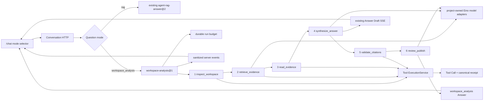

# 受限 Workspace Agent 技术设计

## 1. Design Objective

在不改变固定 RAG、Proposal 和可信写回语义的前提下，为现有对话增加一个独立、可关闭的工作区分析模式。该模式使用服务端拥有的有限 DAG 完成 Git 聚合、证据检索、Source 读取、答案合成、Citation 校验和 Faithfulness Review，并把所有恢复、预算、工具权限和发布事实落在项目自己的持久合同中。

首期刻意不实现通用 Agent 平台：不持久化 Eino transcript，不支持动态 DAG，不开放自由 Shell/文件/网络，不创建 Proposal。

## 2. Architectural Decisions

| Topic | Decision | Reason |
| --- | --- | --- |
| Product entry | Extend current Conversation Question with `mode=rag|workspace_analysis` | Reuses conversation, Answer, Citation and SSE UX while preserving explicit mode identity |
| Default behavior | Missing mode canonicalizes to `rag` | Old clients and existing `/chat` behavior remain compatible |
| Orchestration | New immutable `workspace-analysis@1` six-node DAG | Existing Workflow already owns checkpoints, retry, lease/fence and successor dispatch |
| Eino usage | Reuse project-owned structured chat/stream/review adapters per node; do not run one ReAct loop across nodes | Eino transcript is process-local and cannot resume safely |
| Step state | Workflow Node/Attempt owns stage lifecycle; a narrower logical-operation checkpoint spans replacement Attempts | Prevents duplicate external observation without creating a second Workflow state machine |
| Cross-node budget | New Workspace Analysis run + durable reservation/settlement | Current in-memory ledger cannot span nodes |
| Call authorization | Lease/fence validation, logical operation, budget reservation and Call `STARTED` are one PostgreSQL unit of work | Cancellation, reclaim and budget races cannot authorize an untracked call |
| Tool replay | New opt-in canonical Tool result receipt policy for new versions only; zero policy is omitted from old canonical JSON | Git/search cannot be re-observed after response loss and historical Tool hashes stay unchanged |
| Tool identity | Exact new versions bound only to the new Definition | Old RAG Graph/Tool hashes remain immutable |
| Tool invocation | `TRUSTED_WORKFLOW_ONLY`; each node server-selects its exact Tool, with no general Agent Tool Invoker | Model output never becomes tool authorization |
| Model references | Run-local `E1..En`; full Citation tuple stays server-only | Prevents model-created IDs becoming authorization facts |
| Git dirty state | New read-only status Inspector; do not relax Approval Snapshot | Write authorization continues to require clean exact Snapshot |
| Final result | New `workspace_analysis` Answer result union member | Does not masquerade as `rag_answer`; keeps one conversation turn model |
| Proposal behavior | Structured suggestion + fixed `/proposals` link only | User approved no direct create/prefill/write intent side effect |
| Rollout | Additive migration, default-off API/Worker flag, canary then drain-before-rollback | Keeps fixed RAG and historical replay independently operable |

## 3. Target Architecture



The Workflow, Tool service and Answer finalizer remain authority owners. The browser never receives private receipt bindings, and the model never chooses Workspace, Tool Version, Capability or execution identity.

## 4. Conversation And Answer Contracts

### 4.1 Question mode

Add project-owned `QuestionMode`:

- `rag`
- `workspace_analysis`

`QuestionRequest`, canonical request hash, persistence, HTTP request/response and OpenAPI include `mode`. For rolling compatibility:

- request omission canonicalizes to `rag`;
- persisted legacy rows are backfilled/defaulted to `rag`;
- responses always return the canonical mode;
- omitted mode and explicit `rag` use the historical v1 hash document byte-for-byte (including existing golden hash), so a pre-deploy Idempotency-Key can replay after deployment; `workspace_analysis` uses a versioned v2 hash document that includes mode, so changing mode with the same key conflicts;
- `workspace_analysis` rejects `allow_web=true` and unsupported scope combinations before starting a Workflow.
- legacy API binaries may participate only before a Workspace accepts its first Workspace Analysis fact, or behind routing that excludes every Workspace containing those facts. They reject the unknown `mode` field and cannot decode the new Question hash or Answer result union; this is fail-closed admission, not a compatible historical reader.

`QuestionDispatcher` selects the registered Definition from the canonical mode inside the existing transaction that inserts Question, starts Workflow and creates pending Answer. It must validate the selected Definition key/version and first node instead of hard-coding RAG-only identities.

### 4.2 Answer result

Extend Answer result types with `workspace_analysis`, using the strict schema `conversation.workspace_analysis_answer@v1`:

```text
result_type, schema_id, schema_version, model_run_ref
payload:
  answer_markdown
  citations[]
  git_status { branch, head, clean, staged_count, unstaged_count, untracked_count, conflict_count }
  budget { model_calls, tool_calls, input_tokens, output_tokens, estimated_cost_microunits: integer|null }
  proposal_suggestion: { summary, citation_ids[], href="/proposals" }|null
  termination_reason="COMPLETED"
```

Workspace Analysis adds a mode-aware publication matrix without changing any historical RAG bundle:

| Publication status | Result type | `Answer.model_run_id` | Required publication facts |
| --- | --- | --- | --- |
| `completed` | `workspace_analysis` | required Synthesis Model Run | immutable candidate, all-valid Citation receipt, succeeded Faithfulness Review Model Run |
| `refused` | `workspace_analysis_refusal` | exact authoring Model Run when model-authored; null for deterministic server refusal | stable reason, bounded summary, no factual claim without validated Citation |
| `clarification_required` | existing `clarification` | required Query Planner Model Run | planner-produced canonical clarification |
| `failed` | `workspace_analysis_termination` | optional | stable failure/Unknown reason and sanitized summary |
| `cancelled` | `workspace_analysis_termination` | optional | cancellation fact and sanitized summary |

`WORKSPACE_ANALYSIS_RESULT_UNKNOWN` is a `failed` publication reason, not a successful or refused answer. Deterministic failures before any model call never receive a fabricated Model Run identity. Every accepted Workspace Analysis Question leaves `pending` exactly once through this matrix, including cancellation and unrecoverable Unknown.

The v1 refusal documents use required-nullable `model_run_ref` plus `reason_code` and bounded `summary`; termination documents use required-nullable `model_run_ref` plus `termination_reason` and bounded `summary`. `WORKSPACE_ANALYSIS_CITATION_INVALID` is a deterministic refusal, while `WORKSPACE_ANALYSIS_RECEIPT_INVALID` is a failed termination. Any receipt/commit ambiguity converges to `WORKSPACE_ANALYSIS_RESULT_UNKNOWN`. Public `estimated_cost_microunits` and `proposal_suggestion` keys are required-nullable so omission cannot masquerade as a v1 document.

For a completed Answer, `model_run_id` and `model_run_ref` are always the Synthesis Model Run because it authored the published text. The Review Model Run remains a separate required fact bound through the Analysis Run/operation. A dedicated `WorkspaceAnalysisFinalizer` atomically verifies the candidate's Synthesis Model Run, exact validation receipt, succeeded Review Model Run/result, Answer version, active finalization Attempt and terminal event before publishing. The existing one-ModelRun RAG finalizer and old result schemas remain unchanged.

`retrieval_summary` gains a mode-aware strict shape but never contains private tuple bindings or full excerpts. Proposal suggestions accept only public Citation IDs from the final validated Citation set; the server fills the constant `href="/proposals"`, while the model may supply only a bounded plain-text summary and a subset of those Citation IDs.

## 5. Workflow Definition

Definition key/version: `workspace-analysis@1`. The graph and every node input/output schema are immutable and hash-checked.

| # | Node key | Work | Durable output | Dependency |
| ---: | --- | --- | --- | --- |
| 1 | `inspect_workspace` | Invoke `ReadGitStatus@2` | Tool call/receipt ID, safe aggregate hash/summary | Run input |
| 2 | `retrieve_evidence` | Structured query plan, then `SearchKnowledge@2` | planner Model Call, search receipt ID/hash, `E1..E5` summary | exact Git receipt + Question context |
| 3 | `read_evidence` | Read the frozen first 1–3 refs sequentially with `ReadSource@3` | ordered Tool receipt IDs/hashes | exact search receipt and selected refs |
| 4 | `synthesize_answer` | Tool-free streamed synthesis; persist immutable candidate | candidate ID/hash + Draft terminal binding | Git/search/source receipts |
| 5 | `validate_citations` | Invoke `ValidateCitation@3` against candidate refs | validation Tool receipt ID/hash | candidate and private evidence binding |
| 6 | `review_publish` | Existing Faithfulness Review, then atomic Answer publication | stable Answer output receipt | candidate + all-valid Citation receipt |

### 5.1 Dependency proof

- `retrieve_evidence` input includes the exact Git receipt reference/hash.
- Each `ReadSource@3` call accepts only an `E<n>` resolved from the exact search receipt attached to this Run.
- Candidate Citation markers must be a subset of the opened short refs.
- `ValidateCitation@3` receives candidate ID/hash plus short refs; the executor expands tuples from the same Run receipt.
- Finalizer verifies every published Citation is present and valid in the exact validation receipt.

This produces database-verifiable dependencies without trusting model-provided UUIDs or reasons.

### 5.2 Failure behavior

- No search result or no eligible source: publish an evidence-insufficient refusal; do not synthesize an ungrounded answer.
- Search freezes the first `min(3, hit_count)` refs. A zero-hit search publishes evidence-insufficient refusal; any selected Source failure, drift or ineligibility publishes refusal/failure before synthesis. There is no replacement, re-ranking or partial-evidence continuation.
- Any Citation invalid or Faithfulness Review fails: abort/supersede Draft and publish refusal or stable failure, never the candidate.
- Tool/Model Unknown, receipt drift or budget inconsistency: terminate `WORKSPACE_ANALYSIS_RESULT_UNKNOWN`; do not retry as a new logical step.
- Workflow cancellation reaches the normal safe checkpoint and records `WORKSPACE_ANALYSIS_CANCELLED`.

## 6. Tool Contracts And Canonical Receipts

### 6.1 Exact catalog

| Ref | Server-built input / model-safe output | Exact receipt limits | Receipt policy |
| --- | --- | --- | --- |
| `ReadGitStatus@2` | `{}` -> safe aggregate only | output 4 KiB; binding 1 KiB | persisted canonical |
| `SearchKnowledge@2` | typed planner query/mode/limit, no IDs -> `E1..E5`, snippets, degradation codes | max 5 hits, each snippet 4 KiB, output 32 KiB, binding 16 KiB | persisted canonical + private tuple/hash binding |
| `ReadSource@3` | server-selected `{evidence_ref}` -> ref, content hash, `truncated`, excerpt | excerpt 4 KiB, output 8 KiB, binding 4 KiB | persisted canonical + exact source identity/hash binding |
| `ValidateCitation@3` | server-built candidate ref/hash + short refs -> validity/reason by short ref | output 16 KiB, binding 16 KiB | persisted canonical + complete validation identity binding |

All are `READ_LOCAL`, `NONE`, serial, `TRUSTED_WORKFLOW_ONLY`, and bound only to `workspace-analysis@1`. There is no model-facing general Tool Invoker: `inspect_workspace`, `retrieve_evidence`, `read_evidence` and `validate_citations` respectively allow only their exact Tool version; the read node may invoke its one allowed Tool up to three times. The Query Planner emits only a typed query plan, the server constructs Search input, selected refs come from the persisted Search receipt, and Citation validation input is built from the persisted candidate and receipts.

Add `ResultPersistencePolicy` to Tool `Definition` as `json:"result_persistence_policy,omitempty"`; its zero value means historical behavior and is omitted before the existing direct `json.Marshal` hash. Only the four new versions set `PERSIST_CANONICAL`. Phase 0 freezes every current catalog Definition hash and proves re-canonicalizing old contracts produces identical bytes/hashes before a new contract is registered.

### 6.2 Receipt persistence

Add an immutable `workflow.tool_result_receipt` with a strict one-to-one Tool Call binding:

- identity: Tool Call, Workspace, Workflow Run, Node Run, Node Attempt;
- contract: output schema ID/version, Tool definition hash, persistence policy and exact output/binding byte ceilings;
- model-safe canonical output, exact hash and byte count;
- optional server-only binding document, schema ID/version, hash and byte count;
- created time; no update/delete.

Only a successful call for a Tool version explicitly declaring persisted canonical output may insert a receipt. Add a transaction-capable `FinalizeCallWithReceipt` command (and an Analysis-specific completion unit of work built on it) that CAS-transitions the exact `STARTED` Tool Call, inserts its immutable receipt, settles the matching budget reservation and marks the logical operation succeeded in one PostgreSQL transaction. `ExecutorResult` carries an optional bounded `PrivateBinding` only for an opted-in exact version. If commit acknowledgement is uncertain, no output/private binding is returned to the model or successor; recovery reconciles the exact Call/receipt/operation transaction and otherwise marks it Unknown.

Generic HTTP/timeline repositories cannot read `server_binding`. Only exact Workspace Analysis executors/resolvers receive a narrow lookup port. Logs and errors contain IDs/hashes, never documents.

### 6.3 Git status adapter

Define a new read-only Git status port in `internal/platform/gitcli`, separate from Change Control's `CaptureApprovalSnapshot`; the Tool adapter depends only on that narrow port. The Git adapter:

- resolves repository root from server Workspace facts;
- extends the existing `gitcli` runner with a status command profile and fixed argv: `status --porcelain=v2 --branch --no-ahead-behind -z --untracked-files=normal --ignore-submodules=all`, plus a fixed `rev-parse --show-object-format` identity check; there is no shell or caller argv;
- keeps the existing fixed `-c` protections, sets `GIT_CONFIG_NOSYSTEM=1`, points `HOME`/`XDG_CONFIG_HOME` at a process-owned empty directory, disables prompts/pager/hooks/fsmonitor/untracked cache/optional locks, and retains only repository-local structural config required to inspect that repository;
- caps stdout/stderr at 1 MiB, parses byte-oriented `-z` records, emits only stable error codes, and discards all path bytes immediately after classification;
- maps porcelain records deterministically: type `1`/`2` increments staged when `X != '.'` and unstaged when `Y != '.'`; type `u` increments conflict only; `?` increments untracked only; `!` is ignored; rename source/destination count as one entry and both paths are discarded;
- returns attached branch, HEAD/object format, clean flag and four counts only;
- fails closed for detached/unborn HEAD, submodule/unsupported/ambiguous records, counter/output overflow, invalid branch/HEAD encoding, timeout or repository mismatch.

Approval Snapshot keeps its current clean-only semantics.

### 6.4 Short evidence references

Search results retain the validated Retrieval result order and are assigned `E1..E5`; the Search receipt freezes `E1..Emin(3,n)` as the ordered read set. The private binding stores only complete Citation identity tuples and hashes, never snippet/excerpt content. Short refs are valid only under the exact Analysis Run and Search receipt. `ReadSource` opens every selected ref once in order; retry/reclaim uses the same logical operation/receipt, with no fallback to caller-supplied IDs, replacement result or partial continuation.

## 7. Persistent Budget And Candidate

### 7.1 Analysis run

Add `agent.workspace_analysis_run` with unique bindings to Question, Answer and Workflow Run. It freezes:

- Definition key/version/hash and Tool catalog hash;
- policy version and feature/config revision;
- deadline and maxima;
- reserved/settled model calls, tool calls, source reads, input/output tokens and optional cost;
- status/termination reason/version/timestamps.

Initial v1 policy:

- six logical nodes;
- at most three Model Calls: query plan, synthesis, faithfulness review;
- at most six Tool Calls: one Git, one search, up to three Source reads, one Citation validation;
- serial Tool execution (`max_concurrency=1`);
- query plan output max 256 tokens, synthesis max `min(profile, 4096)`, review max 1024;
- per-model input reservation max 64 Ki tokens and run aggregate max 192 Ki input / 5,376 output tokens;
- Tool input/output byte and timeout limits come from exact contracts;
- deadline formula uses frozen model profile timeouts `M_plan/M_synthesis/M_review` and exact Tool timeouts `T_git/T_search/T_read/T_validate`:
  - `D_inspect = T_git + 5s`;
  - `D_retrieve = M_plan + T_search + 15s`;
  - `D_read = 3 * T_read + 10s`;
  - `D_synthesize = M_synthesis + 15s`;
  - `D_validate = T_validate + 10s`;
  - `D_review = M_review + 15s`;
  - `D_run = min(sum(D_node), 1h)`; policy-v1 readiness fails if `sum(D_node) > 1h`, so an enabled profile always fits the cap.

Constants are versioned code policy, not freely supplied by browser/model. Phase 0 tests may tighten values before implementation; loosening them after final approval requires a new policy version and planning review.

For execution, every Node context deadline is `min(D_node, remaining D_run)`. A Provider/Tool context is further clamped to its frozen call timeout and must leave five seconds for durable completion; insufficient remainder terminates before invocation. The minimum River job timeout for a node is `D_node + 30s`; a global River timeout must cover the maximum of those minima. Workflow lease is intentionally shorter and renewed by the existing heartbeat path: readiness requires `heartbeat <= (lease - 1ns) / 3` and `lease >= 3 * heartbeat + 5s`, preserving a five-second durable-completion/reclaim margin after three heartbeat intervals. It does not require one lease grant to cover the whole job. Startup readiness refuses to advertise Workspace Analysis when the global job/lease/heartbeat values do not satisfy these formulas.

### 7.2 Logical operation checkpoint

Add `agent.workspace_analysis_operation`; this is not a second stage lifecycle. It gives each side-effecting or externally observing action one identity that survives Workflow Attempt replacement:

- unique key `(analysis_run_id, node_key, operation_kind, ordinal)` plus immutable request/input hash;
- status `PENDING | STARTED | SUCCEEDED | FAILED | UNKNOWN`;
- first/latest Node Attempt binding, budget reservation ID, Model/Tool Call ID, receipt/candidate/result reference and hash;
- version, started/completed timestamps and stable error code.

The deterministic ordinal is frozen by the graph (`plan=1`, `search=1`, Source reads `1..3`, synthesis/review/validation `1`). On a replacement Attempt:

- exact-hash `SUCCEEDED` reuses the stored result and completes the Node without invoking anything;
- exact-hash `FAILED` replays the stable failure;
- a hash mismatch or `UNKNOWN` terminates fail closed;
- expired-attempt `STARTED` first reconciles its exact Call. Only a terminal Call plus the atomically committed receipt/candidate/result can promote the operation to `SUCCEEDED`; otherwise it becomes `UNKNOWN`. The new Attempt never treats the previous Attempt's lease/fence as active and never re-executes Git/Search.

### 7.3 Authorization, reservation and settlement

`AuthorizeOperation` uses one PostgreSQL transaction and this lock order everywhere, including cancellation and terminalization:

```text
workflow.run
  -> workflow.node_run
  -> workflow.node_attempt
  -> agent.workspace_analysis_run
  -> agent.workspace_analysis_operation
  -> agent.workspace_analysis_budget_reservation
  -> agent.model_call | workflow.tool_call
```

It validates the current DB-time lease/fence, active Attempt identity, non-cancelled/non-terminal Run and Analysis Run, operation hash/status, remaining deadline and every budget dimension. It then atomically creates/reuses the logical operation and reservation and inserts the exact Model/Tool Call as `STARTED`. Nothing invokes a Provider/Executor without this committed authorization.

Completion follows the same lock order and atomically CAS-terminalizes the Call, settles actual usage (or the full reserved maximum for Unknown), stores the receipt/candidate/result and terminalizes the logical operation. Cancellation/terminalization takes the same locks before changing state, so it cannot race a new authorization. A repeated delivery reuses the existing reservation/Call/checkpoint; it never creates a second charge.

When a versioned price snapshot exists, the same reservation includes `estimated_cost_microunits` and enforces a hard ceiling. Without trustworthy pricing, cost is null and the UI says unavailable; Token/call budgets remain mandatory.

### 7.4 Candidate

`agent.workspace_analysis_candidate` is immutable and bounded, with exact Analysis Run, Answer, logical synthesis operation, originating Synthesis Attempt, Synthesis Model Run, result schema/hash/bytes and created time. Draft SSE is only a temporary projection of its generation. Citation validation and publication load the candidate by identity/hash; Draft content alone can never be published.

## 8. Timeline And SSE

### 8.1 Snapshot API

Add `GET /api/v1/answers/{answer_id}/analysis-timeline?workspace_id=...` for Workspace Analysis answers. It returns a bounded ordered snapshot derived from Analysis Run, Workflow nodes/attempts, Model Calls and Tool Calls/receipts:

- run state and stable termination reason;
- items with stable sequence, kind, phase, status, Tool ref, safe summary, duration and stable error;
- current budget usage/maxima;
- latest Server Event sequence for SSE continuation.

The endpoint never returns Workflow node input/output, raw Tool arguments/results, private receipt bindings, Prompt or Provider payload. Its safe summaries are deterministic server projections, never model text:

- Git: attached branch/HEAD, clean and four counts;
- Search: hit count and stable degradation codes;
- ReadSource: short `E<n>`, content hash and `truncated` only;
- Citation validation: valid/invalid counts and stable reason codes;
- Model phases: phase/status/usage only, with no Prompt, chain of thought or candidate body.

### 8.2 Realtime

Append idempotent sanitized event types such as:

- `workspace_analysis.started`
- `workspace_analysis.waiting`
- `workspace_analysis.tool_requested`
- `workspace_analysis.tool_completed`
- `workspace_analysis.terminated`

The snapshot is authoritative. The existing `/api/v1/events` stream carries only incremental invalidation/projection, while `/api/v1/answers/{answer_id}/stream` carries provisional synthesis Token chunks. Each logical stage/operation transition has a deterministic `source_event_ref`; whenever the facts and event share PostgreSQL, they commit in the same unit of work, including terminal Answer/Run state and `workspace_analysis.terminated`. A response-loss replay detects the existing source ref instead of emitting another logical event.

On reconnect the UI first reloads the authoritative timeline/Answer, then resumes each SSE from its cursor. Missing non-terminal invalidations may be deterministically repaired from facts; events can never override a snapshot. Audit separately records run start, user cancel, terminal result and Tool refusal with sanitized `ActorAgent` identity. Tool receipts are execution facts, not Audit records.

## 9. HTTP And Frontend Flow

### 9.1 OpenAPI changes

- Question request/response: add canonical mode enum with request default `rag`.
- Answer union: add strict Workspace Analysis schema and mode-aware retrieval summary.
- Add Analysis Timeline response schema and stable Problem codes.
- Existing route paths remain; no new Proposal create route is introduced.

Stable Problem/termination code families include invalid mode/scope, capability unavailable, budget exhausted, receipt invalid, evidence insufficient, citation invalid, result unknown and cancelled. Internal stderr, Provider error body and private binding never appear in Problem details.

### 9.2 Chat UX

- Add a two-option segmented control near the Composer. Selecting Workspace Analysis hides/disables unsupported web controls with direct validation; switching mode does not reuse the previous Idempotency-Key.
- Each Turn preserves its submitted mode. Workspace Analysis renders a compact vertical timeline followed by the existing Answer publication and Citation Inspector.
- Running state exposes a Stop icon button with tooltip; Tool rows use stable icons, labels, version, duration and safe summary.
- A successful result may show Git aggregate and a “查看提案” link to `/proposals`; it never says a Proposal was created.
- Draft/terminal disagreements always favor the authoritative Answer/timeline; unverified Draft is visually marked as generating and disappears/supersedes on refusal.
- Desktop and 390x844 layouts use stable widths, wrapping and no nested card hierarchy or horizontal overflow.

Frontend state ownership:

- TanStack Query owns Answer and timeline snapshots;
- the existing event store owns SSE invalidation/cursors;
- local component state owns current Composer mode and transient inspector selection;
- no Prompt, excerpt, private binding or candidate body is stored in URL, localStorage or sessionStorage.

## 10. Compatibility, Migration And Rollback

### 10.1 Forward migration

Use only a new forward migration:

- add/backfill Question mode with default/check;
- extend Answer publication statuses/result constraints with the Workspace Analysis terminal matrix without changing historical RAG rows;
- add Analysis Run, logical operation, budget reservation/counters, Candidate and canonical Tool receipt structures with FK/unique/check/size/immutability guards;
- add indexes for Answer timeline and recovery queries;
- extend result-ref/check constraints only for new exact formats.

Migration must pass with old API/Worker binaries. New API does not enable Workspace Analysis until the new Worker, Definition and Tool Registry report readiness.

### 10.2 Feature gate

Add independent API and Worker capability wiring, default off. Submission with mode `workspace_analysis` returns a stable capability-unavailable Problem when either side is not ready; `rag` remains available. Metrics separate fixed RAG and Workspace Analysis by stable mode/definition, without high-cardinality IDs.

### 10.3 Rollback

1. Disable new Workspace Analysis submissions.
2. Allow active Runs to finish or cancel them at safe checkpoints; investigate Unknown rather than forcing success.
3. Roll back Worker binaries only after no runnable new-definition nodes remain.
4. Keep an API version that can read Workspace Analysis Questions and Answers for every Workspace that has accepted the mode. A legacy API may receive traffic only for Workspaces proven to contain no Workspace Analysis facts; draining nodes does not make the new persisted union readable by an old binary.
5. Leave additive schema, receipts, candidates and historical results readable; do not run destructive Down in production.

The supported repository topology has one blind ingress rather than a Workspace-aware multi-backend router. Once any Workspace Analysis fact exists, rollback therefore retains the current compatible API version and stable ingress while only the Worker artifact moves to a legacy version. Applying the API feature-off configuration may recreate the API process from the exact same current image; the compatibility drill proves image/read-contract and ingress identity, not connection continuity. The exact fact marker is the conjunction of a `question.mode='workspace_analysis'` row and its bound `workspace_analysis_run`; a missing or mismatched side fails closed. Routing a fact-bearing Workspace to a legacy API would require a separately designed gateway and is not implemented here.

No rollback path switches Workspace Analysis questions into fixed RAG.

## 11. Risks And Mitigations

| Risk | Mitigation |
| --- | --- |
| Canonical receipt becomes a generic raw-content dump | `omitempty` opt-in policy on new versions, per-tool 4–32 KiB output limits, identity/hash-only private binding, private reader port, immutable 1:1 call binding, no generic HTTP projection |
| Budget restored twice after crash | Atomic authorization keyed to logical operation rather than replaceable Attempt; Unknown keeps full reservation |
| Lease reclaim repeats Git/Search | Cross-Attempt operation checkpoint reconciles the exact Call/receipt; old lease is never reused and non-provable state becomes Unknown |
| Git aggregation leaks paths | Fixed parser discards path bytes, output schema has no path field, redaction tests scan logs/events/Problems |
| Model fabricates evidence IDs | Only run-local short refs; private tuple resolver rejects cross-run/missing refs |
| Existing RAG behavior changes | Separate Definition/tool versions/flag; default mode `rag`; hash regression tests |
| Draft appears before validation | Draft is explicitly provisional; only Synthesis Candidate + Citation receipt + separate Review Model Run publish through the Workspace Analysis finalizer |
| Rolling deployment strands runs or old API cannot read new facts | Default-off readiness gate, API/Worker contract parity, a bounded canary deployment/access boundary, drain Workers before rollback, and Worker-only rollback behind the retained compatible API/ingress |
| Proposal link implies creation | Copy says “查看提案”; no create API call or prefilled execution payload |
| Monetary cost cannot be proven | Show/enforce money only with versioned price snapshot; always enforce Token/call ceilings |

## 12. Mature Framework Gate

The existing Workflow Runtime, River, Eino adapters, Tool Registry/ExecutionService, PostgreSQL, Server Event SSE, TanStack Query and React Router cover the core requirements. No new orchestration, agent framework, queue, event system or frontend state library is justified. The only new infrastructure is the minimum missing logical-operation checkpoint, durable budget unit of work and canonical Tool result receipt contract; these remain project-owned because they bind existing security/lease facts that an external agent checkpoint format cannot safely replace.
