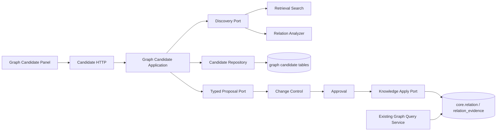
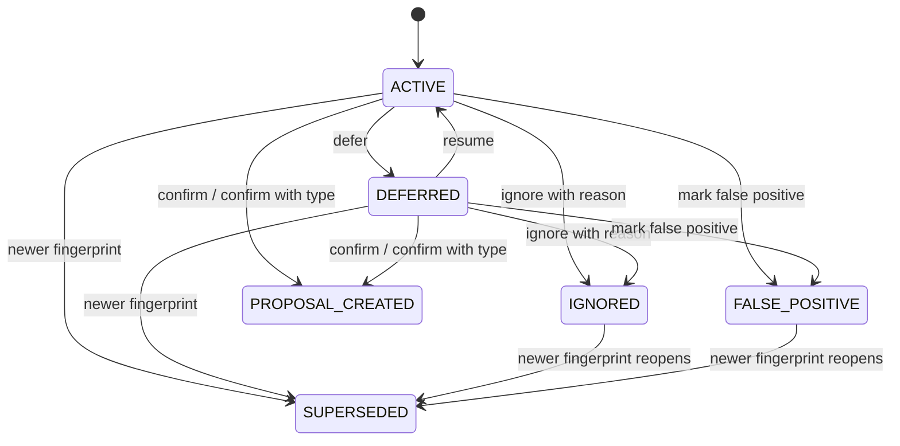
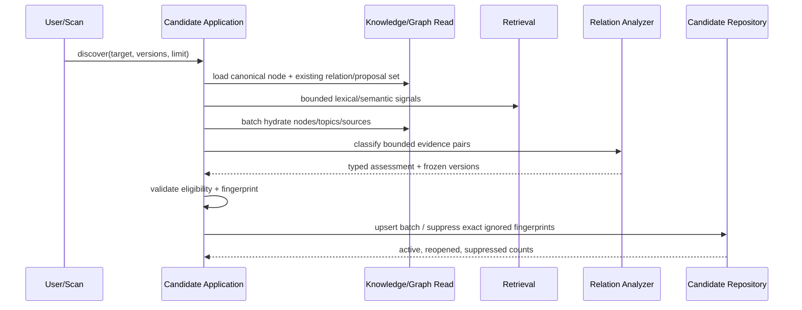

# M7-02 Semantic Link Candidates Design

## 1. Design Objective

在不破坏 M7-01 只读 Graph、M5-05 Knowledge 唯一事实源和现有文件 Safe Writeback 的前提下，增加候选发现、稳定去重、用户决策、typed Relation Proposal、Approval 后正式 Relation 应用，以及可恢复的异步 Topic scan。

设计必须同时保证：候选不是正式边；忽略不会重复打扰；内容变化可解释地重开；每个确认项有独立 Proposal；Candidate/Model 故障不影响正式 Graph。

## 2. Module Boundaries



- `internal/graph/domain`：Candidate vocabulary、状态机、fingerprint、scan scope/read model；可复用 Knowledge NodeRef/RelationType，不依赖 Retrieval/Agent/pgx/HTTP。
- `internal/graph/application`：发现、查询、决策、scan 编排和 ports。现有 Graph Query Service 不新增 mutation 方法。
- `internal/graph/adapter/postgres`：Candidate/Decision/Scan UoW 与有界查询；现有只读 Graph Repository 保持兼容。
- `internal/graph/http`：候选独立 Handler/Service interface；既有七个 Graph route 继续只读。
- `internal/changecontrol`：typed Proposal/Revision、Approval 路由和 Relation apply binding。
- `internal/knowledge`：仍是 Relation 唯一写入 owner；只接受已验证 Approval confirmation。
- `internal/workflow` / River：异步 scan runtime；不拥有 Candidate 事实。
- `web/src/features/graph`：候选面板与 mutation UX；正式 canvas/list 不渲染 Candidate edge。

## 3. Domain Model

### 3.1 SemanticLinkCandidate

核心字段：

- identity：ID、Workspace ID、fingerprint schema/value、version、created/updated。
- endpoints：canonical source/target NodeRef 与各自 Node Version。
- suggestion：proposed Relation Type、confidence、reason、discovery methods。
- evidence：有界 Evidence refs、排序后的 semantic hashes、双方 summary/excerpt；公开 API 只返回安全摘要和可打开 href。
- generation：Index/Embedding/Rerank、Model/Profile/Prompt/Schema 或 Rule version；可选 Model Run ID。
- lifecycle：status、reopened reason/from candidate、current Proposal ID。

`CandidateEvidence` 不是 Relation Evidence：它保留发现时的不可变来源定位和语义哈希；只有 Proposal Approval 后，经 Knowledge Provenance 校验转化为 Relation Evidence。

### 3.2 Status machine



- `IGNORED`/`FALSE_POSITIVE` 不直接回到 ACTIVE；输入变化生成新 Candidate，旧记录进入/保持历史并由新记录引用。
- `PROPOSAL_CREATED` 不因 Proposal reject 回到 ACTIVE；新分析必须生成新 fingerprint，避免同一建议反复创建 Proposal。
- 每次命令写 append-only decision，再以 `expected_version` CAS 更新 Candidate 投影和 command receipt。

### 3.3 Fingerprint v1

Domain 使用显式结构生成 canonical JSON/length-framed payload，禁止直接依赖 Go map 或 PostgreSQL JSONB 文本格式：

```text
semantic-link-candidate/v1
workspace_id
canonical source(type,id,version)
canonical target(type,id,version)
relation_type
sorted evidence semantic hashes
sorted unique discovery methods
index_version_id / embedding_version_id / rerank_model_version
model adapter/model/profile/prompt/schema versions OR rule id/version
```

- 对称 Relation 先复用 Knowledge canonical endpoint 排序，且 Node Version 随端点一起交换。
- Evidence hash 对顺序无关但对多重性敏感；每项由 provenance、reason/applicability 和内容 hash 计算，不含数据库 row ID、rank 或 transient score。
- 任何实际参与版本变化都会改变 fingerprint；未参与字段保持空值并通过 generation kind 的互斥约束校验。

## 4. Persistence

下一前向迁移暂定 `00024_semantic_link_candidates.sql`，包含：

| Table/change | Purpose | Key constraints |
|---|---|---|
| `graph.semantic_link_candidate` | evaluation snapshot/current lifecycle | `(workspace_id,fingerprint)` unique；canonical endpoints；status/version；Proposal/reopen binding；bounded JSON |
| `graph.semantic_link_candidate_evidence` | immutable candidate evidence | same Workspace composite FK；semantic hash unique per candidate；Source Version/Span FK；no full body |
| `graph.semantic_link_candidate_decision` | append-only user decisions | `(workspace_id,idempotency_key)` unique；candidate/version/action/request hash；reason/action constraints |
| `graph.semantic_link_scan` | durable async scan fact | scope/schema/fingerprint/idempotency；workflow binding；status/counters/version |
| `change_control.proposal.proposal_type` | typed proposal discriminator | default `file_patch`; allowed `file_patch|knowledge_change` |
| typed fields on `proposal_revision` | Relation target/base/change/evidence | canonical JSON object/array size limits; relation schema v1 |

迁移策略：

1. Add nullable/defaulted typed columns and `proposal_type DEFAULT 'file_patch'`，回填历史行。
2. 使用 `NOT VALID`/验证后约束或等价安全步骤，把文件字段检查改为按 type 互斥；不重写历史 payload。
3. 现有 Repository SQL 显式列保持 `file_patch` 默认；新增 typed methods 显式写 `knowledge_change`。
4. Down 只在 Candidate/Decision/Scan/knowledge_change Proposal 为空时允许；有业务数据返回 SQLSTATE `55000`，发布回滚保留 Schema/data 并 forward fix。

索引至少覆盖：fingerprint 唯一、canonical endpoint discovery、`workspace/status/updated_at/id` cursor、scan/workflow、candidate/proposal 唯一绑定。真实查询 EXPLAIN 后才增加其他索引。

## 5. Discovery Pipeline



实现顺序先提供确定性 rule-based signals（title/alias、term、common topic、shared source、RAG co-retrieval facts）和 Retrieval semantic port，再复用 RelationAnalyzer 做最终 type/evidence gate。Provider 不可用时：

- 仅依赖可用规则的候选可带明确 generation kind/version 产出。
- 请求明确要求 semantic/model 分类而依赖缺失时，scan/call 失败或返回 explicit degradation，不把未执行能力记为成功。
- 正式 Graph Query 没有到 Candidate service 的依赖。

## 6. Typed Relation Proposal And Apply

`ProposalType`：`file_patch | knowledge_change`。Relation Proposal revision schema `knowledge-relation-change/v1`：

```json
{
  "target_refs": [{"type":"RELATION_CANDIDATE","id":"...","fingerprint":"..."}],
  "base_versions": [{"node_type":"CLAIM","node_id":"...","version":3}],
  "change_set": {"operation":"CREATE_RELATION","source":{},"target":{},"relation_type":"COMPLEMENTS"},
  "evidence_refs": [{"candidate_evidence_id":"...","semantic_hash":"..."}],
  "schema_version":"knowledge-relation-change/v1"
}
```

change hash 由版本化 canonical typed payload 计算；不能复用文件 `ComputeChangeHash` 的 path/content 格式。

确认事务：锁 Candidate，校验状态/version/type，查询同 fingerprint 未终结 Proposal，创建 Proposal+Revision，写 decision/receipt，把 Candidate 置 `PROPOSAL_CREATED` 并绑定 Proposal。需要跨 Graph/Change Control 表的原子性时由 PostgreSQL adapter 内的专用 UoW 实现，Application 不在 Handler 中拼事务。

Approval：

1. 校验 Revision/change hash 与 Proposal type。
2. Reject 只写 Approval/Proposal 状态；不写 Relation。
3. Approve 锁 Proposal/Candidate/端点，重新验证 base versions 与 Candidate Evidence eligibility。
4. 幂等创建或读取 Suggested Relation，追加带 Approval confirmation 的 Evidence，并原子 Confirm；同一 transaction/UoW 同步推进 Proposal application state。
5. 版本漂移将 Proposal 置 `needs_revision`；未知数据库结果由 receipt/绑定查询恢复，不盲重试。

现有 file-patch `DecideProposalWithDispatch` 明确拒绝/分流 `knowledge_change`，避免错误进入 Git Writeback。Knowledge apply 不产生文件/Git Commit；PostgreSQL Relation 本来就是文档定义的正式关系事实源。

## 7. Scan Workflow

首版 Scope：`NODE` 和 `TOPIC`。`DIRECTORY|SMART_COLLECTION` discriminator 可在 wire 保留为 unsupported enum，只有真实对象和查询 port 落地后启用。

- Command 持久化 Scan + Workflow Run/Node/Outbox/River job，返回 202。
- Node input 只保存 scan ID/scope version；正文、Evidence、模型输出存各自事实表或按 ID 读取。
- Executor 每页最多 100 节点，批量 discovery/upsert，CAS checkpoint 和 counters；heartbeat/cancel 在页之间检查。
- 错误记录稳定 stage/code/retryable；Provider 失败不推进 completed count。
- restart/response-loss 通过 scan cursor/checkpoint 与 Candidate fingerprint/receipts 精确重放。

## 8. HTTP Contract

建议新增：

- `GET /api/v1/graph/candidates?workspace_id=&node_type=&node_id=&status=&relation_type=&reopened_reason=&cursor=&limit=`
- `POST /api/v1/graph/candidates/discover`
- `POST /api/v1/graph/candidates/{candidate_id}/decisions`
- `POST /api/v1/graph/candidate-scans`
- `GET /api/v1/graph/candidate-scans/{scan_id}?workspace_id=`
- `GET /api/v1/proposals/{proposal_id}` 扩展 discriminated response；现有 file response 字段保持兼容。
- `POST /api/v1/proposals/{proposal_id}/approvals` 按 Proposal Type 分流；请求仍绑定 Revision/change hash。

Candidate node scope 是判别契约：`CLAIM` 必须精确命中 source/target；`TOPIC` 可命中直接 Topic 端点，或命中
两端 Claim 都有该 Topic 正式 `CONFIRMED BELONGS_TO` membership 的 Claim pair。membership 由 PostgreSQL
Repository 用两个 `EXISTS` 保证，避免 JOIN 重复行；Domain/HTTP/前端只放宽 Topic 下的 Claim-pair 响应形态，
不得改成 Workspace 全量 fallback。Scan `status_url` 使用带 Workspace 的 Candidate Scan 自链接，Workflow ID
继续作为 runtime binding。

Discover 可在有界、预计小于 3 秒且无需模型时同步返回；涉及 semantic/model 或批量时创建 scan 并返回 202。实现若无法可靠预判，统一走 scan 比静默超时更安全。

错误码至少覆盖：`SEMANTIC_LINK_REQUEST_INVALID`、`SEMANTIC_LINK_NOT_FOUND`、`SEMANTIC_LINK_VERSION_CONFLICT`、`SEMANTIC_LINK_CURSOR_INVALID|STALE`、`SEMANTIC_LINK_DEPENDENCY_UNAVAILABLE`、`SEMANTIC_LINK_SCAN_*`、`RELATION_PROPOSAL_*`、`RELATION_PROPOSAL_BASE_STALE`。

## 9. Frontend

- 保留 `/graph` Global/Local/Path 和现有查询 key；候选使用独立 key factory，以 Workspace + node + filters 为 key。
- `web/src/api/semantic-links.ts` 是唯一 unknown-to-domain decoder/client，Proposal discriminated decoder 保留 file patch 兼容。
- Topic scope decoder 接受直接 Topic 端点和 Claim-pair 形态，但不在浏览器重查 membership；Claim scope 仍按
  `(type,id)` 精确绑定，其他形态 fail closed。
- 节点选择后显示未处理数和独立候选面板；Candidate 不进入 `GraphCanvas` edges。
- 卡片/列表按 confidence 和 Relation Type 分组，Evidence 按需展开；mutation 成功后失效 candidate/proposal keys，不清除正式 Graph，只有 Relation apply 成功事件/重新查询后才刷新 Graph。
- Ignore/False Positive 使用 modal/radio reason，Confirm type 使用菜单/segmented select；按钮使用既有图标库和 tooltip，移动端对话框有焦点闭环。

## 10. Security, Performance And Observability

- Input 边界严格校验 UUID、enum、reason 长度、JSON 大小、cursor、Idempotency-Key、expected version。
- 所有 Repository 查询显式列、参数化、Workspace-scoped；批量 API 最大 500 identity，页面最大 100。
- Candidate Evidence 只保存稳定 refs/hash/安全摘要；日志/trace 只记录 ID、计数、版本、耗时和稳定错误码。
- 指标：scan duration/nodes/candidates/suppressed/reopened/failed、decision action、proposal/apply result、provider latency/degradation；通用 append-only Audit 留 M10，但 decision history 已是业务事实。
- `system/status` 分开 `graph` 与 `semantic_links`；Graph readiness 不依赖 semantic provider，Candidate endpoint 缺依赖返回自身 503。

## 11. Verification

- Domain：fingerprint/property/state machine/idempotency tests，关键纯函数 `-race -count=20`。
- PostgreSQL：迁移、约束、并发 fingerprint、CAS、decision append-only、typed Proposal/file compatibility、approval/apply、EXPLAIN。
- Workflow：真实 River scan、lease reclaim、cancel、provider timeout、response-loss、duplicate delivery。
- HTTP/OpenAPI：strict JSON、cursor、Workspace isolation、Candidate→Proposal→Approval→Relation 公共闭环。
- Frontend/browser：desktop/mobile、keyboard、evidence lazy load、mutation errors、refresh recovery、Candidate failure with Graph healthy。
- Eval：固定 Gold Set 和五项指标；Fake/real Provider 报告分离。

## 12. Compatibility And Rollback

- 所有 wire/schema additive；历史 file Proposal 继续解码和执行原流程。
- 应用回滚先停 Candidate route/scan executor/UI；Graph/Knowledge 正式查询继续可用。
- 已执行 00024 后保留新增列/表；有 Candidate/typed Proposal 数据时 Down 拒绝，旧 binary 因默认 `file_patch` 和 nullable typed fields 仍可运行。
- Relation apply 已完成时不删除正式 Relation；错误正式关系必须通过新的 Proposal/Approval 纠正。

## 13. Key Decisions

- Candidate 独立于 Relation，换取一套候选表，但避免未批准事实污染 Knowledge。
- Change Control Expand 而非第二套审批，保留统一 Approval identity，代价是必须严格保护 file-patch 兼容。
- 内容变化创建新 snapshot 而非原地改 fingerprint，换取可审计重开历史。
- 首版只做 Topic/Claim 与 Topic scan，避免用假对象提前声称 Document/Collection 完成。
