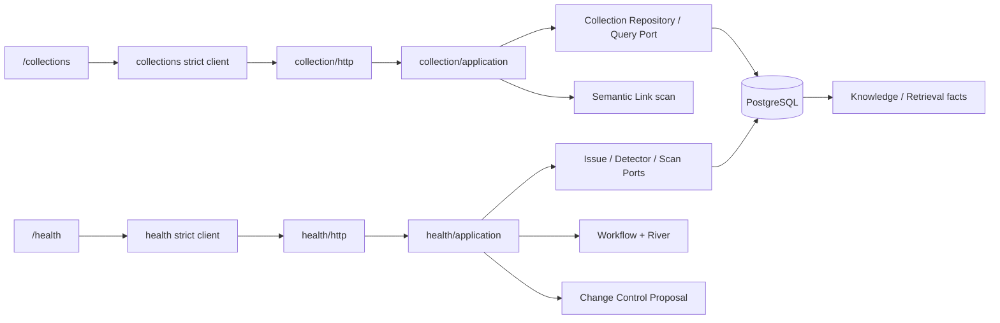

# M7-03 Smart Collection 与健康扫描设计

## Decision Summary

1. 新建 `internal/collection` 和 `internal/health` 两个深模块；Knowledge、Change Control、Workflow 继续拥有正式事实和写入。
2. Collection Query AST 先编译到统一 Topic/Claim read model，所有字段/运算符/排序由版本化 registry 白名单映射；三种视图只消费同一结果 DTO。
3. Collection cursor 使用 HMAC keyset，并绑定 Collection/query、limit、排序和含 Health hydration 的 page revision；
   durable scan 使用独立 membership revision，避免 Health scan 被自身输出打断，同时在 Health 定义 membership 时继续 fail closed。
4. Health 以 `identity_hash` 表达逻辑问题、以 `fingerprint` 表达当前证据；Issue 保留稳定 ID，Evidence/规则变化追加 observation 并 REOPENED。
5. Health Scan 复用现有 Workflow/River 基础，但拥有独立 scan/Issue 事实、detector coverage、checkpoint 和完成规则。
6. Collection scope 是真实稳定对象：Candidate/Health scan 只接收 Collection ID/version/query hash，不接受任意 AST 或路径替代。

## Architecture And Ownership



依赖方向：HTTP -> Application -> Domain ports；PostgreSQL/River/Change Control adapter 实现 ports。Collection/Health domain 不依赖 pgx、chi、River、JSON wire 或 React。Collection/Health 只读 `core`/`retrieval`/`change_control` canonical facts，不直接写 Knowledge 表。

## Collection Domain Contract

### Query AST

```text
QueryV1 {
  schema_version: "collection-query/v1"
  root: Group
  sort: [SortTerm <= 3]
}
Group { kind: "group", operator: AND|OR, clauses: [Clause 1..64] }
Predicate { kind: "predicate", field, operator, value|values }
```

Canonicalization 在 Domain 完成：去除无意义空白、枚举大写、集合值去重排序、稳定保留有语义的 clause 顺序并生成 canonical JSON/hash。最大深度按 root=1 计数，最多 3；空 group、重复 predicate、非法组合和超限 fail closed。

Field Registry v1：

| Field | Operators | Source |
|---|---|---|
| `object_type` | `EQ,IN` | Topic/Claim discriminator |
| `topic_id` | `EQ,IN` | confirmed `BELONGS_TO` membership；Topic 自身也可匹配 |
| `status` | `EQ,IN` | Topic/Claim lifecycle |
| `created_at`,`updated_at` | `GTE,LTE,BETWEEN` | canonical timestamps |
| `confidence` | `GTE,LTE,BETWEEN,IS_NULL` | Claim confidence；Topic 不伪造值 |
| `relation_type` | `EQ,IN` | incident formal Relation |
| `health_issue_type` | `EQ,IN` | active Issue target membership |
| `source_type`,`file_path` | `EQ,IN,PREFIX` | Claim Source -> Source Version -> Source provenance |
| `text` | `CONTAINS,PREFIX` | normalized Topic name/alias/description 或 Claim statement |

`tag`、`review_status` 和 Directory/Document 字段保留在 capability registry，但在 owner 不存在时返回 `COLLECTION_FIELD_UNAVAILABLE`。它们不进入 SQL compiler。

### Unified Result

`CollectionItem` 是 `TOPIC|CLAIM` 判别联合，共享 ref/title/summary/status/timestamps；Claim 才可带 confidence/applicability/source summaries，Topic 才可带 aliases。Topic refs、incident relation types、active health summary 均在固定数量的批量查询中 hydration，禁止逐项查询。

List/Table/Card 都接收相同 `CollectionResultPage`；view config 只是可验证的列/固定列/分组/密度配置，不改变结果成员。可选 columns 只引用 domain item 的公开字段。

### Cursor And Read-Model Revision

首次执行在单个 read-only repeatable-read 事务中：

1. 读取 Collection/version 或 canonical ad-hoc query。
2. O(1) 读取 Workspace 的 knowledge/conflict/health revision vector，并从同一 snapshot 派生两个固定 schema hash：
   `revision_hash` 总是包含 Health hydration revision；`scan_revision_hash` 仅在 Query predicate/sort 引用
   `health_issue_type` 时包含 Health revision。
3. 执行参数化 count 和 keyset page；sort 最后追加 object_type/id。
4. cursor 写入 query hash、revision hash、sort、limit 和 last key，经进程随机 HMAC 签名。

后续页先重算 page revision；不匹配返回 `COLLECTION_CURSOR_STALE`。Health/Semantic durable consumer 必须使用
`scan_revision_hash`，并在每页验证 membership revision；不得把 page hash 当 scan binding。cursor 过期/重启、
签名错误、跨 Workspace/Collection/query 分别返回 invalid。revision trigger 与 integration test 必须保护同事务推进和
Workspace 隔离。

## Persistence

新增 `00025_smart_collection_health.sql`，使用既有 `learning` 与 `ops` schema：

### `learning.smart_collection`

- `id, workspace_id, name, description`
- `query_schema_version, query_version, query_definition, query_hash`
- `view_type, view_config`
- `status ACTIVE|ARCHIVED, version`
- `last_executed_at, cached_result_version`（仅可丢弃元数据）
- `created_at, updated_at`

约束：Workspace 内 active normalized name 唯一；query/view JSON 类型、大小和 schema 受 CHECK；archive 不级联删除知识。

### `learning.smart_collection_command`

保存 Workspace + idempotency key、request hash、operation、collection/version 和 receipt，保护 create/update/archive response-loss。

### `ops.health_issue`

- identity：`id, workspace_id, type, target_type, target_id, detector_id, identity_hash`
- current observation：`fingerprint_schema_version, fingerprint, detector_version, severity, evidence_summary`
- lifecycle：`status, ignored_reason, deferred_until, repair_proposal_id, version`
- time：`first_detected_at, last_detected_at, last_verified_at, resolved_at, created_at, updated_at`

Workspace + identity hash 唯一；active `(workspace_id,fingerprint)` 部分唯一。target 使用受控 `TOPIC|CLAIM|RELATION|CONFLICT|SOURCE_VERSION|INDEX_VERSION` 多态 ref，并由 detector/repository 在同一事务校验 Workspace。`REVIEW_INVALIDATED` 在 Review owner 落地前只产生显式 unavailable coverage，不创建 Issue 行。

### Evidence, observation and decision

- `ops.health_issue_observation`：每个新 fingerprint 一行，保存 detector version、object versions、evidence fingerprint、scan id 和时间；unchanged verify 不重复 observation。
- `ops.health_issue_evidence`：observation-owned、有序、受限 Evidence refs/summary/hash，不保存大正文。
- `ops.health_issue_decision`：expected issue version、action、reason/defer、idempotency/request hash、proposal binding。

### Scan and schedule

- `ops.health_scan`：scope type/ref/version/hash、workflow run、status、coverage/checkpoint/counters/error/version/times。
- `ops.health_scan_detector`：每 detector 状态、checkpoint、processed/failure summary，保证 partial 能解释。
- `ops.health_schedule`：disabled by default，cadence/cron/timezone/scope/max items/next run/last run/version。

所有 Down 在存在业务数据时以 SQLSTATE `55000` 拒绝，禁止静默删除。

## Health Detector Contract

每个 Detector 声明稳定 `ID/Version/SupportedTargets/DefaultSeverity`，实现：

```text
ScanPage(ctx, ScopeSnapshot, Checkpoint, Limit) -> Observations, NextCheckpoint, Complete
```

Observation 必含 type、target、target versions、evidence refs/hashes 和 detector version。Application 统一计算 identity/fingerprint/severity 并 upsert，Detector 不能自行写 Issue。

首版 detector：

- ORPHAN：Active Topic 或 formal Claim 没有符合规则的 confirmed membership/incident Relation。
- DUPLICATE：正式 `DUPLICATES` Relation 或可验证的 duplicate conflict/candidate 事实；不凭文本近似自动定案。
- CONFLICT：未终结 Conflict 及其成员。
- STALE：STALE Relation 或已被新正式版本替代但仍被使用的 target。
- MISSING_SOURCE：应具备支持来源的 Claim/Relation 缺失或不可达 Evidence。
- LOW_CONFIDENCE：非空 confidence 低于版本化规则阈值；阈值属于 detector version/config，不散落 SQL。
- BROKEN_REFERENCE：Evidence 的 Source Version/Span/Artifact 绑定不可验证。
- INDEX_ERROR：失败/不一致的 Index Revision 投影。
- SUPERSEDED_USAGE：正式消费仍指向 superseded Source/Claim/Revision。
- REVIEW_INVALIDATED：registry 中存在但在 Review schema 未落地前返回 capability unavailable，进入 coverage 而不是零结果。

Severity 是 detector rule 的确定性输出；任何 consistency/evidence break 可提升到 CRITICAL/HIGH，外部模型只能提供解释建议。

## Issue Reconciliation

扫描按 detector/scope 分页完成后，在事务中 reconciliation：

- identity 不存在：创建 OPEN Issue + observation/evidence。
- identity 存在且 fingerprint 相同：更新 last_verified，保留 IGNORED/FALSE_POSITIVE/DEFERRED。
- identity 存在且 fingerprint 变化：追加 observation，更新 current fingerprint，状态 REOPENED，清除过期 defer/proposal binding但保留历史 decision。
- detector 对 scope 完整完成且 active identity 未在本轮 seen set：RESOLVED。
- scan PARTIAL/FAILED/CANCELLED：绝不执行 missing-set resolve。

seen set 必须使用 scan-scoped 临时/持久键表或批量标记，禁止把大 identity 列表塞进单个 JSON。

## Workflow, River And Scheduling

定义 `HEALTH_SCAN_V1` Workflow/Node，scan start 与 Run/Node/Outbox/River job 在一个 PostgreSQL 事务创建或重放。Executor 每页：读取 scope snapshot -> 执行一个 detector page -> upsert observations -> 保存 checkpoint；不在模型/远程调用期间持事务。完成所有 detector 后才 reconciliation/terminal transition。

Cancellation guard 与 Semantic Link Scan 组合；completion response-loss 通过 terminal receipt 重放。Schedule dispatcher 使用数据库时间和 `FOR UPDATE SKIP LOCKED` 领取 due schedule，missed 只创建一次补跑；唯一 active scan 约束阻止同 scope/fingerprint 并发。

已提交 Knowledge/Relation/Conflict/Index 变化通过现有 Event/Outbox seam 请求最小 affected scope。触发投递失败保持源事务成功并留可重试 outbox，不在领域写事务同步扫描。

## Collection-Scoped Semantic Link Scan

扩展 Candidate Scan planner：加载 active Collection，验证 ID/version/query hash，执行同一 Collection query 得到有界 Topic/Claim page，并把 scope fingerprint/revision 写入 scan。Collection 更新或 read-model revision 变化后旧 start payload 返回 stale；运行中 scan 使用创建时绑定的 snapshot contract，不切换到新 query。

Candidate 持久化和 Confirm/Approval/Relation apply 不变。Collection scope 只改变 anchor/source page，不改变 Candidate fingerprint、decision 或正式 Relation 规则。

## HTTP Contract

Collection：

- `GET /api/v1/collections`
- `POST /api/v1/collections`
- `POST /api/v1/collections/validate`
- `POST /api/v1/collections/preview`
- `GET /api/v1/collections/{collection_id}`
- `PUT /api/v1/collections/{collection_id}`
- `POST /api/v1/collections/{collection_id}/archive`
- `GET /api/v1/collections/{collection_id}/results`

Health：

- `GET /api/v1/health/summary`
- `GET /api/v1/health/issues`
- `GET /api/v1/health/issues/{issue_id}`
- `POST /api/v1/health/issues/{issue_id}/decisions`
- `POST /api/v1/health/issues/{issue_id}/repair-proposals`
- `POST /api/v1/health/scans`
- `GET /api/v1/health/scans/{scan_id}`
- `GET|PUT /api/v1/health/schedules`

所有命令使用 strict JSON/Idempotency-Key/expected version；scan `status_url` 指向带 Workspace 的 Health Scan 自链接。Problem code 分 Collection/Health 域，不复用 Graph empty 或系统 readiness。

## Frontend Data Flow

```text
unknown JSON -> api/collections.ts|health.ts decoder
             -> domain union -> Query hooks/key factory
             -> CollectionPage|HealthPage
```

- `/collections` 管理 saved collections；`/collections/:id` 的 URL 持有 view/filter/sort/group，cursor 只由 Query cache 持有。
- Query Builder 由 registry metadata 驱动，使用 select/segmented/date/number controls；非法 server state 保留错误码，不自行放宽 AST。
- 三视图使用相同 `items`；Table 只做列投影，Card/List 不重过滤。
- `/health` 的 scan ID 可进入 URL 以刷新恢复；Issue Evidence 在详情 drawer/dialog 打开后再请求。
- Workspace 切换清理旧 Collection/Health cache；SSE 只 invalidates 对应 keys。

## Failure And Isolation

- Collection repository/query 缺失：Collection endpoints/status unavailable；Graph/RAG/Health 已持久 Issue 查询仍可用。
- Detector/Worker 缺失：Health scan start 503 或 PARTIAL coverage，不把已有 Issue 列表隐藏。
- Collection scope stale：返回 version conflict，不能退化为 Workspace scan。
- timeout/cancel：回滚当前小事务、保存已提交 checkpoint，未完整 detector 不 resolve Issue。
- repair adapter 缺失：option unavailable，不创建 Proposal ID。

## Security And Performance

- Workspace predicate 出现在每个 SQL root；多态 target 在 repository 中验证 owner Workspace。
- AST identifiers 只来自 registry；values 全参数化；cursor key/SQL/query/evidence/path 不进入 Problem/log。
- Query 默认 2 秒上层 timeout、数据库 statement timeout <= 1.5 秒；Health page size 100，detector batch 默认 100、最大 500，scan max items 必须有硬上限。
- Collection hydration 以固定批次数完成；Health detectors 批量查询，不循环查库或远程调用。

## Migration And Rollback

- 前向 migration 先建表/约束/索引，再启用 API/Worker；旧 API 未注入 handler 时保留路由并独立 503。
- 回滚应用版本时保留 additive 表和事实；停止 schedule dispatcher/Health worker 即停止新扫描。
- Collection/Issue 数据存在时 migration Down guarded；不得自动删除用户保存查询、Issue 或决策历史。
