# M7 Timeline 与 Impact 遗留技术设计

## 1. Design Objective

在现有 M7-04 查询投影上做 additive 扩展：Artifact/Review owner 提供精确影响 binding 和稳定事件源，Knowledge Impact 负责生成带 analysis version 的不可变报告，Change Control 负责持久化正式 `downstream_update` Proposal，Web 只通过严格 API 展示并发起用户意图。任何层都不能把分析、审批或 UI 选择升级为目标写回权限。

## 2. End-to-End Flow

```mermaid
flowchart LR
    AO["Artifact / Review owner transaction"] -->|"selector + stable outbox source"| PG["PostgreSQL facts"]
    PG --> TW["Timeline projector"]
    TW --> KE["append-only Knowledge Event"]
    KE --> IA["versioned Impact Analysis"]
    PG --> IA
    IA --> IR["append-only Impact Report v2"]
    IR --> UI["Timeline / Impact Web"]
    UI -->|"select one supported target"| PF["owner proposal factory"]
    PF --> CC["typed downstream_update Proposal"]
    CC --> AP["Approval / Rejection"]
    AP -. "Apply unavailable" .-> FC["fail closed; zero side effects"]
```



权威数据流：

```text
owner fact -> selector/outbox -> Event -> versioned analysis -> immutable Report
Report + fresh owner snapshot -> typed Proposal -> Approval intent
```

SSE 不参与事实判断；前端通过 API 回查，显式刷新承担本次异步投影可见性。

## 3. Domain Contracts

### 3.1 Timeline Event Extension

- `EventType` 增加 `ARTIFACT_GENERATED`、`REVIEW_CARD_INVALIDATED`，同步 Domain validation、DB projector codec、HTTP/OpenAPI enum 与 Web decoder。
- 既有 `knowledge-event/v1` wire 保持原字段集合；带 actor 和 owner binding 的新事件使用 `knowledge-event/v2` 判别式 schema。前端按 schema version 严格解码，历史 v1 事件把操作者显示为“未记录”，不得给 v1 响应追加未知字段。
- `ARTIFACT_GENERATED` source key 由 Workspace + Artifact ID + terminal Revision ID/version 构成；aggregate 为 Artifact，correlation 冻结 Revision 和可用 Workflow/Model Run 引用。
- `REVIEW_CARD_INVALIDATED` source key 由 Workspace + Card ID + invalidated Card version 构成；aggregate 为 Review Card，correlation 冻结 Claim/Deck 等 owner 已验证引用。
- Event operator 使用受控 `USER|API_TOKEN|SYSTEM|UNKNOWN` 类型和可选稳定 actor ID。历史 source 缺少可信 actor 时使用 `UNKNOWN`；系统生成/失效投影使用 `SYSTEM`，不反推用户。
- source/event schema、Workspace、owner identity、version 或 correlation 漂移沿用 `POISONED`；合法重复投影保留原 Event ID/created_at。

### 3.2 Impact Object Binding

`ImpactObject` 增加两种类型及 owner binding 判别联合：

```text
ARTIFACT:
  artifact_id, artifact_version, revision_id, revision_no, content_hash

REVIEW_CARD:
  card_id, card_version, status, fingerprint, claim_id,
  evidence_binding_fingerprint
```

- object 顶层 `id/version` 与 binding 的 owner ID/version 必须完全一致。
- Artifact selector 只保存 owner identity 与 Citation selector，不复制正文：`workspace_id, artifact_id, revision_id, selector_kind, source_version_id, source_span_id`。Revision 写入同事务维护；迁移按稳定主键有界回填并建立 Workspace/Source tuple seek 索引。
- 历史回填由 durable Worker 驱动：首次冻结 migration 时的 Revision 高水位，持久保存 contract version、cursor、expected/processed selector counts 和 `PENDING|RUNNING|FAILED|COMPLETED`；每批使用 canonical Revision decoder 幂等 upsert。新 Revision 始终走 owner 同事务 selector。只有全量复扫、count/binding 校验通过后才能原子写不可逆 `COMPLETED` marker。
- `impact-analysis/v2` readiness 和创建路径必须读取该 marker；未完成或 FAILED 时返回稳定 unavailable，不能生成部分 Artifact 集合的 append-only 报告。读取既有 v1 报告不受影响。
- Review 查询复用现有 `review_card_evidence_selector`，最终 Card version/status/fingerprint 仍回读 `review_card`；selector 不是 Card 事实源。
- changed Claim 通过 `claim_source`，changed Relation 通过 endpoints 与 `relation_evidence`，与 selector 的 Source Version/Span 精确连接。查询先集合化候选，再批量回读 owner snapshot，统一限制 500 并按 `(type,id)` 排序。
- owner binding 进入 report fingerprint；同 type/id 返回不同 binding 时视为一致性错误，不选择任意一条。

### 3.3 Impact Report v2 And Supersession

保持 `impact-report/v1` wire 原字段集合可读；当前报告使用 `impact-report/v2` 判别式 wire，并新增持久列：

```text
schema_version         impact-report/v1 | impact-report/v2
analysis_version       impact-analysis/v1 | impact-analysis/v2
supersedes_report_id   nullable report ID
superseded_by_report_id 读取时派生或受约束投影
```

- 既有行 backfill 为 `impact-analysis/v1`，原 ID、version、objects、fingerprint、时间均不变。
- v1/v2 使用 OpenAPI discriminator 和双版本 Domain/DB/HTTP/Web decoder；v2 的 typed owner binding、analysis/supersession 为必需字段，v1 分支拒绝这些未知字段。
- 唯一键从“每 source event 一份”additive 演进为 `(workspace_id, source_event_id, analysis_version)`；每个版本只允许一份报告。
- 当前 policy 固定为 `impact-analysis/v2`。分析先按当前 version 查找；存在则校验完整 binding 后 replay，不存在则重新读取 owner facts并插入 v2。
- v2 若存在旧版本，`supersedes_report_id` 必须指向同 Workspace/source event 的最高旧 analysis version；一个旧报告最多被一个直接后继 supersede，禁止环和跨 source 链。
- 首次 v2 插入、Timeline outbox 和 `IMPACT_ANALYZED` Audit 继续同事务；并发唯一冲突后回读并做 fingerprint/binding 校验，不能覆盖赢家。
- `GET report` 永远按 ID 返回不可变历史；响应显式给出 analysis version、supersedes/superseded 状态。创建 Proposal 时必须通过 repository 重新证明该报告是当前 READY 报告。

## 4. Typed Downstream Proposal

### 4.1 Proposal Union

Change Control 新增：

```text
proposal_type: downstream_update
schema_version: impact-downstream-update/v1
```

Revision typed payload：

```text
workspace_id
source_report: id, analysis_version, fingerprint
source_event: id, event_version
target_type: ARTIFACT | REVIEW_CARD
target_id, base_version
action: REGENERATE_ARTIFACT | REVALIDATE_REVIEW_CARD
artifact_binding | review_card_binding
reason, schema_version
```

- typed payload 是 change hash/request hash 的唯一内容事实；普通 file `target_path/base_hash/content`、`KnowledgeChange`、`PublishArtifact` 必须为空。
- `downstream_update` 固定为 `HIGH` risk；rollback plan 明确“未执行目标写入，无需数据补偿；如未来执行需新 Proposal revision/owner executor”。
- 数据库 Proposal union trigger、append-only Revision、list/detail decoder、OpenAPI discriminator 和 Web Proposal detail 同步识别该成员。

### 4.2 Owner Factories

新增报告选择命令：

```text
POST /api/v1/workspaces/{workspace_id}/impact-reports/{report_id}/proposals
Idempotency-Key: required
body: { target_type, target_id, action }
```

一次请求只创建一个 Proposal，避免批量部分成功。Application 流程：

1. 读取并验证当前 READY report、analysis version、source event 与 fingerprint。
2. 在 report objects 中精确找到 target；重复冲突或 unsupported type 拒绝。
3. 委派 Artifact/Review owner factory 批量安全读取 target，重建 typed binding。
4. binding 必须与报告冻结值一致；否则返回 stale conflict，不创建 Proposal。
5. 计算绑定完整命令的 request/change hash，由 Change Control 原子创建 `ready_for_review` Proposal。
6. 返回正式 Proposal ID、revision/change hash 和 replay 标志；前端跳转 Proposal detail。

Factory registry 只注册 Artifact 与 Review。未注册类型返回稳定 unavailable，不能降级为泛型 payload、Draft 或空操作。

### 4.3 Approval And Apply Boundary

- Approval service 将 `downstream_update` 与 `publish_artifact` 一样走“decision only”分支：批准/驳回持久化 Approval，不读取文件/Git，不调用 dispatcher，不创建 WorkflowRunID。
- 批准前仍校验 Proposal/Revision/change hash 和 exact replay；target freshness 已冻结在 Proposal 创建时，批准不暗中重做分析或修改 payload。
- 所有写回入口在最外层按 Proposal type 拒绝 `downstream_update`，返回非重试 `409 DOWNSTREAM_UPDATE_APPLY_UNAVAILABLE`。Repository/DB 再以约束禁止该类型绑定 workflow run、writeback execution、write authorization 或 applied/completed 状态。
- UI 对 `ready_for_review` 保持正常审批；对 approved 类型显示“已批准、不可应用”，隐藏 Apply command，但服务端仍必须防直接调用。

## 5. API And Web Design

### 5.1 API Compatibility

- 既有四端点保持 method/path/status。Event/Impact API 以 schema version 判别 v1/v2：v1 保持原字段集合，v2 才携带 operator、owner binding、analysis/supersession 字段；strict OpenAPI/checker 锁定每个分支的 required/unknown-field、enum、nullable 与错误矩阵。
- 新 Proposal endpoint 要求 `WRITE_PROPOSAL`；Cookie Session 继续要求 Origin/CSRF，Bearer 仍受 Capability。未知/重复 JSON、额外 token、非法 UUID/enum/key 先于依赖调用拒绝。
- 只有服务器返回的 typed correlation/related object 才能成为导航输入；API 不返回由 `source_ref` 拼接的 href。

### 5.2 Web State Ownership

- `web/src/api/timeline.ts` 独占 Timeline/Impact/Proposal command wire decode；组件不解析 raw JSON。
- Query keys 统一为 `['timeline', workspaceId, ...]`。列表 key 包含 canonical filters/limit，事件/报告 key 包含 ID；Workspace 为空禁用。
- URL 持有 filters；组件 local state 持有与当前 filter 绑定的 cursor history、详情抽屉/选择和单次 mutation key。Workspace/filter 变化同步清除 cursor、selection 和未知结果状态。
- `/timeline` 展示扫描友好的事件表/列表与 Impact panel；`/timeline/:eventId` 是可刷新详情页。移动端改为纵向详情，不嵌套卡片或依赖横向表格。
- 关联导航 allowlist：Proposal、Workflow、Artifact 及本次可证明的页面；无正式 detail owner 的 Review Card/Commit/Evidence 显示类型化 ref。Proposal 创建成功使用正式 ID 导航。
- 不把原始业务 SSE 的到达当作 Timeline 已投影；本任务不新增一次性立即 invalidation。分析/创建成功后精确 invalidate event/report/proposal query，Timeline 新事件由显式刷新回查。

## 6. Migration And Compatibility

- 使用下一条 additive migration：增加 Artifact selector、Impact report analysis/supersession、Impact object binding、downstream proposal payload/union、两类 Timeline source/trigger 所需 schema。
- Up 支持 fresh、已有 M7 v1 报告、已有 Artifact Revision/Review Card 和重复执行；migration 只建立 selector/持久 backfill state 并冻结高水位，durable Worker 分批、有界、可重入处理。marker 完成前 v2 capability unavailable，不在请求时扫描历史 JSON。
- Down 只允许没有新 selector/report/event/proposal/approval/outbox 事实的测试数据库；否则 `55000`。生产回滚采用兼容应用或 forward fix。
- 发布顺序为 migration -> API/Worker -> Web；启用 Proposal 创建前先确认所有进程理解新 Proposal/Event/Object union。生成新事实后不得回滚到 strict decoder 不认识新类型的旧二进制。

## 7. Error And Failure Matrix

| Condition | Result |
| --- | --- |
| Report 非当前、已 superseded、非 READY 或 owner binding 漂移 | `409 KNOWLEDGE_IMPACT_CONFLICT`，零 Proposal |
| target 不在报告、类型/action 不匹配或跨 Workspace | 稳定 `400/404`，不泄漏其他 Workspace |
| Artifact/Review owner factory 未组装或超时 | `503 KNOWLEDGE_IMPACT_UNAVAILABLE`，零 Proposal |
| Proposal 同 key 同 binding | 返回同一 Proposal，并标记 replay |
| Proposal 同 key 不同 report/target/action/binding | `409`，不覆盖既有 Proposal |
| `downstream_update` 批准 | 只写 Approval/Proposal status，无 dispatch/authorization/target mutation |
| 任意 Apply/Preflight/resume/writeback 请求 | `409 DOWNSTREAM_UPDATE_APPLY_UNAVAILABLE`，不可重试、零副作用 |
| selector/report/event/proposal union 数据损坏 | fail closed，不返回部分可信结果 |
| migration Down 遇到新事实 | SQLSTATE `55000`，schema/data 保持不变 |

## 8. Test Strategy

- Domain/Application：event/object/payload 判别联合、binding canonicalization、report v1/v2 replay/supersession、Proposal hash/replay/conflict、approval-only 与 apply rejection。
- PostgreSQL/Migration：fresh/upgrade/repeat/backfill/guarded Down、selector 同事务、精确 provenance、EXPLAIN seek、append-only、并发 report/proposal、owner rollback/event replay/POISONED。
- HTTP/Auth/OpenAPI：既有四端点 additive wire、新 Proposal endpoint、strict request、状态码、Capability、CSRF/Origin、timeout 与防枚举。
- Web：strict decoder、query key、URL/cursor、所有可见状态、unknown network idempotency、navigation allowlist、Proposal 创建与 approved-unavailable 表达。
- Dynamic smoke：disposable PostgreSQL + 真实 API/Worker/Vite，构造 Claim/Relation 变化，证明 Artifact/Review impact、两类 owner event、v1->v2 supersession、Proposal approval 零副作用；桌面与 390x844 浏览器操作完成。

## 9. Affected Areas

- Knowledge Timeline/Impact domain、application、PostgreSQL、HTTP 与 tests。
- Artifact Revision persistence/citation selector、Review invalidation owner transaction 与 tests。
- Change Control typed union、repository/application/HTTP、Proposal list/detail/apply guards 与 tests。
- 新 additive migration、migration contract tests、API/Worker composition、Auth route capability。
- OpenAPI/checker；Web Timeline API/feature/routes/navigation/styles 与 Proposal typed decoder/detail。
- Trellis backend/frontend specs、父任务状态和必要产品/架构说明在实现验收后同步。

## 10. Explicit Non-Designs

- 不以 `ProposalDraft`、`publish_artifact`、Health repair 或 generic `impact_action` 冒充本次 Proposal。
- 不为不存在的 Document/Eval owner 创建 object、selector、Proposal 或占位数据。
- 不修改历史 v1 report，不用“重新分析”覆盖旧 fingerprint。
- 不新增 approved Proposal executor，不把“批准”解释为“已应用”。
- 不从 source ref 猜路由，不用原始业务 SSE 冒充异步 projector 完成通知。
