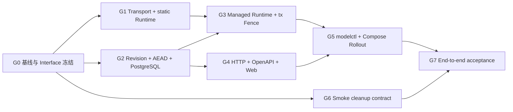

# 实施计划：开发环境一键启动与模型配置

## 计划状态

- W0-W7 的实现与直接相关门禁已完成；用户已批准提交和归档，主实现提交为 `c14173e`。详细证据见
  `research/w7-acceptance.md`。下方 checkbox 保留为原始开发清单，最终完成度以验收记录为准。
- 2026-07-30 最终门禁已通过：受影响 Go tests/vet、modelsettings/transport/modelctl race、`go mod tidy -diff`、
  Web lint/typecheck/test/build、OpenAPI/Compose contracts、独立 PostgreSQL 18 migration integration、
  `git diff --check` 与 Secret 元数据扫描。
- 真实开发栈已完成 `./zhixu up`、`./zhixu restart`、重复 `up`、API/Worker readiness 和 volume 保留验证；
  Settings 页面已在 1440x900 与 390x844 验证 zero console error/warning、zero horizontal overflow、正常 Network。
- 受控 OpenAI-compatible fixture 已验证 Chat、Embedding、test/save/restart 链路；未使用真实第三方 Provider。四套长耗时
  Compose smoke 未逐套动态执行，其启动/清理/信号路径由可执行 contract 覆盖。一次性精确清理实际移除 282 个目标
  smoke image tag，清理后为 0；未执行全局 prune，也未删除其他 Docker 资源。
- 工作树同时包含其他任务的大量未提交改动。所有重叠文件必须先读取当前 diff，再做增量 patch；不得整文件覆盖、格式化无关区块或把其他任务变更纳入本任务回滚。
- 本计划的编号是交付工作包，不表示可以按文件顺序盲目施工；实际执行必须遵守下方波次和门禁。

## 执行波次与依赖

| 波次 | 交付内容 | 对应工作包 | 前置条件 | 退出门禁 |
| --- | --- | --- | --- | --- |
| W0 | 基线、接口冻结、重叠文件保护 | 0、2.1 | 无 | G0 |
| W1 | 深 Module Interface、hardened transport、static Model Runtime | 2、2.1 | G0 | G1 |
| W2 | revision、AEAD、PostgreSQL、Audit | 1 | Interface 类型冻结 | G2 |
| W3 | managed loader、API/Worker Composition、runtime watcher、tx fence | 2、2.1 | G1 + G2 | G3 |
| W4 | Settings HTTP、Session-only、OpenAPI；前端可在 schema 冻结后并行 | 3、5 | G2；前端依赖 HTTP schema | G4 |
| W5 | modelctl、Secret volume、relay、launcher restart/recover | 4 | G3 + G4 | G5 |
| W6 | smoke cleanup contract 与一次性精确清理 | 6 | G0；真实删除等 G5 | G6 |
| W7 | Compose、浏览器、故障注入、Review、规范和回滚验收 | 7、8 | G4 + G5 + G6 | G7 |



### 并行与串行约束

- W1 的 Transport/Model Runtime 与 W2 的 PostgreSQL/AEAD 在 Interface 类型冻结后可以并行；二者不得同时修改 `application/ports.go` 或公共 domain 类型。
- W4 的前端可以基于冻结 OpenAPI 和 fixture 并行，不能在 Handler/OpenAPI 尚变化时自行发明 wire 字段。
- `cmd/api/main.go`、`cmd/worker/main.go`、`api/openapi/*`、`deploy/compose.yml`、`web/src/features/business/BasicPages.tsx` 和全局样式属于串行合并文件；同一时刻只允许一个工作包修改。
- W6 的 cleanup contract 可以提前开发，但一次性镜像删除是独立的破坏性步骤，只能在重新盘点容器引用后执行。

## 0. 开发前门禁

- [ ] 读取 backend/frontend spec、两份 research、PRD 与 design。
- [ ] 搜索 migration 最新编号、Router/Handler/Repository/Audit/strict decoder 既有模式；重读 `research/worktree-overlap.md` 中的用户并行改动并逐文件增量合并。
- [ ] 记录当前 Docker `deploy` 栈、282 个 smoke 镜像、其他项目容器/volume 快照。

## 1. 模型设置领域与持久化

- [ ] 新增 `00064_model_settings.sql` 与 migration contract/integration tests。
- [ ] 新增 model settings domain：Provider-specific value、desired/active/applied revision、Secret action、rollout state。
- [ ] 将 application 收敛为 Settings Manager、Runtime Loader、Rollout Coordinator 三个调用面及 Revision/Rollout/Runtime Store 内部 seam，完整实现 GET、optimistic PUT、draft test、rollout lease/state machine 和 runtime 登记。
- [ ] 新增 AES-256-GCM Secret sealer；覆盖 round trip、wrong key、nonce/AAD tamper、replace 后 keep 重加密、Endpoint rebind 拒绝、明文扫描与安全 String/GoString。
- [ ] 新增 PostgreSQL Repository，参数化 SQL、append-only revisions、singleton state row lock、expected revision、rollout CAS、runtime instance heartbeat/stale 判定。
- [ ] 接入 append-only Audit，只保存 action/revision/provider/key-configured，不保存 Endpoint、Secret 或 draft。

验证：

```bash
go test ./internal/modelsettings/...
go test ./internal/platform/migration/... -run 'ModelSettings|Migration'
```

## 2. Config 与 Composition Root

- [ ] 增加显式 managed-model-settings 配置、Key file loader 和 model-only overlay，共享唯一校验入口。
- [ ] API 正常启动只加载 active；rollout 启动按 rollout id 加载固定 target，再构造 Embedder/RAG/Workflow Registry 并登记 api applied revision/phase。
- [ ] Worker 使用相同规则构造 Chat/Embedder/Registry，完成后登记 worker applied revision/phase；candidate commit 前不消费队列。
- [ ] 无设置时 revision 0 + disabled；Key/密文错误时模型 fail closed、基础服务保持可诊断。
- [ ] managed mode 忽略旧模型 Env identity/secret，仅 overlay 数据库模型字段；static mode 保持现有 Env/YAML 兼容。
- [ ] 增加共享 hardened HTTP Transport，覆盖 no-proxy、no-redirect、DNS rebind、IPv4/IPv6 私网/保留地址和固定 Ollama loopback allowlist。
- [ ] 新增 runtime control watcher 与 instance/rollout fence；所有 HTTP/background/retry/rescue 入队在同一数据库事务使用 EnqueueFence，Worker drain 使用 River QueuePause/QueueResume，并在 model attempt 开始时冻结 active revision。
- [ ] 增加 API/Worker composition/lifecycle tests：disabled、configured、fixed target、revision mismatch、wrong key、stale heartbeat、draining 入队竞态、producer ACK、queue pause、running drain、queued job 保留、abort resume、旧 instance fence、重启后相同 revision。

### 2.1 架构深化迁移门禁

- [ ] 将 Settings HTTP、API/Worker runtime、modelctl 分别收敛到 Settings Manager、Runtime Loader、Rollout Coordinator；不把大 `Service` 直接注入三个调用面。
- [ ] 将持久化 port 收窄为 Revision Store、Rollout Store、Runtime Store 三个内部 seam；PostgreSQL Adapter 可以统一实现，测试 fake 按 seam 独立实现。
- [ ] Settings `Test` 在 Module 内完成 draft Secret 解析、Provider 请求与 Secret 销毁；Handler 不接收 `ResolvedSettings`。
- [ ] 删除非事务 `CheckEnqueueAllowed` 路径；实现注入 River `InsertTx` 的 pgx transaction-scoped EnqueueFence，并审计所有 producer 只经过统一 insertion helper。
- [ ] 新增单一 `NewConfiguredModelRuntime`，先在 static mode 替换 API/Worker 重复 Factory，再接入 managed active/fixed-target loader。
- [ ] Model Runtime 构造同时冻结 Chat/Embedding capability 与 Contract；角色专属 Registry 留在 Composition Root，登记 applied/prepared 必须发生在全部组装成功之后。
- [ ] hardened transport 增加 mixed DNS fail-closed、多地址连接 fallback、DNS rebind、新连接解析、TLS hostname 与固定 loopback preset 测试。
- [ ] 增加架构回归搜索：`cmd/api`、`cmd/worker` 不再出现重复 Configured Model Factory；Application 不导入 pgx/River/HTTP；Handler/modelctl 不直接使用 Repository/Sealer/SQL。

验证：

```bash
go test ./internal/platform/config ./internal/platform/models
go test ./cmd/api ./cmd/worker
```

## 3. Settings HTTP、授权与 OpenAPI

- [ ] 新增 GET/PUT/test Handler 与 strict JSON/Problem/Cache-Control 契约；GET 固定返回 `desired_settings`、`active_settings`、runtime 与 rollout，revision 0 使用 canonical disabled。
- [ ] required auth 下实现 Session-only 管理；Bearer Token、匿名、CSRF/Origin 错误 fail closed；disabled 仅复用 loopback开发边界。
- [ ] Router 注册 `/api/v1/settings/models` 与 `/test`，更新 Capability 路由防未知 mutation 意外授权。
- [ ] 更新 OpenAPI schema/path 和 contract check。
- [ ] 覆盖 GET 双摘要/脱敏、save-before-restart 差异、keep/replace/clear、409、非法配置、Provider 401/429/5xx/timeout/redirect/oversize/model mismatch。

验证：

```bash
go test ./internal/modelsettings/http ./internal/auth/http ./internal/app
make openapi-check
```

## 4. Compose Secret、Ollama relay 与一键脚本

- [ ] Compose 新增持久 Secret volume、原子幂等 Key init、`0700/0400 10001:10001` 权限、API/Worker/modelctl 只读挂载与 managed mode。
- [ ] 默认启动受控 app/worker loopback Ollama relay与 host-gateway 映射，不放宽 Adapter 任意私网 HTTP 规则。
- [ ] 新增镜像内 `zhixu-modelctl`：begin/preflight/drain/wait-prepared/commit/abort/recover/status，所有状态转换使用 rollout id + lease CAS。
- [ ] 新增根目录可执行 `zhixu`：up/restart/status/logs/down/reset。
- [ ] 首次 `.env`/workspace 初始化；默认项目名兼容 `deploy` 数据卷；普通 down 保留 volume。
- [ ] `restart` 固定 target、阻止 PUT、候选预检、暂停入队、排空旧队列、停止入口、启动 prepared candidates、原子 commit；失败/信号/过期 lease 恢复 previous active。
- [ ] restart 期间停止并按新 app/worker network namespace 重建 relay/firewall/proxy；恢复入口前核对 health、active 和两个 fresh applied revision。
- [ ] Makefile/README 委托或记录新入口，保留必要兼容命令。
- [ ] 更新 Compose contract/auth checks，覆盖 key owner/mode/read-only boundary、relay 常驻、loopback、幂等 up/down/reset guard。

验证：

```bash
bash -n ./zhixu deploy/compose-*.sh
make compose-check
go test ./internal/platform/config -run Compose
```

## 5. Settings 前端

- [ ] 新增 model settings API strict decoder/encoder，禁止 Secret 出现在响应 model、错误和缓存持久化。
- [ ] 将 Models 占位内容替换为 Chat/Embedding 配置表单和状态投影。
- [ ] 表单只编辑 desired，同时只读展示 active；实现 keep/replace/clear、Endpoint rebind 提示、测试连接、保存、409 回查、rollout-in-progress、desired/active/applied mismatch。
- [ ] 覆盖 revision 0 disabled、save-before-restart 双摘要、configured/loading/test/save/error/conflict/restart states、键盘/焦点和移动布局。
- [ ] Auth/Session 切换时取消并清除 settings query。

验证：

```bash
npm run lint --prefix web
npm run typecheck --prefix web
npm run test --prefix web -- model-settings SettingsPage
npm run build --prefix web
```

## 6. Smoke 防泄漏与一次性 Docker 清理

- [ ] 四个 Compose smoke cleanup 增加 project-scoped local image 删除。
- [ ] 增加 shell/contract regression，覆盖成功、失败和 signal cleanup。
- [ ] 启动前再次枚举 282 个目标镜像并检查容器引用。
- [ ] 只删除四类无引用 smoke 镜像；记录删除前后数量与 Docker disk usage。
- [ ] 验证 `deploy` 栈、volume 和其他 Compose project 状态未变化。

验证：

```bash
make compose-auth-smoke
make compose-search-smoke
make compose-tool-smoke
make compose-rag-smoke
```

单个 smoke 超过 120 秒或需要真实外部模型时，运行直接相关的 cleanup contract，并如实记录未覆盖动态门禁。

## 7. 全链路启动与浏览器验收

- [ ] 执行 `./zhixu up`，记录 build/migrate/health 结果和 URL。
- [ ] 验证 API `/livez`、`/readyz`、system status、Worker 容器内 `/readyz`。
- [ ] 浏览器桌面与 390x844 打开 Settings Models，验证无模型 disabled 状态。
- [ ] 使用本地受控 Ollama/OpenAI-compatible fixture 或用户已配置 Provider 完成 test/save；验证 app/worker 两侧 relay、hardened transport 与 Secret 不回显。
- [ ] 执行 `./zhixu restart`，验证 API/Worker applied revision 一致和页面 `restart_required=false`。
- [ ] 并发 PUT 与 restart、单 role 启动失败、drain timeout、launcher 中断、stale lease 和 Key volume mismatch 故障注入，验证 previous active 或 Settings 修复入口可用。
- [ ] 检查 Console、Network、overflow、文本遮挡和关键交互。
- [ ] 重复 `./zhixu up`，验证 DB/model settings/workspace 保留。

## 8. Review、规范与回滚检查

- [ ] `git diff --check`。
- [ ] 运行受影响 Go build（跳过测试编译）与局部 Go tests、前端四门禁、OpenAPI/Compose checks。
- [ ] 使用 `go-review`，并追加 SQL 安全审查；前端/脚本执行 `code-review-and-quality` 与 Trellis check。
- [ ] 检查 Secret、SQL 参数化、CSRF/Session-only、SSRF、N+1、事务、迁移 forward-only、日志脱敏和 Docker destructive boundary。
- [ ] 更新 backend/frontend spec 与 deployment/security docs，记录稳定契约。
- [ ] 若需回滚：保留 migration 表；关闭 managed mode恢复 Env disabled；保留数据库/Workspace/Secret volume。

## 9. Go/No-Go 门禁

### G0：基线与范围

- [ ] 保存本任务文件清单及每个重叠文件的当前 diff 摘要；局部 Go/Web 基线可重复通过。
- [ ] PRD、design、implement 和 context manifest 校验通过；无待定产品决策。
- [ ] Docker `deploy` 栈、volume、其他 project 和目标 smoke image/container 引用重新快照。

### G1：Interface、Transport 与 static Runtime

- [ ] Settings Handler 不接触 Repository、Sealer、`ResolvedSettings`、pgx 或 Provider Client；modelctl 不自行传 expected phase/CAS。
- [ ] `cmd/api`、`cmd/worker` 不再直接多次调用 `NewConfiguredChatModel/NewConfiguredEmbedder`；API/Worker 各消费一次冻结 Runtime，Worker 四条消费路径共享同一 Embedder/Contract。
- [ ] Runtime 不公开或保存含明文 API Key 的 `config.Config`；临时 Secret buffer 在 Factory 构造后销毁，安全格式化测试通过。
- [ ] Transport 覆盖 no-proxy、no-redirect、mixed DNS fail-closed、多地址 fallback、DNS rebind、新连接重新解析、TLS hostname 和固定 Ollama loopback。

### G2：持久化与 Secret

- [ ] migration 空库 Up、重复 Up、受控 Down/Up、旧库 forward upgrade 和约束测试通过。
- [ ] revision append-only、expected revision、keep 重加密、endpoint rebind、rollout lease/CAS、runtime ownership/stale 由真实 PostgreSQL 集成测试证明。
- [ ] wrong key、nonce/AAD tamper、Key volume 丢失均 fail closed；日志、错误、Audit、Git diff 和数据库非密文字段扫描不包含 Secret。

### G3：Runtime 与队列一致性

- [ ] 删除非事务 `CheckEnqueueAllowed` 正确性路径；所有新 Workflow/River Job 在同一 `pgx.Tx` 经 `EnqueueFence` 后提交。
- [ ] API/Worker 只加载 active 或 rollout 固定 target；全部 Adapter/Registry 构造成功后才登记 active/prepared。
- [ ] draining 晚提交竞态、QueuePause/Resume、running drain、queued job 保留、attempt revision、stale/旧 instance ownership 测试通过。

### G4：HTTP 与前端契约

- [ ] GET/PUT/test strict JSON、Problem、`Cache-Control: no-store`、409 current revision、Secret 不回显和 Provider 失败矩阵通过。
- [ ] required auth 下 Cookie Session 成功；Bearer、匿名、错误 Origin/CSRF 均 fail closed；Capability 表和 Handler 二次检查同时存在。
- [ ] OpenAPI check、前端 lint/typecheck/test/build 通过；auth/session 切换清除 query，桌面与移动组件测试覆盖所有状态。

### G5：Rollout 与开发入口

- [ ] `./zhixu up|restart|status|logs|down|reset` shell contract 通过；普通 down 不删除 volume，reset 有精确确认。
- [ ] begin/preflight/drain/prepared/commit/abort/recover 使用同一 rollout id + lease；候选 commit 前无流量和 queue claim。
- [ ] commit 前失败自动恢复 previous active；commit 后失败不得伪装 abort 回旧 revision，只恢复已提交 target 的入口/readiness，或明确报告需要新的 rollout。
- [ ] API/Worker/relays/firewall/proxy 的 network namespace、Key 只读权限和 loopback 暴露由 Compose contract 验证。

### G6：Smoke 清理

- [ ] 四个 smoke 在 success/error/signal 路径都只删除自身 project-scoped local images。
- [ ] 一次性清理前逐 Image ID 排除容器引用；无法证明归属或仍有引用的镜像跳过并报告。
- [ ] 清理后目标未使用镜像为 0，`deploy` 栈、PostgreSQL volume、其他项目和全局 BuildKit cache 未变化。

### G7：最终交付

- [ ] AC1–AC11 全部有命令、测试、截图或状态输出证据；未执行项明确记录原因和风险。
- [ ] Go/SQL 使用 `go-review` + SQL 审查；前端/脚本使用 `code-review-and-quality`；最终 Trellis check 无未修复高风险问题。
- [ ] `git diff --check`、受影响模块 build/test、OpenAPI/Compose/Web 门禁通过；未混入或回滚用户其他改动。
- [ ] 用户明确批准后才分批提交；未获授权不 commit、不 push。

## 10. 验收映射

| Acceptance Criteria | 主要实现波次 | 最终证据 |
| --- | --- | --- |
| AC1–AC2 一键启动与幂等 | W5、W7 | 两次 `./zhixu up`、volume/settings/workspace 对比 |
| AC3 无模型可启动 | W1、W3、W4、W7 | disabled composition、readiness、Keyword search、浏览器状态 |
| AC4–AC5 配置、测试与安全错误 | W1、W2、W4 | Manager/Transport/HTTP/Web contract tests |
| AC6 revision 一致与重启生效 | W3、W5、W7 | API/Worker applied revision、attempt/Index/Model Run 事实 |
| AC7 Secret 不泄漏 | W2、W4、W5、W7 | 响应/日志/审计/浏览器/image history 扫描 |
| AC8–AC9 镜像清理 | W6、W7 | 删除前后 inventory 与其他资源快照 |
| AC10 浏览器与 readiness | W4、W7 | 桌面/390x844、Console/Network、API/Worker health |
| AC11 故障恢复 | W3、W5、W7 | 并发、单 role、drain timeout、signal、stale lease、wrong key 注入 |

## 11. 停止条件与建议提交批次

任一条件成立时停止向下一门禁推进：出现 Secret 明文；无法证明 enqueue 与 job insert 同事务；API/Worker target 不一致；migration 无法在旧库安全前进；Docker 资源归属不明确；commit 前恢复会覆盖用户数据；同一外部阻塞连续三次且无降级路径。

建议保持可审查的提交批次，实际提交仍需用户授权：

1. Interface + hardened transport + static Model Runtime。
2. migration + domain/application + AEAD + PostgreSQL。
3. managed loader + Composition Root + runtime watcher + tx fence。
4. Settings HTTP + auth + OpenAPI。
5. Settings Web。
6. modelctl + Compose + `zhixu` launcher。
7. smoke cleanup + docs/spec + final regression fixes。
