# 笔记工作流基础能力增强：技术设计

## 1. 设计目标

把快速采集、Document Draft 创作、材料发现与确认、模板化整理、文件历史和 Git 远端同步接到知序已有的 Source、Retrieval、Workflow、Change Control 与 Git Safe Writeback 主链上，不建立第二套正式知识、审批或文件写入路径。

本任务是父任务，不直接承载一次大规模实现。现有实施拆为四个子任务；本轮确认的 Document Draft 创作是新增的独立交付切片，需在实现前补充子任务与上下文清单，父任务负责跨子任务契约、顺序和最终集成验证。

## 2. 已验证的现状

- Workspace 扫描会原子注册 Source、Content Artifact 和 Source Version，但明确不负责解析或索引：`internal/workspace/application/service.go:190`。
- Ingestion 已有按 Source Version 发起的幂等解析命令：`internal/ingestion/http/handler.go:28`。
- Search 已支持 Source/Source Version 过滤和可打开 Evidence，可作为 Suggested Material Set 的基础召回端口。
- Artifact 已有大纲、人工审核、不可变 Revision、Citation、Coverage/GAP、生成元数据和 Publish Proposal 生命周期：`internal/artifact/domain/model.go:27`。
- 当前仓库尚无正式 Document 的创建 Application/API；`internal/artifact/adapter/changecontrol/publication_creator.go:18` 与 `internal/artifact/application/model.go:185` 明确约束 Artifact 发布请求不会创建正式 Document，因而不能把“新建文章”降格为 Artifact UI 别名。
- Workflow 已支持持久 Human Task，可承载材料确认后的大纲确认节点。
- Safe Writeback 的 GitRepository 明确不提供 push、fetch 或 remote：`docs/architecture/interfaces-and-adapters.md:173`。
- Git CLI Runner 已统一禁 Hook、交互、replace object，并限制输出：`internal/platform/gitcli/runner.go:32`。
- `article_revision.git_commit` 与 `proposal_commit` 已提供 Revision、Proposal、Approval 和 Commit 映射基础：`docs/architecture/database-design.md:177`、`docs/architecture/database-design.md:458`。
- 现有模型密钥加密实现是 Model Settings 专有契约；Git Token 不能直接写入该表或复用其业务 AAD。
- Knowledge Timeline 是领域事务查询投影，不是文件 Git 历史，文件历史不能混入现有 Event 主模型。

## 3. 子任务与依赖

| 子任务 | 拥有范围 | 依赖 |
|---|---|---|
| `08-02-quick-capture-profile` | Quick Capture、Source 捕获状态、自动 Ingestion/Index、Document Knowledge Profile | 无硬依赖；复用 Workspace/Ingestion/Retrieval/Agent |
| 待创建：Document Draft 创作 | 创作台、空白 Document Draft、Markdown 编辑与草稿版本、两条创作路径的统一结果入口 | 不依赖 Quick Capture；整理成文入口依赖 Organizing 子任务 |
| `08-02-organizing-material-templates` | Suggested Material Set、整理草稿、输入快照、内置/自定义模板、整理 Workflow | 硬依赖 Quick Capture 子任务提供稳定 Profile 与版本状态契约 |
| `08-02-document-file-history` | 当前分支文件历史、Diff、外部 Commit 标识、恢复 Proposal | 无 Profile 依赖；复用 Document/Revision、Change Control、Git CLI |
| `08-02-git-remote-sync` | HTTPS Remote、加密 Token、Fetch/FF/Push、同步状态、自动同步 | 依赖 Quick Capture 子任务提供外部变更重新捕获与索引入口；复用 Workspace/Git CLI |

推荐顺序为 Quick Capture/Profile → Organizing；File History 可在其后独立推进；Git Sync 最后接入，避免远端拉取后没有稳定的重新摄取路径。

## 4. 总体数据流

```mermaid
flowchart LR
    Capture["Quick Capture"] --> Source["Source / Source Version"]
    Authoring["新建文章"] --> DocumentDraft["Document / Article Revision Draft"]
    Source --> Ingestion["Ingestion / Chunk / Index"]
    Ingestion --> Profile["Document Knowledge Profile"]
    Profile --> Suggest["Suggested Material Set"]
    Search["Hybrid Search / Formal Knowledge"] --> Suggest
    Suggest --> Confirm["用户确认"]
    Confirm --> Snapshot["Workflow Input Snapshot"]
    Template["Organizing Template Revision"] --> Snapshot
    Snapshot --> Workflow["固定 Organizing Workflow"]
    Workflow --> Result{"模板结果类型"}
    Result --> DocumentDraft
    Result --> Artifact["Artifact"]
    DocumentDraft --> Proposal["Proposal / Approval"]
    Artifact --> Proposal
    Proposal --> Writeback["Safe Writeback / Git Commit"]
    Writeback --> History["Document File History"]
    Writeback --> Sync["可选 Git Remote Sync"]
```

## 5. 模块边界

### 5.1 Workspace 与 Capture

Workspace 继续拥有 Source、Source Version、Content Artifact 和 Workspace 路径边界。Quick Capture 增加面向单条输入的 Capture Application，用统一领域命令调用 Workspace owner，不复制 Source 写入 SQL。

建议在 `internal/capture` 建立编排模块：

- `capture/domain`：Capture kind、状态、失败阶段和不可变原始输入绑定。
- `capture/application`：文字、URL、文件/图片命令，幂等 receipt，异步任务调度。
- `capture/adapter/workspace`：通过 Workspace 公开端口注册 Source/Version/Artifact。
- `capture/adapter/httpfetch`：URL 获取，执行 SSRF、重定向、大小、类型和超时限制。
- `capture/http`：严格 JSON 与 multipart 边界。

文字和文件/图片在同一事务登记 Capture、Source、Artifact、Version；URL 先登记 Capture 和 Source，再异步获取 HTML 并创建 Version。URL 失败时 Source 和原始 URL 仍存在。图片原件先创建 Version，OCR/视觉只是可选派生处理，失败不能删除或覆盖原图。

Inbox 从“只列 Source Version”扩展为 Source/Capture read model；Workspace 扫描产生的既有 Source 继续可见，不强制伪造 Quick Capture 记录。

### 5.2 Document Knowledge Profile

新增 `internal/organizing/profile` 或等价的 Organizing 子域，拥有可重建画像投影。它不能写 Topic、Claim、Relation 表。

Profile 必须绑定：

- Workspace、Source、Source Version、Parse Projection/Index Version。
- Profile schema、prompt、model/settings revision。
- 摘要、候选 Topic、术语与别名、关键知识点、示例和 Source Span 引用。
- `PENDING|RUNNING|READY|FAILED|CAPABILITY_UNAVAILABLE|STALE` 状态、attempt 和稳定错误码。

Ingestion/Index 成功后通过 Outbox 启动 Profile Workflow。模型不可用时基础 Keyword/Hybrid Search 继续工作，Profile 明确为 capability unavailable。Source Version、Parse Projection、Prompt 或 Model 绑定变化时创建新 Profile Revision 或标记旧画像 stale，不覆盖旧运行事实。

### 5.3 Organizing

新增 `internal/organizing` 作为材料与模板的深模块，拥有：

- Organizing Draft。
- Suggested Material Set 及每项召回原因。
- Workflow Input Snapshot。
- Built-in Template Catalog。
- Custom Template 与不可变 Template Revision。
- 固定整理 Workflow 的启动与结果绑定。

它只通过 Retrieval、Profile、Knowledge、Artifact 和 Change Control 的公开端口组合数据，不直接访问其他模块表。

Suggested Material Set 是可修改草稿；确认命令必须携带 expected draft version，并在同一事务冻结材料版本、Template Revision、检索/画像版本和 canonical snapshot hash。Workflow input 只携带 Snapshot ID 等稳定身份，正文由执行器按冻结绑定读取。

自定义模板使用版本化声明 Schema。声明可以包含材料条件、章节、表达和结果位置，但编译器只能映射到系统预注册的固定 Workflow Definition 与允许的 Artifact/Proposal 类型，不能产生任意节点、工具或权限。

### 5.4 Document Draft、Artifact 与 Proposal

Document Draft 与 Artifact 必须保持不同的领域身份：

- “新建文章”直接创建 Document 与首个 Article Revision Draft；“专题知识文章”在大纲 Human Task 确认后分章生成新的 Article Revision Draft。两条路径都进入同一个 Document Draft 版本与 Proposal/Approval/Safe Writeback 边界。
- 多文档合并整理先生成带重复/互补/冲突/独特分类的合并草稿；用户确认目标与 Diff 后才创建 Merge Proposal。
- 知识总结报告和面试复习文档保持 Artifact，除非用户后续明确发布。

Artifact 的大纲、章节、Citation 与 Coverage/GAP 可以作为生成机制参考，但不能成为 Document 的存储或身份事实源。Organizing 可以创建或追加 Article Revision Draft，不能直接发布正式 Markdown；所有发布、覆盖、恢复仍走 Change Control。

#### 5.4.1 创作编辑边界

`/authoring/new` 使用 Markdown 单一编辑事实，不引入富文本或块模型。编辑界面提供标题、目标路径、正文与实时预览；预览只消费当前 Markdown，不反向生成或改写 Markdown。

编辑中的恢复状态使用独立 Working Draft，按 Workspace 与 Document/临时 Draft 身份持久化，并携带 version/updated-at 解决多标签页或恢复冲突。自动恢复只更新当前 Working Draft，不为每次键入创建不可变 Article Revision。用户显式保存版本、整理 Workflow 产出稳定结果或进入发布时，才冻结新的 Article Revision Draft。

目标路径必须在 Workspace 边界内规范化并校验扩展名、冲突与保留路径；前端预览和自动恢复不得直接写正式 Markdown 文件。发布继续由 Proposal、Approval 与 Safe Writeback 负责。

### 5.5 Document File History

新增 `internal/documenthistory` 只读查询模块，组合三类事实：

- Git 当前分支上影响目标路径的 Commit 与 Blob/Diff。
- `article_revision` 的 Document/Revision 映射。
- `proposal_commit` 的 Proposal/Approval/Workflow/Writeback 映射。

没有应用映射的 Git Commit 标记为外部变更；缺失关系保持为空。工作树 Diff 是顶部的当前状态，不写入历史表。

恢复是独立命令：History 只生成目标快照与反向 Diff，Change Control 创建 `RESTORE_DOCUMENT` Proposal；批准后仍由 Safe Writeback 产生新 Commit。History Adapter 不提供 reset、checkout 或 ref 写入。

Knowledge Timeline 与 Document File History 保持两个查询面：前者回答“知识发生了什么”，后者回答“这个文件每个版本是什么”。

### 5.6 Git Remote Sync

新增 `internal/gitsync`，不扩宽 Change Control 的 `GitRepository`：

- `gitsync/domain`：RemoteConfig、SyncRun、方向、状态和冲突分类。
- `gitsync/application`：配置、检查、手动同步、自动同步调度与结果复核。
- `gitsync/adapter/postgres`：配置、加密 Token、幂等运行和 Outbox。
- `gitsync/adapter/gitcli`：Fetch、ancestry/status、FastForward、Push 与 post-check。
- `gitsync/http`：配置、状态、运行与差异查询。

Remote URL 存 PostgreSQL，不含 userinfo，首版只有 HTTPS。Token 使用通用 Secret Sealer 加密，AAD 至少绑定 Workspace、Remote Config Revision、用途和 Schema。模型设置与 Git Token 可以复用同一底层 AES-GCM 原语，但使用不同表、用途和 AAD；不能读取或迁移为同一业务 Secret。

Git 命令认证使用受控 AskPass/credential session，Token 不进入 argv、URL、Git Config、stdout/stderr 或日志。Runner 继续禁交互、Hook、replace object、pager/editor，输出有界。

同步状态机：

1. 创建 SyncRun 并冻结本地 branch/head、Remote revision 和触发来源。
2. Fetch 到受控 remote-tracking ref。
3. 重新检查 HEAD、工作树、分支与 ancestry。
4. 相同则 `SYNCED`；仅远端领先且严格 clean 时 Fast-forward；仅本地领先时非 force Push。
5. 分叉、dirty、detached、ref 漂移或未知结果进入明确 Conflict/Manual Recovery，不自动 Merge/Rebase。
6. 操作后再次 Fetch/ls-remote 并验证本地、远端 OID；只有一致时标记 `SUCCEEDED`。

远端拉取成功后，通过 Workspace 外部变更捕获入口创建 Source/Revision 并触发 Ingestion/Index。Git 已同步与索引更新失败是两个状态，不能互相伪装。

## 6. API 与状态所有权

建议的公共资源边界：

- `POST /api/v1/workspaces/{workspace_id}/captures`：文字/URL JSON。
- `POST /api/v1/workspaces/{workspace_id}/capture-files`：文件/图片 multipart。
- `GET /api/v1/workspaces/{workspace_id}/captures`、`GET /captures/{id}`：Inbox 状态。
- `GET /api/v1/workspaces/{workspace_id}/source-versions/{id}/knowledge-profile`：画像与重试状态。
- `POST /api/v1/workspaces/{workspace_id}/documents` 与 `/document-drafts...`：创建空白 Document、读取/更新带版本的 Working Draft、冻结 Article Revision Draft 与发起发布。
- `/api/v1/workspaces/{workspace_id}/organizing-drafts...`：建议、增删、确认与启动。
- `/api/v1/workspaces/{workspace_id}/organizing-templates...`：模板与 Revision。
- `/api/v1/workspaces/{workspace_id}/documents/{document_id}/history...`：版本、Diff、恢复 Proposal。
- `/api/v1/workspaces/{workspace_id}/git-remote...` 与 `/git-sync-runs...`：配置、状态和同步。

所有命令使用 Workspace-scoped `Idempotency-Key`、expected version 和严格 JSON/multipart 校验。SSE 只触发对应 Query family 失效，REST read model 仍是事实源。Document Working Draft 由服务端按版本持久化；浏览器只可短暂保留尚未确认送达的编辑缓冲并在服务端确认后清除。Secret、Article Revision、Workflow Snapshot、SyncRun 与服务端状态不得进入 Browser Storage。

## 7. 数据库与迁移

采用 additive、forward-safe migration，按子任务独立编号和回滚门禁：

- Capture/Profile：Capture/attempt、Profile/Revision/Outbox；Source owner 外键保持 Workspace 作用域。
- Authoring：复用或补齐 Document、Article Revision，并新增可 CAS 更新的 Working Draft/恢复状态；不可变 Article Revision 与可更新 Working Draft 使用不同表和约束。
- Organizing：Draft、Draft Material、Input Snapshot、Snapshot Material、Template、Template Revision、Run binding。
- History：优先查询现有映射；仅在需要稳定分页/缓存时增加可重建 projection，不复制 Git Blob 正文。
- Git Sync：Remote Config/Revision、encrypted credential、SyncRun/attempt/outbox。

不可变 Revision、Snapshot 和运行结果禁止 UPDATE/DELETE；状态表使用受控 CAS。Down 在存在不可回填的业务事实时 fail closed，生产回滚采用 forward fix。

## 8. 安全与一致性

- URL Capture 必须限制协议、DNS/重绑定、重定向、私网地址、响应大小、媒体类型和超时。
- 文件上传先做大小、文件名、媒体嗅探和内容安全校验；不信任客户端 MIME。
- Document 目标路径必须约束在 Workspace 内并拒绝遍历、保留路径、非 Markdown 扩展名和未解决冲突；Markdown 预览必须清洗 HTML、协议与外部链接，不能执行脚本。
- Profile 与模板模型输入只读取冻结 Evidence，模型输出经过严格 Schema 校验，不成为正式知识。
- Template 自定义指令属于不可信数据，不能改变系统 Prompt、工具 allowlist、权限或输出 Schema。
- Git Token 全链路脱敏，错误只暴露稳定码；Secret 响应仅允许首次 replace 请求，不提供回读。
- Git History 和 Sync 的路径、Commit、ref、URL 必须 canonicalize；命令参数数组化且禁止调用方传 Git args。
- 所有跨文件/Git/DB 副作用持久化 checkpoint；结果未知不能盲目重试或报告成功。

## 9. 兼容与发布

- 现有 Workspace Scan、Source Version 列表、Search、Artifact、Proposal、Timeline 和 Settings 深链保持兼容。
- Inbox read model 扩展时保留现有 Source Version 字段，前端严格 Decoder 以版本化响应迁移。
- Authoring、Profile、Organizing、History、Git Sync 分别使用 capability/readiness；单项不可用不拖垮基础 Inbox、Search 或本地 Safe Writeback。
- 自动同步默认关闭。Git Sync 上线前先只读检查/手动模式，再开放自动触发。
- 每个子任务独立提交和验证；父任务最后只做跨链路集成、文档收敛和回归，不再次引入新业务范围。

### 9.1 PRD 事实源与交付回填

实施期间以本父任务和对应子任务 PRD 作为专项范围、决策与验收事实源；`docs/product/PRD.md` 始终是产品级 `v1.0` 总 PRD。两层文档不互相替代：专项 PRD 保留研发细节，总 PRD 只吸收稳定交付后的产品契约。

各子任务完成后的建议回填范围如下，最终以实际交付行为和总 PRD 现有结构为准：

| 子任务 | 总 PRD 主要回填章节 |
|---|---|
| Quick Capture / Profile | `6.3 Inbox`、`10.2-10.4`、`11.1`、`13.2-13.3`、`14.3-14.4`、`21.2-21.3`、`22 正式 v1.0 验收矩阵` |
| Document Draft Authoring | `6.2-6.4`、`10.5-10.6`、`11.1`、`13.3`、`13.7`、`21.3`、`22 正式 v1.0 验收矩阵` |
| Organizing / Templates | `10.4`、`10.6`、`10.11`、`11.1`、`11.4`、`13.7-13.10`、`14.4`、`14.8`、`14.10`、`14.12`、`21.12`、`21.14`、`22 正式 v1.0 验收矩阵` |
| Document File History | `10.5`、`10.9`、`11.8`、`13.3`、`15.5`、`21.3`、`22 正式 v1.0 验收矩阵` |
| Git Remote Sync | `10.1`、`10.9`、`10.22`、`11.8`、`15.4-15.5`、`16.1`、`21.15`、`22 正式 v1.0 验收矩阵` |

回填时不得整篇复制专项 PRD，不写内部表结构、迁移或实现顺序，也不得把未交付能力改写成产品现状。本专项不创建 `v2.0` PRD；真正的产品大版本升级需另行决策。

## 10. 关键取舍

- 不建设全局材料篮：减少持久对象和跨页面状态，整理草稿足以满足本次选择。
- 不把 Profile 写成正式 Topic/Claim：保住 Evidence-first 审批边界。
- 不提供模板工作流编辑器：模板声明可控、可校验、可升级。
- 不把 Document Draft 建模为 Artifact：文章草稿与派生学习/报告结果拥有不同发布身份。
- 不引入富文本或块编辑器：Markdown 是单一编辑事实，Working Draft 自动恢复不制造逐输入 Article Revision。
- 不把文件历史塞入 Knowledge Timeline：避免两种时间线事实混淆。
- 不复用 Safe Writeback GitRepository 做远端同步：最小权限与失败恢复语义不同。
- 不在首版自动解决 Git 分叉：对单用户本地优先产品，停止并解释比错误合并更可靠。
