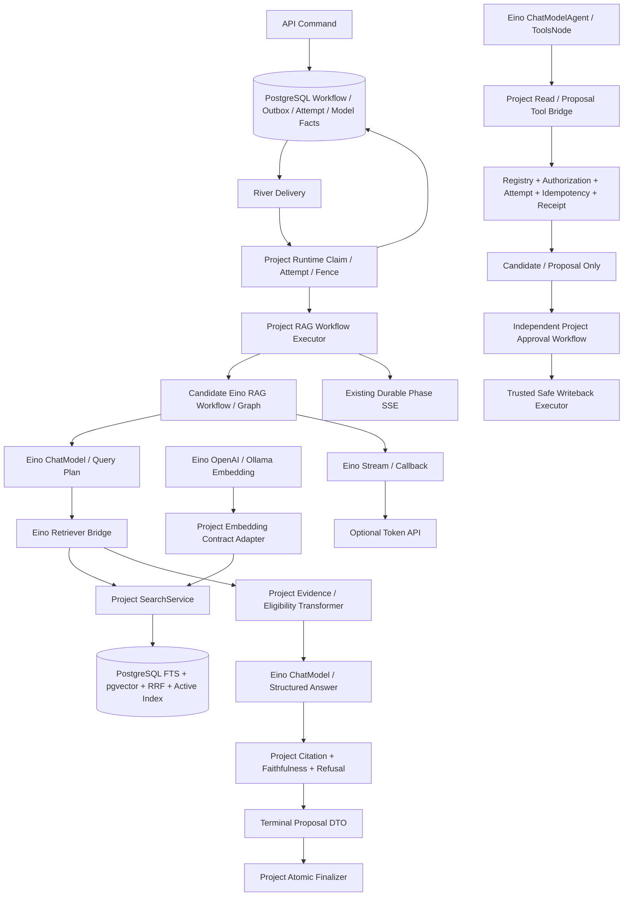

# Eino 分层迁移技术设计（能力复核修订版）

> 修订基线：2026-08-08，Eino core `v0.9.13`。本文同时记录“当前已经落地的基线”和“下一阶段计划”，不把未实施能力写成已完成。

> ADR 编号冲突已解决：ADR-0024 记录基线分层采用，ADR-0025 记录 Embedding 采用，ADR-0026
> 记录其余 Runtime 路线的实际门禁结论。

## 1. 修订后的设计决策

采用“PostgreSQL/River 外层可靠工作流 + Eino 内层 AI Runtime”的分层方案：

- Eino 负责通用 Provider 组件、进程内 Chain/Graph/Workflow、流处理、Callback、通用 Tool dispatch 和 ReAct/Agent loop。
- 知序负责 durable Workflow、领域状态、租约与 fence、事务、Outbox、权限、审计、Evidence/Citation、Proposal/Approval 和 Safe Writeback。
- 项目 Application Port 继续是稳定边界；Eino 类型只出现在 Adapter、Infrastructure 和 AI Composition 包，不进入 Domain、HTTP DTO、Workflow input 或数据库。
- 项目服务适配为 Eino Retriever、Transformer、Tool 或 Lambda，是 Eino 官方支持的自定义 Component 用法；只有重复实现 Graph 调度、流拼装、ReAct 循环或 Provider 协议才属于不必要自研。
- Eino Checkpoint/Interrupt 是 Agent/Graph 执行快照和交互能力，不是 River/PostgreSQL 的替代品。首轮只允许在同一 Worker 进程、同一个持久 Node Attempt 内试点，PostgreSQL 仍是唯一业务恢复事实源。
- 生产基线使用 Eino `v0.9.13` 和经典 `schema.Message` 路径；`v0.10` alpha、Agentic OpenAI/`AgenticMessage`、多 Agent 和长时间 checkpoint 恢复先隔离验证。
- Eino 基线 ADR 只授权当前已完成的 Chat、Callback 和短 Graph。本修订版是后续设计输入，不自动扩大生产授权；任何后续能力进入生产开发前必须新增 ADR，明确 supersede Eino 基线 ADR 的范围限制、版本基线和逐能力回滚策略。

## 2. 目标架构



API 命令先原子写入项目 Workflow/Outbox 事实；River delivery 到达后，由项目 Runtime Claim 创建或恢复 Node Attempt、校验 lease/fence，再把冻结的执行上下文交给外层 Executor。外层 Executor 创建 Model Run，并在内层 Eino Runnable 成功后原子发布结果。Eino Runnable 不创建 Attempt、不提交业务终态、不直接写文件/Git，也不决定 River 重试。

## 3. 修订后的迁移矩阵

| 正式能力/入口 | 归属 | 修订后的目标与保留边界 | 状态/阶段 |
|---|---|---|---|
| OpenAI-Compatible Chat transport | **Eino 原生组件 + 项目合同适配** | 使用 Eino OpenAI ChatModel；项目保留安全 HTTP、动态 Schema、严格 wire/usage/model/error 校验 | 已完成，默认 direct |
| Callback/Trace | **Eino Callback + 项目 observability** | Eino 提供生命周期钩子；只写脱敏 telemetry，不替代 Model Run/Call/Audit | 已完成 |
| Structured Output 三阶段调度 | **Eino Graph + 项目 Port** | Eino 负责节点和分支；项目保留 decoder、预算、阶段上限、错误与审计 | 已完成，按消费者灰度 |
| 完整 RAG 内层编排 | **保留项目 `RAGExecutor`** | Eino 能表达流程，但当前原生覆盖与净收益不达门禁；继续复用 Eino Chat/Embedding/短 Graph | 生产 No-Go |
| `SearchService`、FTS/pgvector、RRF、Active Index | **项目实现** | 官方无 PostgreSQL/pgvector/RRF 等价实现；当前完整 RAG No-Go，因此不创建无消费者 Retriever bridge | 保留 |
| PostgreSQL Indexer/Active Index | **项目实现，按需适配 Eino Indexer** | Eino Indexer 接口不能替代版本激活、事务和一致性 | 有 Graph 消费者时接入 |
| OpenAI/Ollama Embedding transport | **Eino 原生组件 + 项目合同适配** | 两个 Provider 均已实现可回滚 Adapter；保留批量、顺序、数量、维度、归一化、model 和 `truncate=false` 门禁 | 条件 Go，默认 direct |
| 模型语义 Rerank | **项目 Port + 自定义 Eino Transformer** | 官方 ScoreReranker 只重排已有 score；真实 rerank Provider 仍由项目选择和校验 | Provider 确定后 |
| 通用 Tool Calling / ReAct loop | **产品授权后候选 Eino ChatModelAgent/ToolsNode** | ToolsNode PoC 已 PASS；当前无产品入口、终止/审批合同和持久 Attempt，不创建生产路径 | 生产 No-Go |
| Tool 权限、审批、幂等、receipt、写回 | **保留项目所有权** | 任何 Eino Tool 都必须进入项目 Registry/Policy/Attempt；模型侧工具最多产生 Candidate/Proposal，批准后由独立项目 Workflow 执行 Safe Writeback | 全程 |
| Token Streaming | **未来新路径使用 Eino Stream** | 实际 Eino Stream PoC 已 PASS；当前无 Token 消费者，持久阶段 SSE 不改变 | 生产 No-Go |
| ADK 多 Agent | **能力可用，首轮 PoC/灰度** | 经典 `schema.Message` 路径先行；Agentic/Beta 路径不承接核心生产流程，限制来自版本/恢复风险而非能力缺失 | 后续决策 |
| Checkpoint/Interrupt/HITL | **Eino 进程内子流程能力 + 项目持久事实** | 同进程/Attempt 的实际 PoC 已 PASS；跨进程/reclaim/HITL 无 fenced handoff，不进入生产 | PoC-only |
| Session/Memory persistence | **保留项目所有权** | Eino 官方不负责对话历史存储；继续使用项目会话和 Memory Snapshot | 全程 |
| Runtime、Credential、Revision、Readiness | **保留项目所有权** | Composition Root 构造私有 Eino Adapter；Credential 不进入日志、合同或持久状态 | 全程 |
| RecordingChatModel、Model Run/Call/Audit | **保留项目所有权** | 每次 Provider 调用继续形成项目事实；Callback 不是可靠事件总线 | 全程 |
| Workflow/River/PostgreSQL、Outbox、Human Task | **保留项目所有权** | 唯一持久工作流状态、投递、重试、暂停、恢复和补偿边界 | 全程 |

## 4. 关键契约设计

### 4.1 已完成的 Chat 与短 Graph 基线

- `agentapplication.ChatModel`、`ChatContract` 和 `StructuredPhaseScheduler` 继续是调用方看到的稳定接口。
- Eino OpenAI ChatModel 使用项目安全 HTTP client，并通过请求级 option 注入动态 Schema；共享实例不保存可变 Schema、Tool 列表或响应状态。
- Provider 响应继续执行项目严格 wire、model echo、usage、响应大小和稳定错误校验；不因为使用 SDK 而信任未经验证的输出。
- `INITIAL/REPAIR/REDUCED` Eino Graph 继续调用项目 `StructuredPhaseRun.Advance`；Eino 负责调度，项目负责每阶段的模型调用、校验、预算和审计。
- 五个消费者 selector 与 Chat selector 保持独立，默认 direct。已经通过的合同和真实 PostgreSQL/River 门禁不得因后续 RAG 迁移而降低。

### 4.2 Embedding Adapter

目标是删除重复的 Provider transport，而不是删除项目 Embedding 合同：

1. 分别为 OpenAI-Compatible 与 Ollama 做隔离可行性验证；只有对应 Provider Go 后，才在 `internal/platform/models` 增加 Eino-backed Embedder，实现现有 `retrievalapplication.Embedder`。
2. 输入先通过 `ValidateEmbedRequest`；Eino `EmbedStrings` 返回后转换为项目 `EmbedResult`，再执行 `ValidateEmbedResult`。
3. 继续校验批量上限、总字节、UTF-8、向量数量、固定维度、有限数、归一化和调用方独立副本。
4. Eino OpenAI Embedding 当前按响应数组顺序返回，外层拿不到原始 item `index` 和 response model；Ollama 组件同样只返回 vectors、不回显 response model，且项目现有 native Ollama 合同固定 `truncate=false`。两个 Provider 必须分别用乱序/缺项/重复项、维度漂移、model mismatch 和 truncate fixture 验证。
5. 注入项目 HTTP client 不代表自然获得 `MaxResponseBytes`。必须证明成功响应与错误响应都受有界读取保护；框架 client 无法满足时，保留对应 Provider 的窄 direct transport 或提供有界 RoundTripper，不整体重写 Embedding 抽象。
6. `eino-ext/components/embedding/*` 独立锁定精确 tag 或 pseudo-version，记录 commit、许可证和升级门禁。当前复核 commit `90a15623ddb66465aea01fbe8c63ecc9d267acc1` 中，OpenAI/Ollama Embedding 分别依赖 core `v0.7.13`/`v0.6.0`，必须先证明与生产 core `v0.9.13` 编译及行为兼容，不能仅依赖 Go MVS 后能编译就判定通过。

### 4.3 Retriever、Indexer 与 Rerank Bridge

- 只有完整 RAG 路径 B 获得 Go 且出现明确 Eino 消费者时，才新增 Retriever Adapter；它在 `Retrieve` 中唯一调用现有 `SearchService`，并将 `schema.Document` 与项目结果进行有界、可逆映射。
- Workspace、Approved Evidence、Source/Version、Active Index、Keyword/Semantic/Hybrid、RRF、TopK、score、provenance 和降级语义仍只有一个事实源。
- 项目 PostgreSQL Indexer 只有出现 Eino Indexer 消费者时才适配；Eino 接口不获得索引激活或事务提交权。
- 真实模型 rerank 通过项目 `Reranker` Port 调用，并包装为自定义 Eino Transformer。不得以官方 ScoreReranker 替代 query-dependent semantic score。

### 4.4 完整 RAG 内层 Workflow

完整 RAG 不是预设必须迁移。先比较两条路径：A 保留现有 `RAGExecutor`，只复用已经独立通过门禁的 Eino Chat/Embedding，不创建没有消费方的 Retriever bridge；B 由 Eino Workflow 接管完整内层 DAG，并由该 Workflow 消费 Retriever bridge。先逐项检查安全、数据一致性、隐私、部署、许可证和运行时兼容等强制约束，再用实现前冻结的权重计算功能覆盖率；B 至少达到 80% 加权覆盖后，继续量化可删除的重复调度代码、端到端延迟、节点可观测性、错误/取消/重试语义和维护成本。只有 B 有明确净收益且业务合同等价才进入实现；否则保留 A。

若 B 获得 Go，首选 Eino Workflow 承载确定性 DAG；只有需要 cycle 或 Workflow 无法表达的动态分支时使用 Graph。禁止用 Workflow 实现 ReAct 循环。

建议拓扑：

```text
START
  -> query_plan
  -> retrieve
  -> evidence_eligibility_and_topic_projection
  -> answer
  -> citation_validation
  -> faithfulness_review
  -> refusal_or_terminal_proposal
  -> END
```

- `query_plan`、`answer` 和 `faithfulness_review` 复用 Eino ChatModel/结构化输出能力；项目 Schema、预算、repair/reduced 和 Model Run/Call 仍生效。
- `retrieve` 调用 Eino Retriever bridge；Evidence/Citation/Refusal/Proposal 使用项目 DTO 和自定义 Component/Lambda。
- Runnable 只产生 `RAGTerminalProposal`，不调用 Answer finalizer。外层 `RAGWorkflowExecutor` 负责 memory snapshot、Model Run 生命周期、exact replay、失败归类和原子发布。
- Graph/Workflow 不自动 Provider retry，不保存第二套持久 state。一次 River transport 重投递必须先由项目 receipt/attempt 判断，不得再次运行模型。
- RAG 评估不依赖 Eino Embedding Go，可继续使用现有 direct Embedder。先做 direct/Eino 离线等价，再做真实 PostgreSQL/River 和公开 HTTP 闭环；通过前不切默认值、不删除现有 `RAGExecutor`。

### 4.5 Tool Calling 与 ReAct

原 Stage 4 No-Go 的原因是项目缺少明确消费者和可信持久 Tool-loop 入口，不是 Eino 缺少 Tool Calling。保持 No-Go，直到产品 PRD 明确生产调用方、允许工具、终态、预算、人工审批路径，并由新 ADR 授权这一产品行为：

- 只有上述前提满足后才新建持久 Workflow Tool-loop Node，并使用经典 Eino ChatModelAgent 或 Graph + ToolsNode；配置明确 `MaxIterations`、取消和总预算。不得为了展示 Eino 能力先建无消费者的 Node。
- 首个生产路径禁用 Eino `ModelRetryConfig` 和 `ModelFailoverConfig`；重试继续由项目 Workflow 和 `RecordingChatModel` 形成唯一 Model Call/费用事实。未来启用时，每次底层调用仍必须经过这两层并由新 ADR 明确责任。
- Eino Tool `Info` 只暴露脱敏 schema。执行入口从持久 Node/Attempt 重新解析 Workspace、Capability、lease/fence、确定性 `call_no` 和幂等键，不接受模型提供这些身份。
- 第一阶段只注册只读工具，并优先顺序执行，验证工具顺序、重复调用和回放语义后再评估并行。
- 模型侧不注册 Safe Writeback 工具。涉及写入的 Eino Tool 最多创建 Candidate/Proposal；批准后由独立项目 Workflow 取得一次性 Write Authorization 并调用 trusted Safe Writeback Executor，与原 Agent loop 解耦。
- Eino Interrupt/Resume 首轮只承载同一进程、同一活跃 Attempt 内的执行交互。项目 Human Task 会结束 Attempt 并释放 lease，不能直接恢复旧 checkpoint；Approval 记录仍是授权事实，未知外部结果保持 `UNKNOWN/manual_recovery`。

### 4.6 Token Streaming

- 产品需求和扩展采用 ADR 必须同时批准 Token API、持久终态及回滚边界，之后才能进入生产实现。
- 当前 durable phase SSE 保持原样；它提供恢复和阶段事实，不等于模型 Token Stream。
- 新 Token API 必须从 Eino ChatModel/Graph 的 `Stream` 或 `Transform` 入口贯通到 HTTP，不能用 `Invoke` 结果包装成单帧 stream。
- 每个 StreamReader 必须被消费并关闭；覆盖客户端取消、慢消费者、背压、流内错误、UTF-8/大小上限和 goroutine 泄漏。
- Callback 的流副本必须独立消费并关闭，且不得把 Prompt、Token 正文或 Provider raw error 写入 telemetry。

### 4.7 ADK 与 Checkpoint/Interrupt

- 首轮使用经典 `schema.Message` 路径；Agentic OpenAI/`AgenticMessage`、AgenticToolsNode 和多 Agent 的能力已存在，但因版本/恢复风险先做隔离 PoC，不代表框架不支持。
- Checkpoint PoC 必须固定 Eino 版本、Graph topology、CallOptions、自定义类型注册和 serializer；验证进程内快照序列化往返和版本兼容，不宣称进程崩溃后恢复。
- `CheckpointStore` 只能保存 Eino 执行快照，key 必须同时绑定 Worker owner 与项目 Node Attempt。业务状态、会话消息、权限、Approval 和 side-effect receipt 不得只存在 checkpoint。
- Checkpoint 只允许在**同一 Worker 进程、同一个仍活跃的 Attempt** 内恢复。Worker 重启会更换 lease owner；lease reclaim 会把旧 Attempt 标记为 `lease_lost` 并创建新 Attempt；Human Task 也会结束当前 Attempt。以上任一情况发生后都不得读取或转移旧 checkpoint。
- 未来若需要崩溃恢复或跨 Attempt/HITL 转移，必须另立 ADR，设计稳定恢复身份或经 PostgreSQL 授权的 fence 校验与一次性所有权 handoff，并重新估算实现和测试工作量。
- Store 必须定义 TTL、显式 Delete（实现可选的 checkpoint delete 能力或等价清理）、静态加密、访问控制及 Prompt/消息/工具结果等敏感数据的保留周期；Attempt 终态或失效后及时清理。
- 同一流程只能有一个恢复 owner：外层 Node 由 River/PostgreSQL 恢复；Eino checkpoint 若启用，只恢复同一 Worker 进程、同一活跃 Node Attempt 内尚未完成且没有外部副作用的 Agent 子流程。

## 5. 运行时切换、灰度与删除条件

- 保留现有 `chat_implementation=direct|eino` 与五个 Structured Scheduler selector。
- 后续新增独立、进程级内部 selector：Embedding transport、RAG orchestrator、Tool loop 和 Token stream 分别控制；它们不进入 Provider/Model 身份、Workflow input 或持久业务 DTO。
- 每个能力先跑固定 fixture，再跑真实 Provider/数据库门禁，最后逐消费者灰度。禁止一个全局开关同时切换 Chat、Embedding、RAG 和 Tool。
- 回滚只切回 direct/现有实现，不迁移或回滚数据库。Eino path 产生的持久事实必须与项目原合同相同。
- 旧实现删除需要：合同等价、真实 Provider、真实 PostgreSQL/River、生产灰度、错误率/延迟观测和回滚演练全部通过；至少保留一个发布周期后再删除。

## 6. 依赖与升级策略

- Core 固定 Eino `v0.9.13`；不以 main 或 `v0.10` alpha 作为生产设计基线。
- `eino-ext` 每个组件独立记录 module path、精确版本或 pseudo-version、commit、许可证和间接依赖。
- Embedding 当前候选 commit `90a15623ddb66465aea01fbe8c63ecc9d267acc1` 的 OpenAI/Ollama 模块分别声明 core `v0.7.13`/`v0.6.0`，与根模块 `v0.9.13` 不同。每个 Provider 先在隔离模块完成编译、API、race 和合同矩阵，再决定锁定、fork/patch 上游或 No-Go；不得把“依赖解析成功”等同于运行时兼容。
- 首轮 Tool/Agent 使用经典 ChatModel 与 `schema.Message`；Agentic/Beta 模块不得进入默认生产路径。
- 每次升级重跑 direct/Eino contract、race、取消、stream close、Provider smoke、真实 PostgreSQL/River replay 和 vendor/Docker 门禁。
- `poc/eino` 只保留无法在主模块 contract tests 中表达的实验；已进入生产 Adapter 的能力不能只靠 PoC 验证。

## 7. 关键风险与缓解

| 风险 | 缓解 |
|---|---|
| 把未实施误写成框架不支持 | 能力判断引用官方接口/源码；实施状态单独列出 |
| Eino v0.x 或 ext pseudo-version 发生不兼容 | 精确锁版本，升级前跑相同 contract/replay 门禁 |
| Embedding 响应顺序或 model 信息被 SDK 丢失 | 乱序/缺项/重复/模型 fixture；必要时仅保留窄 transport adapter |
| 为接 Retriever 重写 PostgreSQL 检索 | 只建调用 `SearchService` 的 Eino bridge，检索规则保持单一事实源 |
| Graph 获得持久化或业务终态所有权 | Project Runtime Claim 创建/恢复 Attempt 并校验 fence；Runnable 只返回 proposal，外层 executor 只消费已冻结 Attempt 并原子 finalization |
| Eino Agent 自动 retry/failover 绕过项目审计与费用预算 | 首个生产路径禁用 `ModelRetryConfig`/`ModelFailoverConfig`；所有调用穿过 `RecordingChatModel`，Workflow 是唯一重试 owner |
| Tool 并行导致重复副作用 | 只读、顺序、持久 call identity 先行；写操作继续走 Proposal/Safe Writeback |
| `Invoke` 包装成假 Streaming | API 到模型全链路使用 `Stream/Transform`，测试首帧与取消 |
| Worker 重启、Human Task 或 lease reclaim 后错误恢复旧 checkpoint | 首轮只允许同一进程/活跃 Attempt 恢复；Attempt/owner 变化时 checkpoint 失效并清理，禁止隐式跨 Attempt 转移 |
| Checkpoint 与 River 形成双账或泄露敏感消息 | PostgreSQL 是唯一恢复事实源；Store 强制 TTL/Delete、加密、访问控制和敏感数据生命周期 |
| Stream/callback Reader 未关闭 | close、取消、race 和泄漏测试作为发布门禁 |

## 8. 当前实施状态与修订结论

- 已完成：Eino Chat Adapter、调用级 Callback/Trace、Structured Output 三阶段短 Graph、五消费者独立 selector、
  双 Provider Eino Embedding Adapter、真实 Eino ToolsNode/Stream/Checkpoint 隔离能力 PoC，以及对应离线门禁。
- 已保留：direct Chat、direct scheduler、PostgreSQL/River、全部项目领域/权限/审计/安全写回边界。
- 条件 Go：Embedding 离线合同已通过且 ADR-0025 已接受，默认仍为 `direct`；各 Provider 的真实 smoke 和生产
  观察完成前不切默认值、不删除 direct。
- 生产 No-Go：完整 RAG、Tool/ReAct、Token Streaming、Checkpoint/ADK。完整 RAG 是净收益不足；Tool/Token
  是缺少产品消费者；Checkpoint 是 Attempt 恢复所有权不兼容。以上均不能表述为框架不具备能力。
- 未创建：Eino Retriever bridge、完整 RAG Graph/selector、生产 ToolsNode、Token API/selector、根模块
  CheckpointStore 或跨 Attempt 恢复。
- ADR-0026 已冻结这些结论和重开条件；未来满足条件时以新任务和新 ADR 重开，而不是继续本次迁移。
