# 持续演进知识笔记技术设计

## 1. 目标与复用决策

本任务实现 `prd.md` R1–R8。自动流程负责产生可审阅候选，正式文件仍只有 Proposal → Approval → Safe Writeback 一条写入路径。

| 责任 | 复用 owner | 本任务补充 |
|---|---|---|
| 原始资料与解析片段 | Ingestion / Workspace / Retrieval | 解析通过后的持久 Source-ready 通知及原始片段读取桥接 |
| 按知识点整理 | Organizing | 独立 SynthesisService、知识点身份、增量项、来源台账与不可变候选投影 |
| 正式笔记身份与正文 | Authoring Document / ArticleRevision | 内部 AGENT provenance 的生成版本入口；不借用 HTTP USER 创作命令 |
| 模型、预算与调用事实 | Agent StructuredRunner / RecordingChatModel / Eino scheduler | 严格的知识点/增量输出与笔记面试题计划契约 |
| 持久执行 | Workflow / River / 既有 Outbox | 合成与面试准备的固定 Definition、精确输入、恢复与重投递绑定 |
| 审批、文件与 Git | Change Control / Authoring Publication | 连续候选的当前待审绑定、旧审批失效与陈旧覆盖保护 |
| 面试与学习路径 | Interview Session / Turn / Report / Path | 已批准笔记版本来源联合、模型生成题目计划与原始来源回看 |
| 页面与网络 | React / 现有 Shared UI / Generated Client | 合成笔记列表、详情、来源、更新/审批状态、从笔记发起面试 |

现有 Organizing `Service.Confirm` 依赖用户确认材料；自动合成不伪造 Draft/Confirm。现有 Artifact Citation 要求正式 Claim/Relation 的 Eligibility，新导入资料尚不满足；不修改其资格规则、不伪造 Claim、不将 `Verified=true` 当作绕过。

业务实现位于 `internal/organizing` 的独立 `synthesis_*` 文件与类型，保留原手工整理流程。框架与基础设施继续使用 Gin、Eino、GORM、Atlas、Workflow/River、现有 Generated OpenAPI Client，不新增替代框架、第二连接池、通用队列或文件写入路径。

## 2. 数据流与权威状态

```mermaid
flowchart LR
    Ingest[资料解析通过] --> Outbox[事务内 Source-ready]
    Outbox --> Run[持久合成 Workflow]
    Run --> Source[精确原始片段与知识点匹配]
    Source --> Delta[有界结构化增量]
    Delta --> Candidate[不可变候选与 ArticleRevision]
    Candidate --> Proposal[当前更新 Proposal]
    Proposal --> Approval[人工审批]
    Approval --> Writeback[Safe Writeback / Git / Reindex]
    Writeback --> Published[Authoring 已发布版本]
    Published --> Interview[冻结笔记版本与 AI 面试计划]
```

- `SynthesisNote` 只拥有稳定知识点、Document 绑定、当前候选与整理状态；正式发布指针由 `Document.current_published_revision_id` 唯一拥有。
- `SynthesisRevision` 保存条目、冲突、缺口、来源与增量的不可变投影，绑定精确 ArticleRevision ID/content hash。它不能拥有第二份可独立编辑的正式正文或发布状态。
- 同一事务创建生成 ArticleRevision 和其语义投影，使用同池 `foundation.TransactionScope`。Authoring 自己验证 Document/Revision 与 AGENT provenance。
- 来源处理台账绑定 Workspace、Source Version、Parse Projection、处理器版本和 Workflow；重投递读回原结果。正文和凭据不进入队列、事件、Model Run/Call 元数据或日志。

## 3. 自动触发与来源边界

- 在 Ingestion 成功变为 `chunked`、安全检查 `passed`、Parse Projection 存在的同一事务追加通知，失败状态不触发。
- Quick Capture、直接 Refresh、Git 带来的可用资料共用该入口。Workspace Scan 原本只登记 Source，继续等待解析，不暗中扩大扫描的业务含义。
- 复用 durable Outbox 与 Workflow；SSE 是短期失效通知，不能充当任务队列。
- 升级不自动全量重跑历史资料。对新事件自动处理，对明确失败提供受控重试；不得因模型不可用丢掉原资料或把 Ingestion 已完成写成失败。
- 合成笔记写回会再次进入 Reindex/Ingestion。必须通过服务端 Document/Source/Proposal provenance 排除本功能生成的笔记，防止循环合成和把派生内容当作原始证据，不能依赖可伪造的路径前缀或模型自报。
- 解析或来源已经漂移时记录可解释状态并按当前精确输入重建，不把陈旧 Source/Index tuple 当作有效输入。

## 4. 增量与证据合同

- 知识点有 Workspace 内稳定 key/别名与服务器分配的 ID。新资料先匹配已有知识点，再创建尚不存在的笔记；候选范围与输入大小有界。
- 笔记条目有稳定 item ID。模型只提出增加事实/互补点、为既有项追加证据、增加冲突、增加或解决缺口等受限 delta；不能替换任意旧正文、路径、权限或版本。
- 冲突保留所有被支持的备选结论及适用条件，不自动选择真值。缺口明确是待确认/待补充信息，不能生成伪造证据。
- 服务端按固定顺序渲染笔记和来源；未受 delta 影响的已有内容字节保持不变。无语义/证据变化只记录来源已处理，不新建空版本或 Proposal。
- 模型只能使用本次服务器提供的短标签，服务器将其恢复为完整原始 Source/Version/Projection/Span/hash 元组，拒绝不存在、跨 Workspace、未载入或漂移的引用。
- 引用支持性必须经过增量语义校验；可定位到片段不等于结论已获得支持。模型输出、资料正文和文件名均为不可信数据。
- 原始片段与正式 Claim Evidence 使用不同来源类型。合成笔记自身不是原始 Evidence；历史引用失效显示不可用，不能悄悄改指当前文档。

## 5. 连续候选、审批与并发

- 第二篇资料在第一篇候选尚未批准时仍能参与合成，基于同一笔记当前候选累积增量；不把“存在 pending”当作永久停止合成的条件。
- 当前待审内容必须与最新候选、ArticleRevision、Proposal Revision 和 hash 精确绑定。旧审批不授权新内容，历史候选/审批/来源保留。
- 若用户已经开始 Apply，正在执行的 Revision 保持冻结；新候选等待执行在安全终态结束，再以实际已发布版本为基线生成后续 Proposal。不得取消已发生的外部副作用或偷偷改变其内容。
- 用户外部编辑、目标存在性变化、Proposal 人工修订或 Document 版本变化均使旧自动基线失效，返回可见冲突并保留现场，不把用户改动覆盖为模型输出。
- 使用内部受信的 generated-publication 退役命令：在同池事务中锁定精确旧 Proposal/Revision，只有 `ready_for_review` 可转为既有 `needs_revision`，使其不能继续审批；Authoring 按既有规则关闭旧 Publication，再为新 ArticleRevision 创建新的 Proposal。保留全部旧 Proposal 与 immutable binding，不扩展公共三方合并到 CREATE_ONLY、不伪造拒绝审批。
- 退役、候选 CAS 与发布准备必须串行化：若批准方先取得锁则自动退役失败，等待原 Apply 终态；若候选退役先提交则旧批准被拒绝。新候选创建后的发布窗口由持久 reservation/幂等绑定保护，不能出现两个可批准的当前候选。具体方法名在第一实现步骤形成唯一类型合同。
- 所有正式生成标为 AGENT；HTTP 用户创作继续为 USER。人工审批始终由真实用户操作，不伪造用户决策或审批日志。

## 6. 笔记面试

- 从已批准且实际发布的笔记发起，冻结 Note ID、ArticleRevision、内容 hash、条目、冲突、缺口及原始来源；后续笔记更新不改变已经开始的题目。
- 复用 Interview Session/Question/Turn/Report/Learning Path 状态机，新增 `NOTE_REVISION` 与现有 Claim/Topic 来源的明确联合；不得塞入虚假 Claim ID 或把未确认候选标成 CONFIRMED。
- 题目准备使用后台模型 Workflow，返回持久任务引用；模型按笔记生成问题、答案要点及条件追问计划。现有评分/答题恢复可复用，但必须明确实际 scorer 来源，不能把确定性规则冒充实时模型判断。
- 冲突题考察适用条件和双方依据；缺口题允许“不足以判断/需补充资料”。报告和学习步骤能回到对应原始来源，同时可关联笔记作为学习材料。
- Artifact 报告继续使用真实文档来源类型；原始引用由 Note/Interview owner 保存与校验，不放宽现有正式 Claim Citation verifier。

## 7. API 与页面

- API 以 Workspace-scoped `/synthesis/notes` 为入口，提供有界列表、详情/历史、来源打开、后台状态与受控重试；面试准备返回 Workflow 引用并最终链接既有 Interview 页面。
- 具体 wire、状态枚举、限制与所有错误定义写入 `api/openapi/openapi.json`；新增普通请求通过生成客户端和一个 strict API owner，不手写第二 Transport。
- Web 在现有创作区增加“合成笔记”入口（`/authoring/notes` 与详情），复用现有 Markdown/错误/空态/对话框/Proposal 页面；列表和详情使用 Workspace-bound Query key。
- 详情区分已发布内容、待审更新、冲突/缺口、来源和历史，给出准确的“查看提案/继续面试/重试”动作。原始来源按需加载，不能把全量片段预取到浏览器。
- Loading、Empty、Ready、Generating、Pending Approval、Failure、Conflict、Capability Unavailable、Reconnect/Recovery 都由服务端状态驱动。桌面/窄屏、键盘/焦点、非纯颜色状态必须可用。

## 8. 迁移、错误与验证

- 只追加 Atlas 迁移；已有 `00093` 等其他任务修改保留，不改历史 SQL。新表/字段显式 Workspace 复合 FK、唯一键、append-only/CAS 与 nullable 联合约束。
- 普通数据访问使用 GORM，跨 owner 用同池 UoW；严格表/列映射，不用 AutoMigrate、Hook 或第二 Pool。
- 模型缺失、预算耗尽、Schema/引用拒绝、输入漂移、幂等冲突、DB/Provider 结果不确定分别保存稳定 code/retryable 与恢复状态，未知结果不自动重复付费调用或写回。
- 必要验证覆盖真实两篇合成、第三篇增量、未批准零写回、并发候选/审批、来源隔离、自我回流阻断、Worker 重投递、模型调用/结构化边界、面试回看、生成客户端和实际浏览器流程。
- M11 全产品最终 Eval/发布包、目标环境部署和长期容量观察不属于本任务验收；新功能所需真实行为和数据安全测试不可因此跳过。
