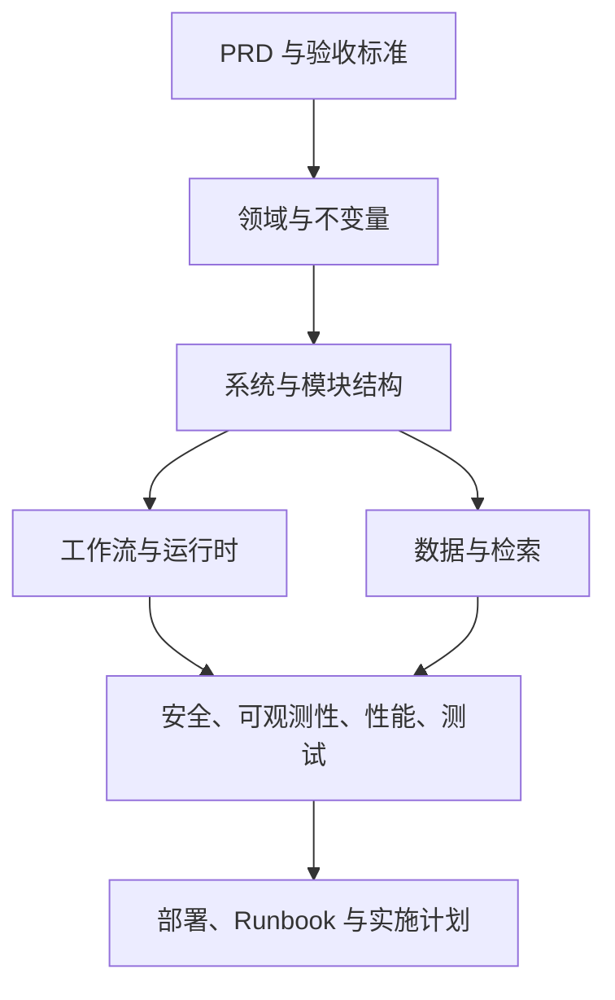

# 自组织知识工作台架构文档

> 状态：v1.0 架构基线  
> 需求依据：[正式 PRD](../product/PRD.md)  
> 架构风格：本地优先 Web 应用、Go 模块化单体、Ports and Adapters  
> 数据基线：Markdown + Git 为正式知识事实源，PostgreSQL + pgvector 为查询与运行状态

## 1. 文档目标

本目录将 PRD 转化为可实现、可测试和可运维的系统设计，回答：

- 系统边界在哪里。
- 领域对象和不变量是什么。
- Go 代码如何按深模块拆分。
- 文件、Git、PostgreSQL 和向量索引如何保持一致。
- Agent、RAG、Workflow 和 Tool Calling 如何协作。
- 失败如何重试、补偿和恢复。
- 本地与自托管如何部署。
- 如何验证安全、性能和 AI 质量。

## 2. 架构原则

1. 正式知识写入只有 Proposal → Approval → Safe Writeback 一条路径。
2. 原始 Source Version 不可变。
3. Markdown + Git 是正式知识事实源。
4. PostgreSQL 投影可重建，运行历史必须备份。
5. Agent 只生成结构化决策或请求工具，不能直接写文件和数据库。
6. 工作流持久化，副作用幂等，失败明确暴露。
7. 图谱、集合和时间线是领域数据的查询视图，不建立第二事实源。
8. 外部模型、解析器、Git、调度器通过 Adapter 接入。
9. 模块 Interface 是调用者和测试共同使用的 seam。
10. 先证明 PostgreSQL + pgvector 不够，再引入独立向量库或图数据库。

## 3. 文档导航

### 架构基线

- [统一领域语言](CONTEXT.md)
- [系统上下文与容器](system-context.md)
- [领域模型](domain-model.md)
- [模块化单体](module-architecture.md)
- [Interface 与 Adapter](interfaces-and-adapters.md)
- [技术栈与依赖选择](technology-stack.md)

### 数据与 AI

- [数据架构](data-architecture.md)
- [数据库设计](database-design.md)
- [检索与索引架构](retrieval-architecture.md)
- [Agent 与 RAG 架构](agent-rag-architecture.md)
- [持久化工作流引擎](workflow-engine.md)
- [Tool Calling 与工具安全](tool-security.md)

### 应用与运行

- [API 与事件](api-and-events.md)
- [前端架构](frontend-architecture.md)
- [进程启动配置](configuration.md)
- [部署架构](deployment.md)
- [可观测性](observability.md)
- [安全架构](security.md)
- [性能与容量](performance.md)
- [测试与 AI 评测](testing-and-evaluation.md)
- [研发实施计划](implementation-plan.md)
- [需求追踪矩阵](requirements-traceability.md)

### 业务流程

- [资料摄取与知识整理](workflows/01-ingestion-and-organization.md)
- [文章优化与版本入库](workflows/02-article-optimization.md)
- [Proposal、审批与安全写回](workflows/03-proposal-approval-writeback.md)
- [RAG 问答](workflows/04-rag-question-answering.md)
- [Artifact 生成](workflows/05-artifact-generation.md)
- [图谱与语义关联](workflows/06-graph-and-semantic-links.md)
- [知识健康维护](workflows/07-knowledge-health.md)
- [智能复习与面试模拟](workflows/08-review-and-interview.md)
- [Conflict 调查与解决](workflows/09-conflict-resolution.md)
- [知识生命周期](workflows/10-knowledge-lifecycle.md)

### 架构决策

- [ADR 索引](adr/README.md)

### Runbook

- [备份与恢复](runbooks/backup-and-restore.md)
- [数据库与 Git 不一致恢复](runbooks/consistency-recovery.md)
- [索引重建](runbooks/index-rebuild.md)
- [Workflow 故障恢复](runbooks/workflow-recovery.md)

## 4. 架构视图

## 5. 关键质量属性

| 属性 | 架构响应 |
|---|---|
| 数据所有权 | Markdown、附件和 Git 位于用户 Workspace |
| 可追溯 | Claim、Relation、Proposal、Commit、Workflow 相互关联 |
| 一致性 | 版本校验、临时写入、原子替换、Git Commit、索引补偿 |
| 可恢复 | 持久化节点、租约、幂等键、补偿记录、Runbook |
| 可解释 | 引用、证据、置信因素、关系状态、影响分析 |
| 安全 | 最小工具权限、路径限制、SSRF 防护、Prompt Injection 隔离 |
| 可替换 | 模型、Embedding、Rerank、Parser、Git、Scheduler Adapter |
| 可评测 | 固定数据集、版本化配置、回归门禁 |
| 可运维 | 结构化日志、Trace、Metrics、审计和健康检查 |

## 6. 一致性约定

- 本文档包使用 [CONTEXT.md](CONTEXT.md) 中的术语。
- 架构选择只在 ADR 中记录一次，其他文档引用 ADR。
- Mermaid 图嵌入所属文档，不维护重复图片源。
- PRD 需求变化先更新 PRD，再更新受影响架构文档和 ADR。
- 实现与文档不一致时，不把实现自动视为正确；必须确认需求或更新决策。

## 7. 当前技术基线

| 层 | 选择 |
|---|---|
| 前端 | React + TypeScript + Vite |
| API | Go net/http + chi |
| Worker | Go Worker + River/PostgreSQL 任务队列 |
| 配置 | Viper v1 + validator v10 + YAML v3 AST 预检；每次加载独立实例 |
| 数据访问 | pgx + sqlc |
| 数据库 | PostgreSQL + pgvector |
| 文件 | 本地 Workspace Bind Mount |
| 版本 | Git CLI Adapter |
| 检索 | PostgreSQL FTS + pgvector + RRF + 可选 Rerank |
| 可观测 | slog + OpenTelemetry OTLP/HTTP Trace + `prometheus/client_golang` Metrics |
| 部署 | Docker Compose，本地和自托管两种模式 |
