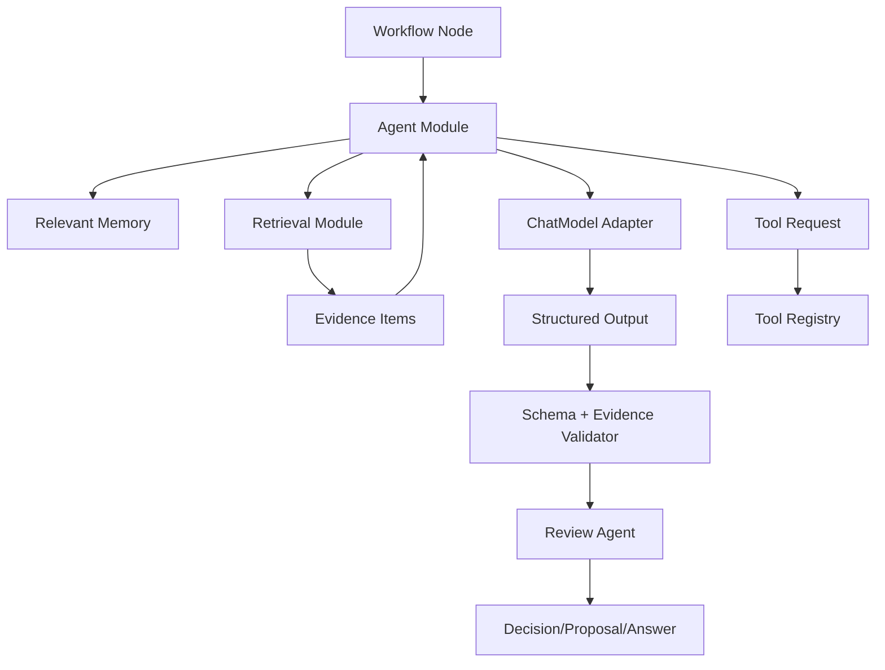
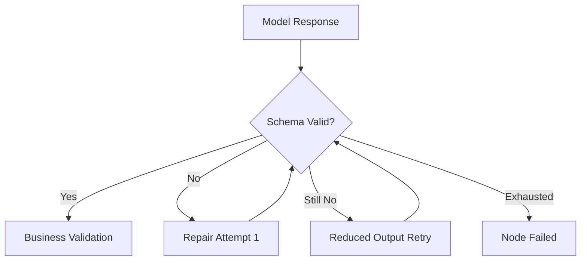
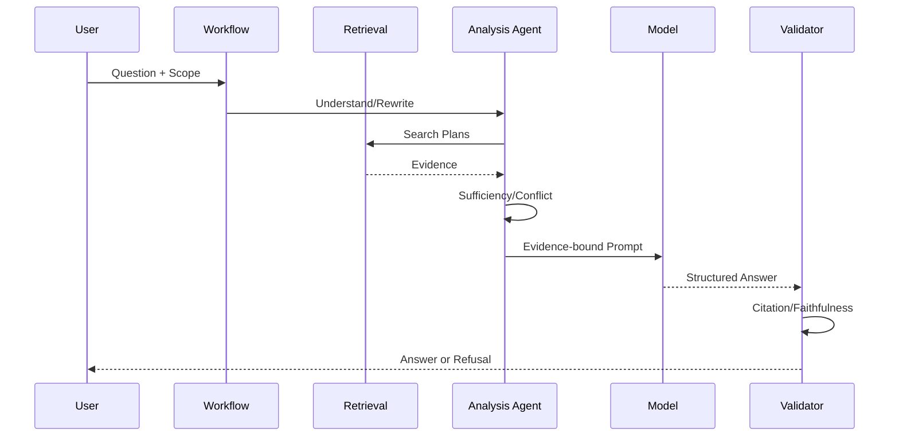

# Agent 与 RAG 架构

## 1. 目标

定义 Agent 角色、模型调用、结构化输出、RAG 证据链、记忆、冲突和评测边界。

## 2. 架构图

## 3. 逻辑角色

### Analysis Agent

- 问题理解。
- Claim 抽取。
- 查询规划。
- 关系分类。
- 证据充分度。

### Organization Agent

- 文章优化。
- Proposal 草稿。
- Artifact 大纲与正文。
- 关系建议。

### Review Agent

- Schema。
- 引用。
- 事实保持。
- 冲突。
- 风险。
- 评分合理性。

角色可以使用同一模型，但必须使用不同任务模板和输出 Schema。

## 4. 模型调用上下文

上下文组成：

1. System Policy。
2. Workflow Node Goal。
3. User Constraints。
4. Relevant Memory。
5. Evidence Items。
6. Tool Definitions。
7. Structured Output Schema。

外部 Source 和 Tool Result 标记为 untrusted data。

## 5. 结构化输出

通用字段：

- result_type。
- conclusion。
- evidence_refs。
- confidence_factors。
- uncertainty_reasons。
- proposed_actions。
- tool_requests。
- schema_version。

不同任务使用具体 Schema，不使用一个巨型万能对象。

## 6. Schema 修复

禁止自由文本正则解析作为假成功兜底。

## 7. RAG 回答链

## 8. 证据充分度

因素：

- Top Evidence 相关性。
- 来源数量。
- 来源状态。
- 是否覆盖问题各子项。
- 是否存在冲突。
- 引用能否定位。

证据不足：

- 扩展本地查询。
- 用户允许时网页检索。
- 仍不足则拒答。

## 9. 冲突

- Conflict Claim 同时进入上下文。
- Answer 输出不同观点、适用条件和来源。
- 不允许用模型常识静默裁决。
- 可生成 Conflict Investigation Workflow。

## 10. 引用验证

验证：

- 引用 ID 存在。
- Source Span 可打开。
- 引用文本支撑相邻结论。
- 未批准内容未被当作正式事实。

失败：

- 返回生成节点重新生成。
- 达到上限则拒绝发布回答。

## 11. 关系分类

步骤：

1. Claim Decomposition。
2. Candidate Retrieval。
3. Applicability Comparison。
4. NEW/COMPLEMENTARY/DUPLICATE/CONFLICT/LOW_CONFIDENCE。
5. Review Agent。
6. Proposal/Human Task。

置信度来自可解释因素，不使用模型单一自报概率。

## 12. 文章优化

Agent 输出 Change Items：

- change_type。
- original_span。
- replacement。
- reason。
- semantic_risk。
- evidence。

Review 检查：

- 禁止修改项。
- 事实。
- 代码块。
- 无来源新增。
- 删除信息。

## 13. Artifact

- 先 Plan，后 Section Generation。
- 每章独立检索。
- 缺失知识显式标记。
- Artifact 默认不进入正式 RAG。

## 14. Review Scoring

评分输入：

- Question。
- Answer Points。
- User Answer。
- Claim Evidence。

输出：

- correctness。
- coverage。
- boundaries。
- clarity。
- omissions。
- errors。
- citations。

Review Agent 防止无证据过度评分。

## 15. Memory

### Short-term

- Conversation。
- Workflow Context。
- 自动过期。

### Long-term

- 用户确认偏好。
- 用户授权反馈。

限制：

- Memory 不作为事实引用。
- Agent 只读取任务相关 Memory。
- 用户可删除。

## 16. Tool Calling

Agent 只输出 Tool Request：

- tool_name。
- arguments。
- reason。

Tool Registry 负责：

- 是否允许。
- Schema。
- 权限。
- 执行。
- 审计。

## 17. 模型路由

按 Node Capability：

- 强推理：关系、冲突、复杂评审。
- 快速模型：Query Rewrite、分类预处理。
- Embedding：批量。
- Rerank：候选重排。

路由配置版本化；切换需评测。

## 18. 降级

| 故障 | 行为 |
|---|---|
| Chat Model 不可用 | AI Node 等待/失败，非 AI 浏览可用 |
| Embedding 不可用 | Keyword Search 可用 |
| Rerank 不可用 | 显式降级 RRF |
| Review Model 不可用 | 不自动发布高风险结果 |
| Web Tool 不可用 | 本地证据不足则拒答 |

## 19. 评测门禁

- Prompt 变更。
- Model 变更。
- Schema 变更。
- Retrieval 变更。

均触发对应数据集。高风险指标下降阻止默认切换。

## 20. 隐私

- 最小化发送到云端模型的内容。
- 按 Evidence Window 发送，不发送整个 Workspace。
- 日志不保存完整 Prompt，除非调试模式显式开启。
- 模型 Adapter 记录数据保留配置。

